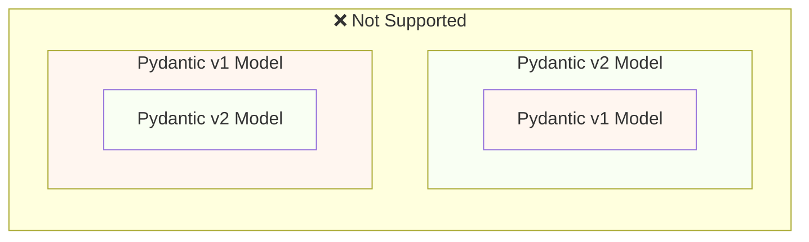
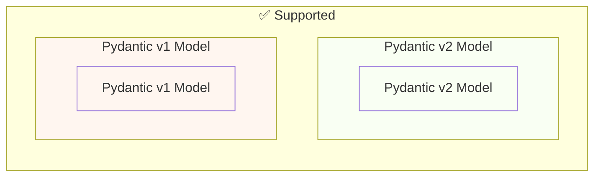

# Migrer de Pydantic v1 à Pydantic v2 { #migrate-from-pydantic-v1-to-pydantic-v2 }

Si vous avez une ancienne application FastAPI, vous utilisez peut-être Pydantic version 1.

FastAPI version 0.100.0 prenait en charge soit Pydantic v1 soit v2. Il utilisait celle que vous aviez installée.

FastAPI version 0.119.0 a introduit une prise en charge partielle de Pydantic v1 depuis l'intérieur de Pydantic v2 (comme `pydantic.v1`), pour faciliter la migration vers v2.

FastAPI 0.126.0 a supprimé la prise en charge de Pydantic v1, tout en continuant à prendre en charge `pydantic.v1` pendant un certain temps.

/// warning | Alertes

L'équipe Pydantic a arrêté la prise en charge de Pydantic v1 pour les dernières versions de Python, à partir de Python 3.14.

Cela inclut `pydantic.v1`, qui n'est plus pris en charge à partir de Python 3.14.

Si vous souhaitez utiliser les dernières fonctionnalités de Python, vous devez vous assurer que vous utilisez Pydantic v2.

///

Si vous avez une ancienne application FastAPI avec Pydantic v1, je vais vous montrer comment la migrer vers Pydantic v2, et les fonctionnalités de FastAPI 0.119.0 pour vous aider à une migration progressive.

## Guide officiel { #official-guide }

Pydantic propose un <a href="https://docs.pydantic.dev/latest/migration/" class="external-link" target="_blank">Guide de migration</a> officiel de la v1 à la v2.

Il inclut aussi ce qui a changé, comment les validations sont désormais plus correctes et strictes, les pièges possibles, etc.

Vous pouvez le lire pour mieux comprendre ce qui a changé.

## Tests { #tests }

Vous devez vous assurer d'avoir des [tests](../tutorial/testing.md){.internal-link target=_blank} pour votre application et de les exécuter en intégration continue (CI).

De cette façon, vous pouvez effectuer la mise à niveau et vous assurer que tout fonctionne toujours comme prévu.

## `bump-pydantic` { #bump-pydantic }

Dans de nombreux cas, lorsque vous utilisez des modèles Pydantic classiques sans personnalisations, vous pourrez automatiser la majeure partie du processus de migration de Pydantic v1 à Pydantic v2.

Vous pouvez utiliser <a href="https://github.com/pydantic/bump-pydantic" class="external-link" target="_blank">`bump-pydantic`</a> de la même équipe Pydantic.

Cet outil vous aidera à modifier automatiquement la majeure partie du code à adapter.

Après cela, vous pouvez exécuter les tests et vérifier que tout fonctionne. Si c'est le cas, vous avez terminé. 😎

## Pydantic v1 dans v2 { #pydantic-v1-in-v2 }

Pydantic v2 inclut tout Pydantic v1 sous la forme du sous-module `pydantic.v1`. Mais cela n'est plus pris en charge dans les versions au-delà de Python 3.13.

Cela signifie que vous pouvez installer la dernière version de Pydantic v2 et importer/utiliser les anciens composants de Pydantic v1 depuis ce sous-module, comme si vous aviez l'ancien Pydantic v1 installé.

{* ../../docs_src/pydantic_v1_in_v2/tutorial001_an_py310.py hl[1,4] *}

### Prise en charge de FastAPI pour Pydantic v1 dans v2 { #fastapi-support-for-pydantic-v1-in-v2 }

Depuis FastAPI 0.119.0, il existe également une prise en charge partielle de Pydantic v1 depuis l'intérieur de Pydantic v2, pour faciliter la migration vers v2.

Vous pouvez donc mettre à niveau Pydantic vers la dernière version 2 et modifier les imports pour utiliser le sous-module `pydantic.v1`, et dans de nombreux cas cela fonctionnera tel quel.

{* ../../docs_src/pydantic_v1_in_v2/tutorial002_an_py310.py hl[2,5,15] *}

/// warning | Alertes

Gardez à l'esprit que, puisque l'équipe Pydantic ne prend plus en charge Pydantic v1 dans les versions récentes de Python à partir de Python 3.14, l'utilisation de `pydantic.v1` n'est pas non plus prise en charge à partir de Python 3.14.

///

### Pydantic v1 et v2 dans la même application { #pydantic-v1-and-v2-on-the-same-app }

Pydantic ne prend pas en charge le fait d'avoir un modèle Pydantic v2 contenant des champs eux-mêmes définis comme des modèles Pydantic v1, et inversement.

... mais vous pouvez avoir des modèles séparés utilisant Pydantic v1 et v2 dans la même application.

Dans certains cas, il est même possible d'avoir des modèles Pydantic v1 et v2 dans le même chemin d'accès de votre application FastAPI :

{* ../../docs_src/pydantic_v1_in_v2/tutorial003_an_py310.py hl[2:3,6,12,21:22] *}

Dans l'exemple ci-dessus, le modèle d'entrée est un modèle Pydantic v1 et le modèle de sortie (défini dans `response_model=ItemV2`) est un modèle Pydantic v2.

### Paramètres Pydantic v1 { #pydantic-v1-parameters }

Si vous devez utiliser certains des outils spécifiques à FastAPI pour les paramètres comme `Body`, `Query`, `Form`, etc., avec des modèles Pydantic v1, vous pouvez les importer depuis `fastapi.temp_pydantic_v1_params` le temps de terminer la migration vers Pydantic v2 :

{* ../../docs_src/pydantic_v1_in_v2/tutorial004_an_py310.py hl[4,18] *}

### Migrer par étapes { #migrate-in-steps }

/// tip | Astuce

Essayez d'abord avec `bump-pydantic` ; si vos tests passent et que cela fonctionne, vous avez tout terminé en une seule commande. ✨

///

Si `bump-pydantic` ne fonctionne pas pour votre cas d'usage, vous pouvez utiliser la prise en charge des modèles Pydantic v1 et v2 dans la même application pour effectuer la migration vers Pydantic v2 progressivement.

Vous pouvez d'abord mettre à niveau Pydantic pour utiliser la dernière version 2 et modifier les imports pour utiliser `pydantic.v1` pour tous vos modèles.

Ensuite, vous pouvez commencer à migrer vos modèles de Pydantic v1 vers v2 par groupes, par étapes progressives. 🚶
