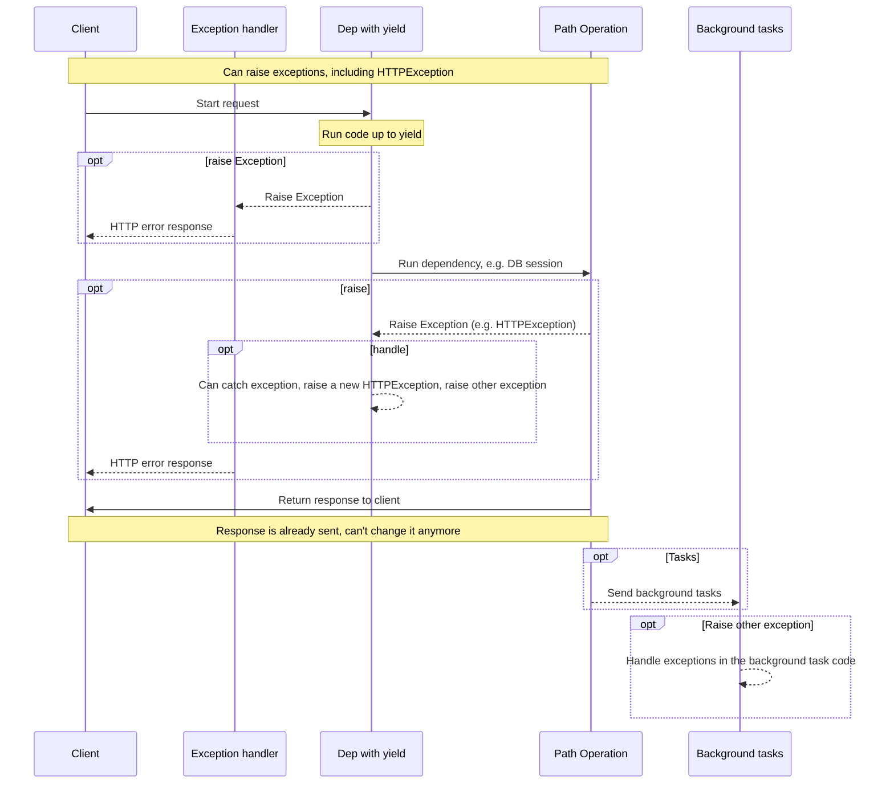
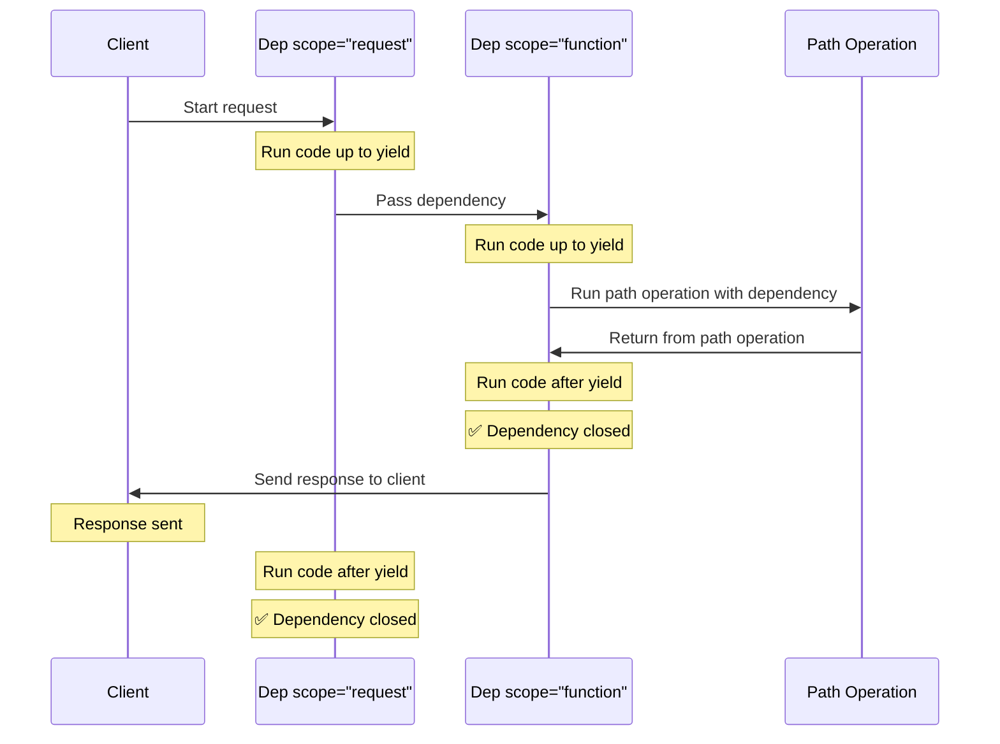

# Utiliser des dépendances avec `yield` { #dependencies-with-yield }

FastAPI prend en charge des dépendances qui effectuent des <dfn title='parfois aussi appelées « exit code », « cleanup code », « teardown code », « closing code », « context manager exit code », etc.'>étapes supplémentaires après l'exécution</dfn>.

Pour cela, utilisez `yield` au lieu de `return`, et écrivez les étapes supplémentaires (code) après.

/// tip | Astuce

Vous devez vous assurer d'utiliser `yield` une seule fois par dépendance.

///

/// note | Détails techniques

Toute fonction valide à utiliser avec :

* <a href="https://docs.python.org/3/library/contextlib.html#contextlib.contextmanager" class="external-link" target="_blank">`@contextlib.contextmanager`</a> ou
* <a href="https://docs.python.org/3/library/contextlib.html#contextlib.asynccontextmanager" class="external-link" target="_blank">`@contextlib.asynccontextmanager`</a>

sera valide comme dépendance **FastAPI**.

En fait, FastAPI utilise ces deux décorateurs en interne.

///

## Créer une dépendance de base de données avec `yield` { #a-database-dependency-with-yield }

Par exemple, vous pouvez l'utiliser pour créer une session de base de données et la fermer après la fin.

Seul le code précédant et incluant l'instruction `yield` est exécuté avant la création de la réponse :

{* ../../docs_src/dependencies/tutorial007_py310.py hl[2:4] *}

La valeur transmise par `yield` est celle qui est injectée dans les *chemins d'accès* et autres dépendances :

{* ../../docs_src/dependencies/tutorial007_py310.py hl[4] *}

Le code suivant l'instruction `yield` est exécuté après la réponse :

{* ../../docs_src/dependencies/tutorial007_py310.py hl[5:6] *}

/// tip | Astuce

Vous pouvez utiliser des fonctions `async` ou des fonctions classiques.

**FastAPI** fera ce qu'il faut dans chaque cas, comme avec des dépendances normales.

///

## Créer une dépendance avec `yield` et `try` { #a-dependency-with-yield-and-try }

Si vous utilisez un bloc `try` dans une dépendance avec `yield`, vous recevrez toute exception qui a été levée lors de l'utilisation de la dépendance.

Par exemple, si à un moment donné, dans une autre dépendance ou dans un *chemin d'accès*, un code a effectué un « rollback » de transaction de base de données ou a créé une autre exception, vous recevrez l'exception dans votre dépendance.

Vous pouvez donc rechercher cette exception spécifique dans la dépendance avec `except SomeException`.

De la même manière, vous pouvez utiliser `finally` pour vous assurer que les étapes de sortie sont exécutées, qu'il y ait eu une exception ou non.

{* ../../docs_src/dependencies/tutorial007_py310.py hl[3,5] *}

## Utiliser des sous-dépendances avec `yield` { #sub-dependencies-with-yield }

Vous pouvez avoir des sous-dépendances et des « arbres » de sous-dépendances de toute taille et forme, et certaines ou toutes peuvent utiliser `yield`.

**FastAPI** s'assurera que le « code de sortie » dans chaque dépendance avec `yield` est exécuté dans le bon ordre.

Par exemple, `dependency_c` peut dépendre de `dependency_b`, et `dependency_b` de `dependency_a` :

{* ../../docs_src/dependencies/tutorial008_an_py310.py hl[6,14,22] *}

Et elles peuvent toutes utiliser `yield`.

Dans ce cas, `dependency_c`, pour exécuter son code de sortie, a besoin que la valeur de `dependency_b` (appelée ici `dep_b`) soit toujours disponible.

Et, à son tour, `dependency_b` a besoin que la valeur de `dependency_a` (appelée ici `dep_a`) soit disponible pour son code de sortie.

{* ../../docs_src/dependencies/tutorial008_an_py310.py hl[18:19,26:27] *}

De la même manière, vous pouvez avoir certaines dépendances avec `yield` et d'autres avec `return`, et faire en sorte que certaines dépendent des autres.

Et vous pouvez avoir une seule dépendance qui exige plusieurs autres dépendances avec `yield`, etc.

Vous pouvez combiner les dépendances comme vous le souhaitez.

**FastAPI** s'assurera que tout est exécuté dans le bon ordre.

/// note | Détails techniques

Cela fonctionne grâce aux <a href="https://docs.python.org/3/library/contextlib.html" class="external-link" target="_blank">gestionnaires de contexte</a> de Python.

**FastAPI** les utilise en interne pour y parvenir.

///

## Utiliser des dépendances avec `yield` et `HTTPException` { #dependencies-with-yield-and-httpexception }

Vous avez vu que vous pouvez utiliser des dépendances avec `yield` et avoir des blocs `try` qui tentent d'exécuter du code puis exécutent du code de sortie après `finally`.

Vous pouvez également utiliser `except` pour intercepter l'exception qui a été levée et faire quelque chose avec.

Par exemple, vous pouvez lever une autre exception, comme `HTTPException`.

/// tip | Astuce

C'est une technique plutôt avancée, et dans la plupart des cas vous n'en aurez pas vraiment besoin, car vous pouvez lever des exceptions (y compris `HTTPException`) depuis le reste de votre code applicatif, par exemple, dans la *fonction de chemin d'accès*.

Mais elle est à votre disposition si vous en avez besoin. 🤓

///

{* ../../docs_src/dependencies/tutorial008b_an_py310.py hl[18:22,31] *}

Si vous souhaitez intercepter des exceptions et créer une réponse personnalisée en fonction de cela, créez un [Gestionnaire d'exceptions personnalisé](../handling-errors.md#install-custom-exception-handlers){.internal-link target=_blank}.

## Utiliser des dépendances avec `yield` et `except` { #dependencies-with-yield-and-except }

Si vous interceptez une exception avec `except` dans une dépendance avec `yield` et que vous ne la relancez pas (ou que vous ne levez pas une nouvelle exception), FastAPI ne pourra pas remarquer qu'il y a eu une exception, de la même manière que cela se produirait avec Python classique :

{* ../../docs_src/dependencies/tutorial008c_an_py310.py hl[15:16] *}

Dans ce cas, le client verra une réponse *HTTP 500 Internal Server Error* comme il se doit, étant donné que nous ne levons pas de `HTTPException` ou similaire, mais le serveur **n'aura aucun logs** ni aucune autre indication de l'erreur. 😱

### Toujours `raise` dans les dépendances avec `yield` et `except` { #always-raise-in-dependencies-with-yield-and-except }

Si vous interceptez une exception dans une dépendance avec `yield`, à moins de lever une autre `HTTPException` ou similaire, **vous devez relancer l'exception d'origine**.

Vous pouvez relancer la même exception avec `raise` :

{* ../../docs_src/dependencies/tutorial008d_an_py310.py hl[17] *}

À présent, le client recevra la même réponse *HTTP 500 Internal Server Error*, mais le serveur aura notre `InternalError` personnalisé dans les logs. 😎

## Comprendre l'exécution des dépendances avec `yield` { #execution-of-dependencies-with-yield }

La séquence d'exécution ressemble plus ou moins à ce diagramme. Le temps s'écoule de haut en bas. Et chaque colonne représente une des parties qui interagit ou exécute du code.



/// info

Une **seule réponse** sera envoyée au client. Il peut s'agir d'une des réponses d'erreur ou de la réponse provenant du *chemin d'accès*.

Après l'envoi de l'une de ces réponses, aucune autre réponse ne peut être envoyée.

///

/// tip | Astuce

Si vous levez une exception dans le code de la *fonction de chemin d'accès*, elle sera transmise aux dépendances avec `yield`, y compris `HTTPException`. Dans la plupart des cas, vous voudrez relancer cette même exception ou en lever une nouvelle depuis la dépendance avec `yield` pour vous assurer qu'elle est correctement gérée.

///

## Utiliser la sortie anticipée et `scope` { #early-exit-and-scope }

Normalement, le code de sortie des dépendances avec `yield` est exécuté **après la réponse** envoyée au client.

Mais si vous savez que vous n'aurez pas besoin d'utiliser la dépendance après être revenu de la *fonction de chemin d'accès*, vous pouvez utiliser `Depends(scope="function")` pour indiquer à FastAPI qu'il doit fermer la dépendance après le retour de la *fonction de chemin d'accès*, mais **avant** que la **réponse ne soit envoyée**.

{* ../../docs_src/dependencies/tutorial008e_an_py310.py hl[12,16] *}

`Depends()` reçoit un paramètre `scope` qui peut être :

* « function » : démarrer la dépendance avant la *fonction de chemin d'accès* qui gère la requête, terminer la dépendance après la fin de la *fonction de chemin d'accès*, mais **avant** que la réponse ne soit renvoyée au client. Ainsi, la fonction de dépendance sera exécutée **autour** de la *fonction de chemin d'accès*.
* « request » : démarrer la dépendance avant la *fonction de chemin d'accès* qui gère la requête (similaire à l'utilisation de « function »), mais terminer **après** que la réponse a été renvoyée au client. Ainsi, la fonction de dépendance sera exécutée **autour** du cycle **requête** et réponse.

S'il n'est pas spécifié et que la dépendance utilise `yield`, le `scope` sera par défaut « request ».

### Définir `scope` pour les sous-dépendances { #scope-for-sub-dependencies }

Lorsque vous déclarez une dépendance avec un `scope="request"` (par défaut), toute sous-dépendance doit également avoir un `scope` de « request ».

Mais une dépendance avec un `scope` de « function » peut avoir des dépendances avec un `scope` de « function » et un `scope` de « request ».

Cela vient du fait que toute dépendance doit pouvoir exécuter son code de sortie avant ses sous-dépendances, car elle pourrait encore avoir besoin de les utiliser pendant son code de sortie.



## Utiliser des dépendances avec `yield`, `HTTPException`, `except` et Background Tasks { #dependencies-with-yield-httpexception-except-and-background-tasks }

Les dépendances avec `yield` ont évolué au fil du temps pour couvrir différents cas d'utilisation et corriger certains problèmes.

Si vous souhaitez voir ce qui a changé dans différentes versions de FastAPI, vous pouvez en savoir plus dans le guide avancé, dans [Dépendances avancées - Dépendances avec `yield`, `HTTPException`, `except` et Background Tasks](../../advanced/advanced-dependencies.md#dependencies-with-yield-httpexception-except-and-background-tasks){.internal-link target=_blank}.
## Gestionnaires de contexte { #context-managers }

### Que sont les « Context Managers » { #what-are-context-managers }

Les « Context Managers » sont des objets Python que vous pouvez utiliser dans une instruction `with`.

Par exemple, <a href="https://docs.python.org/3/tutorial/inputoutput.html#reading-and-writing-files" class="external-link" target="_blank">vous pouvez utiliser `with` pour lire un fichier</a> :

```Python
with open("./somefile.txt") as f:
    contents = f.read()
    print(contents)
```

En coulisse, `open("./somefile.txt")` crée un objet appelé « Context Manager ».

Lorsque le bloc `with` se termine, il s'assure de fermer le fichier, même s'il y a eu des exceptions.

Lorsque vous créez une dépendance avec `yield`, **FastAPI** créera en interne un gestionnaire de contexte pour celle-ci et le combinera avec d'autres outils associés.

### Utiliser des gestionnaires de contexte dans des dépendances avec `yield` { #using-context-managers-in-dependencies-with-yield }

/// warning | Alertes

C'est, plus ou moins, une idée « avancée ».

Si vous débutez avec **FastAPI**, vous voudrez peut-être l'ignorer pour le moment.

///

En Python, vous pouvez créer des gestionnaires de contexte en <a href="https://docs.python.org/3/reference/datamodel.html#context-managers" class="external-link" target="_blank">créant une classe avec deux méthodes : `__enter__()` et `__exit__()`</a>.

Vous pouvez également les utiliser dans des dépendances **FastAPI** avec `yield` en utilisant
des instructions `with` ou `async with` à l'intérieur de la fonction de dépendance :

{* ../../docs_src/dependencies/tutorial010_py310.py hl[1:9,13] *}

/// tip | Astuce

Une autre façon de créer un gestionnaire de contexte consiste à utiliser :

* <a href="https://docs.python.org/3/library/contextlib.html#contextlib.contextmanager" class="external-link" target="_blank">`@contextlib.contextmanager`</a> ou
* <a href="https://docs.python.org/3/library/contextlib.html#contextlib.asynccontextmanager" class="external-link" target="_blank">`@contextlib.asynccontextmanager`</a>

pour décorer une fonction avec un unique `yield`.

C'est ce que **FastAPI** utilise en interne pour les dépendances avec `yield`.

Mais vous n'avez pas à utiliser ces décorateurs pour les dépendances FastAPI (et vous ne devriez pas).

FastAPI le fera pour vous en interne.

///
