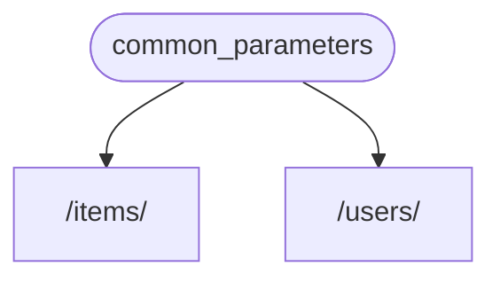
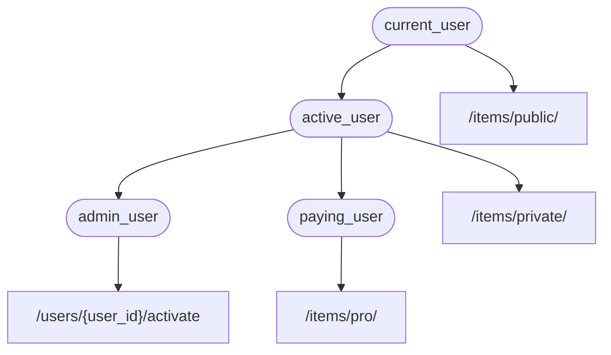

# Dépendances { #dependencies }

**FastAPI** dispose d’un système d’**<dfn title="aussi connu sous le nom de : composants, ressources, fournisseurs, services, injectables">Injection de dépendances</dfn>** très puissant mais intuitif.

Il est conçu pour être très simple à utiliser, et pour faciliter l’intégration d’autres composants à **FastAPI** pour n’importe quel développeur.

## Qu’est-ce que « l’injection de dépendances » { #what-is-dependency-injection }

L’**« injection de dépendances »** signifie, en programmation, qu’il existe un moyen pour votre code (dans ce cas, vos fonctions de chemins d’accès) de déclarer ce dont il a besoin pour fonctionner et utiliser : « dépendances ».

Ensuite, ce système (dans ce cas **FastAPI**) se charge de faire tout le nécessaire pour fournir à votre code ces dépendances requises (« injecter » les dépendances).

C’est très utile lorsque vous avez besoin de :

* Avoir de la logique partagée (la même logique de code encore et encore).
* Partager des connexions à la base de données.
* Imposer la sécurité, l’authentification, des exigences de rôles, etc.
* Et bien d’autres choses ...

Tout cela, en minimisant la répétition de code.

## Premiers pas { #first-steps }

Voyons un exemple très simple. Il sera tellement simple qu’il n’est pas très utile, pour l’instant.

Mais de cette façon nous pouvons nous concentrer sur le fonctionnement du système d’**injection de dépendances**.

### Créer une dépendance, ou « dependable » { #create-a-dependency-or-dependable }

Concentrons-nous d’abord sur la dépendance.

C’est simplement une fonction qui peut prendre tous les mêmes paramètres qu’une fonction de chemin d’accès peut prendre :

{* ../../docs_src/dependencies/tutorial001_an_py310.py hl[8:9] *}

C’est tout.

**2 lignes**.

Et elle a la même forme et structure que toutes vos fonctions de chemins d’accès.

Vous pouvez la considérer comme une fonction de chemin d’accès sans le « décorateur » (sans le `@app.get("/some-path")`).

Et elle peut retourner tout ce que vous voulez.

Dans ce cas, cette dépendance attend :

* Un paramètre de requête optionnel `q` qui est une `str`.
* Un paramètre de requête optionnel `skip` qui est un `int`, et vaut `0` par défaut.
* Un paramètre de requête optionnel `limit` qui est un `int`, et vaut `100` par défaut.

Puis elle retourne simplement un `dict` contenant ces valeurs.

/// info | Info

FastAPI a ajouté la prise en charge de `Annotated` (et a commencé à le recommander) dans la version 0.95.0.

Si vous avez une version plus ancienne, vous obtiendrez des erreurs en essayant d’utiliser `Annotated`.

Vous devez vous assurer de [mettre à niveau la version de FastAPI](../../deployment/versions.md#upgrading-the-fastapi-versions){.internal-link target=_blank} vers au moins la 0.95.1 avant d’utiliser `Annotated`.

///

### Importer `Depends` { #import-depends }

{* ../../docs_src/dependencies/tutorial001_an_py310.py hl[3] *}

### Déclarer la dépendance, dans le « dependant » { #declare-the-dependency-in-the-dependant }

De la même manière que vous utilisez `Body`, `Query`, etc. avec les paramètres de votre fonction de chemin d’accès, utilisez `Depends` avec un nouveau paramètre :

{* ../../docs_src/dependencies/tutorial001_an_py310.py hl[13,18] *}

Même si vous utilisez `Depends` dans les paramètres de votre fonction de la même façon que `Body`, `Query`, etc., `Depends` fonctionne un peu différemment.

Vous ne donnez à `Depends` qu’un seul paramètre.

Ce paramètre doit être quelque chose comme une fonction.

Vous ne l’appelez pas directement (n’ajoutez pas de parenthèses à la fin), vous le passez simplement en paramètre à `Depends()`.

Et cette fonction prend des paramètres de la même manière que les fonctions de chemins d’accès.

/// tip | Astuce

Vous verrez quelles autres « choses », en plus des fonctions, peuvent être utilisées comme dépendances dans le prochain chapitre.

///

Chaque fois qu’une nouvelle requête arrive, **FastAPI** se charge de :

* Appeler votre fonction de dépendance (« dependable ») avec les bons paramètres.
* Récupérer le résultat de votre fonction.
* Affecter ce résultat au paramètre dans votre fonction de chemin d’accès.



De cette façon vous écrivez le code partagé une seule fois et **FastAPI** se charge de l’appeler pour vos chemins d’accès.

/// check | Vérifications

Notez que vous n’avez pas à créer une classe spéciale et à la passer quelque part à **FastAPI** pour l’« enregistrer » ou quoi que ce soit de similaire.

Vous la passez simplement à `Depends` et **FastAPI** sait faire le reste.

///

## Partager des dépendances `Annotated` { #share-annotated-dependencies }

Dans les exemples ci-dessus, vous voyez qu’il y a un tout petit peu de **duplication de code**.

Lorsque vous devez utiliser la dépendance `common_parameters()`, vous devez écrire tout le paramètre avec l’annotation de type et `Depends()` :

```Python
commons: Annotated[dict, Depends(common_parameters)]
```

Mais comme nous utilisons `Annotated`, nous pouvons stocker cette valeur `Annotated` dans une variable et l’utiliser à plusieurs endroits :

{* ../../docs_src/dependencies/tutorial001_02_an_py310.py hl[12,16,21] *}

/// tip | Astuce

C’est simplement du Python standard, cela s’appelle un « alias de type », ce n’est en fait pas spécifique à **FastAPI**.

Mais comme **FastAPI** est basé sur les standards Python, y compris `Annotated`, vous pouvez utiliser cette astuce dans votre code. 😎

///

Les dépendances continueront de fonctionner comme prévu, et la **meilleure partie** est que **l’information de type sera conservée**, ce qui signifie que votre éditeur pourra continuer à vous fournir **l’autocomplétion**, **des erreurs en ligne**, etc. Idem pour d’autres outils comme `mypy`.

Cela sera particulièrement utile lorsque vous l’utiliserez dans une **grande base de code** où vous utilisez **les mêmes dépendances** encore et encore dans **de nombreux chemins d’accès**.

## Utiliser `async` ou non { #to-async-or-not-to-async }

Comme les dépendances seront aussi appelées par **FastAPI** (tout comme vos fonctions de chemins d’accès), les mêmes règles s’appliquent lors de la définition de vos fonctions.

Vous pouvez utiliser `async def` ou un `def` normal.

Et vous pouvez déclarer des dépendances avec `async def` à l’intérieur de fonctions de chemins d’accès `def` normales, ou des dépendances `def` à l’intérieur de fonctions de chemins d’accès `async def`, etc.

Peu importe. **FastAPI** saura quoi faire.

/// note | Remarque

Si vous ne savez pas, consultez la section [Async : *« Pressé ? »*](../../async.md#in-a-hurry){.internal-link target=_blank} à propos de `async` et `await` dans la documentation.

///

## Intégrer à OpenAPI { #integrated-with-openapi }

Toutes les déclarations de requête, validations et exigences de vos dépendances (et sous-dépendances) seront intégrées dans le même schéma OpenAPI.

Ainsi, la documentation interactive contiendra aussi toutes les informations issues de ces dépendances :


## Utilisation simple { #simple-usage }

Si vous y regardez de près, les fonctions de chemins d’accès sont déclarées pour être utilisées chaque fois qu’un « chemin » et une « opération » correspondent, puis **FastAPI** se charge d’appeler la fonction avec les bons paramètres, en extrayant les données de la requête.

En réalité, tous (ou la plupart) des frameworks web fonctionnent de cette manière.

Vous n’appelez jamais ces fonctions directement. Elles sont appelées par votre framework (dans ce cas, **FastAPI**).

Avec le système d’injection de dépendances, vous pouvez aussi indiquer à **FastAPI** que votre fonction de chemin d’accès « dépend » également d’autre chose qui doit être exécuté avant votre fonction de chemin d’accès, et **FastAPI** se chargera de l’exécuter et d’« injecter » les résultats.

D’autres termes courants pour cette même idée « d’injection de dépendances » sont :

* ressources
* fournisseurs
* services
* injectables
* composants

## Plug-ins **FastAPI** { #fastapi-plug-ins }

Les intégrations et « plug-ins » peuvent être construits en utilisant le système d’**injection de dépendances**. Mais en réalité, il n’y a **pas besoin de créer des « plug-ins »**, car en utilisant des dépendances il est possible de déclarer un nombre infini d’intégrations et d’interactions qui deviennent disponibles pour vos fonctions de chemins d’accès.

Et les dépendances peuvent être créées de manière très simple et intuitive, ce qui vous permet d’importer juste les packages Python dont vous avez besoin, et de les intégrer à vos fonctions d’API en quelques lignes de code, *littéralement*.

Vous verrez des exemples de cela dans les prochains chapitres, à propos des bases de données relationnelles et NoSQL, de la sécurité, etc.

## Compatibilité **FastAPI** { #fastapi-compatibility }

La simplicité du système d’injection de dépendances rend **FastAPI** compatible avec :

* toutes les bases de données relationnelles
* les bases de données NoSQL
* les packages externes
* les API externes
* les systèmes d’authentification et d’autorisation
* les systèmes de supervision d’usage d’API
* les systèmes d’injection de données de réponse
* etc.

## Simple et puissant { #simple-and-powerful }

Bien que le système hiérarchique d’injection de dépendances soit très simple à définir et à utiliser, il reste très puissant.

Vous pouvez définir des dépendances qui, à leur tour, peuvent définir leurs propres dépendances.

Au final, un arbre hiérarchique de dépendances est construit, et le système d’**injection de dépendances** se charge de résoudre toutes ces dépendances pour vous (et leurs sous-dépendances) et de fournir (injecter) les résultats à chaque étape.

Par exemple, supposons que vous ayez 4 endpoints d’API (chemins d’accès) :

* `/items/public/`
* `/items/private/`
* `/users/{user_id}/activate`
* `/items/pro/`

alors vous pourriez ajouter différentes exigences d’autorisations pour chacun d’eux uniquement avec des dépendances et des sous-dépendances :



## Intégrer à **OpenAPI** { #integrated-with-openapi_1 }

Toutes ces dépendances, tout en déclarant leurs exigences, ajoutent également des paramètres, des validations, etc. à vos chemins d’accès.

**FastAPI** se chargera d’ajouter le tout au schéma OpenAPI, afin que cela apparaisse dans les systèmes de documentation interactive.
