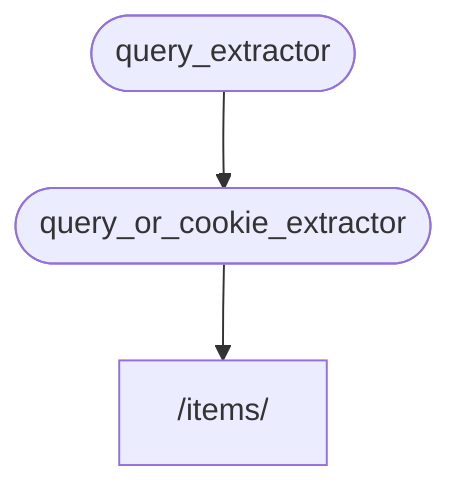

# Sous-dépendances { #sub-dependencies }

Vous pouvez créer des dépendances qui ont des sous-dépendances.

Elles peuvent être aussi profondes que nécessaire.

**FastAPI** se chargera de les résoudre.

## Créer une première dépendance « dependable » { #first-dependency-dependable }

Vous pouvez créer une première dépendance (« dependable ») comme :

{* ../../docs_src/dependencies/tutorial005_an_py310.py hl[8:9] *}

Elle déclare un paramètre de requête optionnel `q` de type `str`, puis le retourne simplement.

C'est assez simple (pas très utile), mais cela nous aidera à nous concentrer sur le fonctionnement des sous-dépendances.

## Créer une seconde dépendance, « dependable » et « dependant » { #second-dependency-dependable-and-dependant }

Vous pouvez ensuite créer une autre fonction de dépendance (un « dependable ») qui, en même temps, déclare sa propre dépendance (elle est donc aussi un « dependant ») :

{* ../../docs_src/dependencies/tutorial005_an_py310.py hl[13] *}

Concentrons-nous sur les paramètres déclarés :

- Même si cette fonction est elle‑même une dépendance (« dependable »), elle déclare aussi une autre dépendance (elle « dépend » d'autre chose).
    - Elle dépend de `query_extractor` et affecte la valeur renvoyée au paramètre `q`.
- Elle déclare également un cookie `last_query` optionnel, de type `str`.
    - Si l'utilisateur n'a fourni aucune requête `q`, nous utilisons la dernière requête utilisée, que nous avons enregistrée auparavant dans un cookie.

## Utiliser la dépendance { #use-the-dependency }

Nous pouvons ensuite utiliser la dépendance avec :

{* ../../docs_src/dependencies/tutorial005_an_py310.py hl[23] *}

/// info

Notez que nous ne déclarons qu'une seule dépendance dans la *fonction de chemin d'accès*, `query_or_cookie_extractor`.

Mais **FastAPI** saura qu'il doit d'abord résoudre `query_extractor`, pour passer ses résultats à `query_or_cookie_extractor` lors de son appel.

///



## Utiliser la même dépendance plusieurs fois { #using-the-same-dependency-multiple-times }

Si l'une de vos dépendances est déclarée plusieurs fois pour le même *chemin d'accès*, par exemple si plusieurs dépendances ont une sous-dépendance commune, **FastAPI** saura n'appeler cette sous-dépendance qu'une seule fois par requête.

Et il enregistrera la valeur renvoyée dans un <dfn title="Un utilitaire/système pour stocker des valeurs calculées/générées, afin de les réutiliser au lieu de les recalculer.">« cache »</dfn> et la transmettra à tous les « dependants » qui en ont besoin dans cette requête spécifique, au lieu d'appeler la dépendance plusieurs fois pour la même requête.

Dans un scénario avancé où vous savez que vous avez besoin que la dépendance soit appelée à chaque étape (éventuellement plusieurs fois) dans la même requête au lieu d'utiliser la valeur « mise en cache », vous pouvez définir le paramètre `use_cache=False` lors de l'utilisation de `Depends` :

//// tab | Python 3.10+

```Python hl_lines="1"
async def needy_dependency(fresh_value: Annotated[str, Depends(get_value, use_cache=False)]):
    return {"fresh_value": fresh_value}
```

////

//// tab | Python 3.10+ non annoté

/// tip | Astuce

Privilégiez la version `Annotated` si possible.

///

```Python hl_lines="1"
async def needy_dependency(fresh_value: str = Depends(get_value, use_cache=False)):
    return {"fresh_value": fresh_value}
```

////

## Récapituler { #recap }

En dehors de tout le jargon utilisé ici, le système d'**injection de dépendances** est assez simple.

Ce ne sont que des fonctions qui ressemblent aux *fonctions de chemin d'accès*.

Mais il est très puissant et vous permet de déclarer des « graphes » (arbres) de dépendances imbriquées aussi profondément que vous le souhaitez.

/// tip | Astuce

Tout cela peut ne pas sembler très utile avec ces exemples simples.

Mais vous verrez à quel point c'est utile dans les chapitres sur la **sécurité**.

Et vous verrez aussi la quantité de code que cela vous fera économiser.

///
