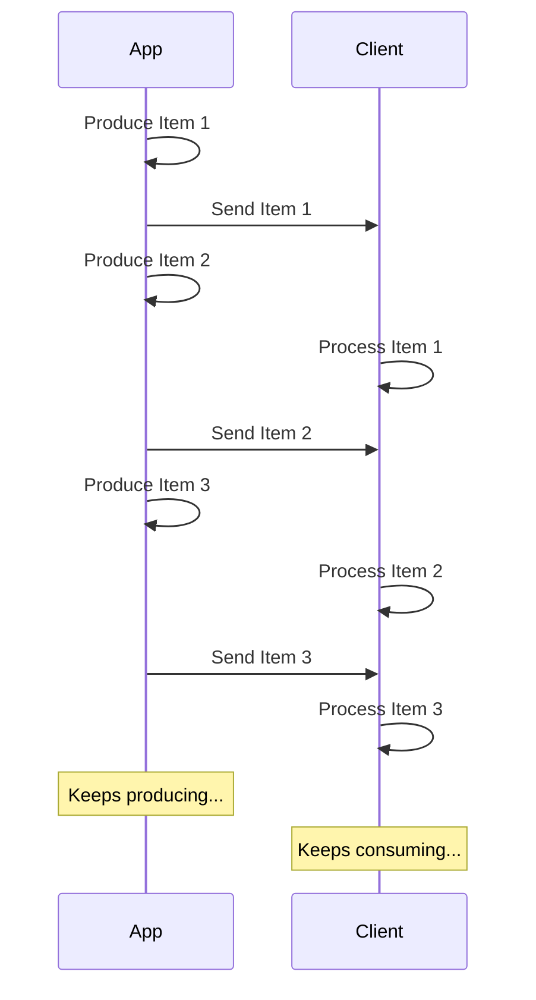

# Diffuser des JSON Lines { #stream-json-lines }

Vous pouvez avoir une séquence de données que vous souhaitez envoyer en « flux » ; vous pouvez le faire avec « JSON Lines ».

/// info

Ajouté dans FastAPI 0.134.0.

///

## Qu'est-ce qu'un flux ? { #what-is-a-stream }

La « diffusion en continu » de données signifie que votre application commence à envoyer des éléments de données au client sans attendre que l'ensemble de la séquence soit prêt.

Ainsi, elle enverra le premier élément, le client le recevra et commencera à le traiter, et vous pourriez être encore en train de produire l'élément suivant.



Cela peut même être un flux infini, où vous continuez à envoyer des données.

## JSON Lines { #json-lines }

Dans ces cas, il est courant d'envoyer des « JSON Lines », qui est un format où vous envoyez un objet JSON par ligne.

Une réponse aurait un type de contenu `application/jsonl` (au lieu de `application/json`) et le corps ressemblerait à ceci :

```json
{"name": "Plumbus", "description": "A multi-purpose household device."}
{"name": "Portal Gun", "description": "A portal opening device."}
{"name": "Meeseeks Box", "description": "A box that summons a Meeseeks."}
```

C'est très similaire à un tableau JSON (équivalent d'une liste Python), mais au lieu d'être entouré de `[]` et d'avoir des `,` entre les éléments, il y a un objet JSON par ligne, ils sont séparés par un caractère de saut de ligne.

/// info

Le point important est que votre application pourra produire chaque ligne à son tour, tandis que le client consomme les lignes précédentes.

///

/// note | Détails techniques

Comme chaque objet JSON sera séparé par un saut de ligne, ils ne peuvent pas contenir de caractères de saut de ligne littéraux dans leur contenu, mais ils peuvent contenir des sauts de ligne échappés (`\n`), ce qui fait partie du standard JSON.

Mais normalement, vous n'avez pas à vous en soucier, c'est fait automatiquement, continuez la lecture. 🤓

///

## Cas d'utilisation { #use-cases }

Vous pouvez utiliser cela pour diffuser des données depuis un service **AI LLM**, depuis des **journaux** ou de la **télémétrie**, ou depuis d'autres types de données pouvant être structurées en éléments **JSON**.

/// tip | Astuce

Si vous voulez diffuser des données binaires, par exemple de la vidéo ou de l'audio, consultez le guide avancé : [Diffuser des données](../advanced/stream-data.md).

///

## Diffuser des JSON Lines avec FastAPI { #stream-json-lines-with-fastapi }

Pour diffuser des JSON Lines avec FastAPI, au lieu d'utiliser `return` dans votre fonction de chemin d'accès, utilisez `yield` pour produire chaque élément à tour de rôle.

{* ../../docs_src/stream_json_lines/tutorial001_py310.py ln[1:24] hl[24] *}

Si chaque élément JSON que vous voulez renvoyer est de type `Item` (un modèle Pydantic) et que c'est une fonction async, vous pouvez déclarer le type de retour comme `AsyncIterable[Item]` :

{* ../../docs_src/stream_json_lines/tutorial001_py310.py ln[1:24] hl[9:11,22] *}

Si vous déclarez le type de retour, FastAPI l'utilisera pour **valider** les données, les **documenter** dans OpenAPI, les **filtrer**, et les **sérialiser** avec Pydantic.

/// tip | Astuce

Comme Pydantic les sérialisera côté **Rust**, vous obtiendrez une **performance** bien supérieure que si vous ne déclarez pas de type de retour.

///

### Fonctions de chemin d'accès non asynchrones { #non-async-path-operation-functions }

Vous pouvez aussi utiliser des fonctions `def` classiques (sans `async`), et utiliser `yield` de la même manière.

FastAPI s'assure qu'elle s'exécute correctement afin de ne pas bloquer la boucle d'événements.

Comme dans ce cas la fonction n'est pas async, le bon type de retour serait `Iterable[Item]` :

{* ../../docs_src/stream_json_lines/tutorial001_py310.py ln[27:30] hl[28] *}

### Sans type de retour { #no-return-type }

Vous pouvez également omettre le type de retour. FastAPI utilisera alors [`jsonable_encoder`](./encoder.md) pour convertir les données en quelque chose qui peut être sérialisé en JSON, puis les enverra en JSON Lines.

{* ../../docs_src/stream_json_lines/tutorial001_py310.py ln[33:36] hl[34] *}

## Événements envoyés par le serveur (SSE) { #server-sent-events-sse }

FastAPI propose également une prise en charge native des Server-Sent Events (SSE), qui sont assez proches mais avec quelques détails supplémentaires. Vous pouvez en apprendre davantage dans le chapitre suivant : [Événements envoyés par le serveur (SSE)](server-sent-events.md). 🤓
