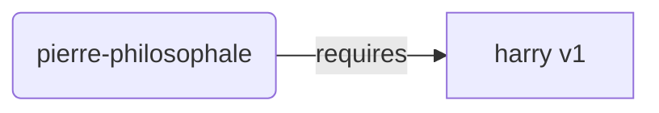
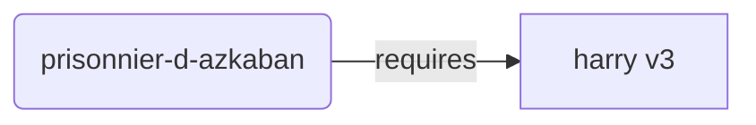
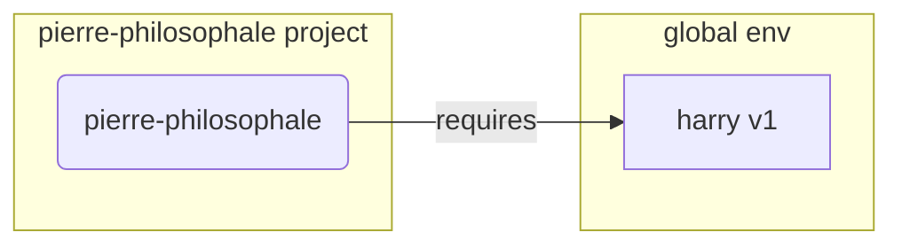
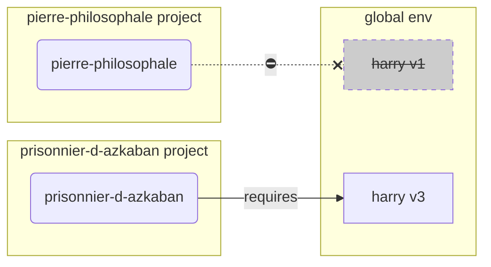
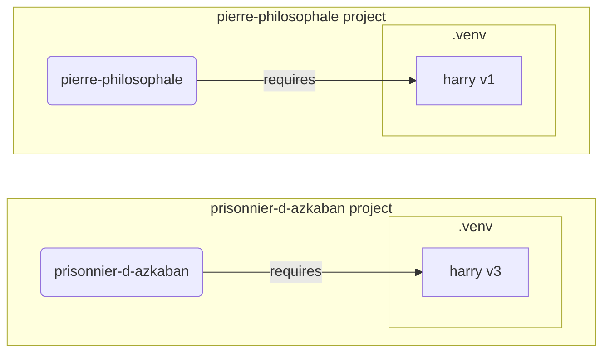

# Environnements Virtuels

Lorsque vous travaillez sur des projets Python, vous utilisez probablement un **environnement virtuel** (ou un mécanisme similaire) pour isoler les packages que vous installez pour chaque projet.

/// info

Si vous savez déjà ce qu'est un environnement virtuel, comment le créer et comment l'utiliser, vous pouvez passer cette section. 🤓

///

/// tip

Un **environnement virtuel** est différent d'une **variable d'environnement**.

Une **variable d'environnement** est une variable système qui peut être utilisée par tous les programmes.

Un **environnement virtuel** est un **répertoire** avec des fichiers dedans.

///

/// info

Cette page va vous apprendre comment utiliser les **environnements virtuels** et comment ils fonctionnent.

Si vous souhaitez utiliser un **outil qui gère tout** pour vous (y compris l'installation de Python), essayez <a href="https://github.com/astral-sh/uv" class="external-link" target="_blank">uv</a>.

///

## Créer un projet

Premièrement, nous allons créer un dossier pour notre projet.

Ce que je fais normalement, c'est que je crée un dossier nommé `code` à l'intérieur de mon dossier home/user.

Et à l'intérieur de ce même dossier, je crée un dossier par projet.

<div class="termy">

```console
// Aller dans votre dossier home
$ cd
// Créer un dossier code pour l'ensemble de vos projets
$ mkdir code
// Se rendre dans ce dossier code
$ cd code
// Créer un dossier pour votre projet
$ mkdir superbe-projet
// Se rendre dans le dossier créé
$ cd superbe-projet
```

</div>

## Créer un environnement virtuel

Lorsque vous commencez à travailler sur un projet Python **pour la première fois**, créez un environnement virtuel **<abbr title="il existe d'autres options, ceci n'est qu'un simple guide">à l'intérieur de votre projet</abbr>**.

/// tip

Vous ne devez faire cela **qu'une seule fois par projet**, pas à chaque fois que vous travaillez dessus.

///

//// tab | `venv`

Pour créer un environnement virtuel, vous pouvez utiliser le package `venv` qui est fourni avec Python.

<div class="termy">

```console
$ python -m venv .venv
```

</div>

/// details | Ce que la commande signifie

* `python`: utiliser le programme nommé `python`
* `-m`: utiliser un package en tant que script
* `venv`: utiliser le package nommé `venv` qui est inclus dans Python par défaut
* `.venv`: créer le nouvel environnement virtuel dans le dossier `.venv`

///

////

//// tab | `uv`

Si vous avez installé <a href="https://github.com/astral-sh/uv" class="external-link" target="_blank">`uv`</a>, vous pouvez l'utiliser pour créer votre nouvel environnement virtuel.

<div class="termy">

```console
$ uv venv
```

</div>

/// tip

Par défaut, `uv` crée votre environnement virtuel dans un dossier appelé `.venv`.

Vous pouvez cependant modifier cela en passant un argument supplémentaire avec le nom du dossier.

///

////

Cette commande crée un nouvel environnement virtuel dans un dossier appelé `.venv`.

/// details | `.venv` ou un autre nom

Dans la pratique, vous pouvez créer l'environnement virtuel dans le dossier que vous désirez, mais il y a une convention pour l'appeler `.venv`.

///

## Activer l'environnement virtuel

Vous devez ensuite activer l'environnement virtuel afin que toutes les commandes Python que vous exécutez ou les packages que vous installez l'utilisent.

/// tip

Utilisez cette commande **chaque fois** que vous démarrez une **nouvelle session de terminal** pour travailler sur le projet.

///

//// tab | Linux, macOS

<div class="termy">

```console
$ source .venv/bin/activate
```

</div>

////

//// tab | Windows PowerShell

<div class="termy">

```console
$ .venv\Scripts\Activate.ps1
```

</div>

////

//// tab | Windows Bash

Ou si vous utilisez Bash pour Windows (par exemple <a href="https://gitforwindows.org/" class="external-link" target="_blank">Git Bash</a>):

<div class="termy">

```console
$ source .venv/Scripts/activate
```

</div>

////

/// tip

À chaque fois que vous installez un **nouveau package** dans cet environnement, **activez** à nouveau l'environnement.

Cela garantit que si vous utilisez un programme **en ligne de commande (<abbr title="command line interface">CLI</abbr>)** pour installer ce package, vous utiliserez celui de votre environnement virtuel et aucun autre qui pourrait être installé globalement, probablement avec une version différente de celle dont vous avez besoin.

///

## Vérifier que l'environnement virtuel est actif

Vérifier si l'environnement virtuel est actif (si la commande précédente a fonctionné).

/// tip

C'est optionnel, mais c'est un bon moyen de vérifier que tout fonctionne convenablement et que vous utilisez l'environnement virtuel que vous avez prévu.

///

//// tab | Linux, macOS, Windows Bash

<div class="termy">

```console
$ which python

/home/user/code/superbe-projet/.venv/bin/python
```

</div>

Si cela renvoie le binaire `python` situé dans `.venv/bin`, à l'intérieur de votre projet (dans ce cas `superbe-projet`), alors cela a fonctionné. 🎉

////

//// tab | Windows PowerShell

<div class="termy">

```console
$ Get-Command python

C:\Users\user\code\superbe-projet\.venv\Scripts\python
```

</div>

Si cela renvoie le binaire `python` situé dans `.venv\Scripts`, à l'intérieur de votre projet (dans ce cas `superbe-projet`), alors cela a fonctionné. 🎉

////

## Mettre à jour `pip`

/// tip

Si vous utilisez <a href="https://github.com/astral-sh/uv" class="external-link" target="_blank">`uv`</a> vous allez l'utiliser pour installer les packages à la place de `pip`, vous n'avez donc pas besoin de le mettre à jour. 😎

///

Si vous utilisez `pip` pour installer des packages (il est inclus par défaut avec Python), vous devriez **le mettre à jour** à la dernière version.

De nombreuses erreurs sont résolues en mettant à jour `pip` avant d'installer un package.

/// tip

Vous devriez normalement faire cela **une seule fois**, juste après avoir créé l'environnement virtuel.

///

Assurez-vous que l'environnement virtuel est actif (avec la commande ci-dessus) puis exécutez :

<div class="termy">

```console
$ python -m pip install --upgrade pip

---> 100%
```

</div>

## Ajouter un fichier `.gitignore`

Si vous utilisez **Git** (vous devriez), ajoutez un fichier `.gitignore` pour exclure tout ce qui se trouve dans votre `.venv` de Git.

/// tip


Si vous avez utilisé <a href="https://github.com/astral-sh/uv" class="external-link" target="_blank">`uv`</a> pour créer l'environnement virtuel, il l'a déjà fait pour vous, vous pouvez donc passer cette étape. 😎

///

/// tip

Faites cela **une seule fois**, juste après avoir créé l'environnement virtuel.

///

<div class="termy">

```console
$ echo "*" > .venv/.gitignore
```

</div>

/// details | Qu'est-ce que cette commande signifie

* `echo "*"`: cela va afficher `*` (un astérisque) dans le terminal (la sortie dite standard)
* `>`: n'importe quel caractère affiché dans le terminal par la commande à gauche de `>` ne sera pas affiché, mais écrit dans le fichier qui se trouve à droite de `>`
* `.gitignore`: le nom du fichier où l'astérisque doit être écrit

Et `*` pour Git signifie "tout". Ainsi, il ignorera tout ce qui se trouve dans le répertoire `.venv`.

Cette commande va créer un fichier `.gitignore` avec le contenu :
```gitignore
*
```

///

## Installer des packages

Après avoir activé l'environnement, vous pouvez installer des packages.

/// tip

Faites ceci **une seule fois** lors de l'installation ou de la mise à jour des packages dont votre projet a besoin.

Si vous devez mettre à jour une version ou ajouter un nouveau package, vous devrez **refaire cela**.

///

### Installer un package directement

Si vous êtes pressé et que vous ne voulez pas utiliser un fichier pour déclarer les dépendances de votre projet, vous pouvez les installer directement.
/// tip

C'est une (très) bonne idée de mettre les packages et les versions dont votre programme a besoin dans un fichier (par exemple `requirements.txt` ou `pyproject.toml`).

///

//// tab | `pip`

<div class="termy">

```console
$ pip install "fastapi[standard]"

---> 100%
```

</div>

////

//// tab | `uv`

Si vous avez <a href="https://github.com/astral-sh/uv" class="external-link" target="_blank">`uv`</a>:

<div class="termy">

```console
$ uv pip install "fastapi[standard]"
---> 100%
```

</div>

////

### Installer un package à partir du `requirements.txt`

Si vous avez un `requirements.txt`, vous pouvez maintenant l'utiliser pour installer ses packages.

//// tab | `pip`

<div class="termy">

```console
$ pip install -r requirements.txt
---> 100%
```

</div>

////

//// tab | `uv`

Si vous avez <a href="https://github.com/astral-sh/uv" class="external-link" target="_blank">`uv`</a>:

<div class="termy">

```console
$ uv pip install -r requirements.txt
---> 100%
```

</div>

////

/// details | `requirements.txt`

Le fichier `requirements.txt` avec des packages ressemble à :

```requirements.txt
fastapi[standard]==0.113.0
pydantic==2.8.0
```

///

## Lancer votre programme

Après avoir activé l'environnement virtuel, vous pouvez exécuter votre programme, et il utilisera le Python à l'intérieur de votre environnement virtuel avec les packages que vous avez installés.

<div class="termy">

```console
$ python main.py

Hello World
```

</div>

## Configurer votre éditeur

Vous allez probablement utiliser un éditeur, assurez-vous de le configurer pour utiliser le même environnement virtuel que vous avez créé (il le détectera probablement automatiquement) afin de bénéficier de l'autocomplétion et des erreurs en ligne.


Par exemple :

* <a href="https://code.visualstudio.com/docs/python/environments#_select-and-activate-an-environment" class="external-link" target="_blank">VS Code</a>
* <a href="https://www.jetbrains.com/help/pycharm/creating-virtual-environment.html" class="external-link" target="_blank">PyCharm</a>

/// tip

Vous devez configurer votre éditeur **une seule fois** pour chaque projet.

///

## Désactiver l'environnement virtuel

Une fois que vous avez terminé de travailler sur votre projet, vous pouvez **désactiver** l'environnement virtuel.

<div class="termy">

```console
$ deactivate
```

</div>

Après ça, quand vous allez exécuter `python`, il ne va pas essayer de l'exécuter à partir de cet environnement virtuel avec les packages installés dedans.

## Prêt pour travailler

Vous êtes maintenant prêt à commencer à travailler sur votre projet.


/// tip

Vous voulez comprendre tout ce qu'il y a au-dessus ?

Continuez à lire. 👇🤓

///

## Pourquoi un environnement virtuel

Pour travailler avec FastAPI, vous devez installer <a href="https://www.python.org/" class="external-link" target="_blank">Python</a>.

Après ça, vous devez également **installer** FastAPI et les autres packages que vous souhaitez utiliser.

Pour installer ces packages, vous utilisez normalement la commande `pip`fournie avec Python (ou des alternatives similaires).

Cependant, si vous utilisez `pip` directement, les packages seront installés dans votre **environnement Python global** (l'installation globale de Python).

### Le problème

Et donc, quel est le problème dans le fait d'installer les packages dans l'environnement Python global ?

À un certain moment, vous allez probablement travailler sur de **nombreux projets différents** qui dépendent de **différents packages**. Et certains de ces projets sur lesquels vous travaillez dépendront de **différentes versions** du même package. 😱

Par exemple, vous pourriez créer un projet nommé `pierre-philosophale` qui utilise un autre package appelé **`harry`, en version `1`**. Vous devez donc installer `harry`.




Ensuite, à un moment donné, vous créez un autre projet appelé `prisonnier-d-azkaban`, et ce projet dépend également de `harry`, mais ce projet a besoin de **`harry` en version `3`**.




Mais maintenant, le problème est que si vous installez les packages globalement (dans l'environnement global) au lieu d'un **environnement virtuel** local, vous devrez choisir quelle version de `harry` installer.

Si vous voulez exécuter `pierre-philosophale`, vous devrez d'abord installer `harry` en version `1`, par exemple avec :

<div class="termy">

```console
$ pip install "harry==1"
```

</div>

Et vous vous retrouveriez avec `harry` en version `1` installé dans votre environnement Python global.




Mais si vous voulez exécuter `prisonnier-d-azkaban`, vous devrez désinstaller `harry` en version `1` et installer `harry` en version `3` (ou simplement installer la version `3` désinstallera automatiquement la version `1`).

<div class="termy">

```console
$ pip install "harry==3"
```

</div>

Et donc vous vous retrouveriez avec `harry` en version `3` installé dans votre environnement Python global.

Et si vous essayez d'exécuter `pierre-philosophale` à nouveau, il y a une chance que cela **ne fonctionne pas** car il a besoin de `harry` en version `1`.




/// tip

Couramment, les packages Python font de leur mieux pour éviter les **changements de rupture** dans les nouvelles versions. Mais il est préférable d'être prudent et d'installer de manière intentionnelle les nouvelles versions pour pouvoir vérifier que tout fonctionne correctement.

///

Maintenant, imaginez que vous ayez beaucoup de projets qui utilisent les mêmes packages.
Vous finirez probablement par exécuter certains projets avec des **versions incompatibles** des packages, sans savoir pourquoi quelque chose ne fonctionne pas.

En plus, en fonction de votre système d'exploitation (Linux, Windows, macOS...), il est possible que Python soit pré-installé, et, dans ce cas, il pourrait y avoir certains packages pré-installés avec. Si vous mettez à jour ces packages dans l'environnement Python global, vous risquez de **casser** certaines fonctionnalités de votre système d'exploitation.

## Où sont installés les packages

Lorsque vous installez Python, il crée des dossiers avec des fichiers sur votre ordinateur.

Certains de ces dossiers sont ceux qui sont chargés de contenir tous les packages que vous installez.

Quand vous exécutez :

<div class="termy">

```console
// Ne lancez pas ceci pour le moment, c'est un exemple 🤓
$ pip install "fastapi[standard]"
---> 100%
```

</div>

Cela va télécharger un fichier compressé avec le code de FastAPI, normalement depuis <a href="https://pypi.org/project/fastapi/" class="external-link" target="_blank">PyPI</a>.

Il va également **télécharger** des fichiers pour d'autres packages dont FastAPI dépend.

Ensuite, il va **extraire** tous ces fichiers et les mettre dans un dossier de votre ordinateur.

Par défaut, il mettra ces fichiers téléchargés et extraits dans le dossier qui vient avec votre installation Python, c'est l'**environnement global**.

## Ce que sont les environnements virtuels

La solution au problème d'avoir tous les packages dans l'environnement global est d'utiliser un **environnement virtuel pour chaque projet** sur lequel vous travaillez.

Un environnement virtuel est un **dossier**, très similaire à l'environnement global, où vous pouvez installer les packages pour un projet.

De cette manière, chaque projet aura son propre environnement virtuel (le dossier `.venv`).



## Ce qu'activer un environnement virtuel fait

Lorsque vous activez un environnement virtuel, par exemple avec :

//// tab | Linux, macOS

<div class="termy">

```console
$ source .venv/bin/activate
```

</div>

////

//// tab | Windows PowerShell

<div class="termy">

```console
$ .venv\Scripts\Activate.ps1
```

</div>

////

//// tab | Windows Bash

Ou si vous utilisez Bash pour Windows (par exemple <a href="https://gitforwindows.org/" class="external-link" target="_blank">Git Bash</a>):

<div class="termy">

```console
$ source .venv/Scripts/activate
```

</div>

////

Cette commande va créer ou modifier certaines [variables d'environnement](environment-variables.md){.internal-link target=_blank} qui seront disponibles pour les commandes suivantes.

Une de ces variables est la variable `PATH`.

/// tip

Vous pouvez en apprendre plus sur la variable d'environnement `PATH` dans la section [Variables d'environnement](environment-variables.md#path-environment-variable){.internal-link target=_blank}.

///

Activer un environnement virtuel ajoute son chemin `.venv/bin` (sur Linux et macOS) ou `.venv\Scripts` (sur Windows) à la variable d'environnement `PATH`.

Disons que, avant d'activer l'environnement, la variable `PATH` ressemblait à ceci :

//// tab | Linux, macOS

```plaintext
/usr/bin:/bin:/usr/sbin:/sbin
```

Cela signifie que le système chercherait les programmes dans :

* `/usr/bin`
* `/bin`
* `/usr/sbin`
* `/sbin`

////

//// tab | Windows

```plaintext
C:\Windows\System32
```

Cela signifie que le système chercherait les programmes dans :

* `C:\Windows\System32`

////

Après avoir activé l'environnement virtuel, la variable `PATH` ressemblerait à ceci :

//// tab | Linux, macOS

```plaintext
/home/user/code/superbe-projet/.venv/bin:/usr/bin:/bin:/usr/sbin:/sbin
```

Cela signifie que le système cherchera maintenant d'abord les programmes dans :

```plaintext
/home/user/code/superbe-projet/.venv/bin
```

Avant de chercher dans les autres répertoires.

Ainsi, lorsque vous tapez `python` dans le terminal, le système trouvera le programme Python dans :

```plaintext
/home/user/code/superbe-projet/.venv/bin/python
```

Et va l'utiliser.

////

//// tab | Windows

```plaintext
C:\Users\user\code\superbe-projet\.venv\Scripts;C:\Windows\System32
```

Cela signifie que le système cherchera maintenant d'abord les programmes dans :

```plaintext
C:\Users\user\code\superbe-projet\.venv\Scripts
```

Avant de chercher dans les autres répertoires.

Ainsi, lorsque vous tapez `python` dans le terminal, le système trouvera le programme Python dans :

```plaintext
C:\Users\user\code\superbe-projet\.venv\Scripts\python
```

Et va l'utiliser.

////

Un détail important est que le chemin de l'environnement virtuel est placé au **début** de la variable `PATH`. Le système le trouvera donc **avant** tout autre environnement Python. De cette façon, lorsque vous exécutez `python`, il utilisera le Python **de l'environnement virtuel** au lieu de tout autre `python` (par exemple, un `python` d'un environnement global).

Activer un environnement virtuel modifie également quelques autres choses, mais c'est l'une des choses les plus importantes qu'il fait.

## Vérifier si un environnement virtuel est actif

Lorsque vous vérifiez si un environnement virtuel est actif, par exemple avec :

//// tab | Linux, macOS, Windows Bash

<div class="termy">

```console
$ which python

/home/user/code/superbe-projet/.venv/bin/python
```

</div>

////

//// tab | Windows PowerShell

<div class="termy">

```console
$ Get-Command python

C:\Users\user\code\superbe-projet\.venv\Scripts\python
```

</div>

////

Cela signifie que le programme `python` qui sera utilisé est celui **dans l'environnement virtuel**.

La commande `which` fonctionne sous Linux et macOS et `Get-Command` sous Windows PowerShell.

La façon dont fonctionne cette commande est qu'elle va vérifier dans la variable d'environnement `PATH`, en passant **dans chaque chemin dans l'ordre**, à la recherche du programme appelé `python`. Une fois qu'elle le trouve, elle va vous **montrer le chemin** de ce programme.

Le chemin qu'elle vous montre est le chemin du programme `python` qui sera exécuté lorsque vous tapez `python` dans le terminal.

Donc, vous pouvez confirmer si vous êtes dans le bon environnement virtuel.

/// tip

Il n'est pas rare d'activer un environnement virtuel, travailler sur un projet, puis partir sur **un autre projet**.

Et le second projet **ne fonctionnerait pas** car vous utilisez le **mauvais Python**, d'un environnement virtuel pour un autre projet.

Il est utile de pouvoir vérifier quel `python` est utilisé. 🤓

///

## Pourquoi désactiver un environnement virtuel

Par exemple, vous pourriez être en train de travailler sur un projet `pierre-philosophale`, **activer cet environnement virtuel**, installer des packages et travailler avec cet environnement.

Et ensuite, vous voulez travailler sur **un autre projet** `prisonnier-d-azkaban`.

Vous allez dans ce projet :

<div class="termy">

```console
$ cd ~/code/prisonnier-d-azkaban
```

</div>

Si vous n'avez pas désactivé l'environnement virtuel pour `pierre-philosophale`, lorsque vous exécutez `python` dans le terminal, il va essayer d'utiliser le Python de `pierre-philosophale`.

<div class="termy">

```console
$ cd ~/code/prisonnier-d-azkaban

$ python main.py

//Erreur lors de l'import de sirius, il n'est pas installé 😱
Traceback (most recent call last):
    File "main.py", line 1, in <module>
        import sirius
```

</div>

Mais si vous désactivez l'environnement virtuel et activez le nouvel environnement pour `prisonnier-d-azkaban`, alors lorsque vous exécutez `python`, il utilisera le Python de l'environnement virtuel de `prisonnier-d-azkaban`.

<div class="termy">

```console
$ cd ~/code/prisonnier-d-azkaban

// Vous n'avez pas besoin d'être dans l'ancien dossier pour désactiver, vous pouvez le faire où que vous soyez, même après être allé sur l'autre projet 😎
$ deactivate

// Activez l'environnement virtuel pour prisonnier-d-azkaban 🚀
$ source .venv/bin/activate

// Maintenant, lorsque vous exécutez python, il utilisera le Python de cet environnement virtuel ✨
$ python main.py

Je jure solennellement que mes intentions sont mauvaises 🐺
```

</div>

## Alternatives

Il ne s'agit ici que d'un guide assez simple pour vous aider à démarrer et vous apprendre comment tout fonctionne **en dessous**.

Il existe beaucoup d'**alternatives** pour gérer les environnements virtuels, les dépendances des packages (requirements), les projets.

Une fois que vous êtes prêts et que vous souhaitez utiliser un outil pour **gérer l'ensemble du projet**, les dépendances des packages, les environnements virtuels, etc., je vous suggère d'essayer <a href="https://github.com/astral-sh/uv" class="external-link" target="_blank">uv</a>.

`uv` peut faire beaucoup de chose, il peut :

* **Installer Python** pour vous, et cela dans différentes versions
* Gérer les **environnements virtuels** de vos projets
* Installer des **packages**
* Gérer les **dépendances** et les **versions** des packages dans vos projets
* Vous assurez que vous avez un **ensemble exact** de packages et de versions à installer, y compris leurs dépendances, pour être sûr que vous pouvez exécuter votre projet en production exactement de la même manière que dans votre ordinateur pendant le développement, c'est ce qu'on appelle le **locking**
* Et bien d'autres choses !

## Conclusion
Si vous avez lu et compris tout cela, vous en savez désormais bien plus sur les environnements virtuels que beaucoup de développeurs. 🤓

Connaître ces détails vous sera très certainement utile à l'avenir lorsque vous déboguerez quelque chose qui semble complexe. Mais vous saurez **comment tout fonctionne en dessous** ! 😎
