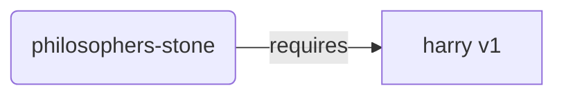
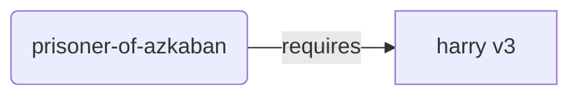
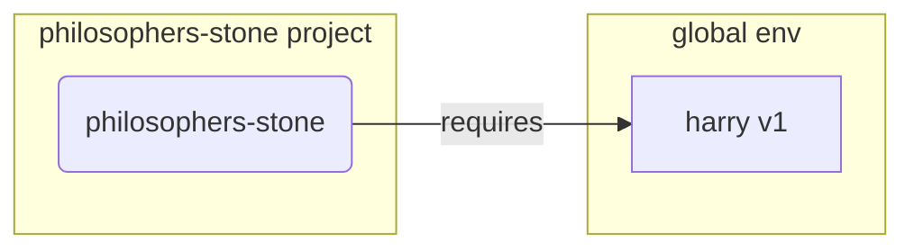
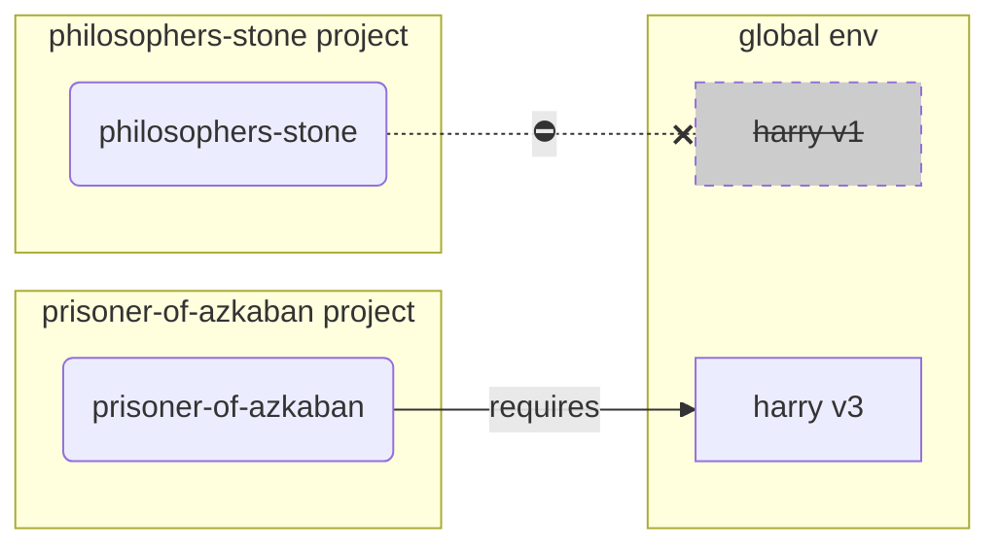
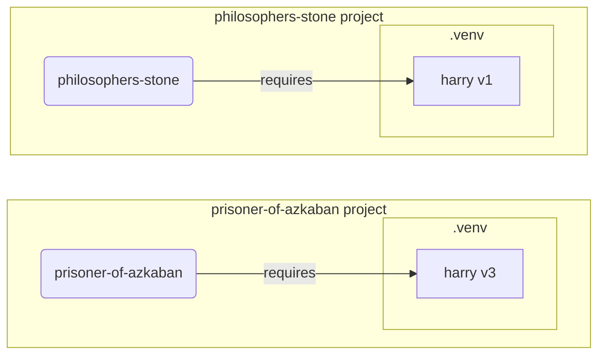

# Environnements virtuels { #virtual-environments }

Lorsque vous travaillez sur des projets Python, vous devriez probablement utiliser un environnement virtuel (ou un mécanisme similaire) pour isoler les packages que vous installez pour chaque projet.

/// info

Si vous connaissez déjà les environnements virtuels, comment les créer et les utiliser, vous pouvez passer cette section. 🤓

///

/// tip | Astuce

Un environnement virtuel est différent d’une variable d’environnement.

Une variable d’environnement est une variable du système qui peut être utilisée par des programmes.

Un environnement virtuel est un répertoire contenant certains fichiers.

///

/// info

Cette page vous apprendra à utiliser les environnements virtuels et à comprendre leur fonctionnement.

Si vous êtes prêt à adopter un outil qui gère tout pour vous (y compris l’installation de Python), essayez <a href="https://github.com/astral-sh/uv" class="external-link" target="_blank">uv</a>.

///

## Créer un projet { #create-a-project }

Commencez par créer un répertoire pour votre projet.

Ce que je fais généralement, c’est créer un répertoire nommé `code` dans mon répertoire personnel/utilisateur.

Et à l’intérieur, je crée un répertoire par projet.

<div class="termy">

```console
// Aller au répertoire personnel
$ cd
// Créer un répertoire pour tous vos projets de code
$ mkdir code
// Entrer dans ce répertoire code
$ cd code
// Créer un répertoire pour ce projet
$ mkdir awesome-project
// Entrer dans ce répertoire de projet
$ cd awesome-project
```

</div>

## Créer un environnement virtuel { #create-a-virtual-environment }

Lorsque vous commencez à travailler sur un projet Python pour la première fois, créez un environnement virtuel <strong><dfn title="il existe d'autres options, il s'agit d'une simple recommandation">dans votre projet</dfn></strong>.

/// tip | Astuce

Vous n’avez besoin de faire cela qu’une seule fois par projet, pas à chaque fois que vous travaillez.

///

//// tab | `venv`

Pour créer un environnement virtuel, vous pouvez utiliser le module `venv` fourni avec Python.

<div class="termy">

```console
$ python -m venv .venv
```

</div>

/// details | Que signifie cette commande

* `python` : utiliser le programme nommé `python`
* `-m` : appeler un module comme un script, nous préciserons ensuite quel module
* `venv` : utiliser le module nommé `venv` qui est normalement installé avec Python
* `.venv` : créer l’environnement virtuel dans le nouveau répertoire `.venv`

///

////

//// tab | `uv`

Si vous avez installé <a href="https://github.com/astral-sh/uv" class="external-link" target="_blank">`uv`</a>, vous pouvez l’utiliser pour créer un environnement virtuel.

<div class="termy">

```console
$ uv venv
```

</div>

/// tip | Astuce

Par défaut, `uv` créera un environnement virtuel dans un répertoire appelé `.venv`.

Mais vous pouvez le personnaliser en passant un argument supplémentaire avec le nom du répertoire.

///

////

Cette commande crée un nouvel environnement virtuel dans un répertoire appelé `.venv`.

/// details | `.venv` ou autre nom

Vous pourriez créer l’environnement virtuel dans un autre répertoire, mais il est d’usage de l’appeler `.venv`.

///

## Activer l’environnement virtuel { #activate-the-virtual-environment }

Activez le nouvel environnement virtuel afin que toute commande Python que vous exécutez ou tout package que vous installez l’utilise.

/// tip | Astuce

Faites cela à chaque fois que vous démarrez une nouvelle session de terminal pour travailler sur le projet.

///

//// tab | Linux, macOS

<div class="termy">

```console
$ source .venv/bin/activate
```

</div>

////

//// tab | Windows PowerShell

<div class="termy">

```console
$ .venv\Scripts\Activate.ps1
```

</div>

////

//// tab | Windows Bash

Ou si vous utilisez Bash pour Windows (par exemple <a href="https://gitforwindows.org/" class="external-link" target="_blank">Git Bash</a>) :

<div class="termy">

```console
$ source .venv/Scripts/activate
```

</div>

////

/// tip | Astuce

Chaque fois que vous installez un nouveau package dans cet environnement, activez de nouveau l’environnement.

Vous vous assurez ainsi que si vous utilisez un programme de terminal (<abbr title="command line interface - interface en ligne de commande">CLI</abbr>) installé par ce package, vous utilisez celui de votre environnement virtuel et non un autre qui pourrait être installé globalement, probablement avec une version différente de celle dont vous avez besoin.

///

## Vérifier que l’environnement virtuel est actif { #check-the-virtual-environment-is-active }

Vérifiez que l’environnement virtuel est actif (la commande précédente a fonctionné).

/// tip | Astuce

C’est facultatif, mais c’est une bonne manière de vérifier que tout fonctionne comme prévu et que vous utilisez l’environnement virtuel voulu.

///

//// tab | Linux, macOS, Windows Bash

<div class="termy">

```console
$ which python

/home/user/code/awesome-project/.venv/bin/python
```

</div>

S’il affiche le binaire `python` à `.venv/bin/python`, dans votre projet (dans cet exemple `awesome-project`), alors cela a fonctionné. 🎉

////

//// tab | Windows PowerShell

<div class="termy">

```console
$ Get-Command python

C:\Users\user\code\awesome-project\.venv\Scripts\python
```

</div>

S’il affiche le binaire `python` à `.venv\Scripts\python`, dans votre projet (dans cet exemple `awesome-project`), alors cela a fonctionné. 🎉

////

## Mettre à niveau `pip` { #upgrade-pip }

/// tip | Astuce

Si vous utilisez <a href="https://github.com/astral-sh/uv" class="external-link" target="_blank">`uv`</a>, vous l’utiliserez pour installer des éléments à la place de `pip`, vous n’avez donc pas besoin de mettre `pip` à niveau. 😎

///

Si vous utilisez `pip` pour installer des packages (il est fourni par défaut avec Python), vous devez le mettre à niveau vers la dernière version.

Beaucoup d’erreurs exotiques lors de l’installation d’un package se résolvent simplement en mettant d’abord `pip` à niveau.

/// tip | Astuce

Vous feriez normalement cela une seule fois, juste après avoir créé l’environnement virtuel.

///

Vous devez vous assurer que l’environnement virtuel est actif (avec la commande ci-dessus), puis exécuter :

<div class="termy">

```console
$ python -m pip install --upgrade pip

---> 100%
```

</div>

/// tip | Astuce

Parfois, vous pourriez obtenir une erreur **`No module named pip`** en essayant de mettre à niveau pip.

Si cela arrive, installez et mettez à niveau pip avec la commande ci-dessous :

<div class="termy">

```console
$ python -m ensurepip --upgrade

---> 100%
```

</div>

Cette commande installera pip s’il n’est pas déjà installé et garantit aussi que la version de pip installée est au moins aussi récente que celle disponible dans `ensurepip`.

///

## Ajouter `.gitignore` { #add-gitignore }

Si vous utilisez Git (vous devriez), ajoutez un fichier `.gitignore` pour exclure tout ce qui se trouve dans votre `.venv` de Git.

/// tip | Astuce

Si vous avez utilisé <a href="https://github.com/astral-sh/uv" class="external-link" target="_blank">`uv`</a> pour créer l’environnement virtuel, il l’a déjà fait pour vous, vous pouvez passer cette étape. 😎

///

/// tip | Astuce

Faites cela une seule fois, juste après avoir créé l’environnement virtuel.

///

<div class="termy">

```console
$ echo "*" > .venv/.gitignore
```

</div>

/// details | Que signifie cette commande

* `echo "*"` : va « afficher » le texte `*` dans le terminal (la partie suivante change un peu cela)
* `>` : tout ce qui est affiché dans le terminal par la commande à gauche de `>` ne doit pas être affiché mais écrit dans le fichier à droite de `>`
* `.gitignore` : le nom du fichier dans lequel le texte doit être écrit

Et `*` signifie pour Git « tout ». Ainsi, il ignorera tout dans le répertoire `.venv`.

Cette commande créera un fichier `.gitignore` avec le contenu :

```gitignore
*
```

///

## Installer des packages { #install-packages }

Après avoir activé l’environnement, vous pouvez y installer des packages.

/// tip | Astuce

Faites cela une seule fois lorsque vous installez ou mettez à niveau les packages nécessaires à votre projet.

Si vous devez mettre à niveau une version ou ajouter un nouveau package, vous le referez.

///

### Installer des packages directement { #install-packages-directly }

Si vous êtes pressé et ne souhaitez pas utiliser un fichier pour déclarer les dépendances de votre projet, vous pouvez les installer directement.

/// tip | Astuce

C’est une très bonne idée de placer les packages et leurs versions nécessaires à votre programme dans un fichier (par exemple `requirements.txt` ou `pyproject.toml`).

///

//// tab | `pip`

<div class="termy">

```console
$ pip install "fastapi[standard]"

---> 100%
```

</div>

////

//// tab | `uv`

Si vous avez <a href="https://github.com/astral-sh/uv" class="external-link" target="_blank">`uv`</a> :

<div class="termy">

```console
$ uv pip install "fastapi[standard]"
---> 100%
```

</div>

////

### Installer depuis `requirements.txt` { #install-from-requirements-txt }

Si vous avez un `requirements.txt`, vous pouvez maintenant l’utiliser pour installer ses packages.

//// tab | `pip`

<div class="termy">

```console
$ pip install -r requirements.txt
---> 100%
```

</div>

////

//// tab | `uv`

Si vous avez <a href="https://github.com/astral-sh/uv" class="external-link" target="_blank">`uv`</a> :

<div class="termy">

```console
$ uv pip install -r requirements.txt
---> 100%
```

</div>

////

/// details | `requirements.txt`

Un `requirements.txt` avec quelques packages pourrait ressembler à :

```requirements.txt
fastapi[standard]==0.113.0
pydantic==2.8.0
```

///

## Exécuter votre programme { #run-your-program }

Après avoir activé l’environnement virtuel, vous pouvez exécuter votre programme, et il utilisera le Python de votre environnement virtuel avec les packages que vous y avez installés.

<div class="termy">

```console
$ python main.py

Hello World
```

</div>

## Configurer votre éditeur { #configure-your-editor }

Vous utiliserez probablement un éditeur, assurez-vous de le configurer pour utiliser le même environnement virtuel que vous avez créé (il le détectera probablement automatiquement) afin d’avoir l’autocomplétion et les erreurs inline.

Par exemple :

* <a href="https://code.visualstudio.com/docs/python/environments#_select-and-activate-an-environment" class="external-link" target="_blank">VS Code</a>
* <a href="https://www.jetbrains.com/help/pycharm/creating-virtual-environment.html" class="external-link" target="_blank">PyCharm</a>

/// tip | Astuce

Vous devez normalement faire cela une seule fois, lorsque vous créez l’environnement virtuel.

///

## Désactiver l’environnement virtuel { #deactivate-the-virtual-environment }

Une fois que vous avez fini de travailler sur votre projet, vous pouvez désactiver l’environnement virtuel.

<div class="termy">

```console
$ deactivate
```

</div>

Ainsi, lorsque vous exécutez `python`, il n’essaiera pas de l’exécuter depuis cet environnement virtuel avec les packages qui y sont installés.

## Prêt à travailler { #ready-to-work }

Vous êtes maintenant prêt à commencer à travailler sur votre projet.


/// tip | Astuce

Voulez-vous comprendre tout ce qui précède ?

Continuez la lecture. 👇🤓

///

## Pourquoi des environnements virtuels { #why-virtual-environments }

Pour travailler avec FastAPI, vous devez installer <a href="https://www.python.org/" class="external-link" target="_blank">Python</a>.

Ensuite, vous devrez installer FastAPI et tout autre package que vous souhaitez utiliser.

Pour installer des packages, vous utiliseriez normalement la commande `pip` fournie avec Python (ou des alternatives similaires).

Néanmoins, si vous utilisez simplement `pip` directement, les packages seraient installés dans votre environnement Python global (l’installation globale de Python).

### Le problème { #the-problem }

Alors, quel est le problème d’installer des packages dans l’environnement Python global ?

À un moment donné, vous finirez probablement par écrire de nombreux programmes différents qui dépendent de packages différents. Et certains de ces projets sur lesquels vous travaillez dépendront de versions différentes du même package. 😱

Par exemple, vous pourriez créer un projet appelé `philosophers-stone`, ce programme dépend d’un autre package appelé **`harry`, en version `1`**. Vous devez donc installer `harry`.



Puis, plus tard, vous créez un autre projet appelé `prisoner-of-azkaban`, et ce projet dépend aussi de `harry`, mais il a besoin de **`harry` en version `3`**.



Mais maintenant, le problème est que, si vous installez les packages globalement (dans l’environnement global) au lieu de dans un environnement virtuel local, vous devrez choisir quelle version de `harry` installer.

Si vous voulez exécuter `philosophers-stone`, vous devrez d’abord installer `harry` en version `1`, par exemple avec :

<div class="termy">

```console
$ pip install "harry==1"
```

</div>

Et vous vous retrouverez avec `harry` en version `1` installé dans votre environnement Python global.



Mais si vous voulez ensuite exécuter `prisoner-of-azkaban`, vous devrez désinstaller `harry` version `1` et installer `harry` version `3` (ou bien installer la version `3` désinstallerait automatiquement la version `1`).

<div class="termy">

```console
$ pip install "harry==3"
```

</div>

Et vous vous retrouverez alors avec `harry` version `3` installé dans votre environnement Python global.

Et si vous essayez d’exécuter à nouveau `philosophers-stone`, il y a une chance que cela ne fonctionne pas car il a besoin de `harry` version `1`.



/// tip | Astuce

Il est très courant que les packages Python fassent de leur mieux pour éviter les changements cassants dans les nouvelles versions, mais il vaut mieux jouer la sécurité et installer de nouvelles versions intentionnellement et lorsque vous pouvez exécuter les tests pour vérifier que tout fonctionne correctement.

///

Maintenant, imaginez cela avec beaucoup d’autres packages dont tous vos projets dépendent. C’est très difficile à gérer. Et vous finiriez probablement par exécuter certains projets avec des versions incompatibles des packages, sans savoir pourquoi quelque chose ne fonctionne pas.

De plus, selon votre système d’exploitation (par exemple Linux, Windows, macOS), il se peut qu’il soit livré avec Python déjà installé. Et dans ce cas, il avait probablement des packages préinstallés avec des versions spécifiques nécessaires à votre système. Si vous installez des packages dans l’environnement Python global, vous pourriez finir par casser certains des programmes fournis avec votre système d’exploitation.

## Où les packages sont-ils installés { #where-are-packages-installed }

Lorsque vous installez Python, il crée des répertoires avec des fichiers sur votre ordinateur.

Certains de ces répertoires sont chargés de contenir tous les packages que vous installez.

Lorsque vous exécutez :

<div class="termy">

```console
// Ne l’exécutez pas maintenant, c’est juste un exemple 🤓
$ pip install "fastapi[standard]"
---> 100%
```

</div>

Cela téléchargera un fichier compressé avec le code de FastAPI, normalement depuis <a href="https://pypi.org/project/fastapi/" class="external-link" target="_blank">PyPI</a>.

Il téléchargera également des fichiers pour d’autres packages dont FastAPI dépend.

Ensuite, il extraira tous ces fichiers et les placera dans un répertoire de votre ordinateur.

Par défaut, il placera ces fichiers téléchargés et extraits dans le répertoire fourni avec votre installation de Python, c’est l’environnement global.

## Qu’est-ce qu’un environnement virtuel { #what-are-virtual-environments }

La solution aux problèmes posés par le fait d’avoir tous les packages dans l’environnement global est d’utiliser un environnement virtuel pour chaque projet sur lequel vous travaillez.

Un environnement virtuel est un répertoire, très similaire à celui global, où vous pouvez installer les packages pour un projet.

De cette manière, chaque projet aura son propre environnement virtuel (répertoire `.venv`) avec ses propres packages.



## Que signifie activer un environnement virtuel { #what-does-activating-a-virtual-environment-mean }

Lorsque vous activez un environnement virtuel, par exemple avec :

//// tab | Linux, macOS

<div class="termy">

```console
$ source .venv/bin/activate
```

</div>

////

//// tab | Windows PowerShell

<div class="termy">

```console
$ .venv\Scripts\Activate.ps1
```

</div>

////

//// tab | Windows Bash

Ou si vous utilisez Bash pour Windows (par exemple <a href="https://gitforwindows.org/" class="external-link" target="_blank">Git Bash</a>) :

<div class="termy">

```console
$ source .venv/Scripts/activate
```

</div>

////

Cette commande créera ou modifiera certaines [variables d’environnement](environment-variables.md){.internal-link target=_blank} qui seront disponibles pour les prochaines commandes.

L’une de ces variables est la variable `PATH`.

/// tip | Astuce

Vous pouvez en savoir plus sur la variable d’environnement `PATH` dans la section [Variables d’environnement](environment-variables.md#path-environment-variable){.internal-link target=_blank}.

///

Activer un environnement virtuel ajoute son chemin `.venv/bin` (sur Linux et macOS) ou `.venv\Scripts` (sur Windows) à la variable d’environnement `PATH`.

Disons qu’avant d’activer l’environnement, la variable `PATH` ressemblait à ceci :

//// tab | Linux, macOS

```plaintext
/usr/bin:/bin:/usr/sbin:/sbin
```

Cela signifie que le système chercherait des programmes dans :

* `/usr/bin`
* `/bin`
* `/usr/sbin`
* `/sbin`

////

//// tab | Windows

```plaintext
C:\Windows\System32
```

Cela signifie que le système chercherait des programmes dans :

* `C:\Windows\System32`

////

Après avoir activé l’environnement virtuel, la variable `PATH` ressemblerait à quelque chose comme ceci :

//// tab | Linux, macOS

```plaintext
/home/user/code/awesome-project/.venv/bin:/usr/bin:/bin:/usr/sbin:/sbin
```

Cela signifie que le système commencera maintenant par chercher des programmes dans :

```plaintext
/home/user/code/awesome-project/.venv/bin
```

avant de chercher dans les autres répertoires.

Ainsi, lorsque vous tapez `python` dans le terminal, le système trouvera le programme Python dans

```plaintext
/home/user/code/awesome-project/.venv/bin/python
```

et utilisera celui-ci.

////

//// tab | Windows

```plaintext
C:\Users\user\code\awesome-project\.venv\Scripts;C:\Windows\System32
```

Cela signifie que le système commencera maintenant par chercher des programmes dans :

```plaintext
C:\Users\user\code\awesome-project\.venv\Scripts
```

avant de chercher dans les autres répertoires.

Ainsi, lorsque vous tapez `python` dans le terminal, le système trouvera le programme Python dans

```plaintext
C:\Users\user\code\awesome-project\.venv\Scripts\python
```

et utilisera celui-ci.

////

Un détail important est qu’il placera le chemin de l’environnement virtuel au début de la variable `PATH`. Le système le trouvera avant de trouver tout autre Python disponible. Ainsi, lorsque vous exécutez `python`, il utilisera le Python de l’environnement virtuel au lieu de tout autre `python` (par exemple, un `python` d’un environnement global).

Activer un environnement virtuel change aussi deux ou trois autres choses, mais c’est l’un des points les plus importants.

## Vérifier un environnement virtuel { #checking-a-virtual-environment }

Lorsque vous vérifiez si un environnement virtuel est actif, par exemple avec :

//// tab | Linux, macOS, Windows Bash

<div class="termy">

```console
$ which python

/home/user/code/awesome-project/.venv/bin/python
```

</div>

////

//// tab | Windows PowerShell

<div class="termy">

```console
$ Get-Command python

C:\Users\user\code\awesome-project\.venv\Scripts\python
```

</div>

////

Cela signifie que le programme `python` qui sera utilisé est celui dans l’environnement virtuel.

Vous utilisez `which` sous Linux et macOS et `Get-Command` sous Windows PowerShell.

La façon dont cette commande fonctionne est qu’elle va vérifier la variable d’environnement `PATH`, en parcourant chaque chemin dans l’ordre, à la recherche du programme nommé `python`. Une fois trouvé, elle vous affichera le chemin vers ce programme.

La partie la plus importante est que lorsque vous appelez `python`, c’est exactement « `python` » qui sera exécuté.

Ainsi, vous pouvez confirmer si vous êtes dans le bon environnement virtuel.

/// tip | Astuce

Il est facile d’activer un environnement virtuel, d’obtenir un Python, puis d’aller vers un autre projet.

Et le second projet ne fonctionnerait pas parce que vous utilisez le Python incorrect, provenant d’un environnement virtuel d’un autre projet.

Il est utile de pouvoir vérifier quel `python` est utilisé. 🤓

///

## Pourquoi désactiver un environnement virtuel { #why-deactivate-a-virtual-environment }

Par exemple, vous pourriez travailler sur un projet `philosophers-stone`, activer cet environnement virtuel, installer des packages et travailler avec cet environnement.

Puis vous souhaitez travailler sur un autre projet `prisoner-of-azkaban`.

Vous allez vers ce projet :

<div class="termy">

```console
$ cd ~/code/prisoner-of-azkaban
```

</div>

Si vous ne désactivez pas l’environnement virtuel de `philosophers-stone`, lorsque vous exécutez `python` dans le terminal, il essaiera d’utiliser le Python de `philosophers-stone`.

<div class="termy">

```console
$ cd ~/code/prisoner-of-azkaban

$ python main.py

// Erreur lors de l'import de sirius, il n'est pas installé 😱
Traceback (most recent call last):
    File "main.py", line 1, in <module>
        import sirius
```

</div>

Mais si vous désactivez l’environnement virtuel et activez le nouveau pour `prisoner-of-askaban`, alors lorsque vous exécuterez `python`, il utilisera le Python de l’environnement virtuel de `prisoner-of-azkaban`.

<div class="termy">

```console
$ cd ~/code/prisoner-of-azkaban

// Vous n’avez pas besoin d’être dans l’ancien répertoire pour désactiver, vous pouvez le faire où que vous soyez, même après être allé dans l’autre projet 😎
$ deactivate

// Activer l’environnement virtuel dans prisoner-of-azkaban/.venv 🚀
$ source .venv/bin/activate

// Maintenant, lorsque vous exécutez python, il trouvera le package sirius installé dans cet environnement virtuel ✨
$ python main.py

I solemnly swear 🐺
```

</div>

## Alternatives { #alternatives }

Ceci est un guide simple pour vous lancer et vous montrer comment tout fonctionne en dessous.

Il existe de nombreuses alternatives pour gérer les environnements virtuels, les dépendances de packages (requirements), les projets.

Lorsque vous êtes prêt et souhaitez utiliser un outil pour gérer l’ensemble du projet, les dépendances, les environnements virtuels, etc., je vous suggère d’essayer <a href="https://github.com/astral-sh/uv" class="external-link" target="_blank">uv</a>.

`uv` peut faire beaucoup de choses, il peut :

* Installer Python pour vous, y compris différentes versions
* Gérer l’environnement virtuel pour vos projets
* Installer des packages
* Gérer les dépendances de packages et leurs versions pour votre projet
* Vous assurer d’avoir un ensemble exact de packages et de versions à installer, y compris leurs dépendances, afin que vous puissiez être certain d’exécuter votre projet en production exactement comme sur votre ordinateur pendant le développement, cela s’appelle le locking
* Et bien d’autres choses

## Conclusion { #conclusion }

Si vous avez lu et compris tout cela, vous en savez maintenant bien plus sur les environnements virtuels que beaucoup de développeurs. 🤓

Connaître ces détails vous sera très probablement utile à l’avenir lorsque vous déboguerez quelque chose qui semble complexe, mais vous saurez comment tout fonctionne en dessous. 😎
