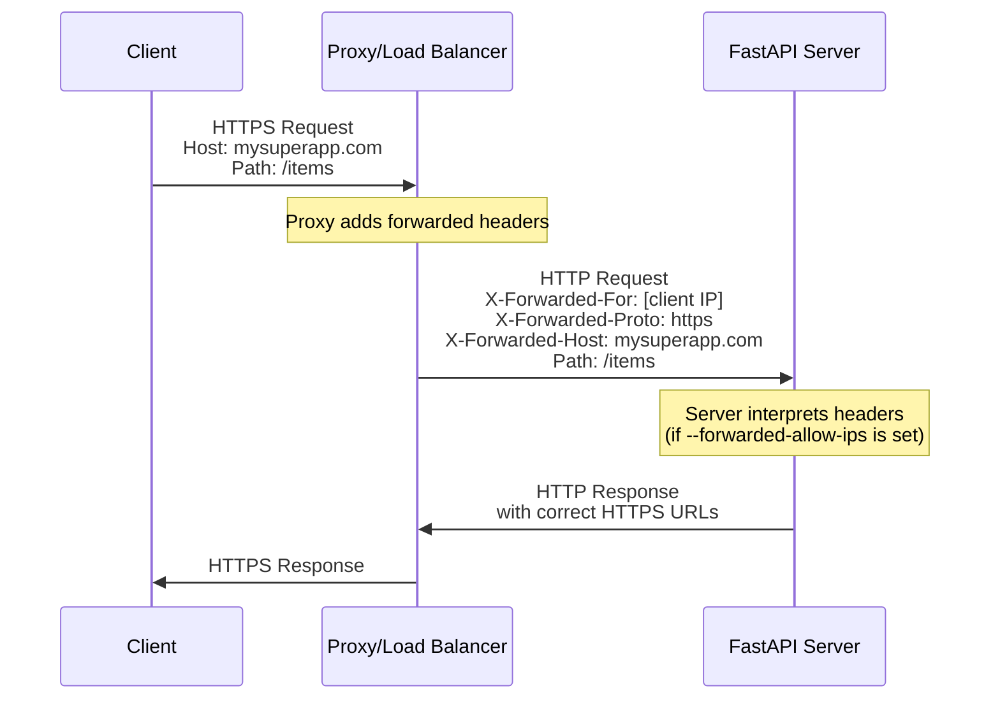
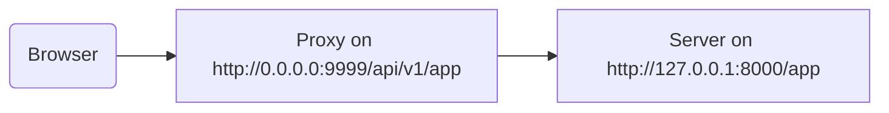

# Proxy के पीछे { #behind-a-proxy }

कई स्थितियों में, आप अपने FastAPI app के सामने Traefik या Nginx जैसा **proxy** उपयोग करेंगे।

ये proxies HTTPS certificates और दूसरी चीज़ें संभाल सकते हैं।

## Proxy Forwarded Headers { #proxy-forwarded-headers }

आपकी application के सामने मौजूद **proxy** आम तौर पर requests को आपके **server** तक भेजने से पहले तुरंत कुछ headers सेट करेगा, ताकि server को पता चल सके कि request proxy द्वारा **forwarded** की गई थी, उसे मूल (public) URL पता चल सके, जिसमें domain शामिल हो, कि वह HTTPS उपयोग कर रहा है, आदि।

**server** program (उदाहरण के लिए **FastAPI CLI** के जरिए **Uvicorn**) इन headers को समझने में सक्षम है, और फिर वह जानकारी आपकी application को पास कर सकता है।

लेकिन security के लिए, क्योंकि server को यह नहीं पता कि वह किसी trusted proxy के पीछे है, वह उन headers को interpret नहीं करेगा।

/// note | तकनीकी विवरण

Proxy headers हैं:

* [X-Forwarded-For](https://developer.mozilla.org/en-US/docs/Web/HTTP/Reference/Headers/X-Forwarded-For)
* [X-Forwarded-Proto](https://developer.mozilla.org/en-US/docs/Web/HTTP/Reference/Headers/X-Forwarded-Proto)
* [X-Forwarded-Host](https://developer.mozilla.org/en-US/docs/Web/HTTP/Reference/Headers/X-Forwarded-Host)

///

### Proxy Forwarded Headers सक्षम करें { #enable-proxy-forwarded-headers }

आप FastAPI CLI को *CLI Option* `--forwarded-allow-ips` के साथ शुरू कर सकते हैं और वे IP addresses पास कर सकते हैं जिन पर उन forwarded headers को पढ़ने के लिए भरोसा किया जाना चाहिए।

अगर आप इसे `--forwarded-allow-ips="*"` पर सेट करते हैं, तो यह सभी incoming IPs पर भरोसा करेगा।

अगर आपका **server** किसी trusted **proxy** के पीछे है और केवल proxy ही उससे बात करता है, तो इससे वह उस **proxy** का जो भी IP है, उसे accept करेगा।

<div class="termy">

```console
$ fastapi run --forwarded-allow-ips="*"

<span style="color: green;">INFO</span>:     Uvicorn running on http://127.0.0.1:8000 (Press CTRL+C to quit)
```

</div>

### HTTPS के साथ Redirects { #redirects-with-https }

उदाहरण के लिए, मान लें कि आप एक *path operation* `/items/` define करते हैं:

{* ../../docs_src/behind_a_proxy/tutorial001_01_py310.py hl[6] *}

अगर client `/items` पर जाने की कोशिश करता है, तो default रूप से, उसे `/items/` पर redirect किया जाएगा।

लेकिन *CLI Option* `--forwarded-allow-ips` सेट करने से पहले यह `http://localhost:8000/items/` पर redirect कर सकता है।

लेकिन शायद आपकी application `https://mysuperapp.com` पर hosted है, और redirection `https://mysuperapp.com/items/` पर होना चाहिए।

अब `--proxy-headers` सेट करने से FastAPI सही location पर redirect कर पाएगा। 😎

```
https://mysuperapp.com/items/
```

/// tip | सुझाव

अगर आप HTTPS के बारे में और जानना चाहते हैं, तो guide [HTTPS के बारे में](../deployment/https.md) देखें।

///

### Proxy Forwarded Headers कैसे काम करते हैं { #how-proxy-forwarded-headers-work }

यहाँ client और **application server** के बीच **proxy** द्वारा forwarded headers जोड़ने का एक visual representation है:



**proxy** मूल client request को intercept करता है और request को **application server** तक पास करने से पहले खास *forwarded* headers (`X-Forwarded-*`) जोड़ता है।

ये headers मूल request के बारे में वह जानकारी सुरक्षित रखते हैं जो अन्यथा खो जाती:

* **X-Forwarded-For**: मूल client का IP address
* **X-Forwarded-Proto**: मूल protocol (`https`)
* **X-Forwarded-Host**: मूल host (`mysuperapp.com`)

जब **FastAPI CLI** को `--forwarded-allow-ips` के साथ configured किया जाता है, तो यह इन headers पर भरोसा करता है और उनका उपयोग करता है, उदाहरण के लिए redirects में सही URLs generate करने के लिए।

## Stripped path prefix वाला Proxy { #proxy-with-a-stripped-path-prefix }

आपके पास ऐसा proxy हो सकता है जो आपकी application में एक path prefix जोड़ता हो।

इन मामलों में आप अपनी application configure करने के लिए `root_path` का उपयोग कर सकते हैं।

`root_path` ASGI specification द्वारा प्रदान किया गया एक mechanism है (जिस पर FastAPI, Starlette के जरिए, बना है)।

`root_path` का उपयोग इन specific cases को handle करने के लिए किया जाता है।

और इसका उपयोग sub-applications mount करते समय internally भी किया जाता है।

इस case में, stripped path prefix वाला proxy होने का मतलब है कि आप अपने code में `/app` पर एक path declare कर सकते हैं, लेकिन फिर आप ऊपर एक layer (proxy) जोड़ते हैं जो आपकी **FastAPI** application को `/api/v1` जैसे path के नीचे रखेगी।

इस case में, मूल path `/app` वास्तव में `/api/v1/app` पर serve किया जाएगा।

हालाँकि आपका सारा code यह मानकर लिखा गया है कि सिर्फ `/app` है।

{* ../../docs_src/behind_a_proxy/tutorial001_py310.py hl[6] *}

और proxy app server (शायद FastAPI CLI के जरिए Uvicorn) तक request भेजने से पहले तुरंत **path prefix** को **"strip"** कर देगा, आपकी application को यह भरोसा दिलाते हुए कि वह `/app` पर serve हो रही है, ताकि आपको prefix `/api/v1` शामिल करने के लिए अपना सारा code update न करना पड़े।

यहाँ तक, सब कुछ सामान्य रूप से काम करेगा।

लेकिन फिर, जब आप integrated docs UI (frontend) खोलेंगे, तो वह OpenAPI schema को `/api/v1/openapi.json` के बजाय `/openapi.json` पर पाने की अपेक्षा करेगा।

इसलिए, frontend (जो browser में चलता है) `/openapi.json` तक पहुँचने की कोशिश करेगा और OpenAPI schema प्राप्त नहीं कर पाएगा।

क्योंकि हमारे app के लिए `/api/v1` का path prefix वाला proxy है, frontend को OpenAPI schema `/api/v1/openapi.json` पर fetch करना होगा।



/// tip | सुझाव

IP `0.0.0.0` आम तौर पर यह बताने के लिए उपयोग किया जाता है कि program उस machine/server में उपलब्ध सभी IPs पर listen करता है।

///

Docs UI को OpenAPI schema में यह declare करने की भी ज़रूरत होगी कि यह API `server` `/api/v1` (proxy के पीछे) पर स्थित है। उदाहरण के लिए:

```JSON hl_lines="4-8"
{
    "openapi": "3.1.0",
    // यहाँ और चीज़ें
    "servers": [
        {
            "url": "/api/v1"
        }
    ],
    "paths": {
            // यहाँ और चीज़ें
    }
}
```

इस उदाहरण में, "Proxy" कुछ **Traefik** जैसा हो सकता है। और server **Uvicorn** के साथ FastAPI CLI जैसा हो सकता है, जो आपकी FastAPI application चला रहा है।

### `root_path` प्रदान करना { #providing-the-root-path }

इसे हासिल करने के लिए, आप command line option `--root-path` इस तरह उपयोग कर सकते हैं:

<div class="termy">

```console
$ fastapi run main.py --forwarded-allow-ips="*" --root-path /api/v1

<span style="color: green;">INFO</span>:     Uvicorn running on http://127.0.0.1:8000 (Press CTRL+C to quit)
```

</div>

अगर आप Hypercorn उपयोग करते हैं, तो उसमें भी option `--root-path` है।

/// note | तकनीकी विवरण

ASGI specification इस use case के लिए `root_path` define करती है।

और `--root-path` command line option वही `root_path` प्रदान करता है।

///

### वर्तमान `root_path` जाँचना { #checking-the-current-root-path }

आप प्रत्येक request के लिए आपकी application द्वारा उपयोग किया गया वर्तमान `root_path` प्राप्त कर सकते हैं, यह `scope` dictionary का हिस्सा है (जो ASGI spec का हिस्सा है)।

यहाँ हम इसे केवल demonstration purposes के लिए message में शामिल कर रहे हैं।

{* ../../docs_src/behind_a_proxy/tutorial001_py310.py hl[8] *}

फिर, अगर आप Uvicorn को इस तरह शुरू करते हैं:

<div class="termy">

```console
$ fastapi run main.py --forwarded-allow-ips="*" --root-path /api/v1

<span style="color: green;">INFO</span>:     Uvicorn running on http://127.0.0.1:8000 (Press CTRL+C to quit)
```

</div>

Response कुछ ऐसा होगा:

```JSON
{
    "message": "Hello World",
    "root_path": "/api/v1"
}
```

### FastAPI app में `root_path` सेट करना { #setting-the-root-path-in-the-fastapi-app }

वैकल्पिक रूप से, अगर आपके पास `--root-path` या equivalent जैसा command line option देने का तरीका नहीं है, तो आप अपनी FastAPI app बनाते समय `root_path` parameter सेट कर सकते हैं:

{* ../../docs_src/behind_a_proxy/tutorial002_py310.py hl[3] *}

`root_path` को `FastAPI` में पास करना, Uvicorn या Hypercorn को `--root-path` command line option पास करने के equivalent होगा।

### `root_path` के बारे में { #about-root-path }

ध्यान रखें कि server (Uvicorn) उस `root_path` का उपयोग app को पास करने के अलावा किसी और चीज़ के लिए नहीं करेगा।

लेकिन अगर आप अपने browser में [http://127.0.0.1:8000/app](http://127.0.0.1:8000/app) पर जाते हैं, तो आपको normal response दिखाई देगा:

```JSON
{
    "message": "Hello World",
    "root_path": "/api/v1"
}
```

इसलिए, यह `http://127.0.0.1:8000/api/v1/app` पर access किए जाने की अपेक्षा नहीं करेगा।

Uvicorn अपेक्षा करेगा कि proxy Uvicorn को `http://127.0.0.1:8000/app` पर access करे, और फिर ऊपर extra `/api/v1` prefix जोड़ना proxy की जिम्मेदारी होगी।

## Stripped path prefix वाले proxies के बारे में { #about-proxies-with-a-stripped-path-prefix }

ध्यान रखें कि stripped path prefix वाला proxy इसे configure करने के तरीकों में से केवल एक है।

शायद कई cases में default यह होगा कि proxy के पास stripped path prefix नहीं होगा।

ऐसे case में (बिना stripped path prefix के), proxy कुछ `https://myawesomeapp.com` जैसा listen करेगा, और फिर अगर browser `https://myawesomeapp.com/api/v1/app` पर जाता है और आपका server (जैसे Uvicorn) `http://127.0.0.1:8000` पर listen करता है, तो proxy (बिना stripped path prefix के) Uvicorn को उसी path पर access करेगा: `http://127.0.0.1:8000/api/v1/app`।

## Traefik के साथ local testing { #testing-locally-with-traefik }

आप [Traefik](https://docs.traefik.io/) का उपयोग करके stripped path prefix के साथ experiment आसानी से locally चला सकते हैं।

[Traefik download करें](https://github.com/containous/traefik/releases), यह एक single binary है, आप compressed file extract कर सकते हैं और इसे सीधे terminal से चला सकते हैं।

फिर `traefik.toml` नाम की file बनाएँ जिसमें यह हो:

```TOML hl_lines="3"
[entryPoints]
  [entryPoints.http]
    address = ":9999"

[providers]
  [providers.file]
    filename = "routes.toml"
```

यह Traefik को port 9999 पर listen करने और दूसरी file `routes.toml` उपयोग करने के लिए कहता है।

/// tip | सुझाव

हम standard HTTP port 80 के बजाय port 9999 उपयोग कर रहे हैं ताकि आपको इसे admin (`sudo`) privileges के साथ न चलाना पड़े।

///

अब वह दूसरी file `routes.toml` बनाएँ:

```TOML hl_lines="5  12  20"
[http]
  [http.middlewares]

    [http.middlewares.api-stripprefix.stripPrefix]
      prefixes = ["/api/v1"]

  [http.routers]

    [http.routers.app-http]
      entryPoints = ["http"]
      service = "app"
      rule = "PathPrefix(`/api/v1`)"
      middlewares = ["api-stripprefix"]

  [http.services]

    [http.services.app]
      [http.services.app.loadBalancer]
        [[http.services.app.loadBalancer.servers]]
          url = "http://127.0.0.1:8000"
```

यह file Traefik को path prefix `/api/v1` उपयोग करने के लिए configure करती है।

और फिर Traefik अपनी requests को `http://127.0.0.1:8000` पर चल रहे आपके Uvicorn पर redirect करेगा।

अब Traefik शुरू करें:

<div class="termy">

```console
$ ./traefik --configFile=traefik.toml

INFO[0000] Configuration loaded from file: /home/user/awesomeapi/traefik.toml
```

</div>

और अब `--root-path` option का उपयोग करके अपना app शुरू करें:

<div class="termy">

```console
$ fastapi run main.py --forwarded-allow-ips="*" --root-path /api/v1

<span style="color: green;">INFO</span>:     Uvicorn running on http://127.0.0.1:8000 (Press CTRL+C to quit)
```

</div>

### Responses जाँचें { #check-the-responses }

अब, अगर आप Uvicorn के port वाले URL पर जाते हैं: [http://127.0.0.1:8000/app](http://127.0.0.1:8000/app), तो आपको normal response दिखाई देगा:

```JSON
{
    "message": "Hello World",
    "root_path": "/api/v1"
}
```

/// tip | सुझाव

ध्यान दें कि भले ही आप इसे `http://127.0.0.1:8000/app` पर access कर रहे हैं, यह option `--root-path` से लिया गया `/api/v1` का `root_path` दिखाता है।

///

और अब Traefik के port वाले URL को खोलें, जिसमें path prefix शामिल है: [http://127.0.0.1:9999/api/v1/app](http://127.0.0.1:9999/api/v1/app)।

हमें वही response मिलता है:

```JSON
{
    "message": "Hello World",
    "root_path": "/api/v1"
}
```

लेकिन इस बार proxy द्वारा प्रदान किए गए prefix path वाले URL पर: `/api/v1`।

बेशक, यहाँ विचार यह है कि हर कोई app को proxy के जरिए access करेगा, इसलिए path prefix `/api/v1` वाला version "correct" है।

और बिना path prefix वाला version (`http://127.0.0.1:8000/app`), जो सीधे Uvicorn द्वारा प्रदान किया गया है, केवल _proxy_ (Traefik) के access के लिए होगा।

यह दिखाता है कि Proxy (Traefik) path prefix का उपयोग कैसे करता है और server (Uvicorn) option `--root-path` से `root_path` का उपयोग कैसे करता है।

### Docs UI जाँचें { #check-the-docs-ui }

लेकिन यहाँ मज़ेदार हिस्सा है। ✨

App को access करने का "official" तरीका उस path prefix वाले proxy के जरिए होगा जिसे हमने define किया है। इसलिए, जैसा कि हम अपेक्षा करेंगे, अगर आप Uvicorn द्वारा सीधे serve किया गया docs UI try करते हैं, URL में path prefix के बिना, तो यह काम नहीं करेगा, क्योंकि यह proxy के जरिए access किए जाने की अपेक्षा करता है।

आप इसे [http://127.0.0.1:8000/docs](http://127.0.0.1:8000/docs) पर देख सकते हैं:


लेकिन अगर हम port `9999` वाले proxy का उपयोग करके "official" URL पर, `/api/v1/docs` पर docs UI access करते हैं, तो यह सही तरीके से काम करता है! 🎉

आप इसे [http://127.0.0.1:9999/api/v1/docs](http://127.0.0.1:9999/api/v1/docs) पर देख सकते हैं:


बिल्कुल जैसा हम चाहते थे। ✔️

ऐसा इसलिए है क्योंकि FastAPI इस `root_path` का उपयोग OpenAPI में default `server` बनाने के लिए करता है, जिसमें `root_path` द्वारा दिया गया URL होता है।

## अतिरिक्त servers { #additional-servers }

/// warning | चेतावनी

यह एक अधिक advanced use case है। चाहें तो इसे skip कर सकते हैं।

///

Default रूप से, **FastAPI** OpenAPI schema में `root_path` के URL वाला एक `server` बनाएगा।

लेकिन आप अन्य alternative `servers` भी प्रदान कर सकते हैं, उदाहरण के लिए अगर आप चाहते हैं कि *वही* docs UI staging और production environment दोनों के साथ interact करे।

अगर आप `servers` की custom list पास करते हैं और कोई `root_path` है (क्योंकि आपकी API proxy के पीछे रहती है), तो **FastAPI** list की शुरुआत में इस `root_path` के साथ एक "server" insert करेगा।

उदाहरण के लिए:

{* ../../docs_src/behind_a_proxy/tutorial003_py310.py hl[4:7] *}

यह इस तरह का OpenAPI schema generate करेगा:

```JSON hl_lines="5-7"
{
    "openapi": "3.1.0",
    // यहाँ और चीज़ें
    "servers": [
        {
            "url": "/api/v1"
        },
        {
            "url": "https://stag.example.com",
            "description": "Staging environment"
        },
        {
            "url": "https://prod.example.com",
            "description": "Production environment"
        }
    ],
    "paths": {
            // यहाँ और चीज़ें
    }
}
```

/// tip | सुझाव

ध्यान दें कि `/api/v1` के `url` value वाला auto-generated server `root_path` से लिया गया है।

///

[http://127.0.0.1:9999/api/v1/docs](http://127.0.0.1:9999/api/v1/docs) पर docs UI में यह ऐसा दिखेगा:


/// tip | सुझाव

Docs UI आपके द्वारा चुने गए server के साथ interact करेगा।

///

/// note | तकनीकी विवरण

OpenAPI specification में `servers` property optional है।

अगर आप `servers` parameter specify नहीं करते और `root_path` `/` के बराबर है, तो generated OpenAPI schema में `servers` property default रूप से पूरी तरह omit कर दी जाएगी, जो `/` के `url` value वाले single server के equivalent है।

///

### `root_path` से automatic server disable करें { #disable-automatic-server-from-root-path }

अगर आप नहीं चाहते कि **FastAPI** `root_path` का उपयोग करके automatic server शामिल करे, तो आप parameter `root_path_in_servers=False` उपयोग कर सकते हैं:

{* ../../docs_src/behind_a_proxy/tutorial004_py310.py hl[9] *}

और फिर यह उसे OpenAPI schema में शामिल नहीं करेगा।

## Sub-application mount करना { #mounting-a-sub-application }

अगर आपको `root_path` वाले proxy का उपयोग करते हुए भी sub-application mount करनी है (जैसा कि [Sub Applications - Mounts](sub-applications.md) में बताया गया है), तो आप इसे सामान्य रूप से कर सकते हैं, जैसा कि आप अपेक्षा करेंगे।

FastAPI internally `root_path` का smart तरीके से उपयोग करेगा, इसलिए यह बस काम करेगा। ✨
