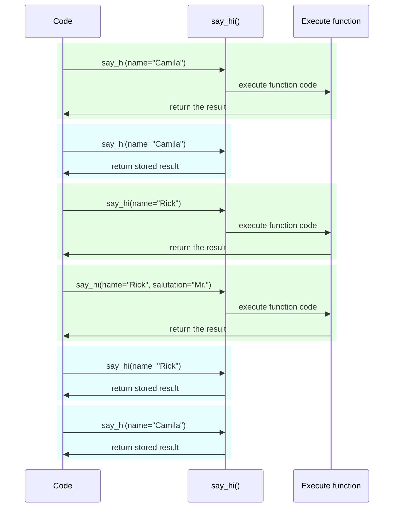

# Settings और Environment Variables { #settings-and-environment-variables }

कई मामलों में आपकी application को कुछ बाहरी settings या configurations की ज़रूरत हो सकती है, उदाहरण के लिए secret keys, database credentials, email services के लिए credentials, आदि।

इनमें से ज़्यादातर settings variable होती हैं (बदल सकती हैं), जैसे database URLs। और कई sensitive हो सकती हैं, जैसे secrets।

इसी कारण उन्हें आम तौर पर environment variables में दिया जाता है जिन्हें application पढ़ती है।

/// tip | सुझाव

Environment variables को समझने के लिए आप [Environment Variables](../environment-variables.md) पढ़ सकते हैं।

///

## Types और validation { #types-and-validation }

ये environment variables केवल text strings को handle कर सकते हैं, क्योंकि ये Python के बाहर होते हैं और इन्हें दूसरे programs और system के बाकी हिस्सों के साथ compatible होना होता है (और अलग-अलग operating systems, जैसे Linux, Windows, और macOS के साथ भी)।

इसका मतलब है कि Python में किसी environment variable से पढ़ी गई कोई भी value एक `str` होगी, और किसी अलग type में कोई भी conversion या कोई भी validation code में करनी होगी।

## Pydantic `Settings` { #pydantic-settings }

सौभाग्य से, Pydantic environment variables से आने वाली इन settings को handle करने के लिए एक बेहतरीन utility देता है: [Pydantic: Settings management](https://docs.pydantic.dev/latest/concepts/pydantic_settings/)।

### `pydantic-settings` install करें { #install-pydantic-settings }

सबसे पहले, सुनिश्चित करें कि आप अपना [virtual environment](../virtual-environments.md) बनाते हैं, उसे activate करते हैं, और फिर `pydantic-settings` package install करते हैं:

<div class="termy">

```console
$ pip install pydantic-settings
---> 100%
```

</div>

जब आप `all` extras को install करते हैं, तो यह भी शामिल आता है:

<div class="termy">

```console
$ pip install "fastapi[all]"
---> 100%
```

</div>

### `Settings` object बनाएँ { #create-the-settings-object }

Pydantic से `BaseSettings` import करें और एक sub-class बनाएँ, बिल्कुल Pydantic model की तरह।

Pydantic models की तरह ही, आप type annotations के साथ class attributes घोषित करते हैं, और संभवतः default values भी।

आप वे सभी validation features और tools इस्तेमाल कर सकते हैं जिन्हें आप Pydantic models के लिए इस्तेमाल करते हैं, जैसे अलग-अलग data types और `Field()` के साथ अतिरिक्त validations।

{* ../../docs_src/settings/tutorial001_py310.py hl[2,5:8,11] *}

/// tip | सुझाव

अगर आप जल्दी copy और paste करने के लिए कुछ चाहते हैं, तो यह example इस्तेमाल न करें, नीचे वाला आखिरी example इस्तेमाल करें।

///

फिर, जब आप उस `Settings` class का instance बनाते हैं (इस case में, `settings` object में), Pydantic environment variables को case-insensitive तरीके से पढ़ेगा, इसलिए upper-case variable `APP_NAME` भी attribute `app_name` के लिए पढ़ा जाएगा।

इसके बाद यह data को convert और validate करेगा। इसलिए, जब आप उस `settings` object का उपयोग करेंगे, तो आपके पास उन types का data होगा जिन्हें आपने घोषित किया था (जैसे `items_per_user` एक `int` होगा)।

### `settings` का उपयोग करें { #use-the-settings }

फिर आप अपनी application में नए `settings` object का उपयोग कर सकते हैं:

{* ../../docs_src/settings/tutorial001_py310.py hl[18:20] *}

### Server चलाएँ { #run-the-server }

इसके बाद, आप configurations को environment variables के रूप में pass करते हुए server चलाएँगे, उदाहरण के लिए आप `ADMIN_EMAIL` और `APP_NAME` set कर सकते हैं:

<div class="termy">

```console
$ ADMIN_EMAIL="deadpool@example.com" APP_NAME="ChimichangApp" fastapi run main.py

<span style="color: green;">INFO</span>:     Uvicorn running on http://127.0.0.1:8000 (Press CTRL+C to quit)
```

</div>

/// tip | सुझाव

एक ही command के लिए कई env vars set करने के लिए बस उन्हें space से अलग करें, और उन सभी को command से पहले रखें।

///

और फिर `admin_email` setting `"deadpool@example.com"` पर set हो जाएगी।

`app_name` `"ChimichangApp"` होगा।

और `items_per_user` अपनी default value `50` बनाए रखेगा।

## किसी दूसरे module में Settings { #settings-in-another-module }

आप उन settings को किसी दूसरे module file में रख सकते हैं, जैसा आपने [Bigger Applications - Multiple Files](../tutorial/bigger-applications.md) में देखा था।

उदाहरण के लिए, आपके पास `config.py` file हो सकती है:

{* ../../docs_src/settings/app01_py310/config.py *}

और फिर उसे `main.py` file में उपयोग करें:

{* ../../docs_src/settings/app01_py310/main.py hl[3,11:13] *}

/// tip | सुझाव

आपको एक `__init__.py` file की भी ज़रूरत होगी, जैसा आपने [Bigger Applications - Multiple Files](../tutorial/bigger-applications.md) में देखा था।

///

## Dependency में Settings { #settings-in-a-dependency }

कुछ मौकों पर settings को dependency से देना उपयोगी हो सकता है, बजाय इसके कि `settings` के साथ एक global object हो जिसे हर जगह इस्तेमाल किया जाए।

यह testing के दौरान विशेष रूप से उपयोगी हो सकता है, क्योंकि dependency को अपनी custom settings से override करना बहुत आसान है।

### Config file { #the-config-file }

पिछले example से आगे बढ़ते हुए, आपकी `config.py` file इस तरह दिख सकती है:

{* ../../docs_src/settings/app02_an_py310/config.py hl[10] *}

ध्यान दें कि अब हम default instance `settings = Settings()` नहीं बनाते।

### Main app file { #the-main-app-file }

अब हम एक dependency बनाते हैं जो नया `config.Settings()` return करती है।

{* ../../docs_src/settings/app02_an_py310/main.py hl[6,12:13] *}

/// tip | सुझाव

हम थोड़ी देर में `@lru_cache` पर चर्चा करेंगे।

अभी के लिए आप मान सकते हैं कि `get_settings()` एक normal function है।

///

और फिर हम इसे *path operation function* से dependency के रूप में require कर सकते हैं और जहाँ भी ज़रूरत हो वहाँ इस्तेमाल कर सकते हैं।

{* ../../docs_src/settings/app02_an_py310/main.py hl[17,19:21] *}

### Settings और testing { #settings-and-testing }

फिर testing के दौरान `get_settings` के लिए dependency override बनाकर अलग settings object देना बहुत आसान होगा:

{* ../../docs_src/settings/app02_an_py310/test_main.py hl[9:10,13,21] *}

Dependency override में हम नया `Settings` object बनाते समय `admin_email` के लिए नई value set करते हैं, और फिर उस नए object को return करते हैं।

फिर हम test कर सकते हैं कि इसका उपयोग हुआ है।

## `.env` file पढ़ना { #reading-a-env-file }

अगर आपके पास कई settings हैं जो संभवतः बहुत बदलती हैं, शायद अलग-अलग environments में, तो उन्हें एक file में रखना और फिर वहाँ से ऐसे पढ़ना उपयोगी हो सकता है जैसे वे environment variables हों।

यह practice इतनी आम है कि इसका एक नाम है, ये environment variables आम तौर पर `.env` file में रखे जाते हैं, और file को "dotenv" कहा जाता है।

/// tip | सुझाव

dot (`.`) से शुरू होने वाली file Unix-like systems, जैसे Linux और macOS में hidden file होती है।

लेकिन dotenv file का वास्तव में वही exact filename होना ज़रूरी नहीं है।

///

Pydantic के पास external library का उपयोग करके इस प्रकार की files से पढ़ने के लिए support है। आप [Pydantic Settings: Dotenv (.env) support](https://docs.pydantic.dev/latest/concepts/pydantic_settings/#dotenv-env-support) पर और पढ़ सकते हैं।

/// tip | सुझाव

इसे काम करने के लिए, आपको `pip install python-dotenv` करना होगा।

///

### `.env` file { #the-env-file }

आपके पास इस तरह की `.env` file हो सकती है:

```bash
ADMIN_EMAIL="deadpool@example.com"
APP_NAME="ChimichangApp"
```

### `.env` से settings पढ़ें { #read-settings-from-env }

और फिर अपनी `config.py` को update करें:

{* ../../docs_src/settings/app03_an_py310/config.py hl[9] *}

/// tip | सुझाव

`model_config` attribute केवल Pydantic configuration के लिए उपयोग किया जाता है। आप [Pydantic: Concepts: Configuration](https://docs.pydantic.dev/latest/concepts/config/) पर और पढ़ सकते हैं।

///

यहाँ हम आपकी Pydantic `Settings` class के अंदर config `env_file` define करते हैं, और value को उस dotenv file के filename पर set करते हैं जिसे हम उपयोग करना चाहते हैं।

### `lru_cache` के साथ `Settings` को केवल एक बार बनाना { #creating-the-settings-only-once-with-lru-cache }

Disk से file पढ़ना सामान्यतः costly (slow) operation होता है, इसलिए आप शायद इसे केवल एक बार करना चाहेंगे और फिर हर request के लिए पढ़ने के बजाय उसी settings object को reuse करना चाहेंगे।

लेकिन हर बार जब हम करते हैं:

```Python
Settings()
```

तो एक नया `Settings` object बनेगा, और बनते समय यह `.env` file को फिर से पढ़ेगा।

अगर dependency function बस ऐसी होती:

```Python
def get_settings():
    return Settings()
```

तो हम हर request के लिए वह object बनाते, और हर request के लिए `.env` file पढ़ते। ⚠️

लेकिन क्योंकि हम ऊपर `@lru_cache` decorator इस्तेमाल कर रहे हैं, `Settings` object केवल एक बार बनाया जाएगा, पहली बार जब इसे call किया जाएगा। ✔️

{* ../../docs_src/settings/app03_an_py310/main.py hl[1,11] *}

फिर अगले requests के लिए dependencies में `get_settings()` की किसी भी बाद की call पर, `get_settings()` के internal code को execute करने और नया `Settings` object बनाने के बजाय, यह वही object return करेगा जो पहली call पर return किया गया था, बार-बार।

#### `lru_cache` Technical Details { #lru-cache-technical-details }

`@lru_cache` जिस function को decorate करता है उसे modify करता है ताकि वह हर बार function का code execute करके फिर से compute करने के बजाय वही value return करे जो पहली बार return की गई थी।

इसलिए, उसके नीचे वाला function arguments के प्रत्येक combination के लिए एक बार execute होगा। और फिर उन arguments के प्रत्येक combination द्वारा return की गई values बार-बार उपयोग की जाएँगी, जब भी function को ठीक उसी arguments combination के साथ call किया जाएगा।

उदाहरण के लिए, अगर आपके पास एक function है:

```Python
@lru_cache
def say_hi(name: str, salutation: str = "Ms."):
    return f"Hello {salutation} {name}"
```

आपका program इस तरह execute हो सकता है:



हमारी dependency `get_settings()` के case में, function कोई arguments भी नहीं लेती, इसलिए यह हमेशा वही value return करती है।

इस तरह, यह लगभग ऐसे behave करती है जैसे यह बस एक global variable हो। लेकिन क्योंकि यह dependency function का उपयोग करती है, इसलिए हम testing के लिए इसे आसानी से override कर सकते हैं।

`@lru_cache` `functools` का हिस्सा है, जो Python की standard library का हिस्सा है। आप इसके बारे में [Python docs for `@lru_cache`](https://docs.python.org/3/library/functools.html#functools.lru_cache) में और पढ़ सकते हैं।

## Recap { #recap }

आप अपनी application की settings या configurations को handle करने के लिए Pydantic Settings का उपयोग कर सकते हैं, Pydantic models की पूरी power के साथ।

* Dependency का उपयोग करके आप testing को सरल बना सकते हैं।
* आप इसके साथ `.env` files का उपयोग कर सकते हैं।
* `@lru_cache` का उपयोग करने से आप हर request के लिए dotenv file को बार-बार पढ़ने से बच सकते हैं, साथ ही testing के दौरान इसे override करने की अनुमति भी मिलती है।
