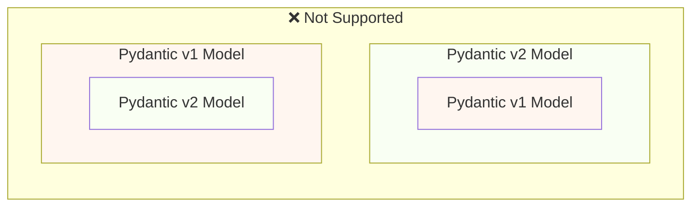
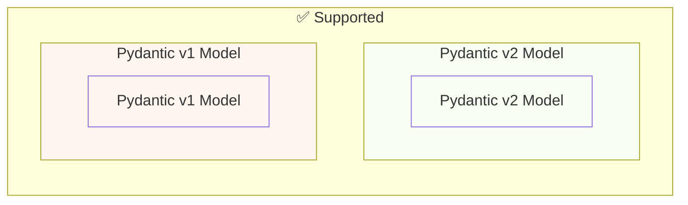

# Pydantic v1 से Pydantic v2 में माइग्रेट करें { #migrate-from-pydantic-v1-to-pydantic-v2 }

अगर आपके पास कोई पुराना FastAPI app है, तो हो सकता है कि आप Pydantic version 1 का उपयोग कर रहे हों।

FastAPI version 0.100.0 में Pydantic v1 या v2, दोनों में से किसी के लिए support था। यह वही उपयोग करता था जो आपने install किया हुआ था।

FastAPI version 0.119.0 ने Pydantic v2 के अंदर से Pydantic v1 के लिए आंशिक support पेश किया (`pydantic.v1` के रूप में), ताकि v2 में migration आसान हो सके।

FastAPI 0.126.0 ने Pydantic v1 के लिए support हटा दिया, लेकिन थोड़े समय के लिए `pydantic.v1` को support करना जारी रखा।

FastAPI 0.128.0 ने `pydantic.v1` के लिए support भी हटा दिया, इसलिए FastAPI के नवीनतम versions के लिए Pydantic v2 required है।

/// warning | चेतावनी

Pydantic team ने **Python 3.14** से शुरू करते हुए, Python के नवीनतम versions के लिए Pydantic v1 का support बंद कर दिया।

इसमें `pydantic.v1` भी शामिल है, जो अब Python 3.14 और उससे ऊपर में supported नहीं है।

अगर आप Python की नवीनतम features का उपयोग करना चाहते हैं, तो आपको यह सुनिश्चित करना होगा कि आप Pydantic v2 का उपयोग करें।

///

अगर आपके पास Pydantic v1 वाला कोई पुराना FastAPI app है, तो यहाँ मैं आपको दिखाऊँगा कि उसे Pydantic v2 में कैसे migrate करें, और gradual migration में मदद के लिए **FastAPI 0.119.0 की features** भी दिखाऊँगा।

## आधिकारिक गाइड { #official-guide }

Pydantic के पास v1 से v2 के लिए एक आधिकारिक [Migration Guide](https://docs.pydantic.dev/latest/migration/) है।

इसमें यह भी शामिल है कि क्या बदला है, validations अब कैसे अधिक सही और strict हैं, संभावित caveats आदि।

क्या बदला है इसे बेहतर समझने के लिए आप इसे पढ़ सकते हैं।

## Tests { #tests }

सुनिश्चित करें कि आपके app के लिए [tests](../tutorial/testing.md) हैं और आप उन्हें continuous integration (CI) पर चलाते हैं।

इस तरह, आप upgrade कर सकते हैं और सुनिश्चित कर सकते हैं कि सब कुछ अभी भी अपेक्षा के अनुसार काम कर रहा है।

## `bump-pydantic` { #bump-pydantic }

कई मामलों में, जब आप customizations के बिना regular Pydantic models का उपयोग करते हैं, तो आप Pydantic v1 से Pydantic v2 में migration की अधिकांश प्रक्रिया automate कर पाएँगे।

आप उसी Pydantic team का [`bump-pydantic`](https://github.com/pydantic/bump-pydantic) उपयोग कर सकते हैं।

यह tool आपको उस अधिकांश code को अपने आप बदलने में मदद करेगा जिसे बदलने की ज़रूरत है।

इसके बाद, आप tests चला सकते हैं और जाँच सकते हैं कि सब कुछ काम करता है या नहीं। अगर करता है, तो आपका काम हो गया। 😎

## v2 में Pydantic v1 { #pydantic-v1-in-v2 }

Pydantic v2 में Pydantic v1 की सभी चीज़ें `pydantic.v1` submodule के रूप में शामिल हैं। लेकिन यह Python 3.13 से ऊपर के versions में अब supported नहीं है।

इसका मतलब है कि आप Pydantic v2 का नवीनतम version install कर सकते हैं और इस submodule से पुराने Pydantic v1 components को import और उपयोग कर सकते हैं, जैसे कि आपके पास पुराना Pydantic v1 install हो।

{* ../../docs_src/pydantic_v1_in_v2/tutorial001_an_py310.py hl[1,4] *}

### v2 में Pydantic v1 के लिए FastAPI support { #fastapi-support-for-pydantic-v1-in-v2 }

/// warning | चेतावनी

`pydantic.v1` models के लिए यह FastAPI support **FastAPI 0.119.0** में जोड़ा गया था और **FastAPI 0.128.0** में हटा दिया गया। इसका उद्देश्य Pydantic v2 में migration के लिए अस्थायी सहायता होना था।

FastAPI के वर्तमान versions में, अपने app में `pydantic.v1` model का उपयोग करने पर error आएगा।

इस section का बाकी हिस्सा केवल उन पुराने versions में उपलब्ध अस्थायी support का वर्णन करता है।

///

FastAPI 0.119.0 से, Pydantic v2 के अंदर से Pydantic v1 के लिए आंशिक support भी है, ताकि v2 में migration आसान हो सके।

इसलिए, आप Pydantic को नवीनतम version 2 में upgrade कर सकते थे, और imports को `pydantic.v1` submodule का उपयोग करने के लिए बदल सकते थे, और कई मामलों में यह बस काम कर जाता।

{* ../../docs_src/pydantic_v1_in_v2/tutorial002_an_py310.py hl[2,5,15] *}

/// warning | चेतावनी

ध्यान रखें कि Pydantic team अब Python के हाल के versions में Pydantic v1 को support नहीं करती, Python 3.14 से शुरू करते हुए, इसलिए `pydantic.v1` का उपयोग भी Python 3.14 और उससे ऊपर में supported नहीं है।

///

### एक ही app में Pydantic v1 और v2 { #pydantic-v1-and-v2-on-the-same-app }

Pydantic द्वारा यह **supported नहीं है** कि Pydantic v2 का कोई model हो जिसके अपने fields Pydantic v1 models के रूप में defined हों, या इसका उल्टा।

...लेकिन आपके पास एक ही app में अलग-अलग models हो सकते हैं, कुछ Pydantic v1 का उपयोग करते हुए और कुछ Pydantic v2 का उपयोग करते हुए।

कुछ मामलों में, आपके FastAPI app में एक ही **path operation** में Pydantic v1 और v2 दोनों models होना भी संभव है:

{* ../../docs_src/pydantic_v1_in_v2/tutorial003_an_py310.py hl[2:3,6,12,21:22] *}

ऊपर दिए गए इस उदाहरण में, input model एक Pydantic v1 model है, और output model (`response_model=ItemV2` में defined) एक Pydantic v2 model है।

### Pydantic v1 parameters { #pydantic-v1-parameters }

अगर आपको Pydantic v1 models के साथ parameters के लिए FastAPI-specific tools जैसे `Body`, `Query`, `Form` आदि का उपयोग करना है, तो Pydantic v2 में migration पूरा करते समय आप उन्हें `fastapi.temp_pydantic_v1_params` से import कर सकते हैं:

{* ../../docs_src/pydantic_v1_in_v2/tutorial004_an_py310.py hl[4,18] *}

### चरणों में माइग्रेट करें { #migrate-in-steps }

/// warning | चेतावनी

नीचे वर्णित, एक ही app में Pydantic v1 और v2 दोनों models का उपयोग करके gradual migration केवल **FastAPI 0.119.0 से 0.127.x** में काम करता है। इसे **FastAPI 0.128.0** में हटा दिया गया, नवीनतम versions के लिए **Pydantic v2** models required हैं।

///

/// tip | सुझाव

पहले `bump-pydantic` के साथ कोशिश करें, अगर आपके tests pass हो जाते हैं और वह काम करता है, तो आपका काम एक command में हो गया। ✨

///

अगर `bump-pydantic` आपके use case के लिए काम नहीं करता, तो आप Pydantic v2 में gradual migration करने के लिए एक ही app में Pydantic v1 और v2 दोनों models के support का उपयोग कर सकते हैं।

आप पहले Pydantic को नवीनतम version 2 का उपयोग करने के लिए upgrade कर सकते हैं, और अपने सभी models के लिए `pydantic.v1` का उपयोग करने के लिए imports बदल सकते हैं।

फिर, आप gradual steps में, groups के रूप में अपने models को Pydantic v1 से v2 में migrate करना शुरू कर सकते हैं। 🚶
