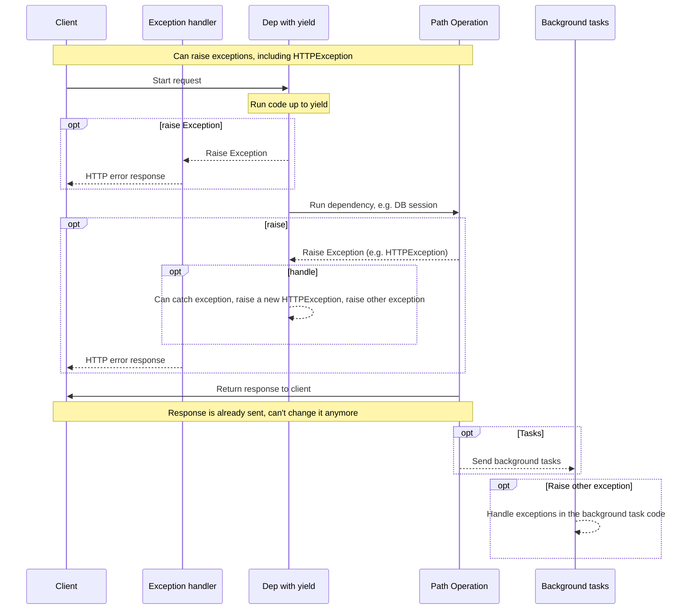
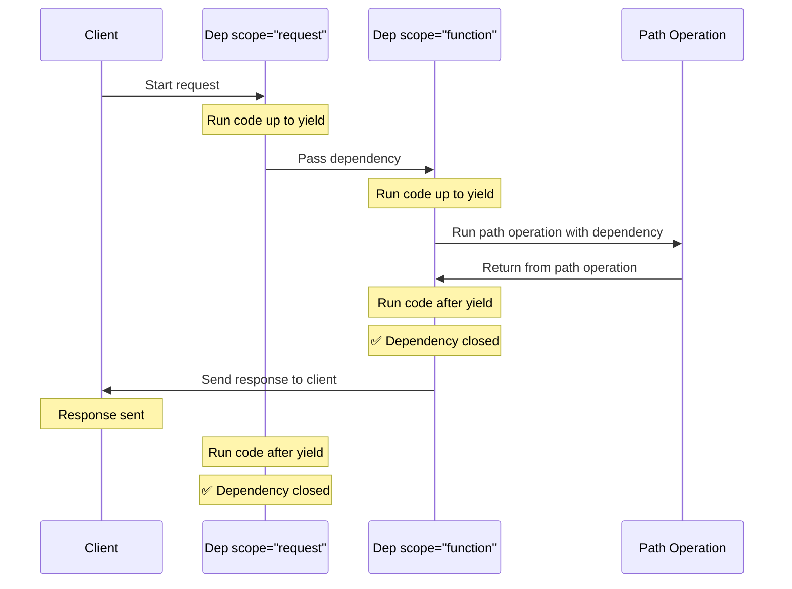

# `yield` वाली Dependencies { #dependencies-with-yield }

FastAPI ऐसी dependencies को support करता है जो <dfn title='कभी-कभी इन्हें "exit code", "cleanup code", "teardown code", "closing code", "context manager exit code" आदि भी कहा जाता है।'>पूरा होने के बाद अतिरिक्त steps</dfn> करती हैं।

ऐसा करने के लिए, `return` की जगह `yield` का उपयोग करें, और अतिरिक्त steps (code) उसके बाद लिखें।

/// tip | सुझाव

हर dependency में `yield` का उपयोग केवल एक बार करना सुनिश्चित करें।

///

/// note | तकनीकी विवरण

कोई भी function जो इनके साथ उपयोग करने के लिए valid है:

* [`@contextlib.contextmanager`](https://docs.python.org/3/library/contextlib.html#contextlib.contextmanager) या
* [`@contextlib.asynccontextmanager`](https://docs.python.org/3/library/contextlib.html#contextlib.asynccontextmanager)

वह **FastAPI** dependency के रूप में उपयोग करने के लिए valid होगी।

वास्तव में, FastAPI internally इन दोनों decorators का उपयोग करता है।

///

## `yield` वाली database dependency { #a-database-dependency-with-yield }

उदाहरण के लिए, आप इसका उपयोग database session बनाने और पूरा होने के बाद उसे close करने के लिए कर सकते हैं।

`yield` statement से पहले और उसे शामिल करते हुए केवल वही code response बनाने से पहले execute होता है:

{* ../../docs_src/dependencies/tutorial007_py310.py hl[2:4] *}

yield किया गया value वही होता है जिसे *path operations* और अन्य dependencies में inject किया जाता है:

{* ../../docs_src/dependencies/tutorial007_py310.py hl[4] *}

`yield` statement के बाद वाला code response के बाद execute होता है:

{* ../../docs_src/dependencies/tutorial007_py310.py hl[5:6] *}

/// tip | सुझाव

आप `async` या regular functions का उपयोग कर सकते हैं।

**FastAPI** हर एक के साथ सही काम करेगा, ठीक normal dependencies की तरह।

///

## `yield` और `try` वाली dependency { #a-dependency-with-yield-and-try }

अगर आप `yield` वाली dependency में `try` block का उपयोग करते हैं, तो dependency का उपयोग करते समय throw की गई कोई भी exception आपको मिलेगी।

उदाहरण के लिए, अगर बीच में किसी point पर, किसी दूसरी dependency में या किसी *path operation* में, कुछ code ने database transaction को "rollback" किया या कोई अन्य exception बनाई, तो आपको अपनी dependency में वह exception मिलेगी।

इसलिए, आप `except SomeException` के साथ dependency के अंदर उस specific exception को देख सकते हैं।

इसी तरह, आप `finally` का उपयोग यह सुनिश्चित करने के लिए कर सकते हैं कि exit steps execute हों, चाहे exception आई हो या नहीं।

{* ../../docs_src/dependencies/tutorial007_py310.py hl[3,5] *}

## `yield` वाली Sub-dependencies { #sub-dependencies-with-yield }

आपके पास किसी भी size और shape की sub-dependencies और sub-dependencies के "trees" हो सकते हैं, और उनमें से कोई भी या सभी `yield` का उपयोग कर सकती हैं।

**FastAPI** यह सुनिश्चित करेगा कि `yield` वाली हर dependency में "exit code" सही क्रम में run हो।

उदाहरण के लिए, `dependency_c` की dependency `dependency_b` पर हो सकती है, और `dependency_b` की `dependency_a` पर:

{* ../../docs_src/dependencies/tutorial008_an_py310.py hl[6,14,22] *}

और वे सभी `yield` का उपयोग कर सकती हैं।

इस case में `dependency_c` को अपना exit code execute करने के लिए `dependency_b` से मिला value (यहाँ `dep_b` नाम दिया गया है) अभी भी उपलब्ध चाहिए।

और, बदले में, `dependency_b` को अपने exit code के लिए `dependency_a` से मिला value (यहाँ `dep_a` नाम दिया गया है) उपलब्ध चाहिए।

{* ../../docs_src/dependencies/tutorial008_an_py310.py hl[18:19,26:27] *}

इसी तरह, आपके पास कुछ dependencies `yield` वाली और कुछ अन्य dependencies `return` वाली हो सकती हैं, और उनमें से कुछ बाकी कुछ पर depend कर सकती हैं।

और आपके पास एक single dependency हो सकती है जिसे `yield` वाली कई अन्य dependencies required हों, आदि।

आप dependencies के कोई भी combinations रख सकते हैं।

**FastAPI** यह सुनिश्चित करेगा कि सब कुछ सही क्रम में run हो।

/// note | तकनीकी विवरण

यह Python के [Context Managers](https://docs.python.org/3/library/contextlib.html) की वजह से काम करता है।

**FastAPI** इसे हासिल करने के लिए internally उनका उपयोग करता है।

///

## `yield` और `HTTPException` वाली Dependencies { #dependencies-with-yield-and-httpexception }

आपने देखा कि आप `yield` वाली dependencies का उपयोग कर सकते हैं और ऐसे `try` blocks रख सकते हैं जो कुछ code execute करने की कोशिश करते हैं और फिर `finally` के बाद कुछ exit code run करते हैं।

आप raise की गई exception को catch करने और उसके साथ कुछ करने के लिए `except` का भी उपयोग कर सकते हैं।

उदाहरण के लिए, आप कोई अलग exception raise कर सकते हैं, जैसे `HTTPException`।

/// tip | सुझाव

यह थोड़ी advanced technique है, और ज्यादातर cases में आपको वास्तव में इसकी ज़रूरत नहीं होगी, क्योंकि आप अपने application code के बाकी हिस्से के अंदर से exceptions (जिसमें `HTTPException` भी शामिल है) raise कर सकते हैं, उदाहरण के लिए, *path operation function* में।

लेकिन अगर आपको इसकी ज़रूरत हो तो यह उपलब्ध है। 🤓

///

{* ../../docs_src/dependencies/tutorial008b_an_py310.py hl[18:22,31] *}

अगर आप exceptions को catch करके उसके आधार पर custom response बनाना चाहते हैं, तो [Custom Exception Handler](../handling-errors.md#install-custom-exception-handlers) बनाएँ।

## `yield` और `except` वाली Dependencies { #dependencies-with-yield-and-except }

अगर आप `yield` वाली dependency में `except` का उपयोग करके exception catch करते हैं और उसे फिर से raise नहीं करते (या कोई नई exception raise नहीं करते), तो FastAPI यह notice नहीं कर पाएगा कि कोई exception हुई थी, ठीक वैसे ही जैसे regular Python में होता:

{* ../../docs_src/dependencies/tutorial008c_an_py310.py hl[15:16] *}

इस case में, client को *HTTP 500 Internal Server Error* response दिखेगा, जैसा कि होना चाहिए, क्योंकि हम `HTTPException` या उसके जैसी कोई चीज़ raise नहीं कर रहे हैं, लेकिन server के पास **कोई logs नहीं होंगे** या error क्या था इसका कोई अन्य संकेत नहीं होगा। 😱

### `yield` और `except` वाली Dependencies में हमेशा `raise` करें { #always-raise-in-dependencies-with-yield-and-except }

अगर आप `yield` वाली dependency में exception catch करते हैं, तो जब तक आप कोई दूसरी `HTTPException` या similar चीज़ raise नहीं कर रहे हैं, **आपको original exception को फिर से raise करना चाहिए**।

आप `raise` का उपयोग करके उसी exception को फिर से raise कर सकते हैं:

{* ../../docs_src/dependencies/tutorial008d_an_py310.py hl[17] *}

अब client को वही *HTTP 500 Internal Server Error* response मिलेगा, लेकिन server के logs में हमारा custom `InternalError` होगा। 😎

## `yield` वाली dependencies का Execution { #execution-of-dependencies-with-yield }

Execution का sequence कमोबेश इस diagram जैसा है। Time ऊपर से नीचे की ओर चलता है। और हर column code के साथ interact करने या execute करने वाले parts में से एक है।



/// note | नोट

Client को केवल **एक response** भेजा जाएगा। यह error responses में से एक हो सकता है या *path operation* से आया response होगा।

उन responses में से एक भेजे जाने के बाद, कोई अन्य response नहीं भेजा जा सकता।

///

/// tip | सुझाव

अगर आप *path operation function* के code में कोई भी exception raise करते हैं, तो उसे yield वाली dependencies को pass किया जाएगा, जिसमें `HTTPException` भी शामिल है। ज्यादातर cases में आप चाहेंगे कि `yield` वाली dependency से वही exception या कोई नई exception फिर से raise करें ताकि यह सुनिश्चित हो सके कि उसे सही तरीके से handle किया गया है।

///

## Early exit और `scope` { #early-exit-and-scope }

आम तौर पर `yield` वाली dependencies का exit code client को **response** भेजे जाने के बाद execute होता है।

लेकिन अगर आपको पता है कि *path operation function* से return करने के बाद आपको dependency का उपयोग करने की ज़रूरत नहीं होगी, तो आप `Depends(scope="function")` का उपयोग करके FastAPI को बता सकते हैं कि उसे dependency को *path operation function* के return करने के बाद, लेकिन **response भेजे जाने से पहले** close करना चाहिए।

{* ../../docs_src/dependencies/tutorial008e_an_py310.py hl[12,16] *}

`Depends()` एक `scope` parameter receive करता है जो यह हो सकता है:

* `"function"`: request handle करने वाले *path operation function* से पहले dependency शुरू करें, *path operation function* खत्म होने के बाद dependency खत्म करें, लेकिन client को response वापस भेजे जाने से **पहले**। यानी, dependency function *path operation **function*** के **around** execute होगा।
* `"request"`: request handle करने वाले *path operation function* से पहले dependency शुरू करें (`"function"` उपयोग करने जैसा), लेकिन client को response वापस भेजे जाने के **बाद** खत्म करें। यानी, dependency function **request** और response cycle के **around** execute होगा।

अगर specify नहीं किया गया है और dependency में `yield` है, तो उसका `scope` default रूप से `"request"` होगा।

### Sub-dependencies के लिए `scope` { #scope-for-sub-dependencies }

जब आप `scope="request"` (default) वाली dependency declare करते हैं, तो किसी भी sub-dependency का `scope` भी `"request"` होना चाहिए।

लेकिन `"function"` के `scope` वाली dependency के पास `"function"` और `"request"` scope वाली dependencies हो सकती हैं।

ऐसा इसलिए है क्योंकि किसी भी dependency को sub-dependencies से पहले अपना exit code run करने में सक्षम होना चाहिए, क्योंकि उसे अपने exit code के दौरान अभी भी उनका उपयोग करने की ज़रूरत हो सकती है।



## `yield`, `HTTPException`, `except` और Background Tasks वाली Dependencies { #dependencies-with-yield-httpexception-except-and-background-tasks }

`yield` वाली Dependencies समय के साथ अलग-अलग use cases cover करने और कुछ issues fix करने के लिए evolve हुई हैं।

अगर आप देखना चाहते हैं कि FastAPI के अलग-अलग versions में क्या बदला है, तो आप इसके बारे में advanced guide में, [Advanced Dependencies - `yield`, `HTTPException`, `except` और Background Tasks वाली Dependencies](../../advanced/advanced-dependencies.md#dependencies-with-yield-httpexception-except-and-background-tasks) में और पढ़ सकते हैं।

## Context Managers { #context-managers }

### "Context Managers" क्या हैं { #what-are-context-managers }

"Context Managers" उन Python objects में से कोई भी हैं जिनका उपयोग आप `with` statement में कर सकते हैं।

उदाहरण के लिए, [आप file पढ़ने के लिए `with` का उपयोग कर सकते हैं](https://docs.python.org/3/tutorial/inputoutput.html#reading-and-writing-files):

```Python
with open("./somefile.txt") as f:
    contents = f.read()
    print(contents)
```

अंदर से, `open("./somefile.txt")` एक object बनाता है जिसे "Context Manager" कहा जाता है।

जब `with` block खत्म होता है, तो यह file को close करना सुनिश्चित करता है, भले ही exceptions आई हों।

जब आप `yield` वाली dependency बनाते हैं, तो **FastAPI** internally उसके लिए एक context manager बनाएगा, और उसे कुछ अन्य related tools के साथ combine करेगा।

### `yield` वाली dependencies में context managers का उपयोग करना { #using-context-managers-in-dependencies-with-yield }

/// warning | चेतावनी

यह कमोबेश एक "advanced" idea है।

अगर आप अभी **FastAPI** शुरू ही कर रहे हैं, तो शायद आप इसे अभी skip करना चाहेंगे।

///

Python में, आप [दो methods वाली class बनाकर: `__enter__()` और `__exit__()`](https://docs.python.org/3/reference/datamodel.html#context-managers) Context Managers बना सकते हैं।

आप dependency function के अंदर `with` या `async with` statements का उपयोग करके इन्हें `yield` वाली **FastAPI** dependencies के अंदर भी उपयोग कर सकते हैं:

{* ../../docs_src/dependencies/tutorial010_py310.py hl[1:9,13] *}

/// tip | सुझाव

Context manager बनाने का एक और तरीका है:

* [`@contextlib.contextmanager`](https://docs.python.org/3/library/contextlib.html#contextlib.contextmanager) या
* [`@contextlib.asynccontextmanager`](https://docs.python.org/3/library/contextlib.html#contextlib.asynccontextmanager)

इनका उपयोग single `yield` वाले function को decorate करने के लिए करना।

**FastAPI** internally `yield` वाली dependencies के लिए यही उपयोग करता है।

लेकिन आपको FastAPI dependencies के लिए decorators का उपयोग करने की ज़रूरत नहीं है (और आपको नहीं करना चाहिए)।

FastAPI internally आपके लिए यह कर देगा।

///
