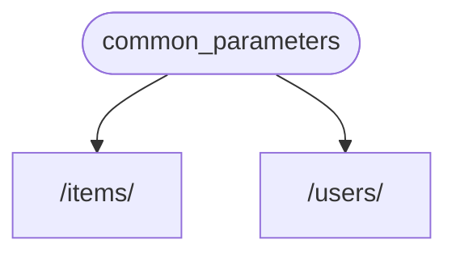
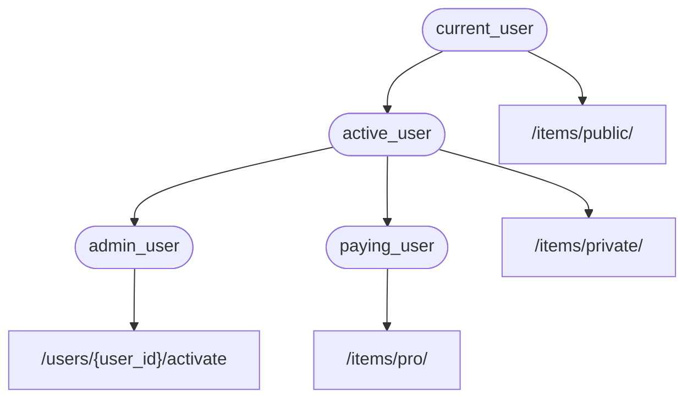

# Dependencies { #dependencies }

**FastAPI** में एक बहुत शक्तिशाली लेकिन सहज **<dfn title="जिसे components, resources, providers, services, injectables के नाम से भी जाना जाता है">Dependency Injection</dfn>** system है।

इसे उपयोग में बहुत सरल होने के लिए, और किसी भी developer के लिए दूसरे components को **FastAPI** के साथ integrate करना बहुत आसान बनाने के लिए design किया गया है।

## "Dependency Injection" क्या है { #what-is-dependency-injection }

**"Dependency Injection"** का मतलब programming में यह है कि आपके code (इस मामले में, आपके *path operation functions*) के पास यह declare करने का एक तरीका होता है कि उसे काम करने और उपयोग करने के लिए किन चीज़ों की ज़रूरत है: "dependencies"।

और फिर, वह system (इस मामले में **FastAPI**) आपके code को वे ज़रूरी dependencies उपलब्ध कराने के लिए जो भी required है, उसका ध्यान रखेगा (dependencies को "inject" करेगा)।

यह तब बहुत उपयोगी होता है जब आपको:

* shared logic चाहिए (वही code logic बार-बार)।
* database connections share करने हों।
* security, authentication, role requirements, आदि enforce करने हों।
* और भी कई चीज़ें...

ये सब, code repetition को कम से कम रखते हुए।

## पहले कदम { #first-steps }

आइए एक बहुत सरल उदाहरण देखते हैं। यह इतना सरल होगा कि अभी के लिए बहुत उपयोगी नहीं है।

लेकिन इस तरह हम इस बात पर focus कर सकते हैं कि **Dependency Injection** system कैसे काम करता है।

### एक dependency, या "dependable" बनाएँ { #create-a-dependency-or-dependable }

पहले dependency पर focus करते हैं।

यह बस एक function है जो वे सभी समान parameters ले सकता है जो एक *path operation function* ले सकता है:

{* ../../docs_src/dependencies/tutorial001_an_py310.py hl[8:9] *}

बस इतना ही।

**2 lines**।

और इसका shape और structure वही है जो आपके सभी *path operation functions* का होता है।

आप इसे "decorator" के बिना एक *path operation function* के रूप में सोच सकते हैं (`@app.get("/some-path")` के बिना)।

और यह आपकी इच्छा के अनुसार कुछ भी return कर सकता है।

इस मामले में, यह dependency अपेक्षा करती है:

* एक optional query parameter `q` जो `str` है।
* एक optional query parameter `skip` जो `int` है, और default रूप से `0` है।
* एक optional query parameter `limit` जो `int` है, और default रूप से `100` है।

और फिर यह बस उन values वाला एक `dict` return करता है।

/// note | नोट

FastAPI ने version 0.95.0 में `Annotated` के लिए support जोड़ा (और इसे recommend करना शुरू किया)।

अगर आपके पास पुराना version है, तो `Annotated` का उपयोग करने की कोशिश करते समय आपको errors मिलेंगे।

`Annotated` का उपयोग करने से पहले सुनिश्चित करें कि आप [FastAPI version को Upgrade](../../deployment/versions.md#upgrading-the-fastapi-versions) करके कम से कम 0.95.1 कर लें।

///

### `Depends` import करें { #import-depends }

{* ../../docs_src/dependencies/tutorial001_an_py310.py hl[3] *}

### "dependant" में dependency declare करें { #declare-the-dependency-in-the-dependant }

जिस तरह आप अपने *path operation function* parameters के साथ `Body`, `Query`, आदि का उपयोग करते हैं, उसी तरह एक नए parameter के साथ `Depends` का उपयोग करें:

{* ../../docs_src/dependencies/tutorial001_an_py310.py hl[13,18] *}

हालाँकि आप अपने function के parameters में `Depends` का उपयोग उसी तरह करते हैं जैसे आप `Body`, `Query`, आदि का उपयोग करते हैं, `Depends` थोड़ा अलग तरीके से काम करता है।

आप `Depends` को केवल एक parameter देते हैं।

यह parameter किसी function जैसा होना चाहिए।

आप इसे सीधे **call नहीं करते** (अंत में parentheses नहीं जोड़ते), आप बस इसे `Depends()` को एक parameter के रूप में pass करते हैं।

और वह function उसी तरह parameters लेता है जैसे *path operation functions* लेते हैं।

/// tip | सुझाव

अगले chapter में आप देखेंगे कि functions के अलावा कौन सी दूसरी "चीज़ें" dependencies के रूप में उपयोग की जा सकती हैं।

///

जब भी कोई नया request आता है, **FastAPI** इन बातों का ध्यान रखेगा:

* आपकी dependency ("dependable") function को सही parameters के साथ call करना।
* आपके function से result लेना।
* उस result को आपके *path operation function* के parameter को assign करना।



इस तरह आप shared code एक बार लिखते हैं और **FastAPI** आपके *path operations* के लिए उसे call करने का ध्यान रखता है।

/// tip | सुझाव

ध्यान दें कि आपको कोई special class बनाकर उसे **FastAPI** को "register" करने के लिए कहीं pass करने या ऐसा कुछ करने की ज़रूरत नहीं है।

आप बस इसे `Depends` को pass करते हैं और **FastAPI** जानता है कि बाकी कैसे करना है।

///

## `Annotated` dependencies share करें { #share-annotated-dependencies }

ऊपर के उदाहरणों में, आप देखते हैं कि **code duplication** का थोड़ा सा हिस्सा है।

जब आपको `common_parameters()` dependency का उपयोग करना हो, तो आपको type annotation और `Depends()` के साथ पूरा parameter लिखना पड़ता है:

```Python
commons: Annotated[dict, Depends(common_parameters)]
```

लेकिन क्योंकि हम `Annotated` का उपयोग कर रहे हैं, हम उस `Annotated` value को एक variable में store कर सकते हैं और कई जगहों पर उपयोग कर सकते हैं:

{* ../../docs_src/dependencies/tutorial001_02_an_py310.py hl[12,16,21] *}

/// tip | सुझाव

यह बस standard Python है, इसे "type alias" कहा जाता है, यह वास्तव में **FastAPI** के लिए specific नहीं है।

लेकिन क्योंकि **FastAPI** Python standards पर आधारित है, जिसमें `Annotated` भी शामिल है, आप अपने code में इस trick का उपयोग कर सकते हैं। 😎

///

dependencies अपेक्षित रूप से काम करती रहेंगी, और **सबसे अच्छी बात** यह है कि **type information preserve रहेगी**, जिसका मतलब है कि आपका editor आपको **autocompletion**, **inline errors**, आदि प्रदान करना जारी रख सकेगा। यही बात `mypy` जैसे दूसरे tools के लिए भी लागू होती है।

यह खास तौर पर तब उपयोगी होगा जब आप इसे एक **large code base** में उपयोग करते हैं जहाँ आप **वही dependencies** बार-बार **कई *path operations*** में उपयोग करते हैं।

## `async` करें या `async` न करें { #to-async-or-not-to-async }

क्योंकि dependencies को भी **FastAPI** द्वारा call किया जाएगा (आपके *path operation functions* की तरह), functions define करते समय वही rules लागू होते हैं।

आप `async def` या सामान्य `def` का उपयोग कर सकते हैं।

और आप normal `def` *path operation functions* के अंदर `async def` dependencies declare कर सकते हैं, या `async def` *path operation functions* के अंदर `def` dependencies, आदि।

इससे फर्क नहीं पड़ता। **FastAPI** जानता होगा कि क्या करना है।

/// note | नोट

अगर आपको नहीं पता, तो docs में `async` और `await` के बारे में [Async: *"In a hurry?"*](../../async.md#in-a-hurry) section देखें।

///

## OpenAPI के साथ integrated { #integrated-with-openapi }

आपकी dependencies (और sub-dependencies) की सभी request declarations, validations और requirements उसी OpenAPI schema में integrate की जाएँगी।

इसलिए, interactive docs में इन dependencies की सारी जानकारी भी होगी:


## सरल उपयोग { #simple-usage }

अगर आप इसे देखें, तो *path operation functions* इस तरह declare किए जाते हैं कि जब भी कोई *path* और *operation* match करता है, उनका उपयोग किया जाए, और फिर **FastAPI** सही parameters के साथ function को call करने और request से data extract करने का ध्यान रखता है।

असल में, सभी (या अधिकांश) web frameworks इसी तरह काम करते हैं।

आप उन functions को कभी सीधे call नहीं करते। वे आपके framework द्वारा call किए जाते हैं (इस मामले में, **FastAPI**)।

Dependency Injection system के साथ, आप **FastAPI** को यह भी बता सकते हैं कि आपका *path operation function* किसी और चीज़ पर भी "depend" करता है जिसे आपके *path operation function* से पहले execute किया जाना चाहिए, और **FastAPI** उसे execute करने और results को "inject" करने का ध्यान रखेगा।

"dependency injection" के इसी idea के लिए अन्य common terms हैं:

* resources
* providers
* services
* injectables
* components

## **FastAPI** plug-ins { #fastapi-plug-ins }

Integrations और "plug-ins" **Dependency Injection** system का उपयोग करके बनाए जा सकते हैं। लेकिन वास्तव में, **"plug-ins" बनाने की कोई ज़रूरत नहीं है**, क्योंकि dependencies का उपयोग करके अनगिनत integrations और interactions declare किए जा सकते हैं जो आपके *path operation functions* के लिए उपलब्ध हो जाते हैं।

और dependencies को बहुत सरल और सहज तरीके से बनाया जा सकता है, जिससे आप बस अपने required Python packages import कर सकते हैं, और उन्हें अपने API functions के साथ कुछ lines of code में integrate कर सकते हैं, *literally*।

आप अगले chapters में relational और NoSQL databases, security, आदि के बारे में इसके examples देखेंगे।

## **FastAPI** compatibility { #fastapi-compatibility }

Dependency injection system की सरलता **FastAPI** को इनके साथ compatible बनाती है:

* सभी relational databases
* NoSQL databases
* external packages
* external APIs
* authentication और authorization systems
* API usage monitoring systems
* response data injection systems
* आदि।

## सरल और शक्तिशाली { #simple-and-powerful }

हालाँकि hierarchical dependency injection system को define और use करना बहुत सरल है, फिर भी यह बहुत शक्तिशाली है।

आप ऐसी dependencies define कर सकते हैं जो बदले में खुद dependencies define कर सकती हैं।

अंत में, dependencies का एक hierarchical tree बनता है, और **Dependency Injection** system आपके लिए इन सभी dependencies (और उनकी sub-dependencies) को solve करने और हर step पर results प्रदान करने (inject करने) का ध्यान रखता है।

उदाहरण के लिए, मान लें कि आपके पास 4 API endpoints (*path operations*) हैं:

* `/items/public/`
* `/items/private/`
* `/users/{user_id}/activate`
* `/items/pro/`

तो आप उनमें से हर एक के लिए अलग-अलग permission requirements केवल dependencies और sub-dependencies के साथ जोड़ सकते हैं:



## **OpenAPI** के साथ integrated { #integrated-with-openapi_1 }

ये सभी dependencies, अपनी requirements declare करते समय, आपके *path operations* में parameters, validations, आदि भी जोड़ती हैं।

**FastAPI** यह सब OpenAPI schema में जोड़ने का ध्यान रखेगा, ताकि यह interactive documentation systems में दिखाया जा सके।
