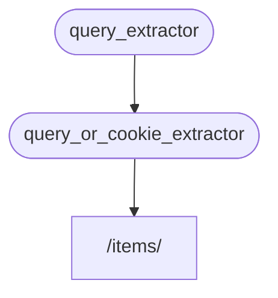

# Sub-dependencies { #sub-dependencies }

आप ऐसी dependencies बना सकते हैं जिनकी अपनी **sub-dependencies** हों।

वे उतनी **deep** हो सकती हैं जितनी आपको चाहिए।

**FastAPI** उन्हें solve करने का ध्यान रखेगा।

## पहली dependency "dependable" { #first-dependency-dependable }

आप पहली dependency ("dependable") इस तरह बना सकते हैं:

{* ../../docs_src/dependencies/tutorial005_an_py310.py hl[8:9] *}

यह एक optional query parameter `q` को `str` के रूप में declare करता है, और फिर बस उसे return करता है।

यह काफी सरल है (बहुत उपयोगी नहीं), लेकिन इससे हमें यह समझने पर ध्यान देने में मदद मिलेगी कि sub-dependencies कैसे काम करती हैं।

## दूसरी dependency, "dependable" और "dependant" { #second-dependency-dependable-and-dependant }

फिर आप एक और dependency function (एक "dependable") बना सकते हैं जो उसी समय अपनी खुद की dependency declare करता है (इसलिए यह एक "dependant" भी है):

{* ../../docs_src/dependencies/tutorial005_an_py310.py hl[13] *}

आइए declared parameters पर ध्यान दें:

* भले ही यह function खुद एक dependency ("dependable") है, यह एक और dependency भी declare करता है (यह किसी और चीज़ पर "depends" करता है)।
    * यह `query_extractor` पर depends करता है, और उसके द्वारा return किए गए value को parameter `q` में assign करता है।
* यह एक optional `last_query` cookie को भी `str` के रूप में declare करता है।
    * अगर user ने कोई query `q` provide नहीं की, तो हम पिछली इस्तेमाल की गई query का उपयोग करते हैं, जिसे हमने पहले एक cookie में save किया था।

## dependency का उपयोग करें { #use-the-dependency }

फिर हम dependency का उपयोग इस तरह कर सकते हैं:

{* ../../docs_src/dependencies/tutorial005_an_py310.py hl[23] *}

/// note | नोट

ध्यान दें कि हम *path operation function* में केवल एक dependency declare कर रहे हैं, `query_or_cookie_extractor`।

लेकिन **FastAPI** को पता होगा कि `query_or_cookie_extractor` को call करते समय उसके results pass करने के लिए पहले `query_extractor` को solve करना है।

///



## उसी dependency को कई बार उपयोग करना { #using-the-same-dependency-multiple-times }

अगर आपकी किसी dependency को उसी *path operation* के लिए कई बार declare किया गया है, उदाहरण के लिए, कई dependencies की कोई common sub-dependency है, तो **FastAPI** जानता होगा कि उस sub-dependency को प्रति request केवल एक बार call करना है।

और यह return किए गए value को एक <dfn title="computed/generated values को store करने और उन्हें फिर से compute करने के बजाय reuse करने के लिए एक utility/system">"cache"</dfn> में save करेगा और उसे उन सभी "dependants" को pass करेगा जिन्हें उस specific request में इसकी ज़रूरत है, बजाय उसी request के लिए dependency को कई बार call करने के।

एक advanced scenario में, जहाँ आप जानते हैं कि आपको उसी request में "cached" value का उपयोग करने के बजाय हर step पर dependency को call करवाना है (संभवतः कई बार), आप `Depends` का उपयोग करते समय parameter `use_cache=False` set कर सकते हैं:

//// tab | Python 3.10+

```Python hl_lines="1"
async def needy_dependency(fresh_value: Annotated[str, Depends(get_value, use_cache=False)]):
    return {"fresh_value": fresh_value}
```

////

//// tab | Python 3.10+ non-Annotated

/// tip | सुझाव

अगर संभव हो तो `Annotated` version का उपयोग करना पसंद करें।

///

```Python hl_lines="1"
async def needy_dependency(fresh_value: str = Depends(get_value, use_cache=False)):
    return {"fresh_value": fresh_value}
```

////

## Recap { #recap }

यहाँ इस्तेमाल किए गए सभी fancy words को छोड़ दें, तो **Dependency Injection** system काफी सरल है।

बस ऐसे functions जो *path operation functions* जैसे ही दिखते हैं।

लेकिन फिर भी, यह बहुत powerful है, और आपको arbitrarily deeply nested dependency "graphs" (trees) declare करने देता है।

/// tip | सुझाव

इन सरल examples के साथ यह सब इतना उपयोगी नहीं लग सकता।

लेकिन **security** के बारे में chapters में आप देखेंगे कि यह कितना उपयोगी है।

और आप यह भी देखेंगे कि यह आपका कितना code बचाएगा।

///
