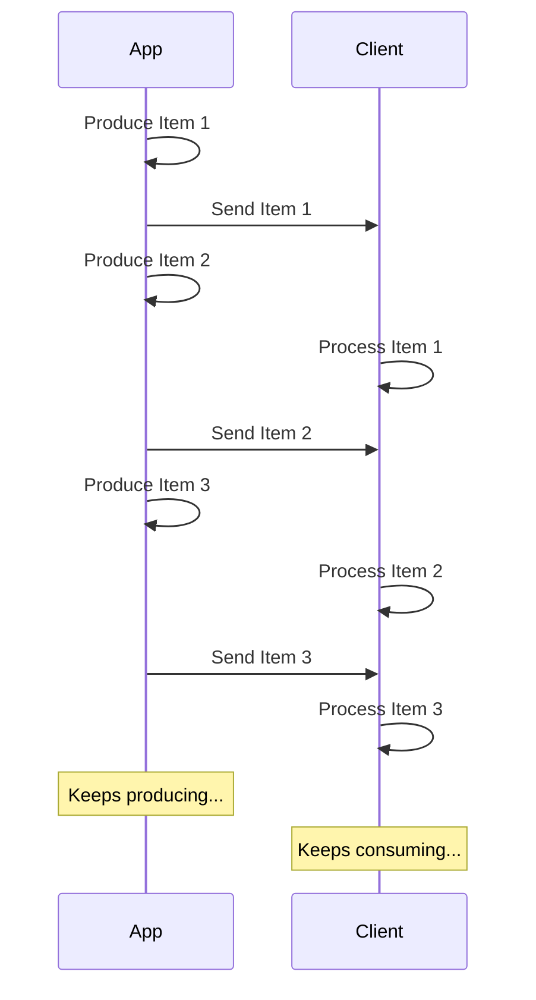

# JSON Lines को Stream करें { #stream-json-lines }

आपके पास data की एक sequence हो सकती है जिसे आप "**stream**" में भेजना चाहें, आप इसे **JSON Lines** के साथ कर सकते हैं।

/// note | टिप्पणी

FastAPI 0.134.0 में जोड़ा गया।

///

## Stream क्या है? { #what-is-a-stream }

"**Streaming**" data का मतलब है कि आपका app items की पूरी sequence के तैयार होने का इंतज़ार किए बिना client को data items भेजना शुरू कर देगा।

तो, यह पहला item भेजेगा, client उसे receive करके process करना शुरू कर देगा, और आप अभी भी अगला item produce कर रहे हो सकते हैं।



यह एक infinite stream भी हो सकती है, जहाँ आप लगातार data भेजते रहते हैं।

## JSON Lines { #json-lines }

इन मामलों में, "**JSON Lines**" भेजना आम है, जो एक ऐसा format है जहाँ आप हर line में एक JSON object भेजते हैं।

एक response का content type `application/jsonl` होगा (`application/json` के बजाय) और body कुछ इस तरह होगी:

```json
{"name": "Plumbus", "description": "A multi-purpose household device."}
{"name": "Portal Gun", "description": "A portal opening device."}
{"name": "Meeseeks Box", "description": "A box that summons a Meeseeks."}
```

यह JSON array (Python list के equivalent) से बहुत मिलता-जुलता है, लेकिन `[]` में wrap होने और items के बीच `,` होने के बजाय, इसमें **हर line में एक JSON object** होता है, वे एक new line character से अलग होते हैं।

/// note | टिप्पणी

महत्वपूर्ण बात यह है कि आपका app हर line को बारी-बारी से produce कर पाएगा, जबकि client पिछली lines को consume करता रहेगा।

///

/// note | तकनीकी विवरण

क्योंकि हर JSON object एक new line से अलग होगा, उनके content में literal new line characters नहीं हो सकते, लेकिन उनमें escaped new lines (`\n`) हो सकती हैं, जो JSON standard का हिस्सा है।

लेकिन आमतौर पर आपको इसके बारे में चिंता करने की ज़रूरत नहीं होगी, यह अपने आप हो जाता है, आगे पढ़ते रहें। 🤓

///

## उपयोग के मामले { #use-cases }

आप इसका उपयोग **AI LLM** service से, **logs** या **telemetry** से, या अन्य प्रकार के data से data stream करने के लिए कर सकते हैं जिन्हें **JSON** items में structure किया जा सकता है।

/// tip | सुझाव

अगर आप binary data stream करना चाहते हैं, उदाहरण के लिए video या audio, तो advanced guide देखें: [Data Stream करें](../advanced/stream-data.md)।

///

## FastAPI के साथ JSON Lines Stream करें { #stream-json-lines-with-fastapi }

FastAPI के साथ JSON Lines stream करने के लिए, आप अपनी *path operation function* में `return` का उपयोग करने के बजाय, हर item को बारी-बारी से produce करने के लिए `yield` का उपयोग कर सकते हैं।

{* ../../docs_src/stream_json_lines/tutorial001_py310.py ln[1:24] hl[24] *}

अगर हर JSON item जिसे आप वापस भेजना चाहते हैं, type `Item` (एक Pydantic model) का है और यह एक async function है, तो आप return type को `AsyncIterable[Item]` के रूप में declare कर सकते हैं:

{* ../../docs_src/stream_json_lines/tutorial001_py310.py ln[1:24] hl[9:11,22] *}

अगर आप return type declare करते हैं, तो FastAPI इसका उपयोग data को **validate** करने, OpenAPI में इसे **document** करने, इसे **filter** करने, और Pydantic का उपयोग करके इसे **serialize** करने के लिए करेगा।

/// tip | सुझाव

क्योंकि Pydantic इसे **Rust** side में serialize करेगा, आपको return type declare न करने की तुलना में बहुत अधिक **performance** मिलेगी।

///

### Non-async *path operation functions* { #non-async-path-operation-functions }

आप regular `def` functions (बिना `async` के) भी उपयोग कर सकते हैं, और उसी तरह `yield` का उपयोग कर सकते हैं।

FastAPI यह सुनिश्चित करेगा कि यह सही तरीके से चले ताकि यह event loop को block न करे।

क्योंकि इस मामले में function async नहीं है, सही return type `Iterable[Item]` होगा:

{* ../../docs_src/stream_json_lines/tutorial001_py310.py ln[27:30] hl[28] *}

### कोई Return Type नहीं { #no-return-type }

आप return type को omit भी कर सकते हैं। FastAPI फिर data को ऐसी चीज़ में convert करने के लिए [`jsonable_encoder`](./encoder.md) का उपयोग करेगा जिसे JSON में serialize किया जा सके और फिर उसे JSON Lines के रूप में भेजेगा।

{* ../../docs_src/stream_json_lines/tutorial001_py310.py ln[33:36] hl[34] *}

## Server-Sent Events (SSE) { #server-sent-events-sse }

FastAPI में Server-Sent Events (SSE) के लिए भी first-class support है, जो काफी समान हैं लेकिन कुछ extra details के साथ। आप इनके बारे में अगले chapter में जान सकते हैं: [Server-Sent Events (SSE)](server-sent-events.md)। 🤓
