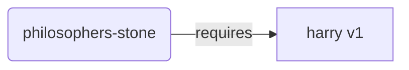
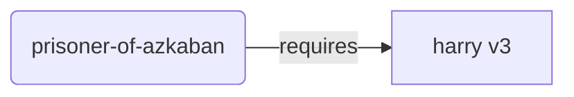
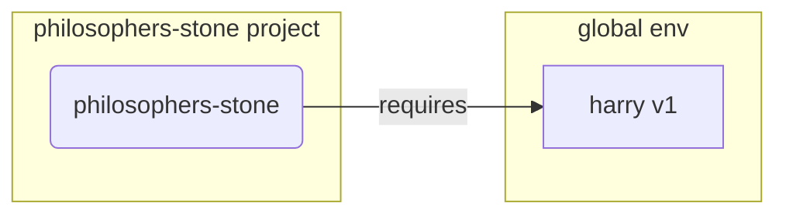
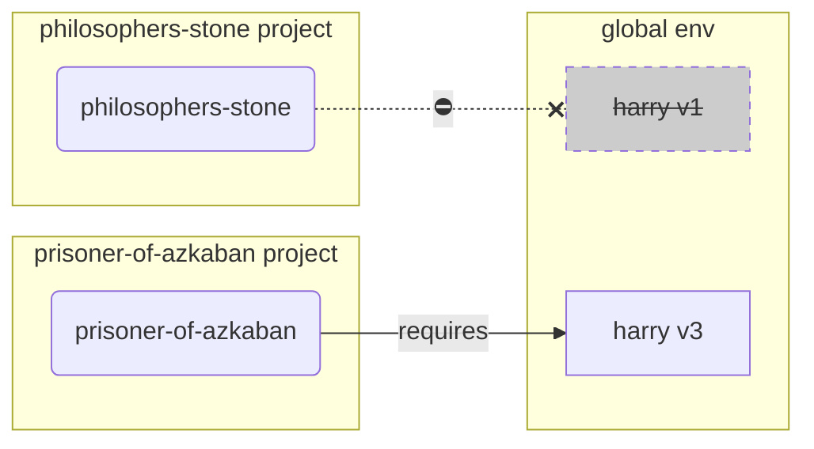
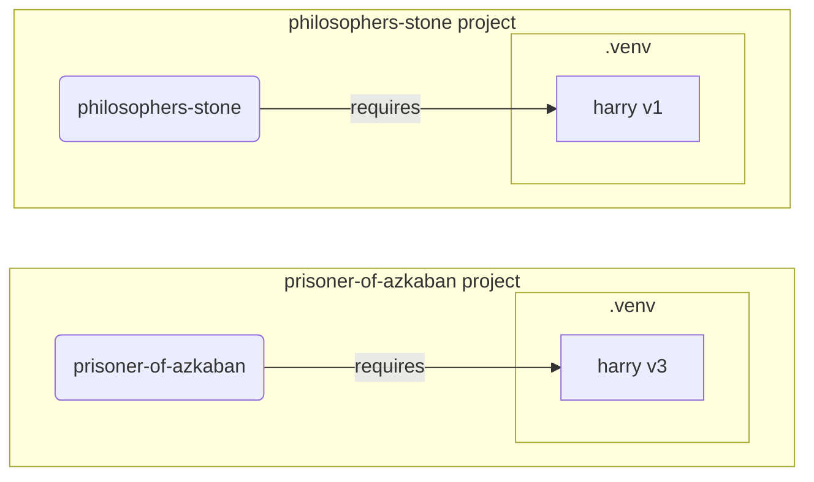

# Virtual Environments { #virtual-environments }

जब आप Python projects पर काम करते हैं, तो संभवतः आपको हर project के लिए install किए जाने वाले packages को अलग रखने के लिए एक **virtual environment** (या कोई समान तरीका) इस्तेमाल करना चाहिए।

/// note | नोट

अगर आप पहले से virtual environments के बारे में जानते हैं, उन्हें कैसे बनाना और इस्तेमाल करना है जानते हैं, तो आप इस section को छोड़ना चाह सकते हैं। 🤓

///

/// tip | सुझाव

एक **virtual environment**, एक **environment variable** से अलग होता है।

एक **environment variable** system में एक variable होता है जिसे programs इस्तेमाल कर सकते हैं।

एक **virtual environment** एक directory होती है जिसमें कुछ files होती हैं।

///

/// note | नोट

यह पेज आपको **virtual environments** का उपयोग करना और वे कैसे काम करते हैं, सिखाएगा।

अगर आप अपने लिए **सब कुछ manage करने वाला tool** अपनाने के लिए तैयार हैं (जिसमें Python install करना भी शामिल है), तो [uv](https://github.com/astral-sh/uv) आज़माएँ।

///

## Project बनाएँ { #create-a-project }

सबसे पहले, अपने project के लिए एक directory बनाएँ।

मैं सामान्यतः अपनी home/user directory के अंदर `code` नाम की एक directory बनाता हूँ।

और उसके अंदर हर project के लिए एक directory बनाता हूँ।

<div class="termy">

```console
// home directory में जाएँ
$ cd
// अपने सभी code projects के लिए एक directory बनाएँ
$ mkdir code
// उस code directory में जाएँ
$ cd code
// इस project के लिए एक directory बनाएँ
$ mkdir awesome-project
// उस project directory में जाएँ
$ cd awesome-project
```

</div>

## Virtual Environment बनाएँ { #create-a-virtual-environment }

जब आप किसी Python project पर **पहली बार** काम शुरू करते हैं, तो एक virtual environment **<dfn title="दूसरे विकल्प भी हैं, यह एक सरल guideline है">अपने project के अंदर</dfn>** बनाएँ।

/// tip | सुझाव

आपको यह **हर project के लिए केवल एक बार** करना होता है, हर बार काम करते समय नहीं।

///

//// tab | `venv`

Virtual environment बनाने के लिए, आप Python के साथ आने वाले `venv` module का उपयोग कर सकते हैं।

<div class="termy">

```console
$ python -m venv .venv
```

</div>

/// details | उस command का क्या अर्थ है

* `python`: `python` नाम के program का उपयोग करें
* `-m`: किसी module को script की तरह call करें, अगला हम उसे बताएँगे कि कौन-सा module
* `venv`: `venv` नाम के module का उपयोग करें जो सामान्यतः Python के साथ install आता है
* `.venv`: नई directory `.venv` में virtual environment बनाएँ

///

////

//// tab | `uv`

अगर आपके पास [`uv`](https://github.com/astral-sh/uv) install है, तो आप इसका उपयोग virtual environment बनाने के लिए कर सकते हैं।

<div class="termy">

```console
$ uv venv
```

</div>

/// tip | सुझाव

Default रूप से, `uv` `.venv` नाम की directory में virtual environment बनाएगा।

लेकिन आप directory नाम के साथ एक अतिरिक्त argument देकर इसे customize कर सकते हैं।

///

////

वह command `.venv` नाम की directory में एक नया virtual environment बनाता है।

/// details | `.venv` या कोई दूसरा नाम

आप virtual environment को किसी दूसरी directory में बना सकते हैं, लेकिन इसे `.venv` कहने की एक convention है।

///

## Virtual Environment activate करें { #activate-the-virtual-environment }

नए virtual environment को activate करें ताकि आप जो भी Python command चलाएँ या जो package install करें, वह इसका उपयोग करे।

/// tip | सुझाव

Project पर काम करने के लिए **हर बार** जब आप एक **नया terminal session** शुरू करें, तो यह करें।

///

//// tab | Linux, macOS

<div class="termy">

```console
$ source .venv/bin/activate
```

</div>

////

//// tab | Windows PowerShell

<div class="termy">

```console
$ .venv\Scripts\Activate.ps1
```

</div>

////

//// tab | Windows Bash

या अगर आप Windows के लिए Bash का उपयोग करते हैं (जैसे [Git Bash](https://gitforwindows.org/)):

<div class="termy">

```console
$ source .venv/Scripts/activate
```

</div>

////

/// tip | सुझाव

हर बार जब आप उस environment में कोई **नया package** install करें, तो environment को फिर से **activate** करें।

यह सुनिश्चित करता है कि अगर आप उस package द्वारा install किया गया कोई **terminal (<abbr title="command line interface - कमांड लाइन इंटरफ़ेस">CLI</abbr>) program** इस्तेमाल करते हैं, तो आप अपने virtual environment वाला ही उपयोग करें, कोई और नहीं जो global रूप से install हो सकता है, शायद आपकी ज़रूरत से अलग version के साथ।

///

## जाँचें कि Virtual Environment Active है { #check-the-virtual-environment-is-active }

जाँचें कि virtual environment active है (पिछली command ने काम किया)।

/// tip | सुझाव

यह **वैकल्पिक** है, लेकिन यह **जाँचने** का एक अच्छा तरीका है कि सब कुछ अपेक्षा के अनुसार काम कर रहा है और आप वही virtual environment इस्तेमाल कर रहे हैं जिसका आपने इरादा किया था।

///

//// tab | Linux, macOS, Windows Bash

<div class="termy">

```console
$ which python

/home/user/code/awesome-project/.venv/bin/python
```

</div>

अगर यह `.venv/bin/python` पर `python` binary दिखाता है, आपके project के अंदर (इस मामले में `awesome-project`), तो यह काम कर गया। 🎉

////

//// tab | Windows PowerShell

<div class="termy">

```console
$ Get-Command python

C:\Users\user\code\awesome-project\.venv\Scripts\python
```

</div>

अगर यह `.venv\Scripts\python` पर `python` binary दिखाता है, आपके project के अंदर (इस मामले में `awesome-project`), तो यह काम कर गया। 🎉

////

## `pip` Upgrade करें { #upgrade-pip }

/// tip | सुझाव

अगर आप [`uv`](https://github.com/astral-sh/uv) का उपयोग करते हैं, तो आप चीजें install करने के लिए `pip` की बजाय उसी का उपयोग करेंगे, इसलिए आपको `pip` upgrade करने की ज़रूरत नहीं है। 😎

///

अगर आप packages install करने के लिए `pip` का उपयोग कर रहे हैं (यह Python के साथ default रूप से आता है), तो आपको इसे latest version में **upgrade** करना चाहिए।

किसी package को install करते समय कई अजीब errors केवल पहले `pip` upgrade करने से हल हो जाते हैं।

/// tip | सुझाव

आप सामान्यतः यह **एक बार** करेंगे, virtual environment बनाने के ठीक बाद।

///

सुनिश्चित करें कि virtual environment active है (ऊपर वाली command से) और फिर चलाएँ:

<div class="termy">

```console
$ python -m pip install --upgrade pip

---> 100%
```

</div>

/// tip | सुझाव

कभी-कभी, pip upgrade करने की कोशिश करते समय आपको **`No module named pip`** error मिल सकता है।

अगर ऐसा होता है, तो नीचे दी गई command का उपयोग करके pip install और upgrade करें:

<div class="termy">

```console
$ python -m ensurepip --upgrade

---> 100%
```

</div>

यह command pip को install करेगी अगर वह पहले से install नहीं है और यह भी सुनिश्चित करेगी कि install किया गया pip का version कम से कम `ensurepip` में उपलब्ध version जितना नया हो।

///

## `.gitignore` जोड़ें { #add-gitignore }

अगर आप **Git** का उपयोग कर रहे हैं (आपको करना चाहिए), तो अपनी `.venv` की हर चीज़ को Git से exclude करने के लिए एक `.gitignore` file जोड़ें।

/// tip | सुझाव

अगर आपने virtual environment बनाने के लिए [`uv`](https://github.com/astral-sh/uv) का उपयोग किया है, तो यह आपके लिए पहले ही कर चुका है, आप यह step छोड़ सकते हैं। 😎

///

/// tip | सुझाव

यह **एक बार** करें, virtual environment बनाने के ठीक बाद।

///

<div class="termy">

```console
$ echo "*" > .venv/.gitignore
```

</div>

/// details | उस command का क्या अर्थ है

* `echo "*"`: terminal में text `*` को "print" करेगा (अगला हिस्सा इसे थोड़ा बदल देता है)
* `>`: `>` के बाईं ओर वाली command द्वारा terminal में print की गई कोई भी चीज़ print नहीं होनी चाहिए, बल्कि `>` के दाईं ओर वाली file में लिखी जानी चाहिए
* `.gitignore`: उस file का नाम जहाँ text लिखा जाना चाहिए

और Git के लिए `*` का मतलब "सब कुछ" होता है। इसलिए, यह `.venv` directory में सब कुछ ignore करेगा।

वह command `.gitignore` file बनाएगी, इस content के साथ:

```gitignore
*
```

///

## Packages install करें { #install-packages }

Environment activate करने के बाद, आप उसमें packages install कर सकते हैं।

/// tip | सुझाव

जब आप अपने project के लिए required packages install या upgrade कर रहे हों, तो यह **एक बार** करें।

अगर आपको किसी version को upgrade करना हो या कोई नया package जोड़ना हो, तो आप **यह फिर से करेंगे**।

///

### सीधे Packages install करें { #install-packages-directly }

अगर आप जल्दी में हैं और अपने project की package requirements declare करने के लिए कोई file इस्तेमाल नहीं करना चाहते, तो आप उन्हें सीधे install कर सकते हैं।

/// tip | सुझाव

आपके program को जिन packages और versions की ज़रूरत है, उन्हें एक file में रखना (बहुत) अच्छा विचार है (उदाहरण के लिए `requirements.txt` या `pyproject.toml`)।

///

//// tab | `pip`

<div class="termy">

```console
$ pip install "fastapi[standard]"

---> 100%
```

</div>

////

//// tab | `uv`

अगर आपके पास [`uv`](https://github.com/astral-sh/uv) है:

<div class="termy">

```console
$ uv pip install "fastapi[standard]"
---> 100%
```

</div>

////

### `requirements.txt` से install करें { #install-from-requirements-txt }

अगर आपके पास `requirements.txt` है, तो अब आप इसके packages install करने के लिए इसका उपयोग कर सकते हैं।

//// tab | `pip`

<div class="termy">

```console
$ pip install -r requirements.txt
---> 100%
```

</div>

////

//// tab | `uv`

अगर आपके पास [`uv`](https://github.com/astral-sh/uv) है:

<div class="termy">

```console
$ uv pip install -r requirements.txt
---> 100%
```

</div>

////

/// details | `requirements.txt`

कुछ packages वाला `requirements.txt` ऐसा दिख सकता है:

```requirements.txt
fastapi[standard]==0.113.0
pydantic==2.8.0
```

///

## अपना Program चलाएँ { #run-your-program }

Virtual environment activate करने के बाद, आप अपना program चला सकते हैं, और यह आपके virtual environment के अंदर मौजूद Python का उपयोग करेगा, उन packages के साथ जिन्हें आपने वहाँ install किया है।

<div class="termy">

```console
$ python main.py

Hello World
```

</div>

## अपना Editor Configure करें { #configure-your-editor }

आप शायद एक editor का उपयोग करेंगे, सुनिश्चित करें कि आप इसे उसी virtual environment का उपयोग करने के लिए configure करें जिसे आपने बनाया है (यह शायद इसे autodetect कर लेगा), ताकि आपको autocompletion और inline errors मिल सकें।

उदाहरण के लिए:

* [VS Code](https://code.visualstudio.com/docs/python/environments#_select-and-activate-an-environment)
* [PyCharm](https://www.jetbrains.com/help/pycharm/creating-virtual-environment.html)

/// tip | सुझाव

आपको सामान्यतः यह केवल **एक बार** करना होता है, जब आप virtual environment बनाते हैं।

///

## Virtual Environment deactivate करें { #deactivate-the-virtual-environment }

जब आप अपने project पर काम कर लें, तो आप virtual environment को **deactivate** कर सकते हैं।

<div class="termy">

```console
$ deactivate
```

</div>

इस तरह, जब आप `python` चलाएँगे, तो यह वहाँ install packages वाले उस virtual environment से इसे चलाने की कोशिश नहीं करेगा।

## काम करने के लिए तैयार { #ready-to-work }

अब आप अपने project पर काम शुरू करने के लिए तैयार हैं।


/// tip | सुझाव

क्या आप समझना चाहते हैं कि ऊपर की सारी चीज़ें क्या हैं?

आगे पढ़ते रहें। 👇🤓

///

## Virtual Environments क्यों { #why-virtual-environments }

FastAPI के साथ काम करने के लिए आपको [Python](https://www.python.org/) install करना होगा।

उसके बाद, आपको FastAPI और कोई भी अन्य **packages** जिन्हें आप इस्तेमाल करना चाहते हैं, **install** करने होंगे।

Packages install करने के लिए आप सामान्यतः Python के साथ आने वाली `pip` command (या समान alternatives) का उपयोग करेंगे।

फिर भी, अगर आप सीधे `pip` का उपयोग करते हैं, तो packages आपके **global Python environment** (Python की global installation) में install हो जाएँगे।

### समस्या { #the-problem }

तो, global Python environment में packages install करने में समस्या क्या है?

किसी समय, आप शायद कई अलग-अलग programs लिखेंगे जो **अलग-अलग packages** पर निर्भर करते हैं। और जिन projects पर आप काम करेंगे उनमें से कुछ उसी package के **अलग-अलग versions** पर निर्भर होंगे। 😱

उदाहरण के लिए, आप `philosophers-stone` नाम का एक project बना सकते हैं, यह program **`harry`, version `1`** नाम के किसी दूसरे package पर निर्भर करता है। इसलिए, आपको `harry` install करना होगा।



फिर, कुछ समय बाद, आप `prisoner-of-azkaban` नाम का दूसरा project बनाते हैं, और यह project भी `harry` पर निर्भर करता है, लेकिन इस project को **`harry` version `3`** चाहिए।



लेकिन अब समस्या यह है कि अगर आप packages को local **virtual environment** में install करने के बजाय globally (global environment में) install करते हैं, तो आपको चुनना होगा कि `harry` का कौन-सा version install करना है।

अगर आप `philosophers-stone` चलाना चाहते हैं, तो आपको पहले `harry` version `1` install करना होगा, उदाहरण के लिए:

<div class="termy">

```console
$ pip install "harry==1"
```

</div>

और फिर आपके global Python environment में `harry` version `1` install हो जाएगा।



लेकिन फिर अगर आप `prisoner-of-azkaban` चलाना चाहते हैं, तो आपको `harry` version `1` uninstall करके `harry` version `3` install करना होगा (या सिर्फ version `3` install करने से version `1` automatically uninstall हो जाएगा)।

<div class="termy">

```console
$ pip install "harry==3"
```

</div>

और फिर आपके global Python environment में `harry` version `3` install हो जाएगा।

और अगर आप `philosophers-stone` फिर से चलाने की कोशिश करते हैं, तो संभावना है कि यह **काम न करे** क्योंकि इसे `harry` version `1` चाहिए।



/// tip | सुझाव

Python packages में **नए versions** में **breaking changes से बचने** की पूरी कोशिश करना बहुत आम है, लेकिन सुरक्षित रहना बेहतर है, और नए versions को जानबूझकर तथा तब install करना बेहतर है जब आप tests चलाकर जाँच सकें कि सब कुछ सही तरीके से काम कर रहा है।

///

अब, यही चीज़ उन **कई** अन्य **packages** के साथ कल्पना करें जिन पर आपके सभी **projects निर्भर करते हैं**। इसे manage करना बहुत कठिन है। और संभवतः आप कुछ projects को packages के कुछ **incompatible versions** के साथ चला देंगे, और यह नहीं जान पाएँगे कि कुछ काम क्यों नहीं कर रहा।

साथ ही, आपके operating system (जैसे Linux, Windows, macOS) के आधार पर, उसमें Python पहले से install आया हो सकता है। और उस मामले में संभवतः कुछ packages कुछ specific versions के साथ pre-installed होंगे जो **आपके system के लिए required** हैं। अगर आप global Python environment में packages install करते हैं, तो आप अपने operating system के साथ आए कुछ programs को **break** कर सकते हैं।

## Packages कहाँ install होते हैं { #where-are-packages-installed }

जब आप Python install करते हैं, तो यह आपके computer पर कुछ files वाली कुछ directories बनाता है।

इनमें से कुछ directories वे होती हैं जो आपके द्वारा install किए गए सभी packages को रखने की जिम्मेदार होती हैं।

जब आप चलाते हैं:

<div class="termy">

```console
// इसे अभी न चलाएँ, यह केवल एक उदाहरण है 🤓
$ pip install "fastapi[standard]"
---> 100%
```

</div>

तो यह FastAPI code वाली एक compressed file download करेगा, सामान्यतः [PyPI](https://pypi.org/project/fastapi/) से।

यह उन अन्य packages की files भी **download** करेगा जिन पर FastAPI निर्भर करता है।

फिर यह उन सभी files को **extract** करेगा और उन्हें आपके computer की एक directory में रखेगा।

Default रूप से, यह उन downloaded और extracted files को उस directory में रखेगा जो आपकी Python installation के साथ आती है, वही **global environment** है।

## Virtual Environments क्या हैं { #what-are-virtual-environments }

सभी packages को global environment में रखने की समस्याओं का समाधान है कि आप जिस भी project पर काम करते हैं उसके लिए **एक virtual environment** उपयोग करें।

एक virtual environment एक **directory** है, global वाली के बहुत समान, जहाँ आप किसी project के लिए packages install कर सकते हैं।

इस तरह, हर project का अपना virtual environment (`.venv` directory) होगा, अपने packages के साथ।



## Virtual Environment activate करने का क्या मतलब है { #what-does-activating-a-virtual-environment-mean }

जब आप किसी virtual environment को activate करते हैं, उदाहरण के लिए:

//// tab | Linux, macOS

<div class="termy">

```console
$ source .venv/bin/activate
```

</div>

////

//// tab | Windows PowerShell

<div class="termy">

```console
$ .venv\Scripts\Activate.ps1
```

</div>

////

//// tab | Windows Bash

या अगर आप Windows के लिए Bash का उपयोग करते हैं (जैसे [Git Bash](https://gitforwindows.org/)):

<div class="termy">

```console
$ source .venv/Scripts/activate
```

</div>

////

वह command कुछ [environment variables](environment-variables.md) बनाएगी या modify करेगी, जो अगली commands के लिए उपलब्ध होंगे।

उन variables में से एक `PATH` variable है।

/// tip | सुझाव

आप [Environment Variables](environment-variables.md#path-environment-variable) section में `PATH` environment variable के बारे में और जान सकते हैं।

///

Virtual environment activate करने से उसका path `.venv/bin` (Linux और macOS पर) या `.venv\Scripts` (Windows पर) `PATH` environment variable में जुड़ जाता है।

मान लीजिए कि environment activate करने से पहले, `PATH` variable ऐसा दिखता था:

//// tab | Linux, macOS

```plaintext
/usr/bin:/bin:/usr/sbin:/sbin
```

इसका मतलब है कि system programs को इनमें खोजता:

* `/usr/bin`
* `/bin`
* `/usr/sbin`
* `/sbin`

////

//// tab | Windows

```plaintext
C:\Windows\System32
```

इसका मतलब है कि system programs को इसमें खोजता:

* `C:\Windows\System32`

////

Virtual environment activate करने के बाद, `PATH` variable कुछ ऐसा दिखेगा:

//// tab | Linux, macOS

```plaintext
/home/user/code/awesome-project/.venv/bin:/usr/bin:/bin:/usr/sbin:/sbin
```

इसका मतलब है कि system अब सबसे पहले programs को यहाँ खोजना शुरू करेगा:

```plaintext
/home/user/code/awesome-project/.venv/bin
```

बाकी directories में देखने से पहले।

तो, जब आप terminal में `python` type करते हैं, तो system Python program को यहाँ पाएगा

```plaintext
/home/user/code/awesome-project/.venv/bin/python
```

और उसी का उपयोग करेगा।

////

//// tab | Windows

```plaintext
C:\Users\user\code\awesome-project\.venv\Scripts;C:\Windows\System32
```

इसका मतलब है कि system अब सबसे पहले programs को यहाँ खोजना शुरू करेगा:

```plaintext
C:\Users\user\code\awesome-project\.venv\Scripts
```

बाकी directories में देखने से पहले।

तो, जब आप terminal में `python` type करते हैं, तो system Python program को यहाँ पाएगा

```plaintext
C:\Users\user\code\awesome-project\.venv\Scripts\python
```

और उसी का उपयोग करेगा।

////

एक महत्वपूर्ण detail यह है कि यह virtual environment path को `PATH` variable की **शुरुआत** में रखेगा। System इसे किसी भी अन्य उपलब्ध Python से **पहले** पाएगा। इस तरह, जब आप `python` चलाते हैं, तो यह किसी अन्य `python` (उदाहरण के लिए, global environment वाला `python`) के बजाय **virtual environment से** Python का उपयोग करेगा।

Virtual environment activate करने से कुछ और चीजें भी बदलती हैं, लेकिन यह उसके द्वारा की जाने वाली सबसे महत्वपूर्ण चीज़ों में से एक है।

## Virtual Environment की जाँच करना { #checking-a-virtual-environment }

जब आप जाँचते हैं कि virtual environment active है या नहीं, उदाहरण के लिए:

//// tab | Linux, macOS, Windows Bash

<div class="termy">

```console
$ which python

/home/user/code/awesome-project/.venv/bin/python
```

</div>

////

//// tab | Windows PowerShell

<div class="termy">

```console
$ Get-Command python

C:\Users\user\code\awesome-project\.venv\Scripts\python
```

</div>

////

इसका मतलब है कि जो `python` program उपयोग किया जाएगा, वह **virtual environment में** मौजूद है।

आप Linux और macOS में `which` और Windows PowerShell में `Get-Command` का उपयोग करते हैं।

वह command जिस तरह काम करती है, वह यह है कि यह `PATH` environment variable में जाकर **हर path को क्रम से** check करेगी, `python` नाम के program को खोजते हुए। एक बार जब यह उसे ढूँढ लेती है, तो यह आपको उस program का **path दिखाएगी**।

सबसे महत्वपूर्ण हिस्सा यह है कि जब आप `python` call करते हैं, तो वही exact "`python`" execute होगा।

तो, आप confirm कर सकते हैं कि आप सही virtual environment में हैं या नहीं।

/// tip | सुझाव

एक virtual environment activate करना, एक Python पाना, और फिर **दूसरे project में चले जाना** आसान है।

और दूसरा project **काम नहीं करेगा** क्योंकि आप **गलत Python** का उपयोग कर रहे हैं, जो किसी दूसरे project के virtual environment से है।

यह check कर पाना उपयोगी है कि कौन-सा `python` उपयोग हो रहा है। 🤓

///

## Virtual Environment deactivate क्यों करें { #why-deactivate-a-virtual-environment }

उदाहरण के लिए, आप `philosophers-stone` project पर काम कर रहे हो सकते हैं, **उस virtual environment को activate** करके, packages install करके और उस environment के साथ काम करके।

और फिर आप **किसी दूसरे project** `prisoner-of-azkaban` पर काम करना चाहते हैं।

आप उस project में जाते हैं:

<div class="termy">

```console
$ cd ~/code/prisoner-of-azkaban
```

</div>

अगर आप `philosophers-stone` के लिए virtual environment को deactivate नहीं करते, तो जब आप terminal में `python` चलाएँगे, यह `philosophers-stone` से Python का उपयोग करने की कोशिश करेगा।

<div class="termy">

```console
$ cd ~/code/prisoner-of-azkaban

$ python main.py

// sirius import करने में error, यह install नहीं है 😱
Traceback (most recent call last):
    File "main.py", line 1, in <module>
        import sirius
```

</div>

लेकिन अगर आप virtual environment deactivate करके `prisoner-of-azkaban` के लिए नया वाला activate करते हैं, तो जब आप `python` चलाएँगे, यह `prisoner-of-azkaban` में मौजूद virtual environment से Python का उपयोग करेगा।

<div class="termy">

```console
$ cd ~/code/prisoner-of-azkaban

// deactivate करने के लिए आपको पुरानी directory में होने की ज़रूरत नहीं है, आप जहाँ भी हों वहाँ से कर सकते हैं, दूसरे project में जाने के बाद भी 😎
$ deactivate

// prisoner-of-azkaban/.venv में virtual environment activate करें 🚀
$ source .venv/bin/activate

// अब जब आप python चलाएँगे, तो यह इस virtual environment में install package sirius को पाएगा ✨
$ python main.py

I solemnly swear 🐺
```

</div>

## Alternatives { #alternatives }

यह आपको शुरू करने और यह सिखाने के लिए एक सरल guide है कि सब कुछ **अंदर से** कैसे काम करता है।

Virtual environments, package dependencies (requirements), projects को manage करने के कई **alternatives** हैं।

जब आप तैयार हों और **पूरे project को manage** करने के लिए कोई tool उपयोग करना चाहें, package dependencies, virtual environments आदि सहित, तो मैं सुझाव दूँगा कि आप [uv](https://github.com/astral-sh/uv) आज़माएँ।

`uv` बहुत सारी चीज़ें कर सकता है, यह कर सकता है:

* आपके लिए **Python install** करना, अलग-अलग versions सहित
* आपके projects के लिए **virtual environment** manage करना
* **Packages** install करना
* आपके project के लिए package **dependencies और versions** manage करना
* सुनिश्चित करना कि आपके पास install करने के लिए packages और versions का **exact** set हो, उनकी dependencies सहित, ताकि आप सुनिश्चित हो सकें कि आप अपने project को production में ठीक उसी तरह चला सकते हैं जैसे development के दौरान अपने computer पर चलाते हैं, इसे **locking** कहा जाता है
* और कई अन्य चीज़ें

## निष्कर्ष { #conclusion }

अगर आपने यह सब पढ़ा और समझा है, तो अब **आप virtual environments के बारे में** वहाँ मौजूद कई developers से कहीं ज़्यादा जानते हैं। 🤓

इन details को जानना भविष्य में उस समय बहुत संभवतः उपयोगी होगा जब आप किसी ऐसी चीज़ को debug कर रहे होंगे जो complex लगती है, लेकिन आपको पता होगा कि **यह सब अंदर से कैसे काम करता है**। 😎
