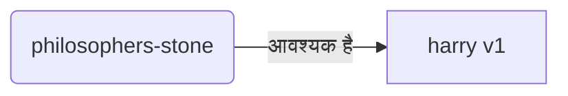
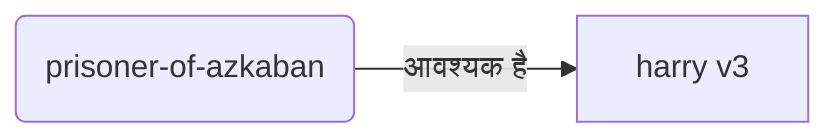
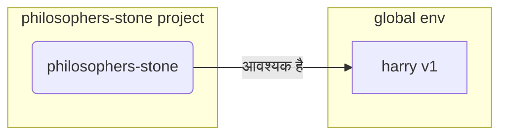
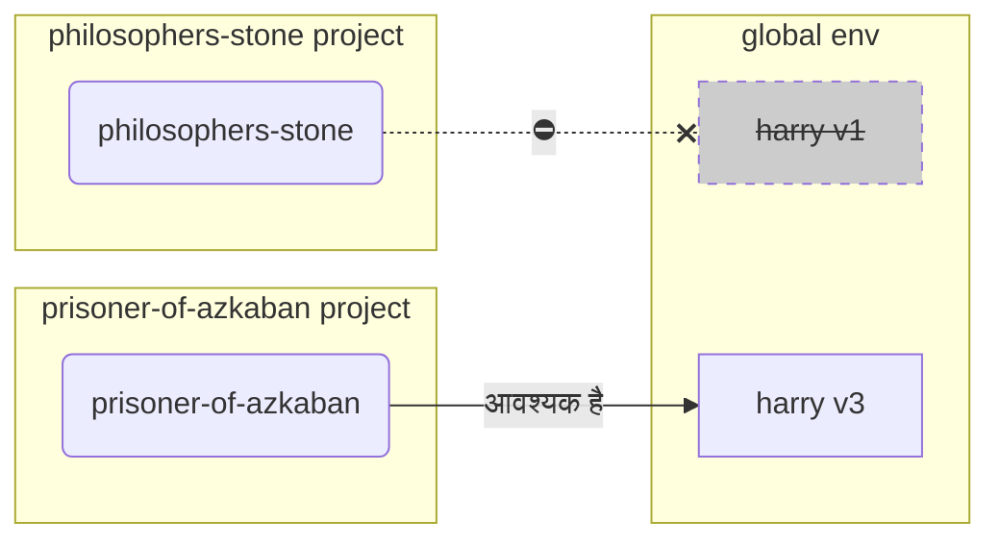
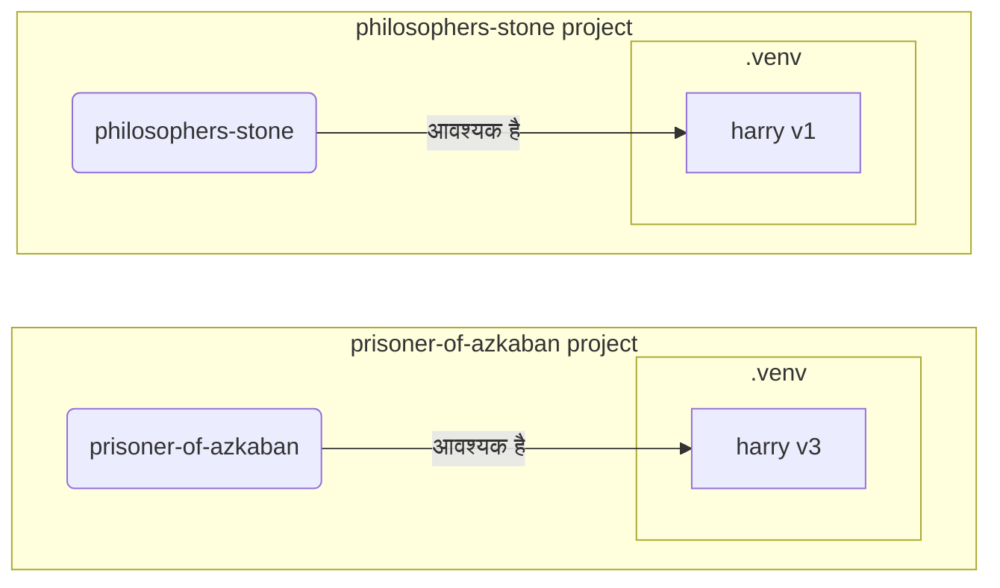

# वर्चुअल एनवायरनमेंट { #virtual-environments }

जब आप Python प्रोजेक्ट्स पर काम करते हैं, तो आपको शायद हर प्रोजेक्ट के लिए इंस्टॉल किए जाने वाले पैकेजों को अलग-थलग रखने के लिए एक **वर्चुअल एनवायरनमेंट** (या कोई समान तरीका) इस्तेमाल करना चाहिए।

/// note | नोट

अगर आप पहले से वर्चुअल एनवायरनमेंट के बारे में जानते हैं, उन्हें कैसे बनाना और उपयोग करना है, तो आप इस सेक्शन को छोड़ सकते हैं। 🤓

///

/// tip | टिप

एक **वर्चुअल एनवायरनमेंट**, एक **एनवायरनमेंट वैरिएबल** से अलग होता है।

एक **एनवायरनमेंट वैरिएबल** सिस्टम में एक वैरिएबल होता है जिसे प्रोग्राम इस्तेमाल कर सकते हैं।

एक **वर्चुअल एनवायरनमेंट** एक डायरेक्टरी होती है जिसमें कुछ फाइलें होती हैं।

///

/// note | नोट

यह पेज आपको सिखाएगा कि **वर्चुअल एनवायरनमेंट** का उपयोग कैसे करना है और वे कैसे काम करते हैं।

अगर आप एक **ऐसा टूल अपनाने के लिए तैयार हैं जो आपके लिए सब कुछ मैनेज करता है** (Python इंस्टॉल करने सहित), तो [uv](https://github.com/astral-sh/uv) आज़माएँ।

///

## प्रोजेक्ट बनाएँ { #create-a-project }

सबसे पहले, अपने प्रोजेक्ट के लिए एक डायरेक्टरी बनाएँ।

मैं सामान्यतः अपने home/user डायरेक्टरी के अंदर `code` नाम की एक डायरेक्टरी बनाता हूँ।

और उसके अंदर हर प्रोजेक्ट के लिए एक-एक डायरेक्टरी बनाता हूँ।

<div class="termy">

```console
// होम डायरेक्टरी में जाएँ
$ cd
// अपने सभी कोड प्रोजेक्ट्स के लिए एक डायरेक्टरी बनाएँ
$ mkdir code
// उस कोड डायरेक्टरी में जाएँ
$ cd code
// इस प्रोजेक्ट के लिए एक डायरेक्टरी बनाएँ
$ mkdir awesome-project
// उस प्रोजेक्ट डायरेक्टरी में जाएँ
$ cd awesome-project
```

</div>

## वर्चुअल एनवायरनमेंट बनाएँ { #create-a-virtual-environment }

जब आप किसी Python प्रोजेक्ट पर **पहली बार** काम शुरू करते हैं, तो एक वर्चुअल एनवायरनमेंट **<dfn title="अन्य विकल्प भी हैं, यह एक सरल दिशानिर्देश है">अपने प्रोजेक्ट के अंदर</dfn>** बनाएँ।

/// tip | टिप

आपको यह **हर प्रोजेक्ट के लिए केवल एक बार** करना होता है, हर बार काम करते समय नहीं।

///

//// tab | `venv`

वर्चुअल एनवायरनमेंट बनाने के लिए, आप Python के साथ आने वाले `venv` module का उपयोग कर सकते हैं।

<div class="termy">

```console
$ python -m venv .venv
```

</div>

/// details | उस कमांड का क्या अर्थ है

* `python`: `python` नाम के प्रोग्राम का उपयोग करें
* `-m`: किसी module को script के रूप में चलाएँ, आगे हम बताएँगे कि कौन-सा module
* `venv`: `venv` नाम के module का उपयोग करें जो सामान्यतः Python के साथ इंस्टॉल आता है
* `.venv`: नई डायरेक्टरी `.venv` में वर्चुअल एनवायरनमेंट बनाएँ

///

////

//// tab | `uv`

अगर आपके पास [`uv`](https://github.com/astral-sh/uv) इंस्टॉल है, तो आप इसका उपयोग वर्चुअल एनवायरनमेंट बनाने के लिए कर सकते हैं।

<div class="termy">

```console
$ uv venv
```

</div>

/// tip | टिप

डिफ़ॉल्ट रूप से, `uv` `.venv` नाम की डायरेक्टरी में वर्चुअल एनवायरनमेंट बनाएगा।

लेकिन आप डायरेक्टरी नाम के साथ एक अतिरिक्त argument देकर इसे customize कर सकते हैं।

///

////

यह कमांड `.venv` नाम की डायरेक्टरी में एक नया वर्चुअल एनवायरनमेंट बनाता है।

/// details | `.venv` या कोई दूसरा नाम

आप वर्चुअल एनवायरनमेंट को किसी अलग डायरेक्टरी में बना सकते हैं, लेकिन इसे `.venv` कहने की एक convention है।

///

## वर्चुअल एनवायरनमेंट को activate करें { #activate-the-virtual-environment }

नए वर्चुअल एनवायरनमेंट को activate करें ताकि आपके द्वारा चलाया गया कोई भी Python कमांड या इंस्टॉल किया गया पैकेज उसी का उपयोग करे।

/// tip | टिप

जब भी आप प्रोजेक्ट पर काम करने के लिए **नया terminal session** शुरू करें, यह **हर बार** करें।

///

//// tab | Linux, macOS

<div class="termy">

```console
$ source .venv/bin/activate
```

</div>

////

//// tab | Windows PowerShell

<div class="termy">

```console
$ .venv\Scripts\Activate.ps1
```

</div>

////

//// tab | Windows Bash

या अगर आप Windows के लिए Bash का उपयोग करते हैं (जैसे [Git Bash](https://gitforwindows.org/)):

<div class="termy">

```console
$ source .venv/Scripts/activate
```

</div>

////

/// tip | टिप

जब भी आप उस एनवायरनमेंट में कोई **नया पैकेज** इंस्टॉल करें, तो एनवायरनमेंट को फिर से **activate** करें।

यह सुनिश्चित करता है कि अगर आप उस पैकेज द्वारा इंस्टॉल किया गया कोई **terminal (<abbr title="command line interface - कमांड लाइन इंटरफ़ेस">CLI</abbr>) program** इस्तेमाल करते हैं, तो आप अपने वर्चुअल एनवायरनमेंट वाला ही इस्तेमाल करें, कोई दूसरा नहीं जो globally इंस्टॉल हो सकता है, शायद आपके आवश्यक version से अलग version के साथ।

///

## जाँचें कि वर्चुअल एनवायरनमेंट active है { #check-the-virtual-environment-is-active }

जाँचें कि वर्चुअल एनवायरनमेंट active है (पिछला कमांड काम कर गया)।

/// tip | टिप

यह **वैकल्पिक** है, लेकिन यह **जाँचने** का अच्छा तरीका है कि सब कुछ अपेक्षा के अनुसार काम कर रहा है और आप वही वर्चुअल एनवायरनमेंट इस्तेमाल कर रहे हैं जो आप चाहते थे।

///

//// tab | Linux, macOS, Windows Bash

<div class="termy">

```console
$ which python

/home/user/code/awesome-project/.venv/bin/python
```

</div>

अगर यह आपके प्रोजेक्ट (इस मामले में `awesome-project`) के अंदर `.venv/bin/python` पर `python` binary दिखाता है, तो यह काम कर गया। 🎉

////

//// tab | Windows PowerShell

<div class="termy">

```console
$ Get-Command python

C:\Users\user\code\awesome-project\.venv\Scripts\python
```

</div>

अगर यह आपके प्रोजेक्ट (इस मामले में `awesome-project`) के अंदर `.venv\Scripts\python` पर `python` binary दिखाता है, तो यह काम कर गया। 🎉

////

## `pip` upgrade करें { #upgrade-pip }

/// tip | टिप

अगर आप [`uv`](https://github.com/astral-sh/uv) इस्तेमाल करते हैं, तो आप चीज़ें इंस्टॉल करने के लिए `pip` के बजाय उसी का उपयोग करेंगे, इसलिए आपको `pip` upgrade करने की ज़रूरत नहीं है। 😎

///

अगर आप पैकेज इंस्टॉल करने के लिए `pip` का उपयोग कर रहे हैं (यह Python के साथ डिफ़ॉल्ट रूप से आता है), तो आपको इसे latest version पर **upgrade** करना चाहिए।

पैकेज इंस्टॉल करते समय आने वाली कई अजीब errors केवल पहले `pip` upgrade करने से हल हो जाती हैं।

/// tip | टिप

आप सामान्यतः यह **एक बार** करेंगे, वर्चुअल एनवायरनमेंट बनाने के तुरंत बाद।

///

सुनिश्चित करें कि वर्चुअल एनवायरनमेंट active है (ऊपर दिए गए कमांड से) और फिर चलाएँ:

<div class="termy">

```console
$ python -m pip install --upgrade pip

---> 100%
```

</div>

/// tip | टिप

कभी-कभी, pip upgrade करने की कोशिश करते समय आपको **`No module named pip`** error मिल सकती है।

अगर ऐसा होता है, तो नीचे दिए गए कमांड का उपयोग करके pip इंस्टॉल और upgrade करें:

<div class="termy">

```console
$ python -m ensurepip --upgrade

---> 100%
```

</div>

यह कमांड pip को इंस्टॉल करेगा अगर वह पहले से इंस्टॉल नहीं है और यह भी सुनिश्चित करेगा कि इंस्टॉल किया गया pip version कम से कम `ensurepip` में उपलब्ध version जितना नया हो।

///

## `.gitignore` जोड़ें { #add-gitignore }

अगर आप **Git** इस्तेमाल कर रहे हैं (आपको करना चाहिए), तो अपनी `.venv` की हर चीज़ को Git से exclude करने के लिए एक `.gitignore` file जोड़ें।

/// tip | टिप

अगर आपने वर्चुअल एनवायरनमेंट बनाने के लिए [`uv`](https://github.com/astral-sh/uv) का उपयोग किया है, तो यह आपके लिए पहले ही कर चुका है, आप यह step छोड़ सकते हैं। 😎

///

/// tip | टिप

यह **एक बार** करें, वर्चुअल एनवायरनमेंट बनाने के तुरंत बाद।

///

<div class="termy">

```console
$ echo "*" > .venv/.gitignore
```

</div>

/// details | उस कमांड का क्या अर्थ है

* `echo "*"`: terminal में text `*` को "print" करेगा (अगला हिस्सा इसे थोड़ा बदलता है)
* `>`: `>` के बाईं ओर वाले कमांड द्वारा terminal पर print की जाने वाली कोई भी चीज़ print नहीं होनी चाहिए, बल्कि `>` के दाईं ओर वाली file में लिखी जानी चाहिए
* `.gitignore`: उस file का नाम जहाँ text लिखा जाना चाहिए

और Git के लिए `*` का अर्थ है "सब कुछ"। इसलिए, यह `.venv` डायरेक्टरी में सब कुछ ignore करेगा।

यह कमांड `.gitignore` file बनाएगा, जिसकी content होगी:

```gitignore
*
```

///

## पैकेज इंस्टॉल करें { #install-packages }

एनवायरनमेंट activate करने के बाद, आप उसमें पैकेज इंस्टॉल कर सकते हैं।

/// tip | टिप

यह **एक बार** करें जब आप अपने प्रोजेक्ट को चाहिए पैकेज इंस्टॉल या upgrade कर रहे हों।

अगर आपको किसी version को upgrade करना है या नया पैकेज जोड़ना है, तो आप **यह फिर से करेंगे**।

///

### पैकेज सीधे इंस्टॉल करें { #install-packages-directly }

अगर आप जल्दी में हैं और अपने प्रोजेक्ट की package requirements declare करने के लिए file का उपयोग नहीं करना चाहते, तो आप उन्हें सीधे इंस्टॉल कर सकते हैं।

/// tip | टिप

आपके प्रोग्राम को जिन packages और versions की ज़रूरत है, उन्हें एक file में रखना (बहुत) अच्छा विचार है (उदाहरण के लिए `requirements.txt` या `pyproject.toml`)।

///

//// tab | `pip`

<div class="termy">

```console
$ pip install "fastapi[standard]"

---> 100%
```

</div>

////

//// tab | `uv`

अगर आपके पास [`uv`](https://github.com/astral-sh/uv) है:

<div class="termy">

```console
$ uv pip install "fastapi[standard]"
---> 100%
```

</div>

////

### `requirements.txt` से इंस्टॉल करें { #install-from-requirements-txt }

अगर आपके पास `requirements.txt` है, तो अब आप उसके packages इंस्टॉल करने के लिए इसका उपयोग कर सकते हैं।

//// tab | `pip`

<div class="termy">

```console
$ pip install -r requirements.txt
---> 100%
```

</div>

////

//// tab | `uv`

अगर आपके पास [`uv`](https://github.com/astral-sh/uv) है:

<div class="termy">

```console
$ uv pip install -r requirements.txt
---> 100%
```

</div>

////

/// details | `requirements.txt`

कुछ packages वाला `requirements.txt` ऐसा दिख सकता है:

```requirements.txt
fastapi[standard]==0.113.0
pydantic==2.8.0
```

///

## अपना प्रोग्राम चलाएँ { #run-your-program }

वर्चुअल एनवायरनमेंट activate करने के बाद, आप अपना प्रोग्राम चला सकते हैं, और यह आपके वर्चुअल एनवायरनमेंट के अंदर वाले Python का उपयोग करेगा, वहाँ इंस्टॉल किए गए packages के साथ।

<div class="termy">

```console
$ python main.py

Hello World
```

</div>

## अपना editor configure करें { #configure-your-editor }

आप शायद कोई editor इस्तेमाल करेंगे, सुनिश्चित करें कि आप उसे उसी वर्चुअल एनवायरनमेंट का उपयोग करने के लिए configure करें जो आपने बनाया है (यह शायद उसे autodetect कर लेगा) ताकि आपको autocompletion और inline errors मिल सकें।

उदाहरण के लिए:

* [VS Code](https://code.visualstudio.com/docs/python/environments#_select-and-activate-an-environment)
* [PyCharm](https://www.jetbrains.com/help/pycharm/creating-virtual-environment.html)

/// tip | टिप

आपको सामान्यतः यह केवल **एक बार** करना होता है, जब आप वर्चुअल एनवायरनमेंट बनाते हैं।

///

## वर्चुअल एनवायरनमेंट deactivate करें { #deactivate-the-virtual-environment }

जब आप अपने प्रोजेक्ट पर काम कर लें, तो आप वर्चुअल एनवायरनमेंट को **deactivate** कर सकते हैं।

<div class="termy">

```console
$ deactivate
```

</div>

इस तरह, जब आप `python` चलाएँगे, तो यह वहाँ इंस्टॉल packages वाले उस वर्चुअल एनवायरनमेंट से चलाने की कोशिश नहीं करेगा।

## काम के लिए तैयार { #ready-to-work }

अब आप अपने प्रोजेक्ट पर काम शुरू करने के लिए तैयार हैं।

/// tip | टिप

क्या आप समझना चाहते हैं कि ऊपर की सभी चीज़ें क्या हैं?

पढ़ना जारी रखें। 👇🤓

///

## वर्चुअल एनवायरनमेंट क्यों { #why-virtual-environments }

FastAPI के साथ काम करने के लिए आपको [Python](https://www.python.org/) इंस्टॉल करना होगा।

उसके बाद, आपको FastAPI और कोई भी अन्य **packages** जिन्हें आप इस्तेमाल करना चाहते हैं, **install** करने होंगे।

Packages install करने के लिए आप सामान्यतः Python के साथ आने वाले `pip` command (या समान विकल्पों) का उपयोग करेंगे।

फिर भी, अगर आप सीधे `pip` का उपयोग करते हैं, तो packages आपके **global Python environment** (Python की global installation) में इंस्टॉल हो जाएँगे।

### समस्या { #the-problem }

तो, global Python environment में packages install करने में समस्या क्या है?

किसी समय, आप शायद कई अलग-अलग programs लिखेंगे जो **अलग-अलग packages** पर निर्भर होंगे। और जिन projects पर आप काम करते हैं उनमें से कुछ उसी package के **अलग-अलग versions** पर निर्भर होंगे। 😱

उदाहरण के लिए, आप `philosophers-stone` नाम का प्रोजेक्ट बना सकते हैं, यह प्रोग्राम **`harry`, version `1`** नाम के एक दूसरे package पर निर्भर है। इसलिए, आपको `harry` install करना होगा।



फिर, बाद में किसी समय, आप `prisoner-of-azkaban` नाम का एक दूसरा प्रोजेक्ट बनाते हैं, और यह प्रोजेक्ट भी `harry` पर निर्भर है, लेकिन इस प्रोजेक्ट को **`harry` version `3`** चाहिए।



लेकिन अब समस्या यह है कि अगर आप packages को local **virtual environment** के बजाय globally (global environment में) install करते हैं, तो आपको चुनना पड़ेगा कि `harry` का कौन-सा version install करना है।

अगर आप `philosophers-stone` चलाना चाहते हैं, तो आपको पहले `harry` version `1` install करना होगा, उदाहरण के लिए:

<div class="termy">

```console
$ pip install "harry==1"
```

</div>

और फिर आपके global Python environment में `harry` version `1` install हो जाएगा।



लेकिन फिर अगर आप `prisoner-of-azkaban` चलाना चाहते हैं, तो आपको `harry` version `1` uninstall करके `harry` version `3` install करना होगा (या केवल version `3` install करने से version `1` अपने-आप uninstall हो जाएगा)।

<div class="termy">

```console
$ pip install "harry==3"
```

</div>

और फिर आपके global Python environment में `harry` version `3` install हो जाएगा।

और अगर आप `philosophers-stone` को फिर से चलाने की कोशिश करते हैं, तो संभावना है कि यह **काम न करे** क्योंकि इसे `harry` version `1` चाहिए।



/// tip | टिप

Python packages में **new versions** में **breaking changes** से बचने की पूरी कोशिश करना बहुत आम है, लेकिन सुरक्षित रहना बेहतर है, और नए versions को जानबूझकर और तब install करना बेहतर है जब आप tests चला कर जाँच सकें कि सब कुछ सही से काम कर रहा है।

///

अब, कल्पना करें कि आपके **सभी projects जिन पर निर्भर हैं** ऐसे **कई** अन्य **packages** हों। इसे manage करना बहुत कठिन है। और आप शायद कुछ projects को packages के **incompatible versions** के साथ चला देंगे, और यह नहीं जान पाएँगे कि कुछ काम क्यों नहीं कर रहा।

साथ ही, आपके operating system (जैसे Linux, Windows, macOS) पर निर्भर करते हुए, उसमें Python पहले से installed हो सकता है। और उस स्थिति में शायद कुछ packages कुछ specific versions के साथ pre-installed थे जो **आपके system को चाहिए**। अगर आप global Python environment में packages install करते हैं, तो आप अपने operating system के साथ आए कुछ programs को **break** कर सकते हैं।

## Packages कहाँ install होते हैं { #where-are-packages-installed }

जब आप Python install करते हैं, तो यह आपके computer पर कुछ files वाली कुछ directories बनाता है।

इनमें से कुछ directories वे होती हैं जो आपके install किए गए सभी packages को रखने की ज़िम्मेदार होती हैं।

जब आप चलाते हैं:

<div class="termy">

```console
// इसे अभी न चलाएँ, यह सिर्फ एक उदाहरण है 🤓
$ pip install "fastapi[standard]"
---> 100%
```

</div>

तो यह FastAPI code वाली compressed file download करेगा, सामान्यतः [PyPI](https://pypi.org/project/fastapi/) से।

यह उन अन्य packages की files भी **download** करेगा जिन पर FastAPI निर्भर करता है।

फिर यह उन सभी files को **extract** करेगा और आपके computer पर एक directory में रखेगा।

डिफ़ॉल्ट रूप से, यह उन downloaded और extracted files को आपकी Python installation के साथ आने वाली directory में रखेगा, वही **global environment** है।

## वर्चुअल एनवायरनमेंट क्या हैं { #what-are-virtual-environments }

सभी packages को global environment में रखने की समस्याओं का समाधान यह है कि आप जिस प्रत्येक project पर काम करते हैं, उसके लिए एक **virtual environment** उपयोग करें।

वर्चुअल एनवायरनमेंट एक **directory** है, global वाली के बहुत समान, जहाँ आप किसी project के लिए packages install कर सकते हैं।

इस तरह, हर project का अपना virtual environment (`.venv` directory) होगा, अपने packages के साथ।



## वर्चुअल एनवायरनमेंट activate करने का क्या मतलब है { #what-does-activating-a-virtual-environment-mean }

जब आप वर्चुअल एनवायरनमेंट activate करते हैं, उदाहरण के लिए:

//// tab | Linux, macOS

<div class="termy">

```console
$ source .venv/bin/activate
```

</div>

////

//// tab | Windows PowerShell

<div class="termy">

```console
$ .venv\Scripts\Activate.ps1
```

</div>

////

//// tab | Windows Bash

या अगर आप Windows के लिए Bash का उपयोग करते हैं (जैसे [Git Bash](https://gitforwindows.org/)):

<div class="termy">

```console
$ source .venv/Scripts/activate
```

</div>

////

तो वह command कुछ [environment variables](environment-variables.md) बनाएगा या modify करेगा जो अगले commands के लिए उपलब्ध होंगे।

उन variables में से एक `PATH` variable है।

/// tip | टिप

आप `PATH` environment variable के बारे में [Environment Variables](environment-variables.md#path-environment-variable) section में अधिक जान सकते हैं।

///

वर्चुअल एनवायरनमेंट activate करने से उसका path `.venv/bin` (Linux और macOS पर) या `.venv\Scripts` (Windows पर) `PATH` environment variable में जुड़ जाता है।

मान लें कि environment activate करने से पहले, `PATH` variable ऐसा दिखता था:

//// tab | Linux, macOS

```plaintext
/usr/bin:/bin:/usr/sbin:/sbin
```

इसका मतलब है कि system programs को यहाँ खोजेगा:

* `/usr/bin`
* `/bin`
* `/usr/sbin`
* `/sbin`

////

//// tab | Windows

```plaintext
C:\Windows\System32
```

इसका मतलब है कि system programs को यहाँ खोजेगा:

* `C:\Windows\System32`

////

वर्चुअल एनवायरनमेंट activate करने के बाद, `PATH` variable कुछ ऐसा दिखेगा:

//// tab | Linux, macOS

```plaintext
/home/user/code/awesome-project/.venv/bin:/usr/bin:/bin:/usr/sbin:/sbin
```

इसका मतलब है कि system अब programs को सबसे पहले यहाँ खोजना शुरू करेगा:

```plaintext
/home/user/code/awesome-project/.venv/bin
```

अन्य directories में देखने से पहले।

इसलिए, जब आप terminal में `python` type करते हैं, तो system Python program को यहाँ पाएगा:

```plaintext
/home/user/code/awesome-project/.venv/bin/python
```

और उसी का उपयोग करेगा।

////

//// tab | Windows

```plaintext
C:\Users\user\code\awesome-project\.venv\Scripts;C:\Windows\System32
```

इसका मतलब है कि system अब programs को सबसे पहले यहाँ खोजना शुरू करेगा:

```plaintext
C:\Users\user\code\awesome-project\.venv\Scripts
```

अन्य directories में देखने से पहले।

इसलिए, जब आप terminal में `python` type करते हैं, तो system Python program को यहाँ पाएगा:

```plaintext
C:\Users\user\code\awesome-project\.venv\Scripts\python
```

और उसी का उपयोग करेगा।

////

एक महत्वपूर्ण detail यह है कि यह virtual environment path को `PATH` variable की **शुरुआत** में रखेगा। System किसी भी अन्य उपलब्ध Python को खोजने से **पहले** इसे पाएगा। इस तरह, जब आप `python` चलाएँगे, तो यह किसी भी अन्य `python` (उदाहरण के लिए, global environment का `python`) के बजाय **virtual environment से Python** का उपयोग करेगा।

वर्चुअल एनवायरनमेंट activate करने से कुछ और चीज़ें भी बदलती हैं, लेकिन यह उन सबसे महत्वपूर्ण चीज़ों में से एक है जो यह करता है।

## वर्चुअल एनवायरनमेंट की जाँच करना { #checking-a-virtual-environment }

जब आप जाँचते हैं कि कोई वर्चुअल एनवायरनमेंट active है या नहीं, उदाहरण के लिए:

//// tab | Linux, macOS, Windows Bash

<div class="termy">

```console
$ which python

/home/user/code/awesome-project/.venv/bin/python
```

</div>

////

//// tab | Windows PowerShell

<div class="termy">

```console
$ Get-Command python

C:\Users\user\code\awesome-project\.venv\Scripts\python
```

</div>

////

इसका मतलब है कि उपयोग किया जाने वाला `python` program वही है जो **virtual environment में** है।

आप Linux और macOS में `which` और Windows PowerShell में `Get-Command` का उपयोग करते हैं।

यह command इस तरह काम करता है कि यह `PATH` environment variable में जाकर **हर path को क्रम से** check करेगा, `python` नाम के program को खोजते हुए। जैसे ही यह उसे पाता है, यह आपको उस program का **path दिखाएगा**।

सबसे महत्वपूर्ण बात यह है कि जब आप `python` call करते हैं, तो यही exact "`python`" execute होगा।

इसलिए, आप confirm कर सकते हैं कि आप सही virtual environment में हैं या नहीं।

/// tip | टिप

एक virtual environment activate करना, एक Python प्राप्त करना, और फिर **दूसरे project में चले जाना** आसान है।

और दूसरा project **काम नहीं करेगा** क्योंकि आप **गलत Python** इस्तेमाल कर रहे हैं, जो दूसरे project के virtual environment से है।

यह check कर पाना उपयोगी है कि कौन-सा `python` इस्तेमाल हो रहा है। 🤓

///

## वर्चुअल एनवायरनमेंट deactivate क्यों करें { #why-deactivate-a-virtual-environment }

उदाहरण के लिए, आप `philosophers-stone` project पर काम कर रहे हो सकते हैं, **उस virtual environment को activate** करके, packages install करके और उस environment के साथ काम करके।

और फिर आप **दूसरे project** `prisoner-of-azkaban` पर काम करना चाहते हैं।

आप उस project में जाते हैं:

<div class="termy">

```console
$ cd ~/code/prisoner-of-azkaban
```

</div>

अगर आप `philosophers-stone` के virtual environment को deactivate नहीं करते, तो जब आप terminal में `python` चलाएँगे, यह `philosophers-stone` से Python का उपयोग करने की कोशिश करेगा।

<div class="termy">

```console
$ cd ~/code/prisoner-of-azkaban

$ python main.py

// sirius import करने में error, यह installed नहीं है 😱
Traceback (most recent call last):
    File "main.py", line 1, in <module>
        import sirius
```

</div>

लेकिन अगर आप virtual environment को deactivate कर दें और `prisoner-of-azkaban` के लिए नया वाला activate करें, तो जब आप `python` चलाएँगे, यह `prisoner-of-azkaban` में virtual environment से Python का उपयोग करेगा।

<div class="termy">

```console
$ cd ~/code/prisoner-of-azkaban

// deactivate करने के लिए आपको पुरानी directory में होने की ज़रूरत नहीं है, आप जहाँ भी हों वहाँ से कर सकते हैं, दूसरे project में जाने के बाद भी 😎
$ deactivate

// prisoner-of-azkaban/.venv में virtual environment activate करें 🚀
$ source .venv/bin/activate

// अब जब आप python चलाएँगे, तो यह इस virtual environment में installed package sirius ढूँढ लेगा ✨
$ python main.py

I solemnly swear 🐺
```

</div>

## विकल्प { #alternatives }

यह आपको शुरू करवाने और यह सिखाने के लिए एक सरल guide है कि सब कुछ **अंदर से** कैसे काम करता है।

Virtual environments, package dependencies (requirements), projects को manage करने के कई **alternatives** हैं।

जब आप तैयार हों और **पूरे project को manage** करने के लिए कोई tool उपयोग करना चाहें, package dependencies, virtual environments, आदि, तो मैं सुझाव दूँगा कि आप [uv](https://github.com/astral-sh/uv) आज़माएँ।

`uv` बहुत सारी चीज़ें कर सकता है, यह कर सकता है:

* आपके लिए **Python install** करना, अलग-अलग versions सहित
* आपके projects के लिए **virtual environment** manage करना
* **packages** install करना
* आपके project के लिए package **dependencies और versions** manage करना
* सुनिश्चित करना कि आपके पास install करने के लिए packages और versions का एक **exact** set हो, उनकी dependencies सहित, ताकि आप सुनिश्चित हो सकें कि आप अपने project को production में बिल्कुल वैसे ही चला सकते हैं जैसे development के दौरान अपने computer में चलाते हैं, इसे **locking** कहा जाता है
* और भी कई चीज़ें

## निष्कर्ष { #conclusion }

अगर आपने यह सब पढ़ और समझ लिया, तो अब **आप virtual environments के बारे में** कई developers से कहीं अधिक जानते हैं। 🤓

इन details को जानना संभवतः भविष्य में तब उपयोगी होगा जब आप किसी ऐसी चीज़ को debug कर रहे होंगे जो complex लगती है, लेकिन आपको पता होगा कि **यह सब अंदर से कैसे काम करता है**। 😎
