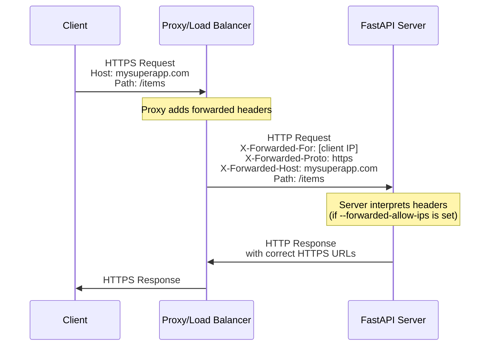
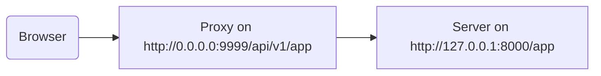

# プロキシの背後 { #behind-a-proxy }

多くの状況で、FastAPI アプリの前段に **Traefik** や **Nginx** のような**プロキシ**を置きます。

これらのプロキシは HTTPS 証明書などの処理を担います。

## プロキシの転送ヘッダー { #proxy-forwarded-headers }

アプリケーションの前段にある **プロキシ** は通常、リクエストを **サーバー** に送る前に、そのリクエストがプロキシによって転送されたことを知らせるためのヘッダーを動的に付与し、使用中の元の（公開）URL（ドメインを含む）や HTTPS 使用などの情報を伝えます。

**サーバー** プログラム（例えば **FastAPI CLI** 経由の **Uvicorn**）はこれらのヘッダーを解釈し、その情報をアプリケーションに渡すことができます。

しかしセキュリティ上、サーバーは自分が信頼できるプロキシの背後にあると分からないため、これらのヘッダーを解釈しません。

/// note | 技術詳細

プロキシのヘッダーは次のとおりです:

* <a href="https://developer.mozilla.org/en-US/docs/Web/HTTP/Reference/Headers/X-Forwarded-For" class="external-link" target="_blank">X-Forwarded-For</a>
* <a href="https://developer.mozilla.org/en-US/docs/Web/HTTP/Reference/Headers/X-Forwarded-Proto" class="external-link" target="_blank">X-Forwarded-Proto</a>
* <a href="https://developer.mozilla.org/en-US/docs/Web/HTTP/Reference/Headers/X-Forwarded-Host" class="external-link" target="_blank">X-Forwarded-Host</a>

///

### プロキシ転送ヘッダーを有効化 { #enable-proxy-forwarded-headers }

FastAPI CLI を *CLI オプション* `--forwarded-allow-ips` 付きで起動し、転送ヘッダーを信頼して読んでよい IP アドレスを指定できます。

`--forwarded-allow-ips="*"` とすると、すべての送信元 IP を信頼します。

**サーバー** が信頼できる **プロキシ** の背後にあり、そのプロキシからのみ接続される場合、プロキシの IP を受け入れるようになります。

<div class="termy">

```console
$ fastapi run --forwarded-allow-ips="*"

<span style="color: green;">INFO</span>:     Uvicorn running on http://127.0.0.1:8000 (Press CTRL+C to quit)
```

</div>

### HTTPS を伴うリダイレクト { #redirects-with-https }

例えば、*path operation* `/items/` を定義しているとします:

{* ../../docs_src/behind_a_proxy/tutorial001_01_py310.py hl[6] *}

クライアントが `/items` にアクセスすると、既定では `/items/` にリダイレクトされます。

しかし、*CLI オプション* `--forwarded-allow-ips` を設定する前は、`http://localhost:8000/items/` にリダイレクトされる場合があります。

ですが、アプリケーションは `https://mysuperapp.com` で公開されており、`https://mysuperapp.com/items/` にリダイレクトされるべきかもしれません。

`--proxy-headers` を設定すると、FastAPI は正しい場所にリダイレクトできるようになります。😎

```
https://mysuperapp.com/items/
```

/// tip | 豆知識

HTTPS について詳しく知りたい場合は、[HTTPS について](../deployment/https.md){.internal-link target=_blank} を参照してください。

///

### プロキシ転送ヘッダーの仕組み { #how-proxy-forwarded-headers-work }

クライアントと **アプリケーションサーバー** の間で、**プロキシ** がどのように転送ヘッダーを追加するかを図示します:



**プロキシ** は元のクライアントリクエストを受け取り、**アプリケーションサーバー** に渡す前に特別な「転送」ヘッダー（`X-Forwarded-*`）を追加します。

これらのヘッダーは、通常は失われる元のリクエストの情報を保持します:

* **X-Forwarded-For**: 元のクライアントの IP アドレス
* **X-Forwarded-Proto**: 元のプロトコル（`https`）
* **X-Forwarded-Host**: 元のホスト（`mysuperapp.com`）

**FastAPI CLI** を `--forwarded-allow-ips` で設定すると、これらのヘッダーを信頼して使用し、たとえばリダイレクトで正しい URL を生成します。

## パスプレフィックスを削除するプロキシ { #proxy-with-a-stripped-path-prefix }

アプリケーションにパスプレフィックスを付与するプロキシを使う場合があります。

そのような場合は `root_path` でアプリケーションを設定できます。

`root_path` は（FastAPI が Starlette を通して基づいている）ASGI 仕様で提供されている仕組みです。

`root_path` はこの種のケースを扱うために使われます。

これはサブアプリケーションをマウントする際にも内部的に使用されます。

ここでいう「パスプレフィックスを削除するプロキシ」とは、コード上では `/app` というパスを宣言していても、その上にプロキシ層を追加して **FastAPI** アプリケーションを `/api/v1` のようなパスの下に配置することを指します。

この場合、元のパス `/app` は実際には `/api/v1/app` で提供されます。

すべてのコードは `/app` だけを前提に書かれているにもかかわらず、です。

{* ../../docs_src/behind_a_proxy/tutorial001_py310.py hl[6] *}

そしてプロキシは、アプリサーバー（おそらく FastAPI CLI 経由の Uvicorn）に転送する前に、その場で **パスプレフィックス** を**「削除」**し、アプリケーション側には自分が `/app` で提供されているように見せかけます。これにより、コードのすべてを `/api/v1` のプレフィックス付きに書き換える必要がありません。

ここまでは通常どおりに動作します。

しかし、統合ドキュメント UI（フロントエンド）を開くと、OpenAPI スキーマを `/api/v1/openapi.json` ではなく `/openapi.json` から取得しようとします。

そのため、フロントエンド（ブラウザで動作）は `/openapi.json` にアクセスしようとして、OpenAPI スキーマを取得できません。

このアプリには `/api/v1` のパスプレフィックスを付与するプロキシがあるため、フロントエンドは `/api/v1/openapi.json` から取得する必要があります。



/// tip | 豆知識

IP `0.0.0.0` は、そのマシン/サーバーで利用可能なすべての IP で待ち受けることを意味する表現として一般的に使われます。

///

ドキュメント UI では、この API の `server` が（プロキシの背後で）`/api/v1` にあることを宣言する OpenAPI スキーマも必要です。例えば:

```JSON hl_lines="4-8"
{
    "openapi": "3.1.0",
    // ほかの項目
    "servers": [
        {
            "url": "/api/v1"
        }
    ],
    "paths": {
            // ほかの項目
    }
}
```

この例では「Proxy」は **Traefik** のようなもの、サーバーは **Uvicorn** と FastAPI CLI で FastAPI アプリケーションを実行しているものを想定しています。

### `root_path` の指定 { #providing-the-root-path }

これを実現するには、次のようにコマンドラインオプション `--root-path` を使用します:

<div class="termy">

```console
$ fastapi run main.py --forwarded-allow-ips="*" --root-path /api/v1

<span style="color: green;">INFO</span>:     Uvicorn running on http://127.0.0.1:8000 (Press CTRL+C to quit)
```

</div>

Hypercorn を使う場合も、同様に `--root-path` オプションがあります。

/// note | 技術詳細

このユースケース向けに、ASGI 仕様は `root_path` を定義しています。

そして `--root-path` コマンドラインオプションは、その `root_path` を提供します。

///

### 現在の `root_path` の確認 { #checking-the-current-root-path }

各リクエストでアプリケーションが使用している現在の `root_path` は取得できます。これは（ASGI 仕様の一部である）`scope` 辞書に含まれます。

ここではデモのため、メッセージに含めています。

{* ../../docs_src/behind_a_proxy/tutorial001_py310.py hl[8] *}

そのうえで、次のように Uvicorn を起動すると:

<div class="termy">

```console
$ fastapi run main.py --forwarded-allow-ips="*" --root-path /api/v1

<span style="color: green;">INFO</span>:     Uvicorn running on http://127.0.0.1:8000 (Press CTRL+C to quit)
```

</div>

レスポンスは次のようになります:

```JSON
{
    "message": "Hello World",
    "root_path": "/api/v1"
}
```

### FastAPI アプリでの `root_path` 設定 { #setting-the-root-path-in-the-fastapi-app }

あるいは、`--root-path` のようなコマンドラインオプションを渡せない場合は、FastAPI アプリ作成時にパラメータ `root_path` を設定できます:

{* ../../docs_src/behind_a_proxy/tutorial002_py310.py hl[3] *}

`FastAPI` に `root_path` を渡すのは、Uvicorn や Hypercorn にコマンドラインオプション `--root-path` を渡すのと同等です。

### `root_path` について { #about-root-path }

サーバー（Uvicorn）は、その `root_path` をアプリに渡す以外の用途では使用しない点に注意してください。

しかし、ブラウザで <a href="http://127.0.0.1:8000/app" class="external-link" target="_blank">http://127.0.0.1:8000/app</a> にアクセスすると、通常どおりのレスポンスが表示されます:

```JSON
{
    "message": "Hello World",
    "root_path": "/api/v1"
}
```

つまり、`http://127.0.0.1:8000/api/v1/app` でアクセスされることは想定していません。

Uvicorn は、プロキシが `http://127.0.0.1:8000/app` にアクセスしてくることを想定しており、その上に追加の `/api/v1` プレフィックスを付けるのはプロキシの責務です。

## パスプレフィックスを削除するプロキシについて { #about-proxies-with-a-stripped-path-prefix }

パスプレフィックスを削除するプロキシは、設定方法の一例にすぎない点に注意してください。

多くの場合、プロキシはパスプレフィックスを削除しない設定が既定でしょう。

そのような場合（パスプレフィックスを削除しない場合）は、プロキシは `https://myawesomeapp.com` のようなアドレスで待ち受け、ブラウザが `https://myawesomeapp.com/api/v1/app` にアクセスし、サーバー（例: Uvicorn）が `http://127.0.0.1:8000` で待ち受けているなら、プロキシ（プレフィックスを削除しない）は同じパス `http://127.0.0.1:8000/api/v1/app` で Uvicorn にアクセスします。

## Traefik を使ったローカル検証 { #testing-locally-with-traefik }

<a href="https://docs.traefik.io/" class="external-link" target="_blank">Traefik</a> を使えば、パスプレフィックスを削除する構成をローカルで簡単に試せます。

<a href="https://github.com/containous/traefik/releases" class="external-link" target="_blank">Traefik をダウンロード</a> してください。単一バイナリなので、圧縮ファイルを展開して端末から直接実行できます。

次の内容で `traefik.toml` というファイルを作成します:

```TOML hl_lines="3"
[entryPoints]
  [entryPoints.http]
    address = ":9999"

[providers]
  [providers.file]
    filename = "routes.toml"
```

これは Traefik にポート 9999 で待ち受け、別のファイル `routes.toml` を使用するよう指示します。

/// tip | 豆知識

標準の HTTP ポート 80 ではなく 9999 を使うのは、管理者（`sudo`）権限で実行する必要をなくすためです。

///

次に、その `routes.toml` ファイルを作成します:

```TOML hl_lines="5  12  20"
[http]
  [http.middlewares]

    [http.middlewares.api-stripprefix.stripPrefix]
      prefixes = ["/api/v1"]

  [http.routers]

    [http.routers.app-http]
      entryPoints = ["http"]
      service = "app"
      rule = "PathPrefix(`/api/v1`)"
      middlewares = ["api-stripprefix"]

  [http.services]

    [http.services.app]
      [http.services.app.loadBalancer]
        [[http.services.app.loadBalancer.servers]]
          url = "http://127.0.0.1:8000"
```

このファイルは Traefik に `/api/v1` のパスプレフィックスを使うよう設定します。

そして Traefik は、`http://127.0.0.1:8000` で動作している Uvicorn へリクエストを転送します。

では Traefik を起動します:

<div class="termy">

```console
$ ./traefik --configFile=traefik.toml

INFO[0000] Configuration loaded from file: /home/user/awesomeapi/traefik.toml
```

</div>

次に、`--root-path` オプションを指定してアプリを起動します:

<div class="termy">

```console
$ fastapi run main.py --forwarded-allow-ips="*" --root-path /api/v1

<span style="color: green;">INFO</span>:     Uvicorn running on http://127.0.0.1:8000 (Press CTRL+C to quit)
```

</div>

### レスポンスの確認 { #check-the-responses }

ここで、Uvicorn のポートの URL <a href="http://127.0.0.1:8000/app" class="external-link" target="_blank">http://127.0.0.1:8000/app</a> にアクセスすると、通常どおりのレスポンスが表示されます:

```JSON
{
    "message": "Hello World",
    "root_path": "/api/v1"
}
```

/// tip | 豆知識

`http://127.0.0.1:8000/app` にアクセスしているにもかかわらず、オプション `--root-path` から取得した `root_path` が `/api/v1` と表示されている点に注目してください。

///

次に、Traefik のポートでプレフィックス付きの URL <a href="http://127.0.0.1:9999/api/v1/app" class="external-link" target="_blank">http://127.0.0.1:9999/api/v1/app</a> を開きます。

同じレスポンスが得られます:

```JSON
{
    "message": "Hello World",
    "root_path": "/api/v1"
}
```

ただし今回は、プロキシが付与したプレフィックス `/api/v1` の付いた URL です。

もちろん、ここでの想定は全員がプロキシ経由でアプリにアクセスすることです。したがって、パスプレフィックス `/api/v1` のある版が「正しい」アクセス方法になります。

一方、プレフィックスのない版（`http://127.0.0.1:8000/app`。Uvicorn が直接提供）は、_プロキシ_（Traefik）専用の接続先になります。

これにより、プロキシ（Traefik）がパスプレフィックスをどのように用い、サーバー（Uvicorn）が `--root-path` の `root_path` をどのように利用するかが分かります。

### ドキュメント UI の確認 { #check-the-docs-ui }

ここがポイントです。✨

「公式な」アクセス方法は、定義したパスプレフィックス付きのプロキシ経由です。したがって想定どおり、プレフィックスなしの URL で Uvicorn が直接提供するドキュメント UI にアクセスすると動作しません。プロキシ経由でアクセスされることを前提としているためです。

<a href="http://127.0.0.1:8000/docs" class="external-link" target="_blank">http://127.0.0.1:8000/docs</a> を確認してください:


しかし、プロキシ（ポート `9999`）を使った「公式」URL `/api/v1/docs` でドキュメント UI にアクセスすると、正しく動作します！🎉

<a href="http://127.0.0.1:9999/api/v1/docs" class="external-link" target="_blank">http://127.0.0.1:9999/api/v1/docs</a> を確認してください:


ねらいどおりです。✔️

これは、FastAPI が `root_path` を使って、OpenAPI の既定の `server` を `root_path` の URL で生成するためです。

## 追加のサーバー { #additional-servers }

/// warning | 注意

これは高度なユースケースです。読み飛ばしても構いません。

///

既定では、**FastAPI** は OpenAPI スキーマ内に `root_path` の URL を持つ `server` を作成します。

しかし、ステージングと本番の両方と同じドキュメント UI で対話させたい場合など、別の `servers` を指定することもできます。

カスタムの `servers` リストを渡していて、かつ `root_path`（API がプロキシの背後にあるため）が設定されている場合、**FastAPI** はこの `root_path` を用いた「server」をリストの先頭に挿入します。

例えば:

{* ../../docs_src/behind_a_proxy/tutorial003_py310.py hl[4:7] *}

次のような OpenAPI スキーマが生成されます:

```JSON hl_lines="5-7"
{
    "openapi": "3.1.0",
    // ほかの項目
    "servers": [
        {
            "url": "/api/v1"
        },
        {
            "url": "https://stag.example.com",
            "description": "Staging environment"
        },
        {
            "url": "https://prod.example.com",
            "description": "Production environment"
        }
    ],
    "paths": {
            // ほかの項目
    }
}
```

/// tip | 豆知識

`root_path` から取得した `url` 値 `/api/v1` を持つ server が自動生成されている点に注目してください。

///

ドキュメント UI（<a href="http://127.0.0.1:9999/api/v1/docs" class="external-link" target="_blank">http://127.0.0.1:9999/api/v1/docs</a>）では次のように表示されます:


/// tip | 豆知識

ドキュメント UI は、選択した server と対話します。

///

/// note | 技術詳細

OpenAPI 仕様の `servers` プロパティは任意です。

`servers` パラメータを指定せず、かつ `root_path` が `/` の場合、生成される OpenAPI スキーマからは `servers` プロパティが既定で完全に省略されます。これは、`url` が `/` の server が 1 つあるのと同等です。

///

### `root_path` 由来の自動 server を無効化 { #disable-automatic-server-from-root-path }

`root_path` を用いた自動的な server を **FastAPI** に含めてほしくない場合は、パラメータ `root_path_in_servers=False` を使用します:

{* ../../docs_src/behind_a_proxy/tutorial004_py310.py hl[9] *}

すると、OpenAPI スキーマには含まれません。

## サブアプリケーションのマウント { #mounting-a-sub-application }

`root_path` を伴うプロキシを使用しつつサブアプリケーションをマウントする必要がある場合でも（[サブアプリケーション - マウント](sub-applications.md){.internal-link target=_blank} 参照）、通常どおりに行えます。

FastAPI は内部で `root_path` を適切に扱うため、そのまま動作します。✨
