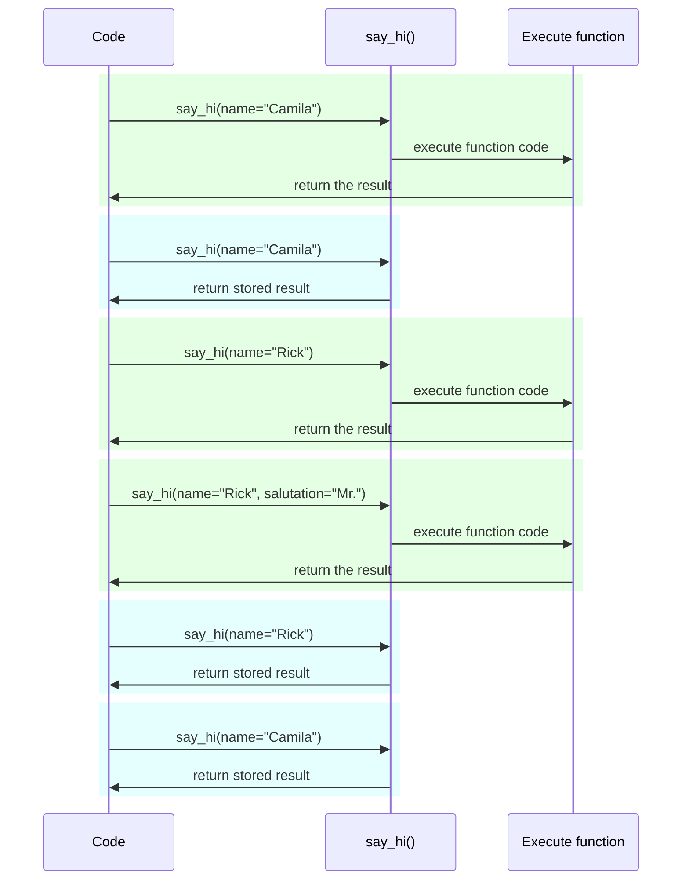

# 設定と環境変数 { #settings-and-environment-variables }

多くの場合、アプリケーションは外部の設定や構成を必要とします。たとえば、シークレットキー、データベース認証情報、メールサービスの認証情報などです。

これらの設定の多くは可変（変更されうる）で、データベースのURLのようなものがあります。また、多くはシークレットのように機微な情報です。

そのため、アプリケーションが読み取る環境変数で提供するのが一般的です。

/// tip | 豆知識

環境変数について理解するには、[環境変数](../environment-variables.md){.internal-link target=_blank}を参照してください。

///

## 型とバリデーション { #types-and-validation }

これらの環境変数は Python の外部にあり、他のプログラムやシステム全体（Linux、Windows、macOS といった異なるOSを含む）と互換性が必要なため、文字列テキストのみを扱えます。

つまり、Python で環境変数から読み取られる値はすべて `str` になり、他の型への変換やバリデーションはコードで行う必要があります。

## Pydantic の `Settings` { #pydantic-settings }

幸いなことに、Pydantic には環境変数から来る設定を扱うための優れたユーティリティがあり、<a href="https://docs.pydantic.dev/latest/concepts/pydantic_settings/" class="external-link" target="_blank">Pydantic: Settings management</a> で提供されています。

### `pydantic-settings` のインストール { #install-pydantic-settings }

まず、[仮想環境](../virtual-environments.md){.internal-link target=_blank}を作成して有効化し、`pydantic-settings` パッケージをインストールします:

<div class="termy">

```console
$ pip install pydantic-settings
---> 100%
```

</div>

また、次のように `all` エクストラをインストールすると付属します:

<div class="termy">

```console
$ pip install "fastapi[all]"
---> 100%
```

</div>

### `Settings` オブジェクトを作成 { #create-the-settings-object }

Pydantic から `BaseSettings` をインポートして、そのサブクラスを作成します。これは Pydantic モデルとほぼ同じです。

Pydantic モデルと同様に、型アノテーションと（必要なら）デフォルト値を持つクラス属性を宣言します。

`Field()` による追加バリデーションなど、Pydantic モデルで使えるのと同じバリデーション機能をすべて利用できます。

{* ../../docs_src/settings/tutorial001_py310.py hl[2,5:8,11] *}

/// tip | 豆知識

コピペ用に手早く使いたい場合は、この例ではなく、下の最後の例を使ってください。

///

その後、その `Settings` クラスのインスタンス（この例では `settings` オブジェクト）を作成すると、Pydantic は環境変数を大文字小文字を区別せずに読み取ります。つまり、大文字の `APP_NAME` という変数は、属性 `app_name` に対しても読み取られます。

次に、データが変換・バリデーションされます。したがって、`settings` オブジェクトを使うと、宣言した型のデータ（例: `items_per_user` は `int`）が得られます。

### `settings` の使用 { #use-the-settings }

次に、アプリケーションで新しい `settings` オブジェクトを使用できます:

{* ../../docs_src/settings/tutorial001_py310.py hl[18:20] *}

### サーバーを実行 { #run-the-server }

次に、設定を環境変数として渡してサーバーを実行します。たとえば、`ADMIN_EMAIL` と `APP_NAME` を次のように設定できます:

<div class="termy">

```console
$ ADMIN_EMAIL="deadpool@example.com" APP_NAME="ChimichangApp" fastapi run main.py

<span style="color: green;">INFO</span>:     Uvicorn running on http://127.0.0.1:8000 (Press CTRL+C to quit)
```

</div>

/// tip | 豆知識

1つのコマンドに複数の環境変数を設定するには、スペースで区切ってコマンドの前に並べます。

///

すると、`admin_email` の設定は `"deadpool@example.com"` に設定されます。

`app_name` は `"ChimichangApp"` になります。

`items_per_user` はデフォルト値の `50` のままです。

## 別モジュールでの設定 { #settings-in-another-module }

[大規模アプリケーション - 複数ファイル](../tutorial/bigger-applications.md){.internal-link target=_blank} で見たように、これらの設定を別のモジュールファイルに置くこともできます。

たとえば、`config.py` というファイルに次のように書けます:

{* ../../docs_src/settings/app01_py310/config.py *}

そして、`main.py` というファイルでそれを使います:

{* ../../docs_src/settings/app01_py310/main.py hl[3,11:13] *}

/// tip | 豆知識

[大規模アプリケーション - 複数ファイル](../tutorial/bigger-applications.md){.internal-link target=_blank} で見たように、`__init__.py` ファイルも必要です。

///

## 依存関係での設定 { #settings-in-a-dependency }

場合によっては、どこでも使うグローバルな `settings` オブジェクトを持つ代わりに、依存関係から設定を提供すると便利なことがあります。

これは特にテスト時に有用で、依存関係を独自のカスタム設定で簡単にオーバーライドできるからです。

### 設定ファイル { #the-config-file }

前の例から続けると、`config.py` ファイルは次のようになります:

{* ../../docs_src/settings/app02_an_py310/config.py hl[10] *}

ここでは、デフォルトのインスタンス `settings = Settings()` を作成していないことに注意してください。

### メインアプリファイル { #the-main-app-file }

ここでは、新しい `config.Settings()` を返す依存関係を作成します。

{* ../../docs_src/settings/app02_an_py310/main.py hl[6,12:13] *}

/// tip | 豆知識

`@lru_cache` については後で説明します。

今は `get_settings()` が普通の関数だと考えてください。

///

そして、*path operation 関数*から依存関係として要求し、必要な場所でどこでも使えます。

{* ../../docs_src/settings/app02_an_py310/main.py hl[17,19:21] *}

### 設定とテスト { #settings-and-testing }

次に、`get_settings` の依存関係オーバーライドを作ることで、テスト中に別の設定オブジェクトを提供するのがとても簡単になります:

{* ../../docs_src/settings/app02_an_py310/test_main.py hl[9:10,13,21] *}

依存関係オーバーライドでは、新しい `Settings` オブジェクトを作る際に `admin_email` に新しい値を設定し、その新しいオブジェクトを返します。

そして、それが使用されていることをテストできます。

## `.env` ファイルの読み込み { #reading-a-env-file }

変更が多くなりそうな設定が多数ある場合、環境ごとにファイルに入れて、環境変数としてそこから読み込むと便利なことがあります。

このプラクティスは十分に一般的で名前もあり、これらの環境変数は通常 `.env` というファイルに置かれ、そのファイルは「dotenv」と呼ばれます。

/// tip | 豆知識

ドット（`.`）で始まるファイルは、Linux や macOS のような Unix 系システムでは隠しファイルです。

ただし、dotenv ファイルは必ずしもその正確なファイル名である必要はありません。

///

Pydantic は外部ライブラリを使ってこの種のファイルからの読み込みをサポートしています。詳細は <a href="https://docs.pydantic.dev/latest/concepts/pydantic_settings/#dotenv-env-support" class="external-link" target="_blank">Pydantic Settings: Dotenv (.env) support</a> を参照してください。

/// tip | 豆知識

これを機能させるには、`pip install python-dotenv` が必要です。

///

### `.env` ファイル { #the-env-file }

次のような `.env` ファイルを用意できます:

```bash
ADMIN_EMAIL="deadpool@example.com"
APP_NAME="ChimichangApp"
```

### `.env` から設定を読む { #read-settings-from-env }

そして、`config.py` を次のように更新します:

{* ../../docs_src/settings/app03_an_py310/config.py hl[9] *}

/// tip | 豆知識

`model_config` 属性は Pydantic の設定専用です。詳しくは <a href="https://docs.pydantic.dev/latest/concepts/config/" class="external-link" target="_blank">Pydantic: Concepts: Configuration</a> を参照してください。

///

ここでは、Pydantic の `Settings` クラス内で設定 `env_file` を定義し、使用したい dotenv ファイルのファイル名を指定しています。

### `lru_cache` で `Settings` を一度だけ作成 { #creating-the-settings-only-once-with-lru-cache }

ディスクからファイルを読むのは通常コスト（遅延）が高い処理なので、1回だけ実行して同じ設定オブジェクトを再利用し、各リクエストごとに読み直さないのが望ましいです。

しかし、次のようにするたびに:

```Python
Settings()
```

新しい `Settings` オブジェクトが作成され、その作成時に `.env` ファイルが再度読み込まれます。

依存関数が次のようであれば:

```Python
def get_settings():
    return Settings()
```

各リクエストごとにそのオブジェクトを作成し、各リクエストごとに `.env` ファイルを読み込むことになります。⚠️

しかし、上に `@lru_cache` デコレータを使っているので、`Settings` オブジェクトは最初に呼び出されたときに一度だけ作成されます。✔️

{* ../../docs_src/settings/app03_an_py310/main.py hl[1,11] *}

その後のリクエスト用の依存関係で `get_settings()` が呼ばれるたびに、`get_settings()` の内部コードを実行して新しい `Settings` オブジェクトを作るのではなく、最初の呼び出しで返されたのと同じオブジェクトを何度でも返します。

#### `lru_cache` の技術詳細 { #lru-cache-technical-details }

`@lru_cache` は、毎回関数のコードを実行して再計算するのではなく、最初に返した値を返すように、修飾する関数を変更します。

したがって、その下の関数は引数の組み合わせごとに一度だけ実行されます。そして、その各引数の組み合わせで返された値は、まったく同じ引数の組み合わせで呼び出されたときに何度でも再利用されます。

たとえば、次のような関数があるとします:

```Python
@lru_cache
def say_hi(name: str, salutation: str = "Ms."):
    return f"Hello {salutation} {name}"
```

プログラムは次のように実行されます:



今回の依存関数 `get_settings()` の場合、関数は引数を一切取りません。そのため、常に同じ値を返します。

この方法は、ほとんどグローバル変数のように振る舞います。しかし、依存関数を使っているので、テストのために簡単にオーバーライドできます。

`@lru_cache` は Python 標準ライブラリの `functools` の一部です。詳細は <a href="https://docs.python.org/3/library/functools.html#functools.lru_cache" class="external-link" target="_blank">Python の `@lru_cache` ドキュメント</a>を参照してください。

## まとめ { #recap }

Pydantic Settings を使うことで、アプリケーションの設定や構成を、Pydantic モデルの力を活かして扱えます。

* 依存関係を使うことで、テストを簡素化できます。
* `.env` ファイルを利用できます。
* `@lru_cache` を使うと、各リクエストごとに dotenv ファイルを繰り返し読み込むのを避けつつ、テスト時にはオーバーライドできます。
