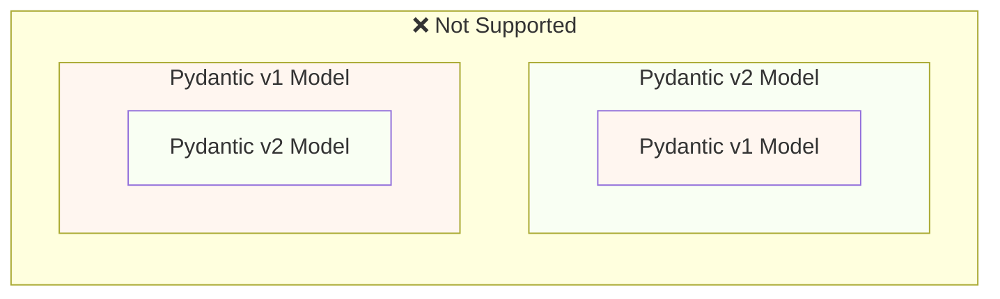
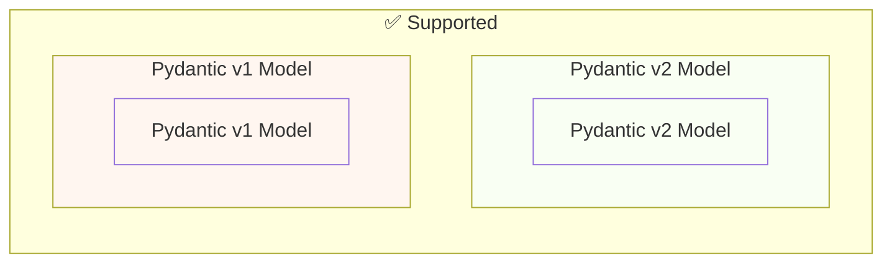

# Pydantic v1 から Pydantic v2 への移行 { #migrate-from-pydantic-v1-to-pydantic-v2 }

古い FastAPI アプリがある場合、Pydantic v1 を使っているかもしれません。

FastAPI 0.100.0 は Pydantic v1 / v2 のどちらにも対応しており、インストールされている方を使用しました。

FastAPI 0.119.0 では、Pydantic v2 内からの Pydantic v1 の部分的サポート（`pydantic.v1`）が導入され、v2 への移行が容易になりました。

FastAPI 0.126.0 で Pydantic v1 のサポートは終了しましたが、しばらくの間は `pydantic.v1` は利用可能でした。

/// warning | 注意

Pydantic チームは Python の最新バージョン、つまり **Python 3.14** から、Pydantic v1 のサポートを終了しました。

これには `pydantic.v1` も含まれ、Python 3.14 以上ではサポートされません。

Python の最新機能を使いたい場合は、Pydantic v2 を使用していることを確認する必要があります。

///

古い FastAPI アプリで Pydantic v1 を使っている場合、ここでは Pydantic v2 への移行方法と、段階的移行を助ける **FastAPI 0.119.0 の機能** を紹介します。

## 公式ガイド { #official-guide }

Pydantic には v1 から v2 への公式の <a href="https://docs.pydantic.dev/latest/migration/" class="external-link" target="_blank">移行ガイド</a> があります。

変更点、検証がより正確で厳密になった点、注意事項などが含まれます。

何が変わったかをよりよく理解するために参照してください。

## テスト { #tests }

アプリに対する[テスト](../tutorial/testing.md){.internal-link target=_blank}を用意し、継続的インテグレーション（CI）で実行するようにしてください。

これにより、アップグレード後も期待どおり動作していることを確認できます。

## `bump-pydantic` { #bump-pydantic }

多くの場合、カスタマイズのない通常の Pydantic モデルを使っていれば、v1 から v2 への移行作業の大半を自動化できます。

同じ Pydantic チームが提供する <a href="https://github.com/pydantic/bump-pydantic" class="external-link" target="_blank">`bump-pydantic`</a> を使用できます。

このツールは必要なコード変更のほとんどを自動で行います。

その後テストを実行し、問題なければ完了です。😎

## v2 における Pydantic v1 { #pydantic-v1-in-v2 }

Pydantic v2 には、Pydantic v1 がサブモジュール `pydantic.v1` として同梱されています。ただし、これは Python 3.13 を超えるバージョンではサポートされません。

つまり、Pydantic v2 の最新バージョンをインストールし、このサブモジュールから旧 Pydantic v1 のコンポーネントをインポートして、あたかも v1 をインストールしているかのように使用できます。

{* ../../docs_src/pydantic_v1_in_v2/tutorial001_an_py310.py hl[1,4] *}

### v2 内の Pydantic v1 に対する FastAPI のサポート { #fastapi-support-for-pydantic-v1-in-v2 }

FastAPI 0.119.0 以降では、移行を容易にするため、Pydantic v2 内の Pydantic v1 に対する部分的サポートもあります。

そのため、Pydantic を v2 の最新に上げ、インポートを `pydantic.v1` サブモジュールに切り替えるだけで、多くの場合そのまま動作します。

{* ../../docs_src/pydantic_v1_in_v2/tutorial002_an_py310.py hl[2,5,15] *}

/// warning | 注意

前述のとおり、Python の最近のバージョン（Python 3.14 以降）では Pydantic v1 がサポートされないため、`pydantic.v1` の使用も Python 3.14 以上ではサポートされません。

///

### 同一アプリでの Pydantic v1 と v2 { #pydantic-v1-and-v2-on-the-same-app }

Pydantic v2 のモデルのフィールドに Pydantic v1 のモデルを（またはその逆を）埋め込むことは、Pydantic では「サポートされていません」。

...but, you can have separated models using Pydantic v1 and v2 in the same app.

場合によっては、同じ FastAPI の path operation 内で、Pydantic v1 と v2 の両方のモデルを扱うことも可能です:

{* ../../docs_src/pydantic_v1_in_v2/tutorial003_an_py310.py hl[2:3,6,12,21:22] *}

上の例では、入力モデルは Pydantic v1、出力モデル（`response_model=ItemV2` で定義）は Pydantic v2 です。

### Pydantic v1 のパラメータ { #pydantic-v1-parameters }

Pydantic v1 のモデルで `Body`、`Query`、`Form` などの FastAPI 固有のパラメータユーティリティを使う必要がある場合、v2 への移行が完了するまでの間は `fastapi.temp_pydantic_v1_params` からインポートできます:

{* ../../docs_src/pydantic_v1_in_v2/tutorial004_an_py310.py hl[4,18] *}

### 段階的に移行 { #migrate-in-steps }

/// tip | 豆知識

まずは `bump-pydantic` を試してください。テストが通り、問題なければコマンド一発で完了です。✨

///

`bump-pydantic` が適用できない場合は、同一アプリで v1 と v2 のモデルを併用できるサポートを利用して、徐々に v2 へ移行できます。

まず Pydantic を v2 の最新にアップグレードし、すべてのモデルのインポートを `pydantic.v1` に切り替えます。

その後、モデルをグループごとに少しずつ Pydantic v1 から v2 へ移行していきます。🚶
