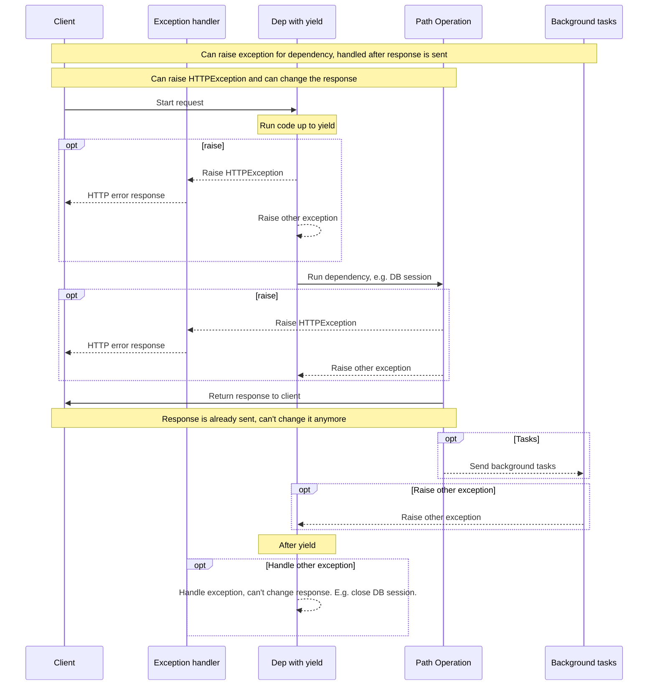

# yieldを持つ依存関係

FastAPIは、いくつかの<abbr title='時々"exit"、"cleanup"、"teardown"、"close"、"context managers"、 ...のように呼ばれる'>終了後の追加のステップ</abbr>を行う依存関係をサポートしています。

これを行うには、`return`の代わりに`yield`を使い、その後に追加のステップを書きます。

/// tip | 豆知識

`yield`は必ず一度だけ使用するようにしてください。

///

/// info | 情報

これを動作させるには、**Python 3.7** 以上を使用するか、**Python 3.6** では"backports"をインストールする必要があります:

```
pip install async-exit-stack async-generator
```

これにより<a href="https://github.com/sorcio/async_exit_stack" class="external-link" target="_blank">async-exit-stack</a>と<a href="https://github.com/python-trio/async_generator" class="external-link" target="_blank">async-generator</a>がインストールされます。

///

/// note | 技術詳細

以下と一緒に使用できる関数なら何でも有効です:

* <a href="https://docs.python.org/3/library/contextlib.html#contextlib.contextmanager" class="external-link" target="_blank">`@contextlib.contextmanager`</a>または
* <a href="https://docs.python.org/3/library/contextlib.html#contextlib.asynccontextmanager" class="external-link" target="_blank">`@contextlib.asynccontextmanager`</a>

これらは **FastAPI** の依存関係として使用するのに有効です。

実際、FastAPIは内部的にこれら２つのデコレータを使用しています。

///

## `yield`を持つデータベースの依存関係

例えば、これを使ってデータベースセッションを作成し、終了後にそれを閉じることができます。

レスポンスを送信する前に`yield`文を含む前のコードのみが実行されます。

{* ../../docs_src/dependencies/tutorial007.py hl[2,3,4] *}

生成された値は、*path operations*や他の依存関係に注入されるものです:

{* ../../docs_src/dependencies/tutorial007.py hl[4] *}

`yield`文に続くコードは、レスポンスが送信された後に実行されます:

{* ../../docs_src/dependencies/tutorial007.py hl[5,6] *}

/// tip | 豆知識

`async`や通常の関数を使用することができます。

**FastAPI** は、通常の依存関係と同じように、それぞれで正しいことを行います。

///

## `yield`と`try`を持つ依存関係

`yield`を持つ依存関係で`try`ブロックを使用した場合、その依存関係を使用した際に発生した例外を受け取ることになります。

例えば、途中のどこかの時点で、別の依存関係や*path operation*の中で、データベーストランザクションを「ロールバック」したり、その他のエラーを作成したりするコードがあった場合、依存関係の中で例外を受け取ることになります。

そのため、依存関係の中にある特定の例外を`except SomeException`で探すことができます。

同様に、`finally`を用いて例外があったかどうかにかかわらず、終了ステップを確実に実行することができます。

{* ../../docs_src/dependencies/tutorial007.py hl[3,5] *}

## `yield`を持つサブ依存関係

任意の大きさや形のサブ依存関係やサブ依存関係の「ツリー」を持つことができ、その中で`yield`を使用することができます。

**FastAPI** は、`yield`を持つ各依存関係の「終了コード」が正しい順番で実行されていることを確認します。

例えば、`dependency_c`は`dependency_b`と`dependency_b`に依存する`dependency_a`に、依存することができます:

{* ../../docs_src/dependencies/tutorial008.py hl[4,12,20] *}

そして、それらはすべて`yield`を使用することができます。

この場合、`dependency_c`は終了コードを実行するために、`dependency_b`（ここでは`dep_b`という名前）の値がまだ利用可能である必要があります。

そして、`dependency_b`は`dependency_a`（ここでは`dep_a`という名前）の値を終了コードで利用できるようにする必要があります。

{* ../../docs_src/dependencies/tutorial008.py hl[16,17,24,25] *}

同様に、`yield`と`return`が混在した依存関係を持つこともできます。

また、単一の依存関係を持っていて、`yield`などの他の依存関係をいくつか必要とすることもできます。

依存関係の組み合わせは自由です。

**FastAPI** は、全てが正しい順序で実行されていることを確認します。

/// note | 技術詳細

これはPythonの<a href="https://docs.python.org/3/library/contextlib.html" class="external-link" target="_blank">Context Managers</a>のおかげで動作します。

**FastAPI** はこれを実現するために内部的に使用しています。

///

## `yield`と`HTTPException`を持つ依存関係

`yield`と例外をキャッチする`try`ブロックを持つことができる依存関係を使用することができることがわかりました。

`yield`の後の終了コードで`HTTPException`などを発生させたくなるかもしれません。しかし**それはうまくいきません**

`yield`を持つ依存関係の終了コードは[例外ハンドラ](../handling-errors.md#_4){.internal-link target=_blank}の*後に*実行されます。依存関係によって投げられた例外を終了コード（`yield`の後）でキャッチするものはなにもありません。

つまり、`yield`の後に`HTTPException`を発生させた場合、`HTTTPException`をキャッチしてHTTP 400のレスポンスを返すデフォルトの（あるいは任意のカスタムの）例外ハンドラは、その例外をキャッチすることができなくなります。

これは、依存関係に設定されているもの（例えば、DBセッション）を、例えば、バックグラウンドタスクで使用できるようにするものです。

バックグラウンドタスクはレスポンスが送信された*後*に実行されます。そのため、*すでに送信されている*レスポンスを変更する方法すらないので、`HTTPException`を発生させる方法はありません。

しかし、バックグラウンドタスクがDBエラーを発生させた場合、少なくとも`yield`で依存関係のセッションをロールバックしたり、きれいに閉じたりすることができ、エラーをログに記録したり、リモートのトラッキングシステムに報告したりすることができます。

例外が発生する可能性があるコードがある場合は、最も普通の「Python流」なことをして、コードのその部分に`try`ブロックを追加してください。

レスポンスを返したり、レスポンスを変更したり、`HTTPException`を発生させたりする*前に*処理したいカスタム例外がある場合は、[カスタム例外ハンドラ](../handling-errors.md#_4){.internal-link target=_blank}を作成してください。

/// tip | 豆知識

`HTTPException`を含む例外は、`yield`の*前*でも発生させることができます。ただし、後ではできません。

///

実行の順序は多かれ少なかれ以下の図のようになります。時間は上から下へと流れていきます。そして、各列はコードを相互作用させたり、実行したりしている部分の一つです。



/// info | 情報

**１つのレスポンス** だけがクライアントに送信されます。それはエラーレスポンスの一つかもしれませんし、*path operation*からのレスポンスかもしれません。

いずれかのレスポンスが送信された後、他のレスポンスを送信することはできません。

///

/// tip | 豆知識

この図は`HTTPException`を示していますが、[カスタム例外ハンドラ](../handling-errors.md#_4){.internal-link target=_blank}を作成することで、他の例外を発生させることもできます。そして、その例外は依存関係の終了コードではなく、そのカスタム例外ハンドラによって処理されます。

しかし例外ハンドラで処理されない例外を発生させた場合は、依存関係の終了コードで処理されます。

///

## コンテキストマネージャ

### 「コンテキストマネージャ」とは

「コンテキストマネージャ」とは、`with`文の中で使用できるPythonオブジェクトのことです。

例えば、<a href="https://docs.python.org/3/tutorial/inputoutput.html#reading-and-writing-files" class="external-link" target="_blank">ファイルを読み込むには`with`を使用することができます</a>:

```Python
with open("./somefile.txt") as f:
    contents = f.read()
    print(contents)
```

その後の`open("./somefile.txt")`は「コンテキストマネージャ」と呼ばれるオブジェクトを作成します。

`with`ブロックが終了すると、例外があったとしてもファイルを確かに閉じます。

`yield`を依存関係を作成すると、**FastAPI** は内部的にそれをコンテキストマネージャに変換し、他の関連ツールと組み合わせます。

### `yield`を持つ依存関係でのコンテキストマネージャの使用

/// warning | 注意

これは多かれ少なかれ、「高度な」発想です。

**FastAPI** を使い始めたばかりの方は、とりあえずスキップした方がよいかもしれません。

///

Pythonでは、<a href="https://docs.python.org/3/reference/datamodel.html#context-managers" class="external-link" target="_blank">以下の２つのメソッドを持つクラスを作成する: `__enter__()`と`__exit__()`</a>ことでコンテキストマネージャを作成することができます。

また、依存関数の中で`with`や`async with`文を使用することによって`yield`を持つ **FastAPI** の依存関係の中でそれらを使用することができます:

{* ../../docs_src/dependencies/tutorial010.py hl[1,2,3,4,5,6,7,8,9,13] *}

/// tip | 豆知識

コンテキストマネージャを作成するもう一つの方法はwithです:

* <a href="https://docs.python.org/3/library/contextlib.html#contextlib.contextmanager" class="external-link" target="_blank">`@contextlib.contextmanager`</a> または
* <a href="https://docs.python.org/3/library/contextlib.html#contextlib.asynccontextmanager" class="external-link" target="_blank">`@contextlib.asynccontextmanager`</a>

これらを使って、関数を単一の`yield`でデコレートすることができます。

これは **FastAPI** が内部的に`yield`を持つ依存関係のために使用しているものです。

しかし、FastAPIの依存関係にデコレータを使う必要はありません（そして使うべきではありません）。

FastAPIが内部的にやってくれます。

///
