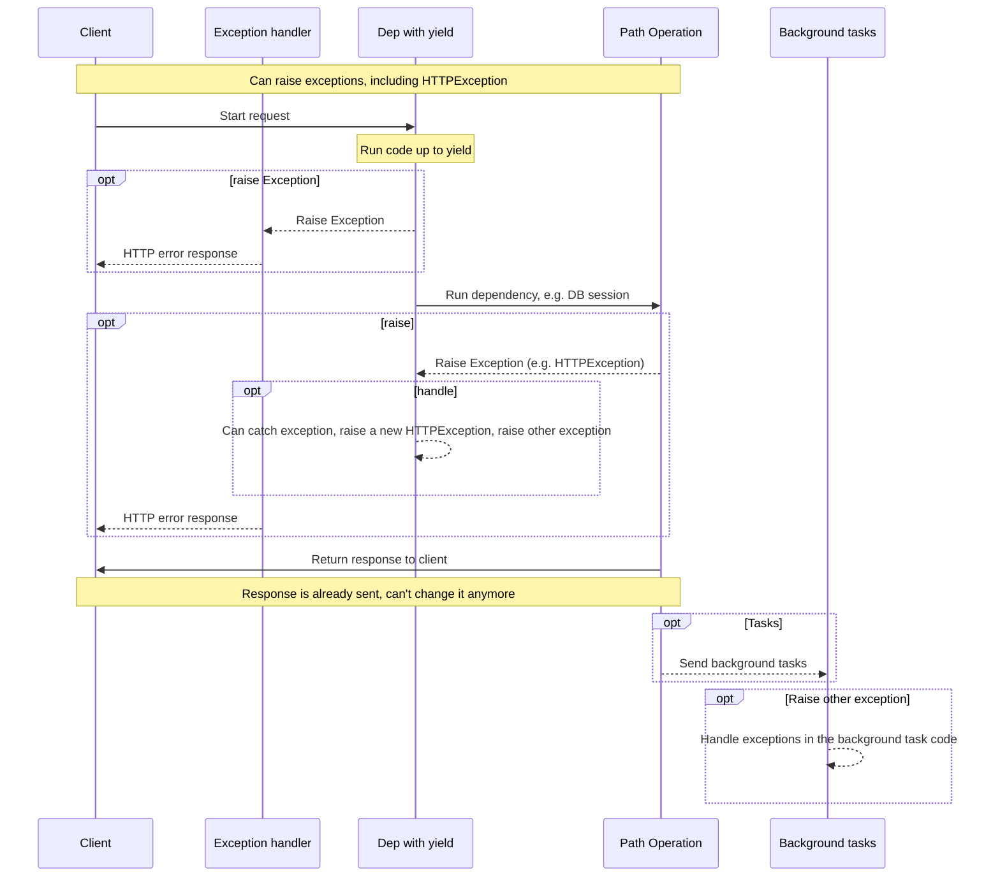
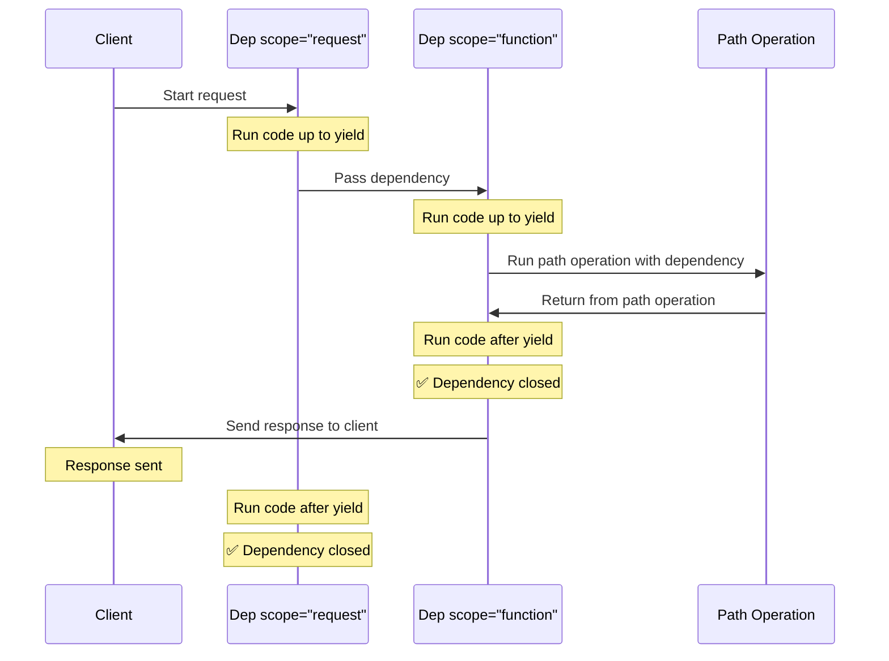

# `yield`を持つ依存関係 { #dependencies-with-yield }

FastAPIは、いくつかの<dfn title="「終了コード」「クリーンアップコード」「ティアダウンコード」「クローズコード」「コンテキストマネージャの終了コード」などと呼ばれることもあります">終了後の追加のステップ</dfn>を行う依存関係をサポートしています。

これを行うには、`return`の代わりに`yield`を使い、その後に追加のステップ（コード）を書きます。

/// tip | 豆知識

`yield`は必ず依存関係ごとに1回だけ使用するようにしてください。

///

/// note | 技術詳細

以下と一緒に使用できる関数なら何でも有効です:

* <a href="https://docs.python.org/3/library/contextlib.html#contextlib.contextmanager" class="external-link" target="_blank">`@contextlib.contextmanager`</a>または
* <a href="https://docs.python.org/3/library/contextlib.html#contextlib.asynccontextmanager" class="external-link" target="_blank">`@contextlib.asynccontextmanager`</a>

これらは **FastAPI** の依存関係として使用するのに有効です。

実際、FastAPIは内部的にこれら２つのデコレータを使用しています。

///

## `yield`を持つデータベースの依存関係 { #a-database-dependency-with-yield }

例えば、これを使ってデータベースセッションを作成し、終了後にそれを閉じることができます。

レスポンスを作成する前に、`yield`文より前のコード（および`yield`文を含む）が実行されます:

{* ../../docs_src/dependencies/tutorial007_py310.py hl[2:4] *}

生成された値は、*path operations*や他の依存関係に注入されるものです:

{* ../../docs_src/dependencies/tutorial007_py310.py hl[4] *}

`yield`文に続くコードは、レスポンスの後に実行されます:

{* ../../docs_src/dependencies/tutorial007_py310.py hl[5:6] *}

/// tip | 豆知識

`async`や通常の関数を使用することができます。

**FastAPI** は、通常の依存関係と同じように、それぞれで正しいことを行います。

///

## `yield`と`try`を持つ依存関係 { #a-dependency-with-yield-and-try }

`yield`を持つ依存関係で`try`ブロックを使用した場合、その依存関係を使用した際にスローされたあらゆる例外を受け取ることになります。

例えば、途中のどこかの時点で、別の依存関係や*path operation*の中で、データベーストランザクションを「ロールバック」したり、その他の例外を作成したりするコードがあった場合、依存関係の中で例外を受け取ることになります。

そのため、依存関係の中にある特定の例外を`except SomeException`で探すことができます。

同様に、`finally`を用いて例外があったかどうかにかかわらず、終了ステップを確実に実行することができます。

{* ../../docs_src/dependencies/tutorial007_py310.py hl[3,5] *}

## `yield`を持つサブ依存関係 { #sub-dependencies-with-yield }

任意の大きさや形のサブ依存関係やサブ依存関係の「ツリー」を持つことができ、その中で`yield`を使用することができます。

**FastAPI** は、`yield`を持つ各依存関係の「終了コード」が正しい順番で実行されていることを確認します。

例えば、`dependency_c`は`dependency_b`に、そして`dependency_b`は`dependency_a`に依存することができます:

{* ../../docs_src/dependencies/tutorial008_an_py310.py hl[6,14,22] *}

そして、それらはすべて`yield`を使用することができます。

この場合、`dependency_c`は終了コードを実行するために、`dependency_b`（ここでは`dep_b`という名前）の値がまだ利用可能である必要があります。

そして、`dependency_b`は`dependency_a`（ここでは`dep_a`という名前）の値を終了コードで利用できるようにする必要があります。

{* ../../docs_src/dependencies/tutorial008_an_py310.py hl[18:19,26:27] *}

同様に、`yield`を持つ依存関係と`return`を持つ他の依存関係をいくつか持ち、それらの一部が他の一部に依存するようにもできます。

また、単一の依存関係を持っていて、`yield`を持つ他の依存関係をいくつか必要とすることもできます。

依存関係の組み合わせは自由です。

**FastAPI** は、全てが正しい順序で実行されていることを確認します。

/// note | 技術詳細

これはPythonの<a href="https://docs.python.org/3/library/contextlib.html" class="external-link" target="_blank">Context Managers</a>のおかげで動作します。

**FastAPI** はこれを実現するために内部的に使用しています。

///

## `yield`と`HTTPException`を持つ依存関係 { #dependencies-with-yield-and-httpexception }

`yield`を持つ依存関係を使い、何らかのコードを実行し、その後に`finally`の後で終了コードを実行しようとする`try`ブロックを持てることが分かりました。

また、`except`を使って発生した例外をキャッチし、それに対して何かをすることもできます。

例えば、`HTTPException`のように別の例外を発生させることができます。

/// tip | 豆知識

これはやや高度なテクニックで、ほとんどの場合は本当に必要にはなりません。例えば、*path operation 関数*など、アプリケーションコードの他の場所から（`HTTPException`を含む）例外を発生させられるためです。

ただし必要であれば使えます。 🤓

///

{* ../../docs_src/dependencies/tutorial008b_an_py310.py hl[18:22,31] *}

例外をキャッチして、それに基づいてカスタムレスポンスを作成したい場合は、[カスタム例外ハンドラ](../handling-errors.md#install-custom-exception-handlers){.internal-link target=_blank}を作成してください。

## `yield`と`except`を持つ依存関係 { #dependencies-with-yield-and-except }

`yield`を持つ依存関係で`except`を使って例外をキャッチし、それを再度raiseしない（または新しい例外をraiseしない）場合、通常のPythonと同じように、FastAPIは例外があったことに気づけません:

{* ../../docs_src/dependencies/tutorial008c_an_py310.py hl[15:16] *}

この場合、（`HTTPException`やそれに類するものをraiseしていないため）クライアントには適切に*HTTP 500 Internal Server Error*レスポンスが返りますが、サーバーには**ログが一切残らず**、何がエラーだったのかを示す他の手がかりもありません。 😱

### `yield`と`except`を持つ依存関係では常に`raise`する { #always-raise-in-dependencies-with-yield-and-except }

`yield`を持つ依存関係で例外をキャッチした場合、別の`HTTPException`などをraiseするのでない限り、**元の例外を再raiseすべきです**。

`raise`を使うと同じ例外を再raiseできます:

{* ../../docs_src/dependencies/tutorial008d_an_py310.py hl[17] *}

これでクライアントは同じ*HTTP 500 Internal Server Error*レスポンスを受け取りますが、サーバーのログにはカスタムの`InternalError`が残ります。 😎

## `yield`を持つ依存関係の実行 { #execution-of-dependencies-with-yield }

実行の順序は多かれ少なかれ以下の図のようになります。時間は上から下へと流れていきます。そして、各列はコードを相互作用させたり、実行したりしている部分の一つです。



/// info | 情報

**１つのレスポンス** だけがクライアントに送信されます。それはエラーレスポンスの一つかもしれませんし、*path operation*からのレスポンスかもしれません。

いずれかのレスポンスが送信された後、他のレスポンスを送信することはできません。

///

/// tip | 豆知識

*path operation 関数*のコードで例外をraiseした場合、`HTTPException`を含め、それはyieldを持つ依存関係に渡されます。ほとんどの場合、その例外が正しく処理されるように、`yield`を持つ依存関係から同じ例外、または新しい例外を再raiseしたくなるでしょう。

///

## 早期終了と`scope` { #early-exit-and-scope }

通常、`yield`を持つ依存関係の終了コードは、クライアントに**レスポンスが送信された後**に実行されます。

しかし、*path operation 関数*からreturnした後に依存関係を使う必要がないと分かっている場合は、`Depends(scope="function")`を使って、**レスポンスが送信される前**に、*path operation 関数*のreturn後に依存関係を閉じるべきだとFastAPIに伝えられます。

{* ../../docs_src/dependencies/tutorial008e_an_py310.py hl[12,16] *}

`Depends()`は、以下のいずれかを取る`scope`パラメータを受け取ります:

* `"function"`: リクエストを処理する*path operation 関数*の前に依存関係を開始し、*path operation 関数*の終了後に依存関係を終了しますが、クライアントにレスポンスが返される**前**に終了します。つまり、依存関係関数は*path operation 関数*の**周囲**で実行されます。
* `"request"`: リクエストを処理する*path operation 関数*の前に依存関係を開始し（`"function"`を使用する場合と同様）、クライアントにレスポンスが返された**後**に終了します。つまり、依存関係関数は**リクエスト**とレスポンスのサイクルの**周囲**で実行されます。

指定されておらず、依存関係に`yield`がある場合、デフォルトで`scope`は`"request"`になります。

### サブ依存関係の`scope` { #scope-for-sub-dependencies }

`scope="request"`（デフォルト）を持つ依存関係を宣言する場合、どのサブ依存関係も`"request"`の`scope`を持つ必要があります。

しかし、`"function"`の`scope`を持つ依存関係は、`"function"`と`"request"`の`scope`を持つ依存関係を持てます。

これは、いずれの依存関係も、サブ依存関係より前に終了コードを実行できる必要があるためです（終了コードの実行中にサブ依存関係をまだ使う必要がある可能性があるためです）。



## `yield`、`HTTPException`、`except`、バックグラウンドタスクを持つ依存関係 { #dependencies-with-yield-httpexception-except-and-background-tasks }

`yield`を持つ依存関係は、さまざまなユースケースをカバーし、いくつかの問題を修正するために、時間とともに進化してきました。

FastAPIの異なるバージョンで何が変わったのかを知りたい場合は、上級ガイドの[上級の依存関係 - `yield`、`HTTPException`、`except`、バックグラウンドタスクを持つ依存関係](../../advanced/advanced-dependencies.md#dependencies-with-yield-httpexception-except-and-background-tasks){.internal-link target=_blank}で詳しく読めます。
## コンテキストマネージャ { #context-managers }

### 「コンテキストマネージャ」とは { #what-are-context-managers }

「コンテキストマネージャ」とは、`with`文の中で使用できるPythonオブジェクトのことです。

例えば、<a href="https://docs.python.org/3/tutorial/inputoutput.html#reading-and-writing-files" class="external-link" target="_blank">ファイルを読み込むには`with`を使用することができます</a>:

```Python
with open("./somefile.txt") as f:
    contents = f.read()
    print(contents)
```

その後の`open("./somefile.txt")`は「コンテキストマネージャ」と呼ばれるオブジェクトを作成します。

`with`ブロックが終了すると、例外があったとしてもファイルを確かに閉じます。

`yield`を持つ依存関係を作成すると、**FastAPI** は内部的にそれをコンテキストマネージャに変換し、他の関連ツールと組み合わせます。

### `yield`を持つ依存関係でのコンテキストマネージャの使用 { #using-context-managers-in-dependencies-with-yield }

/// warning | 注意

これは多かれ少なかれ、「高度な」発想です。

**FastAPI** を使い始めたばかりの方は、とりあえずスキップした方がよいかもしれません。

///

Pythonでは、<a href="https://docs.python.org/3/reference/datamodel.html#context-managers" class="external-link" target="_blank">以下の２つのメソッドを持つクラスを作成する: `__enter__()`と`__exit__()`</a>ことでコンテキストマネージャを作成することができます。

また、依存関数の中で`with`や`async with`文を使用することによって`yield`を持つ **FastAPI** の依存関係の中でそれらを使用することができます:

{* ../../docs_src/dependencies/tutorial010_py310.py hl[1:9,13] *}

/// tip | 豆知識

コンテキストマネージャを作成するもう一つの方法はwithです:

* <a href="https://docs.python.org/3/library/contextlib.html#contextlib.contextmanager" class="external-link" target="_blank">`@contextlib.contextmanager`</a> または
* <a href="https://docs.python.org/3/library/contextlib.html#contextlib.asynccontextmanager" class="external-link" target="_blank">`@contextlib.asynccontextmanager`</a>

これらを使って、関数を単一の`yield`でデコレートすることができます。

これは **FastAPI** が内部的に`yield`を持つ依存関係のために使用しているものです。

しかし、FastAPIの依存関係にデコレータを使う必要はありません（そして使うべきではありません）。

FastAPIが内部的にやってくれます。

///
