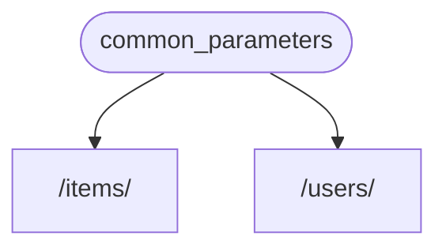
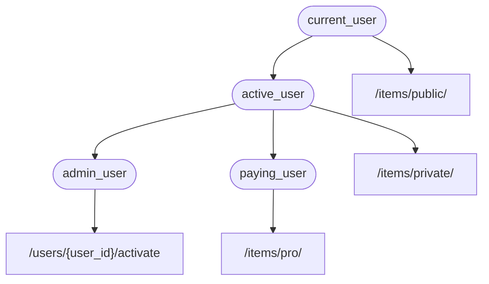

# 依存関係 - 最初のステップ

** FastAPI** は非常に強力でありながら直感的な **<abbr title="コンポーネント、リソース、プロバイダ、サービス、インジェクタブルとしても知られている">依存性注入</abbr>** システムを持っています。

それは非常にシンプルに使用できるように設計されており、開発者が他のコンポーネント **FastAPI** と統合するのが非常に簡単になるように設計されています。

## 「依存性注入」とは

**「依存性注入」** とは、プログラミングにおいて、コード（この場合は、*path operation関数*）が動作したり使用したりするために必要なもの（「依存関係」）を宣言する方法があることを意味します:

そして、そのシステム（この場合は、**FastAPI**）は、必要な依存関係をコードに提供するために必要なことは何でも行います（依存関係を「注入」します）。

これは以下のようなことが必要な時にとても便利です:

* ロジックを共有している。（同じコードロジックを何度も繰り返している）。
* データベース接続を共有する。
* セキュリティ、認証、ロール要件などを強制する。
* そのほかにも多くのこと...

これらすべてを、コードの繰り返しを最小限に抑えながら行います。

## 最初のステップ

非常にシンプルな例を見てみましょう。あまりにもシンプルなので、今のところはあまり参考にならないでしょう。

しかし、この方法では **依存性注入** システムがどのように機能するかに焦点を当てることができます。

### 依存関係の作成

まずは依存関係に注目してみましょう。

以下のように、*path operation関数*と同じパラメータを全て取ることができる関数にすぎません:

{* ../../docs_src/dependencies/tutorial001.py hl[8,9] *}

これだけです。

**２行**。

そして、それはすべての*path operation関数*が持っているのと同じ形と構造を持っています。

「デコレータ」を含まない（`@app.get("/some-path")`を含まない）*path operation関数*と考えることもできます。

そして何でも返すことができます。

この場合、この依存関係は以下を期待しています:

* オプショナルのクエリパラメータ`q`は`str`です。
* オプショナルのクエリパラメータ`skip`は`int`で、デフォルトは`0`です。
* オプショナルのクエリパラメータ`limit`は`int`で、デフォルトは`100`です。

そして、これらの値を含む`dict`を返します。

### `Depends`のインポート

{* ../../docs_src/dependencies/tutorial001.py hl[3] *}

### "dependant"での依存関係の宣言

*path operation関数*のパラメータに`Body`や`Query`などを使用するのと同じように、新しいパラメータに`Depends`を使用することができます:

{* ../../docs_src/dependencies/tutorial001.py hl[13,18] *}

関数のパラメータに`Depends`を使用するのは`Body`や`Query`などと同じですが、`Depends`の動作は少し異なります。

`Depends`は１つのパラメータしか与えられません。

このパラメータは関数のようなものである必要があります。

そして、その関数は、*path operation関数*が行うのと同じ方法でパラメータを取ります。

/// tip | 豆知識

次の章では、関数以外の「もの」が依存関係として使用できるものを見ていきます。

///

新しいリクエストが到着するたびに、**FastAPI** が以下のような処理を行います:

* 依存関係（"dependable"）関数を正しいパラメータで呼び出します。
* 関数の結果を取得します。
* *path operation関数*のパラメータにその結果を代入してください。

この方法では、共有されるコードを一度書き、**FastAPI** が*path operations*のための呼び出しを行います。

/// check | 確認

特別なクラスを作成してどこかで **FastAPI** に渡して「登録」する必要はないことに注意してください。

`Depends`を渡すだけで、**FastAPI** が残りの処理をしてくれます。

///

## `async`にするかどうか

依存関係は **FastAPI**（*path operation関数*と同じ）からも呼び出されるため、関数を定義する際にも同じルールが適用されます。

`async def`や通常の`def`を使用することができます。

また、通常の`def`*path operation関数*の中に`async def`を入れて依存関係を宣言したり、`async def`*path operation関数*の中に`def`を入れて依存関係を宣言したりすることなどができます。

それは重要ではありません。**FastAPI** は何をすべきかを知っています。

/// note | 備考

わからない場合は、ドキュメントの[Async: *"In a hurry?"*](../../async.md){.internal-link target=_blank}の中の`async`と`await`についてのセクションを確認してください。

///

## OpenAPIとの統合

依存関係（およびサブ依存関係）のすべてのリクエスト宣言、検証、および要件は、同じOpenAPIスキーマに統合されます。

つまり、対話型ドキュメントにはこれらの依存関係から得られる全ての情報も含まれているということです:

## 簡単な使い方

見てみると、*path*と*operation*が一致した時に*path operation関数*が宣言されていて、**FastAPI** が正しいパラメータで関数を呼び出してリクエストからデータを抽出する処理をしています。

実は、すべての（あるいはほとんどの）Webフレームワークは、このように動作します。

これらの関数を直接呼び出すことはありません。これらの関数はフレームワーク（この場合は、**FastAPI**）によって呼び出されます。

依存性注入システムでは、**FastAPI** に*path operation*もまた、*path operation関数*の前に実行されるべき他の何かに「依存」していることを伝えることができ、**FastAPI** がそれを実行し、結果を「注入」することを引き受けます。

他にも、「依存性注入」と同じような考えの一般的な用語があります:

* リソース
* プロバイダ
* サービス
* インジェクタブル
* コンポーネント

## **FastAPI** プラグイン

統合や「プラグイン」は **依存性注入** システムを使って構築することができます。しかし、実際には、**「プラグイン」を作成する必要はありません**。依存関係を使用することで、無限の数の統合やインタラクションを宣言することができ、それが**path operation関数*で利用可能になるからです。

依存関係は非常にシンプルで直感的な方法で作成することができ、必要なPythonパッケージをインポートするだけで、*文字通り*数行のコードでAPI関数と統合することができます。

次の章では、リレーショナルデータベースやNoSQLデータベース、セキュリティなどについて、その例を見ていきます。

## **FastAPI** 互換性

依存性注入システムがシンプルなので、**FastAPI** は以下のようなものと互換性があります:

* すべてのリレーショナルデータベース
* NoSQLデータベース
* 外部パッケージ
* 外部API
* 認証・認可システム
* API利用状況監視システム
* レスポンスデータ注入システム
* など。

## シンプルでパワフル

階層依存性注入システムは、定義や使用方法が非常にシンプルであるにもかかわらず、非常に強力なものとなっています。

依存関係事態を定義する依存関係を定義することができます。

最終的には、依存関係の階層ツリーが構築され、**依存性注入**システムが、これらの依存関係（およびそのサブ依存関係）をすべて解決し、各ステップで結果を提供（注入）します。

例えば、４つのAPIエンドポイント（*path operations*）があるとします:

* `/items/public/`
* `/items/private/`
* `/users/{user_id}/activate`
* `/items/pro/`

そして、依存関係とサブ依存関係だけで、それぞれに異なるパーミッション要件を追加することができます:

## **OpenAPI** との統合

これら全ての依存関係は、要件を宣言すると同時に、*path operations*にパラメータやバリデーションを追加します。

**FastAPI** はそれをすべてOpenAPIスキーマに追加して、対話型のドキュメントシステムに表示されるようにします。
