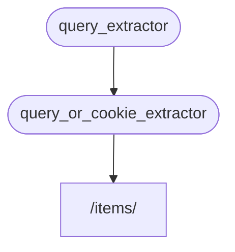

# サブ依存関係 { #sub-dependencies }

**サブ依存関係** を持つ依存関係を作成することができます。

それらは必要なだけ **深く** することができます。

**FastAPI** はそれらを解決してくれます。

## 最初の依存関係「依存可能なもの」 { #first-dependency-dependable }

以下のような最初の依存関係（「依存可能なもの」）を作成することができます:

{* ../../docs_src/dependencies/tutorial005_an_py310.py hl[8:9] *}

これはオプショナルのクエリパラメータ`q`を`str`として宣言し、それを返すだけです。

これは非常にシンプルです（あまり便利ではありません）が、サブ依存関係がどのように機能するかに焦点を当てるのに役立ちます。

## 第二の依存関係 「依存可能なもの」と「依存」 { #second-dependency-dependable-and-dependant }

そして、別の依存関数（「依存可能なもの」）を作成して、同時にそれ自身の依存関係を宣言することができます（つまりそれ自身も「依存」です）:

{* ../../docs_src/dependencies/tutorial005_an_py310.py hl[13] *}

宣言されたパラメータに注目してみましょう:

* この関数は依存関係（「依存可能なもの」）そのものであるにもかかわらず、別の依存関係を宣言しています（何か他のものに「依存」しています）。
    * これは`query_extractor`に依存しており、それが返す値をパラメータ`q`に代入します。
* また、オプショナルの`last_query`クッキーを`str`として宣言します。
    * ユーザーがクエリ`q`を提供しなかった場合、クッキーに保存していた最後に使用したクエリを使用します。

## 依存関係の使用 { #use-the-dependency }

以下のように依存関係を使用することができます:

{* ../../docs_src/dependencies/tutorial005_an_py310.py hl[23] *}

/// info | 情報

*path operation 関数*の中で宣言している依存関係は`query_or_cookie_extractor`の1つだけであることに注意してください。

しかし、**FastAPI** は`query_extractor`を最初に解決し、その結果を`query_or_cookie_extractor`を呼び出す時に渡す必要があることを知っています。

///



## 同じ依存関係の複数回の使用 { #using-the-same-dependency-multiple-times }

依存関係の1つが同じ*path operation*に対して複数回宣言されている場合、例えば、複数の依存関係が共通のサブ依存関係を持っている場合、**FastAPI** はリクエストごとに1回だけそのサブ依存関係を呼び出します。

そして、返された値を<dfn title="計算/生成された値を保存し、再計算する代わりに再利用するためのユーティリティ/システム">「キャッシュ」</dfn>に保存し、同じリクエストに対して依存関係を何度も呼び出す代わりに、その特定のリクエストでそれを必要とする全ての「依存」に渡すことになります。

高度なシナリオでは、「キャッシュされた」値を使うのではなく、同じリクエストの各ステップ（おそらく複数回）で依存関係を呼び出す必要があることがわかっている場合、`Depends`を使用する際に、`use_cache=False`というパラメータを設定することができます:

//// tab | Python 3.10+

```Python hl_lines="1"
async def needy_dependency(fresh_value: Annotated[str, Depends(get_value, use_cache=False)]):
    return {"fresh_value": fresh_value}
```

////

//// tab | Python 3.10+ 非Annotated

/// tip | 豆知識

可能であれば`Annotated`版を使うことを推奨します。

///

```Python hl_lines="1"
async def needy_dependency(fresh_value: str = Depends(get_value, use_cache=False)):
    return {"fresh_value": fresh_value}
```

////

## まとめ { #recap }

ここで使われている派手な言葉は別にして、**Dependency Injection** システムは非常にシンプルです。

*path operation 関数*と同じように見えるただの関数です。

しかし、それでも非常に強力で、任意の深くネストされた依存関係「グラフ」（ツリー）を宣言することができます。

/// tip | 豆知識

これらの単純な例では、全てが役に立つとは言えないかもしれません。

しかし、**security** についての章で、それがどれほど有用であるかがわかるでしょう。

そして、あなたを救うコードの量もみることになるでしょう。

///
