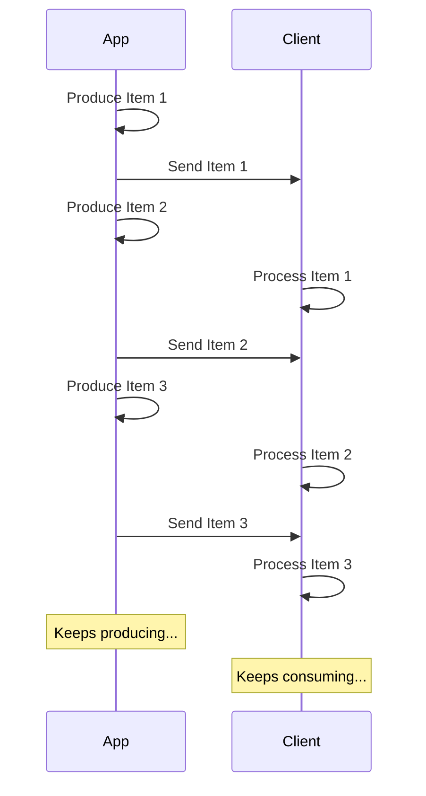

# JSON Lines をストリームする { #stream-json-lines }

データのシーケンスを**「ストリーム」**で送りたい場合、**JSON Lines** を使って実現できます。

/// info | 情報

FastAPI 0.134.0 で追加されました。

///

## ストリームとは { #what-is-a-stream }

データを**ストリーミング**するとは、アイテムの全シーケンスが用意できるのを待たずに、アプリがデータアイテムの送信をクライアントに対して開始することを意味します。

つまり、最初のアイテムを送信し、クライアントはそれを受け取って処理を始めます。その間に、次のアイテムをまだ生成しているかもしれません。



データを送り続ける無限ストリームにすることもできます。

## JSON Lines { #json-lines }

このような場合、1 行に 1 つの JSON オブジェクトを送る「**JSON Lines**」形式を使うのが一般的です。

レスポンスの content type は `application/jsonl`（`application/json` の代わり）となり、ボディは次のようになります:

```json
{"name": "Plumbus", "description": "A multi-purpose household device."}
{"name": "Portal Gun", "description": "A portal opening device."}
{"name": "Meeseeks Box", "description": "A box that summons a Meeseeks."}
```

これは JSON 配列（Python の list に相当）にとてもよく似ていますが、`[]` で囲まず、アイテム間の `,` もありません。その代わりに、**1 行に 1 つの JSON オブジェクト**で、改行文字で区切られます。

/// info | 情報

重要な点は、クライアントが前の行を消費している間に、アプリ側は次の行を順次生成して送れることです。

///

/// note | 技術詳細

各 JSON オブジェクトは改行で区切られるため、内容にリテラルな改行文字は含められません。ですが、エスケープした改行（`\n`）は含められます。これは JSON 標準の一部です。

とはいえ、通常は気にする必要はありません。自動で処理されますので、読み進めてください。🤓

///

## ユースケース { #use-cases }

これは **AI LLM** サービス、**ログ**や**テレメトリ**、あるいは **JSON** アイテムとして構造化できる他の種類のデータをストリームするのに使えます。

/// tip | 豆知識

動画や音声などのバイナリデータをストリームしたい場合は、上級ガイドを参照してください: [データのストリーム](../advanced/stream-data.md)。

///

## FastAPI で JSON Lines をストリームする { #stream-json-lines-with-fastapi }

FastAPI で JSON Lines をストリームするには、*path operation 関数*で `return` を使う代わりに、`yield` を使って各アイテムを順に生成します。

{* ../../docs_src/stream_json_lines/tutorial001_py310.py ln[1:24] hl[24] *}

送り返す各 JSON アイテムが `Item`（Pydantic モデル）型で、関数が async の場合、戻り値の型を `AsyncIterable[Item]` と宣言できます:

{* ../../docs_src/stream_json_lines/tutorial001_py310.py ln[1:24] hl[9:11,22] *}

戻り値の型を宣言すると、FastAPI はそれを使ってデータを**検証**し、OpenAPI に**ドキュメント化**し、**フィルター**し、Pydantic で**シリアライズ**します。

/// tip | 豆知識

Pydantic は **Rust** 側でシリアライズを行うため、戻り値の型を宣言しない場合に比べて大幅に高い**パフォーマンス**が得られます。

///

### 非 async の *path operation 関数* { #non-async-path-operation-functions }

`async` を使わない通常の `def` 関数でも同様に `yield` を使えます。

FastAPI が適切に実行されるように処理するため、イベントループをブロックしません。

この場合は関数が async ではないので、適切な戻り値の型は `Iterable[Item]` です:

{* ../../docs_src/stream_json_lines/tutorial001_py310.py ln[27:30] hl[28] *}

### 戻り値の型なし { #no-return-type }

戻り値の型を省略することもできます。FastAPI はその場合、データを JSON にシリアライズ可能な形に変換するために [`jsonable_encoder`](./encoder.md) を使い、JSON Lines として送信します。

{* ../../docs_src/stream_json_lines/tutorial001_py310.py ln[33:36] hl[34] *}

## Server-Sent Events (SSE) { #server-sent-events-sse }

FastAPI は Server-Sent Events (SSE) にもファーストクラスで対応しています。とても似ていますが、いくつか追加の詳細があります。次の章で学べます: [Server-Sent Events (SSE)](server-sent-events.md)。🤓
