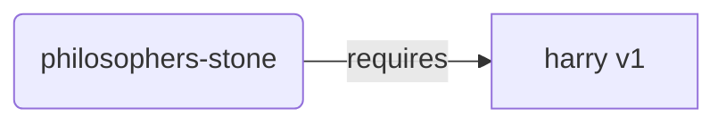
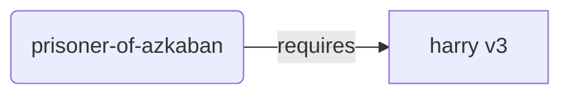
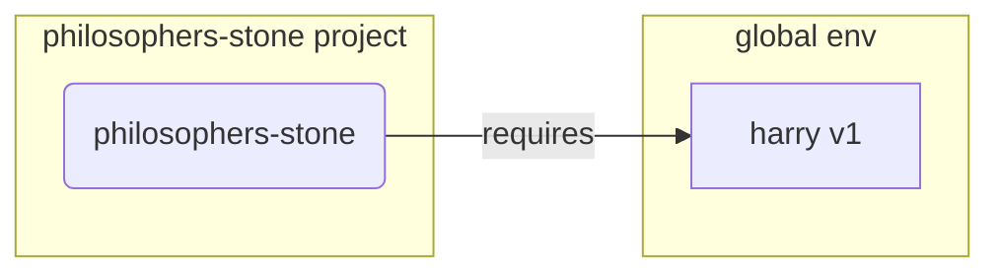
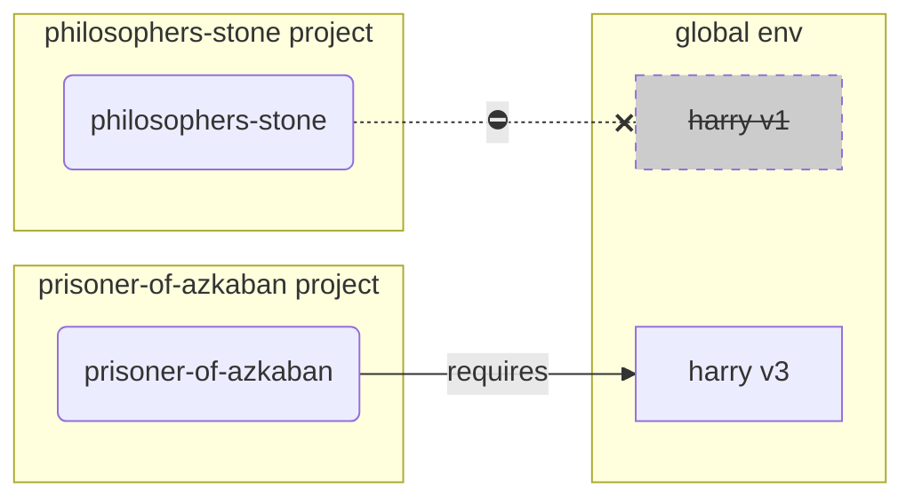
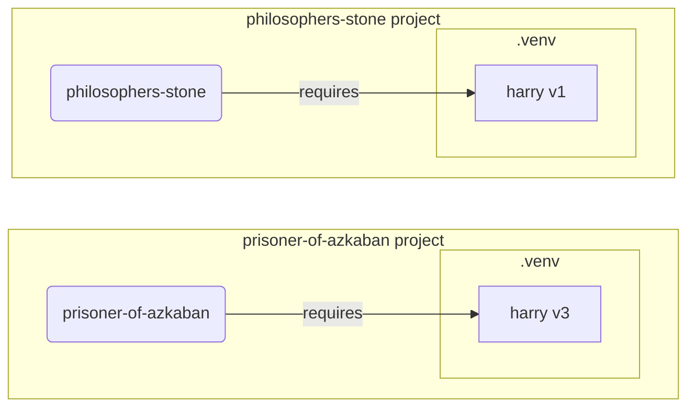

# 仮想環境

Pythonプロジェクトの作業では、**仮想環境**（または類似の仕組み）を使用し、プロジェクトごとにインストールするパッケージを分離するべきでしょう。

/// info | 情報

もし、仮想環境の概要や作成方法、使用方法について既にご存知なら、このセクションをスキップすることができます。🤓

///

/// tip | 豆知識

**仮想環境**は、**環境変数**とは異なります。

**環境変数**は、プログラムが使用できるシステム内の変数です。

**仮想環境**は、ファイルをまとめたディレクトリのことです。

///

/// info | 情報
このページでは、**仮想環境**の使用方法と、そのはたらきについて説明します。

もし**すべてを管理するツール**（Pythonのインストールも含む）を導入する準備ができているなら、<a href="https://github.com/astral-sh/uv" class="external-link" target="_blank">uv</a> をお試しください。

///

## プロジェクトの作成

まず、プロジェクト用のディレクトリを作成します。

私は通常 home/user ディレクトリの中に `code` というディレクトリを用意していて、プロジェクトごとに1つのディレクトリをその中に作成しています。

<div class="termy">

```console
// Go to the home directory
$ cd
// Create a directory for all your code projects
$ mkdir code
// Enter into that code directory
$ cd code
// Create a directory for this project
$ mkdir awesome-project
// Enter into that project directory
$ cd awesome-project
```

</div>

## 仮想環境の作成

Pythonプロジェクトでの**初めての**作業を開始する際には、**<abbr title="他の選択肢もありますが、これはシンプルなガイドラインです">プロジェクト内</abbr>**に仮想環境を作成してください。

/// tip | 豆知識

これを行うのは、**プロジェクトごとに1回だけ**です。作業のたびに行う必要はありません。

///

//// tab | `venv`

仮想環境を作成するには、Pythonに付属している `venv` モジュールを使用できます。

<div class="termy">

```console
$ python -m venv .venv
```

</div>

/// details | このコマンドの意味

- `python` : `python` というプログラムを呼び出します
- `-m` : モジュールをスクリプトとして呼び出します。どのモジュールを呼び出すのか、この次に指定します
- `venv` : 通常Pythonに付随してインストールされる `venv`モジュールを使用します
- `.venv` : 仮想環境を`.venv`という新しいディレクトリに作成します

///

////

//// tab | `uv`

もし <a href="https://github.com/astral-sh/uv" class="external-link" target="_blank">`uv`</a> をインストール済みなら、仮想環境を作成するために `uv` を使うこともできます。

<div class="termy">

```console
$ uv venv
```

</div>

/// tip | 豆知識

デフォルトでは、 `uv` は `.venv` というディレクトリに仮想環境を作成します。

ただし、追加の引数にディレクトリ名を与えてカスタマイズすることもできます。

///

////

このコマンドは `.venv` というディレクトリに新しい仮想環境を作成します。

/// details | `.venv` またはその他の名前

仮想環境を別のディレクトリに作成することも可能ですが、 `.venv` と名付けるのが一般的な慣習です。

///

## 仮想環境の有効化

実行されるPythonコマンドやインストールされるパッケージが新しく作成した仮想環境を使用するよう、その仮想環境を有効化しましょう。

/// tip | 豆知識

そのプロジェクトの作業で**新しいターミナルセッション**を開始する際には、**毎回**有効化が必要です。

///

//// tab | Linux, macOS

<div class="termy">

```console
$ source .venv/bin/activate
```

</div>

////

//// tab | Windows PowerShell

<div class="termy">

```console
$ .venv\Scripts\Activate.ps1
```

</div>

////

//// tab | Windows Bash

もしWindowsでBashを使用している場合 (<a href="https://gitforwindows.org/" class="external-link" target="_blank">Git Bash</a>など):

<div class="termy">

```console
$ source .venv/Scripts/activate
```

</div>

////

/// tip | 豆知識

**新しいパッケージ**を仮想環境にインストールするときには、再度**有効化**してください。

こうすることで、そのパッケージがインストールした**ターミナル（<abbr title="command line interface">CLI</abbr>）プログラム**を使用する場合に、仮想環境内のものが確実に使われ、グローバル環境にインストールされている別のもの（おそらく必要なものとは異なるバージョン）を誤って使用することを防ぎます。

///

## 仮想環境が有効であることを確認する

仮想環境が有効である（前のコマンドが正常に機能した）ことを確認します。

/// tip | 豆知識

これは**任意**ですが、すべてが期待通りに機能し、意図した仮想環境を使用していることを**確認する**良い方法です。

///

//// tab | Linux, macOS, Windows Bash

<div class="termy">

```console
$ which python

/home/user/code/awesome-project/.venv/bin/python
```

</div>

`.venv/bin/python` にある `python` バイナリが、プロジェクト（この場合は `awesome-project` ）内に表示されていれば、正常に動作しています 🎉。

////

//// tab | Windows PowerShell

<div class="termy">

``` console
$ Get-Command python

C:\Users\user\code\awesome-project\.venv\Scripts\python
```

</div>

`.venv\Scripts\python` にある `python` バイナリが、プロジェクト（この場合は `awesome-project` ）内に表示されていれば、正常に動作しています 🎉。

////

## `pip` をアップグレードする

/// tip | 豆知識

もし <a href="https://github.com/astral-sh/uv" class="external-link" target="_blank">`uv`</a> を使用している場合は、 `pip` の代わりに `uv` を使ってインストールを行うため、 `pip` をアップグレードする必要はありません 😎。

///

もしパッケージのインストールに `pip`（Pythonに標準で付属しています）を使用しているなら、 `pip` を最新バージョンに**アップグレード**しましょう。

パッケージのインストール中に発生する想定外のエラーの多くは、最初に `pip` をアップグレードしておくだけで解決されます。

/// tip | 豆知識

通常、これは仮想環境を作成した直後に**一度だけ**実行します。

///

仮想環境が有効であることを（上で説明したコマンドで）確認し、アップグレードを実行しましょう：

<div class="termy">

```console
$ python -m pip install --upgrade pip

---> 100%
```

</div>

## `.gitignore` を追加する

**Git**を使用している場合（使用するべきでしょう）、 `.gitignore` ファイルを追加して、 `.venv` 内のあらゆるファイルをGitの管理対象から除外します。

/// tip | 豆知識

もし <a href="https://github.com/astral-sh/uv" class="external-link" target="_blank">`uv`</a> を使用して仮想環境を作成した場合、すでにこの作業は済んでいるので、この手順をスキップできます 😎。

///

/// tip | 豆知識

これも、仮想環境を作成した直後に**一度だけ**実行します。

///

<div class="termy">

```console
$ echo "*" > .venv/.gitignore
```

</div>

/// details | このコマンドの意味

- `echo "*"` : ターミナルに `*` というテキストを「表示」しようとします。（次の部分によってその動作が少し変わります）
- `>` : `>` の左側のコマンドがターミナルに表示しようとする内容を、ターミナルには表示せず、 `>` の右側のファイルに書き込みます。
- `.gitignore` : `*` を書き込むファイル名。

ここで、Gitにおける `*` は「すべて」を意味するので、このコマンドによって `.venv` ディレクトリ内のすべてがGitに無視されるようになります。

このコマンドは以下のテキストを持つ `.gitignore` ファイルを作成します：

```gitignore
*
```

///

## パッケージのインストール

仮想環境を有効化した後、その中でパッケージをインストールできます。

/// tip | 豆知識

プロジェクトに必要なパッケージをインストールまたはアップグレードする場合、これを**一度**実行します。

もし新しいパッケージを追加したり、バージョンをアップグレードする必要がある場合は、もう**一度この手順を繰り返し**ます。

///

### パッケージを直接インストールする

急いでいて、プロジェクトのパッケージ要件を宣言するファイルを使いたくない場合、パッケージを直接インストールできます。

/// tip | 豆知識

プログラムが必要とするパッケージとバージョンをファイル（例えば `requirements.txt` や `pyproject.toml` ）に記載しておくのは、（とても）良い考えです。

///

//// tab | `pip`

<div class="termy">

```console
$ pip install "fastapi[standard]"

---> 100%
```

</div>

////

//// tab | `uv`

もし <a href="https://github.com/astral-sh/uv" class="external-link" target="_blank">`uv`</a> を使用できるなら:

<div class="termy">

```console
$ uv pip install "fastapi[standard]"
---> 100%
```

</div>

////

### `requirements.txt` からインストールする

もし `requirements.txt` があるなら、パッケージのインストールに使用できます。

//// tab | `pip`

<div class="termy">

```console
$ pip install -r requirements.txt
---> 100%
```

</div>

////

//// tab | `uv`

もし <a href="https://github.com/astral-sh/uv" class="external-link" target="_blank">`uv`</a> を使用できるなら:

<div class="termy">

```console
$ uv pip install -r requirements.txt
---> 100%
```

</div>

////

/// details | `requirements.txt`

パッケージが記載された `requirements.txt` は以下のようになっています:

```requirements.txt
fastapi[standard]==0.113.0
pydantic==2.8.0
```

///

## プログラムを実行する

仮想環境を有効化した後、プログラムを実行できます。この際、仮想環境内のPythonと、そこにインストールしたパッケージが使用されます。

<div class="termy">

```console
$ python main.py

Hello World
```

</div>

## エディタの設定

プロジェクトではおそらくエディタを使用するでしょう。コード補完やインラインエラーの表示ができるように、作成した仮想環境をエディタでも使えるよう設定してください。（多くの場合、自動検出されます）

設定例:

* <a href="https://code.visualstudio.com/docs/python/environments#_select-and-activate-an-environment" class="external-link" target="_blank">VS Code</a>
* <a href="https://www.jetbrains.com/help/pycharm/creating-virtual-environment.html" class="external-link" target="_blank">PyCharm</a>

/// tip | 豆知識

この設定は通常、仮想環境を作成した際に**一度だけ**行います。

///

## 仮想環境の無効化

プロジェクトの作業が終了したら、その仮想環境を**無効化**できます。

<div class="termy">

```console
$ deactivate
```

</div>

これにより、 `python` コマンドを実行しても、そのプロジェクト用（のパッケージがインストールされた）仮想環境から `python` プログラムを呼び出そうとはしなくなります。

## 作業準備完了

ここまでで、プロジェクトの作業を始める準備が整いました。

/// tip | 豆知識

上記の内容を理解したいですか？

もしそうなら、以下を読み進めてください。👇🤓

///

## なぜ仮想環境？

FastAPIを使った作業をするには、 [Python](https://www.python.org/) のインストールが必要です。

それから、FastAPIや、使用したいその他の**パッケージ**を**インストール**する必要があります。

パッケージをインストールするには、通常、Python に付属する `pip` コマンド (または同様の代替コマンド) を使用します。

ただし、`pip` を直接使用すると、パッケージは**グローバルなPython環境**（OS全体にインストールされたPython環境）にインストールされます。

### 問題点

では、グローバルPython環境にパッケージをインストールすることの問題点は何でしょうか？

ある時点で、あなたは**異なるパッケージ**に依存する多くのプログラムを書くことになるでしょう。そして、これらの中には同じパッケージの**異なるバージョン**に依存するものも出てくるでしょう。😱

例えば、 `philosophers-stone` （賢者の石）というプロジェクトを作成するとします。このプログラムは **`harry` （ハリー）というパッケージのバージョン `1`**に依存しています。そのため、 `harry` （ハリー）をインストールする必要があります。



それから、 `prisoner-of-azkaban` （アズカバンの囚人）という別のプロジェクトを作成したとします。このプロジェクトも `harry` （ハリー）に依存していますが、**`harry` （ハリー）のバージョン `3`**が必要です。



しかし、ここで問題になるのは、もしローカルの**仮想環境**ではなくグローバル（環境）にパッケージをインストールするなら、 `harry` （ハリー）のどのバージョンをインストールするか選ばないといけないことです。

例えば、 `philosophers-stone` （賢者の石）を実行するには、まず `harry` （ハリー）のバージョン `1` をインストールする必要があります：

<div class="termy">

```console
$ pip install "harry==1"
```

</div>

これにより、`harry` （ハリー）バージョン1がグローバルなPython環境にインストールされます。



しかし、 `prisoner-of-azkaban` （アズカバンの囚人）を実行したい場合は、`harry` （ハリー）のバージョン `1` をアンインストールし、`harry` （ハリー）のバージョン `3` をインストールし直す必要があります。（あるいは、単に`harry` （ハリー）のバージョン `3` をインストールすることで、自動的にバージョン `1` がアンインストールされます）

<div class="termy">

```console
$ pip install "harry==3"
```

</div>

このようにして、グローバル環境への `harry` （ハリー）のバージョン `3` のインストールが完了します。

それから、 `philosophers-stone` （賢者の石）を再び実行しようとすると、このプログラムは `harry` （ハリー）のバージョン `1` が必要なため、**動作しなくなる**可能性があります。



/// tip | 豆知識

Pythonのパッケージでは、**新しいバージョン**で**互換性を損なう変更を避ける**よう努めるのが一般的ですが、それでも注意が必要です。すべてが正常に動作することをテストで確認してから、意図的に指定して新しいバージョンをインストールするのが良いでしょう。

///

あなたのすべての**プロジェクトが依存している**、**多数の**他の**パッケージ**が上記の問題を抱えていると想像してください。これは管理が非常に困難です。そして、**互換性のないバージョン**のパッケージを使ってプロジェクトを実行し、なぜ動作しないのか分からなくなるでしょう。

また、使用しているOS（Linux、Windows、macOS など）によっては、Pythonがすでにインストールされていることがあります。この場合、特定のバージョンのパッケージが**OSの動作に必要である**ことがあります。グローバル環境にパッケージをインストールすると、OSに付属するプログラムを**壊してしまう**可能性があります。

## パッケージのインストール先

Pythonをインストールしたとき、ファイルを含んだいくつかのディレクトリが作成されます。

これらの中には、インストールされたパッケージを保存するためのものもあります。

以下のコマンドを実行したとき：

<div class="termy">

```console
// Don't run this now, it's just an example 🤓
$ pip install "fastapi[standard]"
---> 100%
```

</div>

FastAPIのコードを含む圧縮ファイルが、通常は [PyPI](https://pypi.org/project/fastapi/) からダウンロードされます。

また、FastAPIが依存する他のパッケージも**ダウンロード**されます。

それから、これらのファイルは**解凍**され、コンピュータのあるディレクトリに配置されます。

デフォルトでは、これらのファイルはPythonのインストール時に作成されるディレクトリ、つまり**グローバル環境**に配置されます。

## 仮想環境とは

すべてのパッケージをグローバル環境に配置することによって生じる問題の解決策は、作業する**プロジェクトごとの仮想環境**を使用することです。

仮想環境は**ディレクトリ**であり、グローバル環境と非常に似ていて、一つのプロジェクトで使う特定のパッケージ群をインストールできる場所です。

このようにして、それぞれのプロジェクトが独自の仮想環境（`.venv` ディレクトリ）に独自のパッケージ群を持つことができます。



## 仮想環境の有効化とは

仮想環境を有効にしたとき、例えば次のコマンドを実行した場合を考えます：

//// tab | Linux, macOS

<div class="termy">

```console
$ source .venv/bin/activate
```

</div>

////

//// tab | Windows PowerShell

<div class="termy">

```console
$ .venv\Scripts\Activate.ps1
```

</div>

////

//// tab | Windows Bash

あるいは、WindowsでBashを使用している場合 (<a href="https://gitforwindows.org/" class="external-link" target="_blank">Git Bash</a>など):

<div class="termy">

```console
$ source .venv/Scripts/activate
```

</div>

////

これによって、いくつかの [環境変数](environment-variables.md){.internal-link target=_blank} が作成・修正され、次に実行されるコマンドで使用できるようになります。

これらの環境変数のひとつに、 `PATH` 変数があります。

/// tip | 豆知識

`PATH` 変数についての詳細は [環境変数](environment-variables.md#path環境変数){.internal-link target=_blank} を参照してください。

///

仮想環境を有効にすると、その仮想環境のパス `.venv/bin` （LinuxとmacOS）、あるいは `.venv\Scripts` （Windows）が `PATH` 変数に追加されます。

その環境を有効にする前の `PATH` 変数が次のようになっているとします。

//// tab | Linux, macOS

```plaintext
/usr/bin:/bin:/usr/sbin:/sbin
```

これは、OSが以下のディレクトリ中でプログラムを探すことを意味します：

* `/usr/bin`
* `/bin`
* `/usr/sbin`
* `/sbin`

////

//// tab | Windows

```plaintext
C:\Windows\System32
```

これは、OSが以下のディレクトリ中でプログラムを探すことを意味します：

* `C:\Windows\System32`

////

仮想環境を有効にすると、 `PATH` 変数は次のようになります。

//// tab | Linux, macOS

```plaintext
/home/user/code/awesome-project/.venv/bin:/usr/bin:/bin:/usr/sbin:/sbin
```

これは、OSが他のディレクトリを探すより前に、最初に以下のディレクトリ中でプログラムを探し始めることを意味します：

```plaintext
/home/user/code/awesome-project/.venv/bin
```

そのため、ターミナルで `python` と入力した際に、OSはPythonプログラムを以下のパスで発見し、使用します。

```plaintext
/home/user/code/awesome-project/.venv/bin/python
```

////

//// tab | Windows

```plaintext
C:\Users\user\code\awesome-project\.venv\Scripts;C:\Windows\System32
```

これは、OSが他のディレクトリを探すより前に、最初に以下のディレクトリ中でプログラムを探し始めることを意味します：

```plaintext
C:\Users\user\code\awesome-project\.venv\Scripts
```

そのため、ターミナルで `python` と入力した際に、OSはPythonプログラムを以下のパスで発見し、使用します。

```plaintext
C:\Users\user\code\awesome-project\.venv\Scripts\python
```

////

重要な点は、仮想環境のパスを `PATH` 変数の**先頭**に配置することです。OSは利用可能な他のPythonを見つけるより**前に**、この仮想環境のPythonを見つけるようになります。このようにして、 `python` を実行したときに、他の `python` （例えばグローバル環境の `python` ）ではなく、**その仮想環境の**Pythonを使用するようになります。

仮想環境を有効にして変更されることは他にもありますが、これが最も重要な変更のひとつです。

## 仮想環境の確認

仮想環境が有効かどうか、例えば次のように確認できます。：

//// tab | Linux, macOS, Windows Bash

<div class="termy">

```console
$ which python

/home/user/code/awesome-project/.venv/bin/python
```

</div>

////

//// tab | Windows PowerShell

<div class="termy">

```console
$ Get-Command python

C:\Users\user\code\awesome-project\.venv\Scripts\python
```

</div>

////

これは、使用される `python` プログラムが**その仮想環境の**ものであることを意味します。

LinuxやmacOSでは `which` を、Windows PowerShellでは `Get-Command` を使用します。

このコマンドの動作は、 `PATH`変数に設定された**それぞれのパスを順に**確認していき、呼ばれている `python` プログラムを探します。そして、見つかり次第そのプログラムへの**パスを表示します**。

最も重要なことは、 `python` が呼ばれたときに、まさにこのコマンドで確認した "`python`" が実行されることです。

こうして、自分が想定通りの仮想環境にいるかを確認できます。

/// tip | 豆知識

ある仮想環境を有効にし、そのPythonを使用したまま**他のプロジェクトに移動して**しまうことは簡単に起こり得ます。

そして、その第二のプロジェクトは動作しないでしょう。なぜなら別のプロジェクトの仮想環境の**誤ったPython**を使用しているからです。

そのため、どの `python` が使用されているのか確認できることは役立ちます。🤓

///

## なぜ仮想環境を無効化するのか

例えば、`philosophers-stone` （賢者の石）というプロジェクトで作業をしていて、**その仮想環境を有効にし**、必要なパッケージをインストールしてその環境内で作業を進めているとします。

それから、**別のプロジェクト**、 `prisoner-of-azkaban` （アズカバンの囚人）に取り掛かろうとします。

そのプロジェクトディレクトリへ移動します：

<div class="termy">

```console
$ cd ~/code/prisoner-of-azkaban
```

</div>

もし `philosophers-stone` （賢者の石）の仮想環境を無効化していないと、`python` を実行したとき、 ターミナルは `philosophers-stone` （賢者の石）のPythonを使用しようとします。

<div class="termy">

```console
$ cd ~/code/prisoner-of-azkaban

$ python main.py

// Error importing sirius, it's not installed 😱
Traceback (most recent call last):
    File "main.py", line 1, in <module>
        import sirius
```

</div>

しかし、その仮想環境を無効化し、 `prisoner-of-azkaban` （アズカバンの囚人）のための新しい仮想環境を有効にすれば、 `python` を実行したときに `prisoner-of-azkaban` （アズカバンの囚人）の仮想環境の Python が使用されるようになります。

<div class="termy">

```console
$ cd ~/code/prisoner-of-azkaban

// You don't need to be in the old directory to deactivate, you can do it wherever you are, even after going to the other project 😎
$ deactivate

// Activate the virtual environment in prisoner-of-azkaban/.venv 🚀
$ source .venv/bin/activate

// Now when you run python, it will find the package sirius installed in this virtual environment ✨
$ python main.py

I solemnly swear 🐺
```

</div>

## 代替手段

これは、あらゆる仕組みを**根本から**学ぶためのシンプルな入門ガイドです。

仮想環境、パッケージの依存関係（requirements）、プロジェクトの管理には、多くの**代替手段**があります。

準備が整い、パッケージの依存関係、仮想環境など**プロジェクト全体の管理**ツールを使いたいと考えたら、<a href="https://github.com/astral-sh/uv" class="external-link" target="_blank">uv</a> を試してみることをおすすめします。

`uv` では以下のような多くのことができます：

* 異なるバージョンも含めた**Python のインストール**
* プロジェクトごとの**仮想環境**の管理
* **パッケージ**のインストール
* プロジェクトのパッケージの**依存関係やバージョン**の管理
* パッケージとそのバージョンの、依存関係を含めた**厳密な**組み合わせを保持し、これによって、本番環境で、開発環境と全く同じようにプロジェクトを実行できる（これは**locking**と呼ばれます）
* その他のさまざまな機能

## まとめ

ここまで読みすべて理解したなら、世間の多くの開発者と比べて、仮想環境について**あなたはより多くのことを知っています**。🤓

これらの詳細を知ることは、将来、複雑に見える何かのデバッグにきっと役立つでしょう。しかし、その頃には、あなたは**そのすべての動作を根本から**理解しているでしょう。😎
