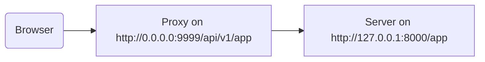

#  프록시의 뒤편

당신의 응용프로그램에서는 인식할 수 없는 경로 접두사를 추가하는 설정을 적용해서 Traefik 또는 Nginx와 같은 **프록시** 서버를 사용해야 하는 경우가 있습니다.

이러한 경우에 `root_path`를 사용하여 당신의 응용프로그램을 구성할 수 있습니다.

`root_path`는 (Starlette을 통해 FastAPI가 기반으로 하는) ASGI 명세에 의해 제공되는 매커니즘입니다.

`root_path`는 이러한 특정한 경우에 사용됩니다.

또한 하위 응용프로그램을 마운트 할 때 내부적으로 사용되기도 합니다.

## 잘린 경로 접두사를 갖는 프록시

잘린 경로 접두사를 갖는 프록시가 있다는 것은, 당신의 코드에서 `/app`으로 경로를 선언한 뒤에, `/api/v1`와 같은 경로 아래에 당신의 **FastAPI** 응용프로그램을 담는 새로운 계층을 최상단(프록시) 위에 추가한다는 것을 의미합니다.

이 경우, 기존 경로 `/app`은 실제로는 `/api/v1/app`에서 동작합니다.

모든 코드가 `/app`에서 동작하는 것으로 가정한 채로 작성되었다고 할지라도 말입니다.

그리고 프록시는 Uvicorn으로 요청을 전송하기 전에 즉시 **경로 접두사** 를 **"잘라"** 응용프로그램으로 하여금 `/app`에서 동작중임을 확신하게 하기 때문에, 접두사가 `/api/v1`을 포함하도록 코드를 수정할 필요가 없습니다.

여기까지, 모든 것은 정상적으로 작동할 것입니다.

하지만, 통합 문서 UI(프론트엔드)를 열람하면, `/api/v1/openapi.json`가 아닌 `/openapi.json`에서 OpenAPI 스키마를 가져오게 됩니다.

따라서, (브라우저에서 실행되는) 프론트엔드는 `/openapi.json`에 접근을 시도하고, OpenAPI 스키마를 가져올 수 없게됩니다.

응용프로그램에서 `/api/v1`를 경로 접두사로 갖는 프록시를 갖고있기 때문에, 프론트엔드는 OpenAPI 스키마를 `/api/v1/openapi.json`에서 불러와야합니다.



!!! tip "팁"
     IP `0.0.0.0`는 일반적으로 프로그램이 기계/서버에 접근할 수 있는 모든 IP를 수신한다는 의미로 사용됩니다.

문서 UI 또한 해당 API `server`가 `/api/v1`(프록시의 뒤편)에 위치해있다는 것을 선언하는 OpenAPI 스키마가 필요합니다. 예를 들면:

```JSON hl_lines="4-8"
{
    "openapi": "3.0.2",
    // More stuff here
    "servers": [
        {
            "url": "/api/v1"
        }
    ],
    "paths": {
            // More stuff here
    }
}
```

상기 예시에서, "프록시"는 **Traefik**과 같은 것입니다. 그리고 서버는 FastAPI를 동작시키는 **Uvicorn** 과 같은 것입니다.

### `root_path`의 규정

이를 위해, 커맨드 라인 옵션인 `--root-path`를 다음과 같이 사용할 수 있습니다:

<div class="termy">

```console
$ uvicorn main:app --root-path /api/v1

<span style="color: green;">INFO</span>:     Uvicorn running on http://127.0.0.1:8000 (Press CTRL+C to quit)
```

</div>

Hypercorn을 사용하는 경우에도 `--root-path` 옵션을 사용할 수 있습니다.

!!! note "기술적 세부사항"
     ASGI 명세는 이러한 경우에 대해 `root_path`를 정의합니다.

      그리고  `--root-path` 커맨드 라인 옵션은 이 `root_path`을 규정합니다.

### 현재의 `root_path` 확인하기

각 요청마다 응용프로그램이 사용하는 현재의 `root_path`를 가져올 수 있습니다. 이는 ASGI 스펙의 한 부분인 `scope` 사전의 일부입니다.

여기에서는 단지 설명을 목적으로 이것을 포함해 반환하겠습니다.

```Python hl_lines="8"
{!../../../docs_src/behind_a_proxy/tutorial001.py!}
```

그 다음, 다음과 같이 Uvicorn을 실행시키면:

<div class="termy">

```console
$ uvicorn main:app --root-path /api/v1

<span style="color: green;">INFO</span>:     Uvicorn running on http://127.0.0.1:8000 (Press CTRL+C to quit)
```

</div>

응답은 다음과 같을 것입니다:

```JSON
{
    "message": "Hello World",
    "root_path": "/api/v1"
}
```

### FastAPI 응용프로그램에서 `root_path` 설정하기

`--root-path`와 같은 커맨드 라인 옵션을 제공할 방법이 없는 경우, FastAPI 응용프로그램을 생성할 때 `root_path` 매개변수를 설정할 수 있습니다.

```Python hl_lines="3"
{!../../../docs_src/behind_a_proxy/tutorial002.py!}
```

`root_path`을 `FastAPI`에 전달하는 것은 Uvicorn 또는 Hypercorn에 `--root-path`를 전달하는 것과 동일한 효과를 갖습니다.

### `root_path`에 대해

서버(Uvicorn)는 응용프로그램에 전달하는 것 이외에는 해당 `root_path`를 사용하지 않는다는 것을 염두에 두십시오.

하지만 브라우저로 <a href="http://127.0.0.1:8000" class="external-link" target="_blank">http://127.0.0.1:8000/app</a>에 접속하면, 다음과 같은 정상적인 응답을 확인하게 될 것입니다:

```JSON
{
    "message": "Hello World",
    "root_path": "/api/v1"
}
```

따라서, `http://127.0.0.1:8000/api/v1/app`로 접근하는 것은 바람직하지 않습니다.

Uvicorn은 프록시가 `http://127.0.0.1:8000/app`로 접근할 것으로 기대하며,  `/api/v1` 접두사를 추가하는 것은 프록시의 역할입니다.

## 잘린 경로 접두사를 갖는 프록시에 대해

잘린 경로 접두사를 갖는 프록시는 경로 접두사를 설정하는 방법들 중 하나일 뿐이라는 것을 염두에 두십시오.

많은 경우에서 잘린 경로 접두사를 갖지 않는 프록시가 기본값일 것입니다.

이러한 (잘린 경로 접두사를 갖지 않는) 경우, 프록시는 `https://myawesomeapp.com`와 같은 경로에서 수신하고, 만약 브라우저가 `https://myawesomeapp.com/api/v1/app`로 접속하고 당신의 서버(예를 들어, Uvicorn)는  `http://127.0.0.1:8000`에서 수신할 경우 (잘린 경로 접두사를 갖지 않는) 프록시는 동일한 경로에서 Uvicorn에 접근할 것입니다: `http://127.0.0.1:8000/api/v1/app`.

## Traefik을 사용해 로컬 환경에서 테스트하기

잘린 경로 접두사를 <a href="https://docs.traefik.io/" class="external-link" target="_blank">Traefik</a>을 사용해 로컬 환경에서 쉽게 테스트해볼 수 있습니다.

<a href="https://github.com/containous/traefik/releases" class="external-link" target="_blank">Traefik을 다운로드 하십시오</a>. 이것은 단일 이진 파일로, 압축 파일을 풀어 터미널에서 직접적으로 실행할 수 있습니다.

다음과 같은  `traefik.toml` 파일을 생성하십시오:

```TOML hl_lines="3"
[entryPoints]
  [entryPoints.http]
    address = ":9999"

[providers]
  [providers.file]
    filename = "routes.toml"
```

이것은 Traefik에게 9999번 포트에서 수신하고 또다른 파일인 `routes.toml`를 사용할 것을 지시합니다.

!!! tip "팁"
    표준 HTTP 포트인 80 대신 9999번 포트를 사용함으로써 관리자 권한(`sudo`)으로 실행하지 않아도 됩니다.

그 또 다른 파일인 `routes.toml`를 생성합니다:

```TOML hl_lines="5  12  20"
[http]
  [http.middlewares]

    [http.middlewares.api-stripprefix.stripPrefix]
      prefixes = ["/api/v1"]

  [http.routers]

    [http.routers.app-http]
      entryPoints = ["http"]
      service = "app"
      rule = "PathPrefix(`/api/v1`)"
      middlewares = ["api-stripprefix"]

  [http.services]

    [http.services.app]
      [http.services.app.loadBalancer]
        [[http.services.app.loadBalancer.servers]]
          url = "http://127.0.0.1:8000"
```

이 파일은 경로 접두사 `/api/v1`를 사용하도록 Traefik의 환경을 설정합니다.

그리고 이것은 `http://127.0.0.1:8000`에서 동작 중인 Uvicorn으로 요청을 리다이렉트할 것입니다.

이제 Traefik을 실행하십시오:

<div class="termy">

```console
$ ./traefik --configFile=traefik.toml

INFO[0000] Configuration loaded from file: /home/user/awesomeapi/traefik.toml
```

</div>

그리고 `--root-path` 옵션을 사용해 Uvicorn으로 응용프로그램을 실행하십시오.

<div class="termy">

```console
$ uvicorn main:app --root-path /api/v1

<span style="color: green;">INFO</span>:     Uvicorn running on http://127.0.0.1:8000 (Press CTRL+C to quit)
```

</div>

### 응답 확인

Uvicorn에 대한 포트를 사용해 URL로 접속하십시오: <a href="http://127.0.0.1:8000/app" class="external-link" target="_blank">http://127.0.0.1:8000/app</a>, 정상적인 응답을 확인할 수 있을 것입니다.

```JSON
{
    "message": "Hello World",
    "root_path": "/api/v1"
}
```

!!! tip "팁"
    `http://127.0.0.1:8000/app`로 접근한다고 해도, `root_path`가 `--root-path`에서 가져온 `/api/v1`로 표시되는 것애 주목하십시오.

이제 Traefik에 대한 포트를 사용해 경로 접두사를 포함한 URL로 접속하십시오: <a href="http://127.0.0.1:9999/api/v1/app" class="external-link" target="_blank">http://127.0.0.1:9999/api/v1/app</a>.

동일한 응답을 받는 것을 확인할 수 있습니다:

```JSON
{
    "message": "Hello World",
    "root_path": "/api/v1"
}
```

하지만 이번에는 프록시에 의해 경로 접두사가 포함된 URL에서 해당 응답을 받습니다: `/api/v1`.

물론, 모두가 프록시를 통해 응용프로그램에 접근한다는 것이 이 섹션이 주제이므로 경로 접두사 `/app/v1`를 사용한 버전이 "올바른" 버전입니다.

그리고 Uvicorn에서 직접 제공하는 경로 접두사가 없는 버전(`http://127.0.0.1:8000/app`)은 오직 _프록시_ (Traefik)만 접근할 수 있습니다.

이로써 프록시(Traefik)가 경로 접두사를 사용하는 방법과 서버(Uvicorn)가 `--root-path` 옵션으로부터 `root_path`를 사용하는 방법을 확인할 수 있습니다.

### 문서 UI 확인하기

하지만 여기 재미있는 사실이 있습니다. ✨

응용프로그램에 접근하는 "공식적인" 방법은 우리가 정의한 경로 접두사를 갖는 프록시를 통한 것입니다. 따라서, URL에서 경로 접두사 없이 Uvicorn에서 직접 제공하는 문서 UI에 접근하려고 하는 경우, 이것은 동작하지 않을 것입니다. 프록시를 통해 접근해야하기 때문입니다.

 <a href="http://127.0.0.1:8000/docs" class="external-link" target="_blank">http://127.0.0.1:8000/docs</a>에서 확인할 수 있습니다:

 

 하지만 문서 URL을 포트 `9999`의 프록시를 사용하는 "공식적인" URL인 `/api/v1/docs`를 통해 접근하면, 정상적으로 동작합니다! 🎉

<a href="http://127.0.0.1:9999/api/v1/docs" class="external-link" target="_blank">http://127.0.0.1:9999/api/v1/docs</a>에서 확인할 수 있습니다:


우리가 바란 그대로 입니다. ✔️

이것은 FastAPI가 이 `root_path`을 사용해 `root_path`에서 제공하는 URL로 OpenAPI에서 기본 `server`를 생성하기 때문입니다.

## 추가적인 서버들

!!! warning "경고"
    여기부터는 심화된 사례에 대해 다룹니다. 넘어가셔도 좋습니다.

기본적으로, **FastAPI**는 `root_path`의 URL로 OpenAPI 스키마의 `server`를 생성합니다.

하지만 그 대신에 다른 `servers`를 제공할 수도 있습니다. 일례로 스테이징 환경 및 운영 환경과 상호작용을 하는 *동일한* 문서 UI를 원하는 경우가 있습니다.

사용자 지정 리스트인 `servers`를 전달하고 `root_path`가 존재하는(API가 프록시 뒤에 위치하기 때문에) 경우, **FastAPI**는 이 `root_path`와 함께 "서버"를 해당 리스트의 첫 부분에 삽입합니다.

예를 들어:

```Python hl_lines="4-7"
{!../../../docs_src/behind_a_proxy/tutorial003.py!}
```

이것은 다음과 같은 OpenAPI 스키마를 생성합니다:

```JSON hl_lines="5-7"
{
    "openapi": "3.0.2",
    // More stuff here
    "servers": [
        {
            "url": "/api/v1"
        },
        {
            "url": "https://stag.example.com",
            "description": "Staging environment"
        },
        {
            "url": "https://prod.example.com",
            "description": "Production environment"
        }
    ],
    "paths": {
            // More stuff here
    }
}
```

!!! tip "팁"
     `url`의 값이  `root_path`에서 가져온 `/api/v1`인 자동으로 생성된 서버에 주목하십시오.

<a href="http://127.0.0.1:9999/api/v1/docs" class="external-link" target="_blank">http://127.0.0.1:9999/api/v1/docs</a>의 문서 UI는 다음처럼 생겼습니다:


!!! tip "팁"
     문서 UI는 당신이 선택한 서버와 상호작용합니다.

### `root_path`를 사용하는 자동 서버 비활성화

**FastAPI**가 `root_path`를 사용한 자동 서버를 포함하는 것을 원치 않는다면, `root_path_in_servers=False` 매개변수를 사용할 수 있습니다:

```Python hl_lines="9"
{!../../../docs_src/behind_a_proxy/tutorial004.py!}
```

이 경우 OpenAPI 스키마에 포함되지 않습니다.

## 하위 응용프로그램 마운트

[하위 응용프로그램 - 마운트](https://fastapi.tiangolo.com/advanced/sub-applications/){.internal-link target=__blank}에서 설명하는 대로 하위 응용프로그램을 마운트하면서 동시에 `root_path`와 함께 프록시를 사용하고싶다면, 예상한대로 정상적으로 사용할 수 있습니다.

FastAPI는 내부적으로 똑똑하게 `root_path`를 사용하기 때문에, 이것은 문제 없이 동작합니다. ✨
