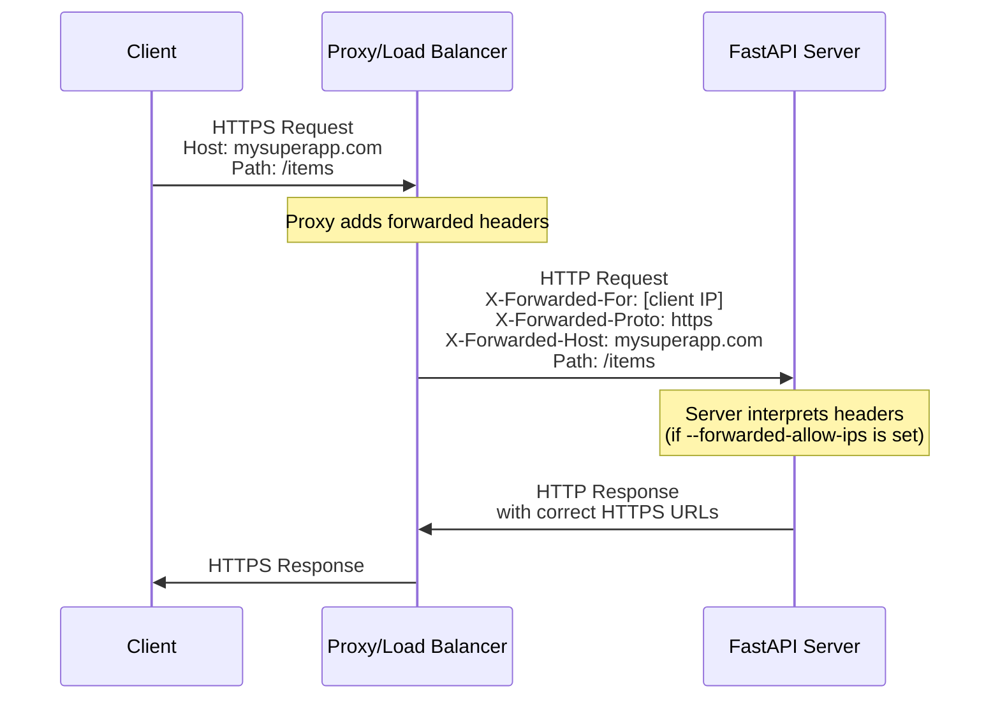
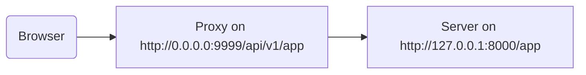

# 프록시 뒤에서 실행하기 { #behind-a-proxy }

많은 경우 FastAPI 앱 앞단에 Traefik이나 Nginx 같은 **프록시(proxy)**를 두고 사용합니다.

이런 프록시는 HTTPS 인증서 처리 등 여러 작업을 담당할 수 있습니다.

## 프록시 전달 헤더 { #proxy-forwarded-headers }

애플리케이션 앞단의 **프록시**는 보통 **서버**로 요청을 보내기 전에, 해당 요청이 프록시에 의해 **전달(forwarded)**되었다는 것을 서버가 알 수 있도록 몇몇 헤더를 동적으로 설정합니다. 이를 통해 서버는 도메인을 포함한 원래의 (공개) URL, HTTPS 사용 여부 등 정보를 알 수 있습니다.

**서버** 프로그램(예: **FastAPI CLI**를 통해 실행되는 **Uvicorn**)은 이런 헤더를 해석할 수 있고, 그 정보를 애플리케이션으로 전달할 수 있습니다.

하지만 보안상, 서버는 자신이 신뢰할 수 있는 프록시 뒤에 있다는 것을 모르면 해당 헤더를 해석하지 않습니다.

/// note | 기술 세부사항

프록시 헤더는 다음과 같습니다:

* <a href="https://developer.mozilla.org/en-US/docs/Web/HTTP/Reference/Headers/X-Forwarded-For" class="external-link" target="_blank">X-Forwarded-For</a>
* <a href="https://developer.mozilla.org/en-US/docs/Web/HTTP/Reference/Headers/X-Forwarded-Proto" class="external-link" target="_blank">X-Forwarded-Proto</a>
* <a href="https://developer.mozilla.org/en-US/docs/Web/HTTP/Reference/Headers/X-Forwarded-Host" class="external-link" target="_blank">X-Forwarded-Host</a>

///

### 프록시 전달 헤더 활성화하기 { #enable-proxy-forwarded-headers }

FastAPI CLI를 *CLI 옵션* `--forwarded-allow-ips`로 실행하고, 전달 헤더를 읽을 수 있도록 신뢰할 IP 주소들을 넘길 수 있습니다.

`--forwarded-allow-ips="*"`로 설정하면 들어오는 모든 IP를 신뢰합니다.

**서버**가 신뢰할 수 있는 **프록시** 뒤에 있고 프록시만 서버에 접근한다면, 이는 해당 **프록시**의 IP가 무엇이든 간에 받아들이게 됩니다.

<div class="termy">

```console
$ fastapi run --forwarded-allow-ips="*"

<span style="color: green;">INFO</span>:     Uvicorn running on http://127.0.0.1:8000 (Press CTRL+C to quit)
```

</div>

### HTTPS에서 리디렉션 { #redirects-with-https }

예를 들어, *경로 처리* `/items/`를 정의했다고 해봅시다:

{* ../../docs_src/behind_a_proxy/tutorial001_01_py39.py hl[6] *}

클라이언트가 `/items`로 접근하면, 기본적으로 `/items/`로 리디렉션됩니다.

하지만 *CLI 옵션* `--forwarded-allow-ips`를 설정하기 전에는 `http://localhost:8000/items/`로 리디렉션될 수 있습니다.

그런데 애플리케이션이 `https://mysuperapp.com`에 호스팅되어 있고, 리디렉션도 `https://mysuperapp.com/items/`로 되어야 할 수 있습니다.

이때 `--proxy-headers`를 설정하면 FastAPI가 올바른 위치로 리디렉션할 수 있습니다. 😎

```
https://mysuperapp.com/items/
```

/// tip | 팁

HTTPS에 대해 더 알아보려면 가이드 [HTTPS에 대하여](../deployment/https.md){.internal-link target=_blank}를 확인하세요.

///

### 프록시 전달 헤더가 동작하는 방식 { #how-proxy-forwarded-headers-work }

다음은 **프록시**가 클라이언트와 **애플리케이션 서버** 사이에서 전달 헤더를 추가하는 과정을 시각적으로 나타낸 것입니다:



**프록시**는 원래의 클라이언트 요청을 가로채고, **애플리케이션 서버**로 요청을 전달하기 전에 특수한 *forwarded* 헤더(`X-Forwarded-*`)를 추가합니다.

이 헤더들은 그렇지 않으면 사라질 수 있는 원래 요청의 정보를 보존합니다:

* **X-Forwarded-For**: 원래 클라이언트의 IP 주소
* **X-Forwarded-Proto**: 원래 프로토콜(`https`)
* **X-Forwarded-Host**: 원래 호스트(`mysuperapp.com`)

**FastAPI CLI**를 `--forwarded-allow-ips`로 설정하면, 이 헤더를 신뢰하고 사용합니다. 예를 들어 리디렉션에서 올바른 URL을 생성하는 데 사용됩니다.

## 제거된 경로 접두사를 가진 프록시 { #proxy-with-a-stripped-path-prefix }

애플리케이션에 경로 접두사(prefix)를 추가하는 프록시를 둘 수도 있습니다.

이런 경우 `root_path`를 사용해 애플리케이션을 구성할 수 있습니다.

`root_path`는 (FastAPI가 Starlette를 통해 기반으로 하는) ASGI 사양에서 제공하는 메커니즘입니다.

`root_path`는 이러한 특정 사례를 처리하는 데 사용됩니다.

또한 서브 애플리케이션을 마운트할 때 내부적으로도 사용됩니다.

경로 접두사가 제거(stripped)되는 프록시가 있다는 것은, 코드에서는 `/app`에 경로를 선언하지만, 위에 한 겹(프록시)을 추가해 **FastAPI** 애플리케이션을 `/api/v1` 같은 경로 아래에 두는 것을 의미합니다.

이 경우 원래 경로 `/app`은 실제로 `/api/v1/app`에서 서비스됩니다.

코드는 모두 `/app`만 있다고 가정하고 작성되어 있는데도 말입니다.

{* ../../docs_src/behind_a_proxy/tutorial001_py39.py hl[6] *}

그리고 프록시는 요청을 앱 서버(아마 FastAPI CLI를 통해 실행되는 Uvicorn)로 전달하기 전에, 동적으로 **경로 접두사**를 **"제거"**합니다. 그래서 애플리케이션은 여전히 `/app`에서 서비스된다고 믿게 되고, 코드 전체를 `/api/v1` 접두사를 포함하도록 수정할 필요가 없어집니다.

여기까지는 보통 정상적으로 동작합니다.

하지만 통합 문서 UI(프론트엔드)를 열면, OpenAPI 스키마를 `/api/v1/openapi.json`이 아니라 `/openapi.json`에서 가져오려고 합니다.

그래서 브라우저에서 실행되는 프론트엔드는 `/openapi.json`에 접근하려고 시도하지만 OpenAPI 스키마를 얻지 못합니다.

앱에 대해 `/api/v1` 경로 접두사를 가진 프록시가 있으므로, 프론트엔드는 `/api/v1/openapi.json`에서 OpenAPI 스키마를 가져와야 합니다.



/// tip | 팁

IP `0.0.0.0`은 보통 해당 머신/서버에서 사용 가능한 모든 IP에서 프로그램이 리슨한다는 의미로 사용됩니다.

///

문서 UI는 또한 OpenAPI 스키마에서 이 API `server`가 `/api/v1`(프록시 뒤) 위치에 있다고 선언해야 합니다. 예:

```JSON hl_lines="4-8"
{
    "openapi": "3.1.0",
    // More stuff here
    "servers": [
        {
            "url": "/api/v1"
        }
    ],
    "paths": {
            // More stuff here
    }
}
```

이 예시에서 "Proxy"는 **Traefik** 같은 것이고, 서버는 **Uvicorn**으로 실행되는 FastAPI CLI처럼, FastAPI 애플리케이션을 실행하는 구성일 수 있습니다.

### `root_path` 제공하기 { #providing-the-root-path }

이를 달성하려면 다음처럼 커맨드 라인 옵션 `--root-path`를 사용할 수 있습니다:

<div class="termy">

```console
$ fastapi run main.py --forwarded-allow-ips="*" --root-path /api/v1

<span style="color: green;">INFO</span>:     Uvicorn running on http://127.0.0.1:8000 (Press CTRL+C to quit)
```

</div>

Hypercorn을 사용한다면, Hypercorn에도 `--root-path` 옵션이 있습니다.

/// note | 기술 세부사항

ASGI 사양은 이 사용 사례를 위해 `root_path`를 정의합니다.

그리고 커맨드 라인 옵션 `--root-path`가 그 `root_path`를 제공합니다.

///

### 현재 `root_path` 확인하기 { #checking-the-current-root-path }

요청마다 애플리케이션에서 사용 중인 현재 `root_path`를 얻을 수 있는데, 이는 `scope` 딕셔너리(ASGI 사양의 일부)에 포함되어 있습니다.

여기서는 데모 목적을 위해 메시지에 포함하고 있습니다.

{* ../../docs_src/behind_a_proxy/tutorial001_py39.py hl[8] *}

그 다음 Uvicorn을 다음과 같이 시작하면:

<div class="termy">

```console
$ fastapi run main.py --forwarded-allow-ips="*" --root-path /api/v1

<span style="color: green;">INFO</span>:     Uvicorn running on http://127.0.0.1:8000 (Press CTRL+C to quit)
```

</div>

응답은 다음과 비슷할 것입니다:

```JSON
{
    "message": "Hello World",
    "root_path": "/api/v1"
}
```

### FastAPI 앱에서 `root_path` 설정하기 { #setting-the-root-path-in-the-fastapi-app }

또는 `--root-path` 같은 커맨드 라인 옵션(또는 동등한 방법)을 제공할 수 없는 경우, FastAPI 앱을 생성할 때 `root_path` 파라미터를 설정할 수 있습니다:

{* ../../docs_src/behind_a_proxy/tutorial002_py39.py hl[3] *}

`FastAPI`에 `root_path`를 전달하는 것은 Uvicorn이나 Hypercorn에 커맨드 라인 옵션 `--root-path`를 전달하는 것과 동일합니다.

### `root_path`에 대하여 { #about-root-path }

서버(Uvicorn)는 그 `root_path`를 앱에 전달하는 것 외에는 다른 용도로 사용하지 않는다는 점을 기억하세요.

하지만 브라우저로 <a href="http://127.0.0.1:8000/app" class="external-link" target="_blank">http://127.0.0.1:8000/app</a>에 접속하면 정상 응답을 볼 수 있습니다:

```JSON
{
    "message": "Hello World",
    "root_path": "/api/v1"
}
```

따라서 `http://127.0.0.1:8000/api/v1/app`로 접근될 것이라고 기대하지는 않습니다.

Uvicorn은 프록시가 `http://127.0.0.1:8000/app`에서 Uvicorn에 접근할 것을 기대하고, 그 위에 `/api/v1` 접두사를 추가하는 것은 프록시의 책임입니다.

## 제거된 경로 접두사를 가진 프록시에 대하여 { #about-proxies-with-a-stripped-path-prefix }

경로 접두사가 제거되는 프록시는 구성 방법 중 하나일 뿐이라는 점을 기억하세요.

많은 경우 기본값은 프록시가 경로 접두사를 제거하지 않는 방식일 것입니다.

그런 경우(경로 접두사를 제거하지 않는 경우) 프록시는 `https://myawesomeapp.com` 같은 곳에서 리슨하고, 브라우저가 `https://myawesomeapp.com/api/v1/app`로 접근하면, 서버(예: Uvicorn)가 `http://127.0.0.1:8000`에서 리슨하고 있을 때 프록시(경로 접두사를 제거하지 않는)는 동일한 경로로 Uvicorn에 접근합니다: `http://127.0.0.1:8000/api/v1/app`.

## Traefik으로 로컬 테스트하기 { #testing-locally-with-traefik }

<a href="https://docs.traefik.io/" class="external-link" target="_blank">Traefik</a>을 사용하면, 경로 접두사가 제거되는 구성을 로컬에서 쉽게 실험할 수 있습니다.

<a href="https://github.com/containous/traefik/releases" class="external-link" target="_blank">Traefik 다운로드</a>는 단일 바이너리이며, 압축 파일을 풀고 터미널에서 바로 실행할 수 있습니다.

그 다음 다음 내용을 가진 `traefik.toml` 파일을 생성하세요:

```TOML hl_lines="3"
[entryPoints]
  [entryPoints.http]
    address = ":9999"

[providers]
  [providers.file]
    filename = "routes.toml"
```

이는 Traefik이 9999 포트에서 리슨하고, 다른 파일 `routes.toml`을 사용하도록 지시합니다.

/// tip | 팁

표준 HTTP 포트 80 대신 9999 포트를 사용해서, 관리자(`sudo`) 권한으로 실행하지 않아도 되게 했습니다.

///

이제 다른 파일 `routes.toml`을 생성하세요:

```TOML hl_lines="5  12  20"
[http]
  [http.middlewares]

    [http.middlewares.api-stripprefix.stripPrefix]
      prefixes = ["/api/v1"]

  [http.routers]

    [http.routers.app-http]
      entryPoints = ["http"]
      service = "app"
      rule = "PathPrefix(`/api/v1`)"
      middlewares = ["api-stripprefix"]

  [http.services]

    [http.services.app]
      [http.services.app.loadBalancer]
        [[http.services.app.loadBalancer.servers]]
          url = "http://127.0.0.1:8000"
```

이 파일은 Traefik이 경로 접두사 `/api/v1`을 사용하도록 설정합니다.

그리고 Traefik은 요청을 `http://127.0.0.1:8000`에서 실행 중인 Uvicorn으로 전달합니다.

이제 Traefik을 시작하세요:

<div class="termy">

```console
$ ./traefik --configFile=traefik.toml

INFO[0000] Configuration loaded from file: /home/user/awesomeapi/traefik.toml
```

</div>

그리고 `--root-path` 옵션을 사용해 앱을 시작하세요:

<div class="termy">

```console
$ fastapi run main.py --forwarded-allow-ips="*" --root-path /api/v1

<span style="color: green;">INFO</span>:     Uvicorn running on http://127.0.0.1:8000 (Press CTRL+C to quit)
```

</div>

### 응답 확인하기 { #check-the-responses }

이제 Uvicorn의 포트로 된 URL인 <a href="http://127.0.0.1:8000/app" class="external-link" target="_blank">http://127.0.0.1:8000/app</a>로 접속하면 정상 응답을 볼 수 있습니다:

```JSON
{
    "message": "Hello World",
    "root_path": "/api/v1"
}
```

/// tip | 팁

`http://127.0.0.1:8000/app`로 접근했는데도 `/api/v1`의 `root_path`가 표시되는 것에 주의하세요. 이는 옵션 `--root-path`에서 가져온 값입니다.

///

이제 Traefik의 포트가 포함되고 경로 접두사가 포함된 URL <a href="http://127.0.0.1:9999/api/v1/app" class="external-link" target="_blank">http://127.0.0.1:9999/api/v1/app</a>을 여세요.

동일한 응답을 얻습니다:

```JSON
{
    "message": "Hello World",
    "root_path": "/api/v1"
}
```

하지만 이번에는 프록시가 제공한 접두사 경로 `/api/v1`이 포함된 URL에서의 응답입니다.

물론 여기서의 아이디어는 모두가 프록시를 통해 앱에 접근한다는 것이므로, `/api/v1` 경로 접두사가 있는 버전이 "올바른" 접근입니다.

그리고 경로 접두사가 없는 버전(`http://127.0.0.1:8000/app`)은 Uvicorn이 직접 제공하는 것이며, 오직 _프록시_(Traefik)가 접근하기 위한 용도입니다.

이는 프록시(Traefik)가 경로 접두사를 어떻게 사용하는지, 그리고 서버(Uvicorn)가 옵션 `--root-path`로부터의 `root_path`를 어떻게 사용하는지를 보여줍니다.

### 문서 UI 확인하기 { #check-the-docs-ui }

하지만 재미있는 부분은 여기입니다. ✨

앱에 접근하는 "공식" 방법은 우리가 정의한 경로 접두사를 가진 프록시를 통해서입니다. 따라서 기대하는 대로, URL에 경로 접두사가 없는 상태에서 Uvicorn이 직접 제공하는 docs UI를 시도하면, 프록시를 통해 접근된다고 가정하고 있기 때문에 동작하지 않습니다.

<a href="http://127.0.0.1:8000/docs" class="external-link" target="_blank">http://127.0.0.1:8000/docs</a>에서 확인할 수 있습니다:


하지만 프록시(포트 `9999`)를 사용해 "공식" URL인 `/api/v1/docs`에서 docs UI에 접근하면, 올바르게 동작합니다! 🎉

<a href="http://127.0.0.1:9999/api/v1/docs" class="external-link" target="_blank">http://127.0.0.1:9999/api/v1/docs</a>에서 확인할 수 있습니다:


원하던 그대로입니다. ✔️

이는 FastAPI가 이 `root_path`를 사용해, OpenAPI에서 기본 `server`를 `root_path`가 제공한 URL로 생성하기 때문입니다.

## 추가 서버 { #additional-servers }

/// warning | 경고

이는 더 고급 사용 사례입니다. 건너뛰어도 괜찮습니다.

///

기본적으로 **FastAPI**는 OpenAPI 스키마에서 `root_path`의 URL로 `server`를 생성합니다.

하지만 예를 들어 동일한 docs UI가 스테이징과 프로덕션 환경 모두와 상호작용하도록 하려면, 다른 대안 `servers`를 제공할 수도 있습니다.

사용자 정의 `servers` 리스트를 전달했고 `root_path`(API가 프록시 뒤에 있기 때문)가 있다면, **FastAPI**는 리스트의 맨 앞에 이 `root_path`를 가진 "server"를 삽입합니다.

예:

{* ../../docs_src/behind_a_proxy/tutorial003_py39.py hl[4:7] *}

다음과 같은 OpenAPI 스키마를 생성합니다:

```JSON hl_lines="5-7"
{
    "openapi": "3.1.0",
    // More stuff here
    "servers": [
        {
            "url": "/api/v1"
        },
        {
            "url": "https://stag.example.com",
            "description": "Staging environment"
        },
        {
            "url": "https://prod.example.com",
            "description": "Production environment"
        }
    ],
    "paths": {
            // More stuff here
    }
}
```

/// tip | 팁

`root_path`에서 가져온 값인 `/api/v1`의 `url` 값을 가진, 자동 생성된 server에 주목하세요.

///

<a href="http://127.0.0.1:9999/api/v1/docs" class="external-link" target="_blank">http://127.0.0.1:9999/api/v1/docs</a>의 docs UI에서는 다음처럼 보입니다:


/// tip | 팁

docs UI는 선택한 server와 상호작용합니다.

///

/// note | 기술 세부사항

OpenAPI 사양에서 `servers` 속성은 선택 사항입니다.

`servers` 파라미터를 지정하지 않고 `root_path`가 `/`와 같다면, 생성된 OpenAPI 스키마의 `servers` 속성은 기본적으로 완전히 생략되며, 이는 `url` 값이 `/`인 단일 server와 동등합니다.

///

### `root_path`에서 자동 server 비활성화하기 { #disable-automatic-server-from-root-path }

**FastAPI**가 `root_path`를 사용한 자동 server를 포함하지 않게 하려면, `root_path_in_servers=False` 파라미터를 사용할 수 있습니다:

{* ../../docs_src/behind_a_proxy/tutorial004_py39.py hl[9] *}

그러면 OpenAPI 스키마에 포함되지 않습니다.

## 서브 애플리케이션 마운트하기 { #mounting-a-sub-application }

프록시에서 `root_path`를 사용하면서도, [서브 애플리케이션 - 마운트](sub-applications.md){.internal-link target=_blank}에 설명된 것처럼 서브 애플리케이션을 마운트해야 한다면, 기대하는 대로 일반적으로 수행할 수 있습니다.

FastAPI가 내부적으로 `root_path`를 똑똑하게 사용하므로, 그냥 동작합니다. ✨
