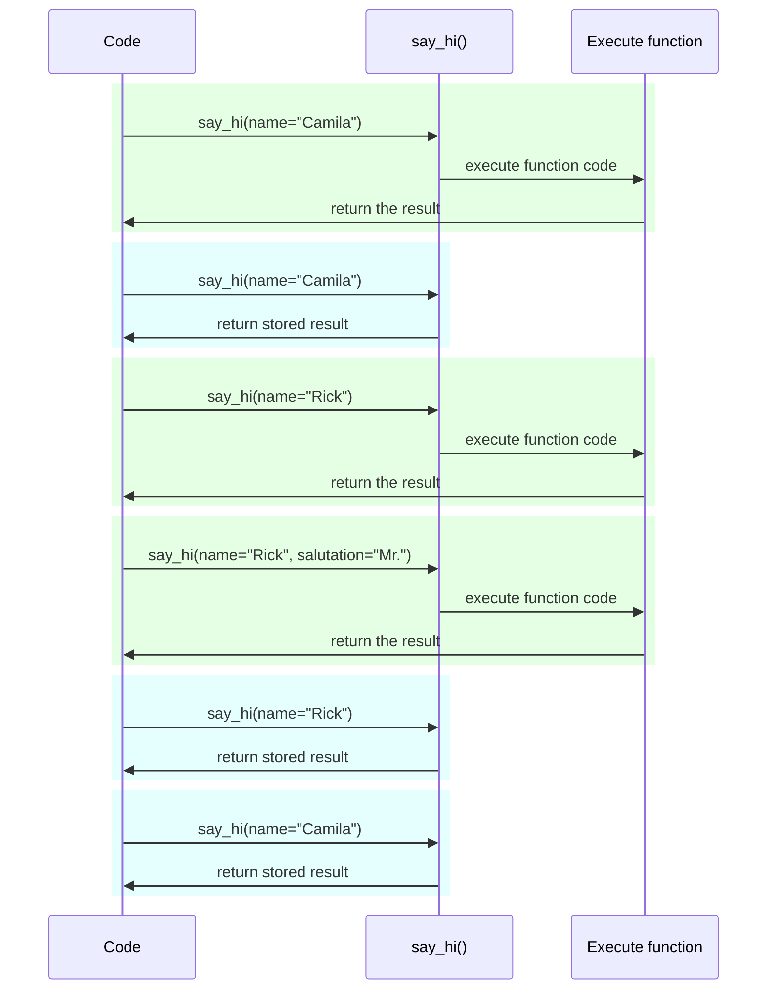

# 설정과 환경 변수 { #settings-and-environment-variables }

많은 경우 애플리케이션에는 외부 설정이나 구성(예: secret key, 데이터베이스 자격 증명, 이메일 서비스 자격 증명 등)이 필요할 수 있습니다.

이러한 설정 대부분은 데이터베이스 URL처럼 변동 가능(변경될 수 있음)합니다. 그리고 많은 설정은 secret처럼 민감할 수 있습니다.

이 때문에 보통 애플리케이션이 읽어들이는 환경 변수로 이를 제공하는 것이 일반적입니다.

/// tip | 팁

환경 변수를 이해하려면 [환경 변수](../environment-variables.md){.internal-link target=_blank}를 읽어보세요.

///

## 타입과 검증 { #types-and-validation }

이 환경 변수들은 Python 외부에 있으며 다른 프로그램 및 시스템의 나머지 부분(그리고 Linux, Windows, macOS 같은 서로 다른 운영체제와도)과 호환되어야 하므로, 텍스트 문자열만 다룰 수 있습니다.

즉, Python에서 환경 변수로부터 읽어온 어떤 값이든 `str`이 되며, 다른 타입으로의 변환이나 검증은 코드에서 수행해야 합니다.

## Pydantic `Settings` { #pydantic-settings }

다행히 Pydantic은 <a href="https://docs.pydantic.dev/latest/concepts/pydantic_settings/" class="external-link" target="_blank">Pydantic: Settings management</a>를 통해 환경 변수에서 오는 이러한 설정을 처리할 수 있는 훌륭한 유틸리티를 제공합니다.

### `pydantic-settings` 설치하기 { #install-pydantic-settings }

먼저 [가상 환경](../virtual-environments.md){.internal-link target=_blank}을 만들고 활성화한 다음, `pydantic-settings` 패키지를 설치하세요:

<div class="termy">

```console
$ pip install pydantic-settings
---> 100%
```

</div>

또는 다음처럼 `all` extras를 설치하면 함께 포함됩니다:

<div class="termy">

```console
$ pip install "fastapi[all]"
---> 100%
```

</div>

### `Settings` 객체 만들기 { #create-the-settings-object }

Pydantic에서 `BaseSettings`를 import하고, Pydantic 모델과 매우 비슷하게 서브클래스를 만드세요.

Pydantic 모델과 같은 방식으로, 타입 어노테이션(그리고 필요하다면 기본값)과 함께 클래스 속성을 선언합니다.

다양한 데이터 타입, `Field()`로 추가 검증 등 Pydantic 모델에서 사용하는 동일한 검증 기능과 도구를 모두 사용할 수 있습니다.

{* ../../docs_src/settings/tutorial001_py39.py hl[2,5:8,11] *}

/// tip | 팁

빠르게 복사/붙여넣기할 예시가 필요하다면, 이 예시는 사용하지 말고 아래의 마지막 예시를 사용하세요.

///

그 다음, 해당 `Settings` 클래스의 인스턴스(여기서는 `settings` 객체)를 생성하면 Pydantic이 대소문자를 구분하지 않고 환경 변수를 읽습니다. 따라서 대문자 변수 `APP_NAME`도 `app_name` 속성에 대해 읽힙니다.

이후 데이터를 변환하고 검증합니다. 그래서 그 `settings` 객체를 사용할 때는 선언한 타입의 데이터를 갖게 됩니다(예: `items_per_user`는 `int`가 됩니다).

### `settings` 사용하기 { #use-the-settings }

이제 애플리케이션에서 새 `settings` 객체를 사용할 수 있습니다:

{* ../../docs_src/settings/tutorial001_py39.py hl[18:20] *}

### 서버 실행하기 { #run-the-server }

다음으로 환경 변수를 통해 구성을 전달하면서 서버를 실행합니다. 예를 들어 다음처럼 `ADMIN_EMAIL`과 `APP_NAME`을 설정할 수 있습니다:

<div class="termy">

```console
$ ADMIN_EMAIL="deadpool@example.com" APP_NAME="ChimichangApp" fastapi run main.py

<span style="color: green;">INFO</span>:     Uvicorn running on http://127.0.0.1:8000 (Press CTRL+C to quit)
```

</div>

/// tip | 팁

하나의 명령에 여러 env var를 설정하려면 공백으로 구분하고, 모두 명령 앞에 두세요.

///

그러면 `admin_email` 설정은 `"deadpool@example.com"`으로 설정됩니다.

`app_name`은 `"ChimichangApp"`이 됩니다.

그리고 `items_per_user`는 기본값 `50`을 유지합니다.

## 다른 모듈의 설정 { #settings-in-another-module }

[Bigger Applications - Multiple Files](../tutorial/bigger-applications.md){.internal-link target=_blank}에서 본 것처럼, 설정을 다른 모듈 파일에 넣을 수도 있습니다.

예를 들어 `config.py` 파일을 다음처럼 만들 수 있습니다:

{* ../../docs_src/settings/app01_py39/config.py *}

그리고 `main.py` 파일에서 이를 사용합니다:

{* ../../docs_src/settings/app01_py39/main.py hl[3,11:13] *}

/// tip | 팁

[Bigger Applications - Multiple Files](../tutorial/bigger-applications.md){.internal-link target=_blank}에서 본 것처럼 `__init__.py` 파일도 필요합니다.

///

## 의존성에서 설정 사용하기 { #settings-in-a-dependency }

어떤 경우에는 어디서나 사용되는 전역 `settings` 객체를 두는 대신, 의존성에서 설정을 제공하는 것이 유용할 수 있습니다.

이는 특히 테스트 중에 유용할 수 있는데, 사용자 정의 설정으로 의존성을 override하기가 매우 쉽기 때문입니다.

### config 파일 { #the-config-file }

이전 예시에서 이어서, `config.py` 파일은 다음과 같을 수 있습니다:

{* ../../docs_src/settings/app02_an_py39/config.py hl[10] *}

이제는 기본 인스턴스 `settings = Settings()`를 생성하지 않는다는 점에 유의하세요.

### 메인 앱 파일 { #the-main-app-file }

이제 새로운 `config.Settings()`를 반환하는 의존성을 생성합니다.

{* ../../docs_src/settings/app02_an_py39/main.py hl[6,12:13] *}

/// tip | 팁

`@lru_cache`는 조금 뒤에 다룹니다.

지금은 `get_settings()`가 일반 함수라고 가정해도 됩니다.

///

그 다음 *경로 처리 함수*에서 이를 의존성으로 요구하고, 필요한 어디서든 사용할 수 있습니다.

{* ../../docs_src/settings/app02_an_py39/main.py hl[17,19:21] *}

### 설정과 테스트 { #settings-and-testing }

그 다음, `get_settings`에 대한 의존성 override를 만들어 테스트 중에 다른 설정 객체를 제공하기가 매우 쉬워집니다:

{* ../../docs_src/settings/app02_an_py39/test_main.py hl[9:10,13,21] *}

의존성 override에서는 새 `Settings` 객체를 생성할 때 `admin_email`의 새 값을 설정하고, 그 새 객체를 반환합니다.

그 다음 그것이 사용되는지 테스트할 수 있습니다.

## `.env` 파일 읽기 { #reading-a-env-file }

많이 바뀔 수 있는 설정이 많고, 서로 다른 환경에서 사용한다면, 이를 파일에 넣어 환경 변수인 것처럼 읽는 것이 유용할 수 있습니다.

이 관행은 충분히 흔해서 이름도 있는데, 이러한 환경 변수들은 보통 `.env` 파일에 두며, 그 파일을 "dotenv"라고 부릅니다.

/// tip | 팁

점(`.`)으로 시작하는 파일은 Linux, macOS 같은 Unix 계열 시스템에서 숨김 파일입니다.

하지만 dotenv 파일이 꼭 그 정확한 파일명을 가져야 하는 것은 아닙니다.

///

Pydantic은 외부 라이브러리를 사용해 이런 유형의 파일에서 읽는 기능을 지원합니다. 자세한 내용은 <a href="https://docs.pydantic.dev/latest/concepts/pydantic_settings/#dotenv-env-support" class="external-link" target="_blank">Pydantic Settings: Dotenv (.env) support</a>를 참고하세요.

/// tip | 팁

이를 사용하려면 `pip install python-dotenv`가 필요합니다.

///

### `.env` 파일 { #the-env-file }

다음과 같은 `.env` 파일을 둘 수 있습니다:

```bash
ADMIN_EMAIL="deadpool@example.com"
APP_NAME="ChimichangApp"
```

### `.env`에서 설정 읽기 { #read-settings-from-env }

그리고 `config.py`를 다음처럼 업데이트합니다:

{* ../../docs_src/settings/app03_an_py39/config.py hl[9] *}

/// tip | 팁

`model_config` 속성은 Pydantic 설정을 위한 것입니다. 자세한 내용은 <a href="https://docs.pydantic.dev/latest/concepts/config/" class="external-link" target="_blank">Pydantic: Concepts: Configuration</a>을 참고하세요.

///

여기서는 Pydantic `Settings` 클래스 안에 config `env_file`을 정의하고, 사용하려는 dotenv 파일의 파일명을 값으로 설정합니다.

### `lru_cache`로 `Settings`를 한 번만 생성하기 { #creating-the-settings-only-once-with-lru-cache }

디스크에서 파일을 읽는 것은 보통 비용이 큰(느린) 작업이므로, 각 요청마다 읽기보다는 한 번만 수행하고 동일한 settings 객체를 재사용하는 것이 좋습니다.

하지만 매번 다음을 수행하면:

```Python
Settings()
```

새 `Settings` 객체가 생성되고, 생성 시점에 `.env` 파일을 다시 읽게 됩니다.

의존성 함수가 단순히 다음과 같다면:

```Python
def get_settings():
    return Settings()
```

요청마다 객체를 생성하게 되고, 요청마다 `.env` 파일을 읽게 됩니다. ⚠️

하지만 위에 `@lru_cache` 데코레이터를 사용하고 있으므로, `Settings` 객체는 최초 호출 시 딱 한 번만 생성됩니다. ✔️

{* ../../docs_src/settings/app03_an_py39/main.py hl[1,11] *}

그 다음 요청들에서 의존성으로 `get_settings()`가 다시 호출될 때마다, `get_settings()`의 내부 코드를 실행해서 새 `Settings` 객체를 만드는 대신, 첫 호출에서 반환된 동일한 객체를 계속 반환합니다.

#### `lru_cache` Technical Details { #lru-cache-technical-details }

`@lru_cache`는 데코레이션한 함수가 매번 다시 계산하는 대신, 첫 번째에 반환된 동일한 값을 반환하도록 함수를 수정합니다(즉, 매번 함수 코드를 실행하지 않습니다).

따라서 아래의 함수는 인자 조합마다 한 번씩 실행됩니다. 그리고 각각의 인자 조합에 대해 반환된 값은, 함수가 정확히 같은 인자 조합으로 호출될 때마다 반복해서 사용됩니다.

예를 들어 다음 함수가 있다면:

```Python
@lru_cache
def say_hi(name: str, salutation: str = "Ms."):
    return f"Hello {salutation} {name}"
```

프로그램은 다음과 같이 실행될 수 있습니다:



우리의 의존성 `get_settings()`의 경우, 함수가 어떤 인자도 받지 않으므로 항상 같은 값을 반환합니다.

이렇게 하면 거의 전역 변수처럼 동작합니다. 하지만 의존성 함수를 사용하므로 테스트를 위해 쉽게 override할 수 있습니다.

`@lru_cache`는 Python 표준 라이브러리의 `functools`에 포함되어 있으며, 자세한 내용은 <a href="https://docs.python.org/3/library/functools.html#functools.lru_cache" class="external-link" target="_blank">`@lru_cache`에 대한 Python 문서</a>에서 확인할 수 있습니다.

## 정리 { #recap }

Pydantic Settings를 사용하면 Pydantic 모델의 모든 강력한 기능을 활용해 애플리케이션의 설정 또는 구성을 처리할 수 있습니다.

* 의존성을 사용하면 테스트를 단순화할 수 있습니다.
* `.env` 파일을 사용할 수 있습니다.
* `@lru_cache`를 사용하면 각 요청마다 dotenv 파일을 반복해서 읽는 것을 피하면서도, 테스트 중에는 이를 override할 수 있습니다.
