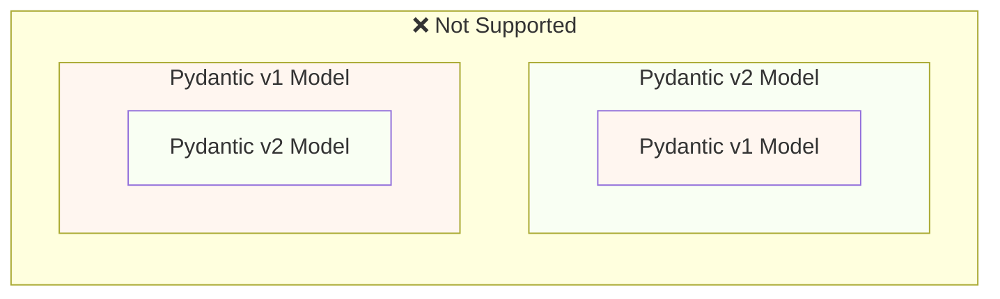
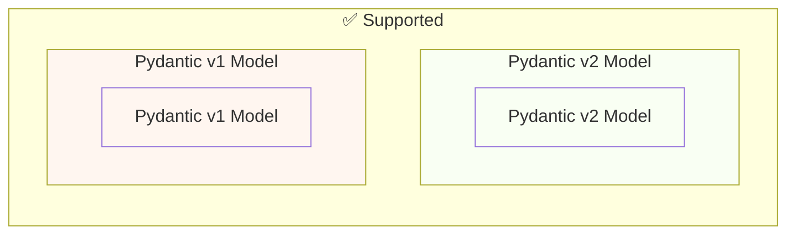

# Pydantic v1에서 Pydantic v2로 마이그레이션하기 { #migrate-from-pydantic-v1-to-pydantic-v2 }

오래된 FastAPI 앱이 있다면 Pydantic 버전 1을 사용하고 있을 수 있습니다.

FastAPI 0.100.0 버전은 Pydantic v1 또는 v2 중 하나를 지원했습니다. 설치되어 있는 쪽을 사용했습니다.

FastAPI 0.119.0 버전에서는 v2로의 마이그레이션을 쉽게 하기 위해, Pydantic v2 내부에서 Pydantic v1을(`pydantic.v1`로) 부분적으로 지원하기 시작했습니다.

FastAPI 0.126.0 버전에서는 Pydantic v1 지원을 중단했지만, `pydantic.v1`은 잠시 동안 계속 지원했습니다.

/// warning | 경고

Pydantic 팀은 **Python 3.14**부터 최신 Python 버전에서 Pydantic v1 지원을 중단했습니다.

여기에는 `pydantic.v1`도 포함되며, Python 3.14 이상에서는 더 이상 지원되지 않습니다.

Python의 최신 기능을 사용하려면 Pydantic v2를 사용하고 있는지 확인해야 합니다.

///

Pydantic v1을 사용하는 오래된 FastAPI 앱이 있다면, 여기서는 이를 Pydantic v2로 마이그레이션하는 방법과 점진적 마이그레이션을 돕는 **FastAPI 0.119.0의 기능**을 소개하겠습니다.

## 공식 가이드 { #official-guide }

Pydantic에는 v1에서 v2로의 공식 <a href="https://docs.pydantic.dev/latest/migration/" class="external-link" target="_blank">Migration Guide</a>가 있습니다.

여기에는 무엇이 바뀌었는지, 검증이 이제 어떻게 더 정확하고 엄격해졌는지, 가능한 주의사항 등도 포함되어 있습니다.

변경된 내용을 더 잘 이해하기 위해 읽어보면 좋습니다.

## 테스트 { #tests }

앱에 대한 [tests](../tutorial/testing.md){.internal-link target=_blank}가 있는지 확인하고, 지속적 통합(CI)에서 테스트를 실행하세요.

이렇게 하면 업그레이드를 진행하면서도 모든 것이 기대한 대로 계속 동작하는지 확인할 수 있습니다.

## `bump-pydantic` { #bump-pydantic }

많은 경우, 커스터마이징 없이 일반적인 Pydantic 모델을 사용하고 있다면 Pydantic v1에서 Pydantic v2로의 마이그레이션 과정 대부분을 자동화할 수 있습니다.

같은 Pydantic 팀이 제공하는 <a href="https://github.com/pydantic/bump-pydantic" class="external-link" target="_blank">`bump-pydantic`</a>를 사용할 수 있습니다.

이 도구는 변경해야 하는 코드의 대부분을 자동으로 바꾸는 데 도움을 줍니다.

그 다음 테스트를 실행해서 모든 것이 동작하는지 확인하면 됩니다. 잘 된다면 끝입니다. 😎

## v2 안의 Pydantic v1 { #pydantic-v1-in-v2 }

Pydantic v2는 Pydantic v1의 모든 것을 서브모듈 `pydantic.v1`로 포함합니다. 하지만 이는 Python 3.13보다 높은 버전에서는 더 이상 지원되지 않습니다.

즉, Pydantic v2의 최신 버전을 설치한 뒤, 이 서브모듈에서 예전 Pydantic v1 구성 요소를 import하여 예전 Pydantic v1을 설치한 것처럼 사용할 수 있습니다.

{* ../../docs_src/pydantic_v1_in_v2/tutorial001_an_py310.py hl[1,4] *}

### v2 안의 Pydantic v1에 대한 FastAPI 지원 { #fastapi-support-for-pydantic-v1-in-v2 }

FastAPI 0.119.0부터는 v2로의 마이그레이션을 쉽게 하기 위해, Pydantic v2 내부의 Pydantic v1에 대해서도 부분적인 지원이 있습니다.

따라서 Pydantic을 최신 v2로 업그레이드하고, import를 `pydantic.v1` 서브모듈을 사용하도록 바꾸면, 많은 경우 그대로 동작합니다.

{* ../../docs_src/pydantic_v1_in_v2/tutorial002_an_py310.py hl[2,5,15] *}

/// warning | 경고

Pydantic 팀이 Python 3.14부터 최신 Python 버전에서 Pydantic v1을 더 이상 지원하지 않으므로, `pydantic.v1`을 사용하는 것 역시 Python 3.14 이상에서는 지원되지 않는다는 점을 염두에 두세요.

///

### 같은 앱에서 Pydantic v1과 v2 함께 사용하기 { #pydantic-v1-and-v2-on-the-same-app }

Pydantic에서는 Pydantic v2 모델의 필드를 Pydantic v1 모델로 정의하거나 그 반대로 하는 것을 **지원하지 않습니다**.

...하지만 같은 앱에서 Pydantic v1과 v2를 사용하되, 모델을 분리해서 둘 수는 있습니다.

어떤 경우에는 FastAPI 앱의 같은 **경로 처리**에서 Pydantic v1과 v2 모델을 함께 사용하는 것도 가능합니다:

{* ../../docs_src/pydantic_v1_in_v2/tutorial003_an_py310.py hl[2:3,6,12,21:22] *}

위 예제에서 입력 모델은 Pydantic v1 모델이고, 출력 모델(`response_model=ItemV2`로 정의됨)은 Pydantic v2 모델입니다.

### Pydantic v1 파라미터 { #pydantic-v1-parameters }

Pydantic v1 모델과 함께 `Body`, `Query`, `Form` 등 파라미터용 FastAPI 전용 도구 일부를 사용해야 한다면, Pydantic v2로의 마이그레이션을 마칠 때까지 `fastapi.temp_pydantic_v1_params`에서 import할 수 있습니다:

{* ../../docs_src/pydantic_v1_in_v2/tutorial004_an_py310.py hl[4,18] *}

### 단계적으로 마이그레이션하기 { #migrate-in-steps }

/// tip | 팁

먼저 `bump-pydantic`로 시도해 보세요. 테스트가 통과하고 잘 동작한다면, 한 번의 명령으로 끝입니다. ✨

///

`bump-pydantic`가 여러분의 사용 사례에 맞지 않는다면, 같은 앱에서 Pydantic v1과 v2 모델을 모두 지원하는 기능을 이용해 Pydantic v2로 점진적으로 마이그레이션할 수 있습니다.

먼저 Pydantic을 최신 v2로 업그레이드하고, 모든 모델의 import를 `pydantic.v1`을 사용하도록 바꿀 수 있습니다.

그 다음 Pydantic v1에서 v2로 모델을 그룹 단위로, 점진적인 단계로 마이그레이션을 시작하면 됩니다. 🚶
