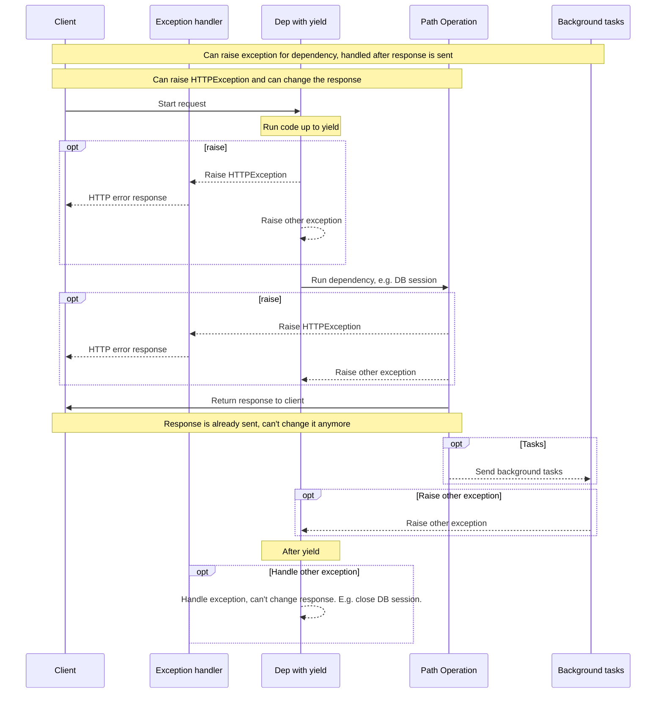

# yield를 사용한 의존성

FastAPI는 <abbr title='때때로 "종료", "정리", "해제", "닫기", "컨텍스트 관리자" 등으로 불리는'>종료 이후의 추가적인 단계</abbr>를 작업하는 의존성을 지원합니다.

이를 지원하기 위해서는, `return` 대신 `yield`를 사용하고, 이후 추가적인 단계를 작성합니다.

!!! tip "팁"
    `yield`를 단 한 번만 사용해야 하는 걸 명심하기 바랍니다.

!!! note "기술적 세부사항""
    다음과 함께 사용할 수 있는 유효한 함수는:

    * <a href="https://docs.python.org/3/library/contextlib.html#contextlib.contextmanager" class="external-link" target="_blank">`@contextlib.contextmanager`</a> 또는 
    * <a href="https://docs.python.org/3/library/contextlib.html#contextlib.asynccontextmanager" class="external-link" target="_blank">`@contextlib.asynccontextmanager`</a>

    **FastAPI** 의존성으로 사용하는 데 유효합니다.

    사실, FastAPI는 내부적으로 이 두 데코레이터를 사용합니다.

## `yield`를 사용한 데이터베이스 의존성

예를 들어, 이것을 사용하여 데이터베이스 세션을 만들고 종료 이후 닫을 수 있습니다.

`yield` 문장 앞의 코드만이 응답을 전달하기 이전에 실행됩니다:

```Python hl_lines="2-4"
{!../../../docs_src/dependencies/tutorial007.py!}
```

생성된 값은 *경로 작동* 및 다른 의존성에 주입되어야 하는 것입니다:

```Python hl_lines="4"
{!../../../docs_src/dependencies/tutorial007.py!}
```

`yield` 문장 다음에 오는 코드는 응답이 전달된 이후 실행됩니다:

```Python hl_lines="5-6"
{!../../../docs_src/dependencies/tutorial007.py!}
```

!!! tip "팁"
    `async` 또는 보통의 함수를 사용할 수 있습니다.
    
    **FastAPI**는 보통의 의존성을 사용했던 것과 동일하게, 각각에 알맞은 작업을 수행합니다.

## `yield` 및 `try`을 사용한 의존성

`yield`를 사용한 의존성 내에 `try` 블록를 사용할 경우, 의존성을 사용할 때 발생하는 모든 예외를 전달 받을 것입니다.

예를 들어, 어떤 부분의 중간, 다른 의존성 또는 *경로 작동* 내부의 어떤 코드가, 데이터베이스 트랜잭션 "롤백"을 만들거나 다른 오류를 생성하는 경우, 의존성 내부에서 예외를 전달 받게 됩니다.

따라서, `except SomeException`을 사용하여 의존성 내부의 해당 특정 예외를 찾을 수 있습니다.

동일한 방법으로, 예외와 상관 없이, `finally`를 사용하여 확실하게 종료 단계가 실행되었는지 확인할 수 있습니다.

```Python hl_lines="3  5"
{!../../../docs_src/dependencies/tutorial007.py!}
```

## `yield`를 사용한 하위-의존성

하위-의존성 또는 모든 크기와 모양의 하위-의존성 "트리"를 가질 수 있으며, 이들 중 일부 또는 모두가 `yield`를 사용할 수 있습니다.

**FastAPI**는 `yield`를 사용한 각각의 의존성 내부의 "종료 코드"가 올바른 순서로 실행하는 지 확인 합니다.

예를 들어, `dependency_c`는 `dependency_b`에 의존성을 갖고, `dependency_b`는 `dependency_a`에 의존성을 가질 수 있습니다:

```Python hl_lines="4  12  20"
{!../../../docs_src/dependencies/tutorial008.py!}
```

그리고 이 모든 것은 `yield`를 사용할 수 있습니다.

`dependency_c`의 경우, 종료 코드를 실행하기 위해, 계속 사용할 수 있는 (여기서 `dep_b`라 명명된) `dependency_b`의 값을 필요로 합니다.

그리고, 순서대로, `dependency_b`는 종료 코드를 실행하기 위해 사용할 수 있는 (여기서 `dep_a`라 명명된) `dependency_a`의 값을 필요로 합니다.

```Python hl_lines="16-17  24-25"
{!../../../docs_src/dependencies/tutorial008.py!}
```

동일한 방법으로, `yield` 및 `return`을 혼합하여 사용한 의존성을 가질 수 있습니다.

그리고 `yield`, 기타 등등을 사용하여 여러 다른 의존성을 요구하는 단일 의존성을 가질 수 있습니다.

원하는 어떤 의존성 조합도 가질 수 있습니다.

**FastAPI**는 모든 것이 올바른 순서대로 실행하는 지 확인합니다.

!!! note "기술적 세부사항"
    이것은 파이썬의 <a href="https://docs.python.org/3/library/contextlib.html" class="external-link" target="_blank">컨텍스트 관리자</a> 덕분에 동작합니다.

    **FastAPI**는 이를 달성하기 위해 내부적으로 그것들을 사용합니다.

## `yield` 및 `HTTPException`을 사용한 의존성

`yield`를 사용한 의존성 및 예외를 잡는 `try` 블록을 가질 수 있다는 걸 봤습니다.

`yield` 이후에, 종료 코드 내부에서 `HTTPException` 또는 이와 유사한 것을 발생시키고 싶을 수 있으나 **이것은 작동하지 않습니다**.

`yield`를 사용한 의존성 내부의 종료 코드는 [예외 처리](../handling-errors.md#install-custom-exception-handlers){.internal-link target=_blank}] *이후* 실행됩니다. (`yield` 이후의) 종료 코드 내부 의존성에 의해 발생하는 예외를 잡을 방법은 없습니다.

따라서, `yield` 이후 `HTTPException`을 발생시킨다면, `HTTPException`을 잡고 HTTP 400 응답을 반환하는 기본 (또는 어떤 사용자 정의) 예외 처리는 해당 예외를 더이상 잡지 못합니다.

이것은 종속성 (예를 들어 DB 세션) 에 설정된 모든 것을, 예를 들어, 백그라운드 작업에서 사용될 수 있게 합니다.

백그라운드 작업은 응답이 발송된 이후 *이후* 실행됩니다. 따라서 *이미 전달된* 응답을 변경할 방법이 존재하지 않기 때문에 `HTTPException`를 발생시킬 방법이 없습니다.

그러나 백그라운드 작업이 DB 오류를 생성한다면, 최소한 `yield`를 사용하여 세션을 롤백하거나 완전히 닫을 수 있으며, 오류를 기록하거나 원격 추적 시스템에 보고할 수 있습니다.

만약 예외를 발생시킬 코드가 있는 경우, 가장 일반적인 "파이써닉"한 작업을 수행하고 코드의 해당 부분에 `try` 블록을 추가하기 바랍니다.

만약, 응답을 반환하고 아마도 수정하거나, 심지어 `HTTPException`을 발생시키기, *이전*에 처리하기를 원하는 사용자 정의 예외를 갖기를 원한다면, [사용자 정의 예외 처리](../handling-errors.md#install-custom-exception-handlers){.internal-link target=_blank}를 생성하기 바랍니다.

!!! tip "팁"
    여전히 `HTTPException`을 포함하여 `yield` 이후가 아닌 *이전*에 예외를 발생시킬 수 있습니다.

실행 순서는 이 다이어그램과 다소 비슷합니다. 시간은 위에서부터 아래로 흐릅니다. 그리고 각각의 열은 상호 작용하거나 코드를 실행하는 부분 중 하나입니다.



!!! info "정보"
    오로지 **하나의 응답**만이 클라이언트에게 전송됩니다. 이것은 오류 응답 중 하나이거나 *경로 작동*의 응답일 수 있습니다.
    
    이 응답 중 하나가 전송된 이후, 다른 응답은 전송될 수 없습니다.

!!! tip "팁"
    이 다이어그램은 `HTTPException`을 보여줍니다, 그러나 생성한 [사용자 정의 예외 처리](../handling-errors.md#install-custom-exception-handlers){.internal-link target=_blank}에 대한 어떤 다른 예외도 발생시킬 수 있습니다. 그리고 그 예외는 의존성 종료 코드 대신 사용자 정의 예외 처리에 의해 처리됩니다.

    그러나 만약 예외 처리에 의해 처리되지 않는 예외를 발생시킨다면, 의존성의 종료 코드에 의해 처리됩니다.

## 컨텍스트 관리자

### "컨텍스트 관리자"란 무엇인가

"컨텍스트 관리자"는 `with` 문장에서 사용할 수 있는 파이썬 객체 중 하나입니다.

예를 들어, <a href="https://docs.python.org/3/tutorial/inputoutput.html#reading-and-writing-files" class="external-link" target="_blank">파일을 읽는 데 `with`을 사용할 수 있습니다</a>:

```Python
with open("./somefile.txt") as f:
    contents = f.read()
    print(contents)
```

그 아래, `open("./somefile.txt")`은 "컨텍스트 관리자"라 불리는 객체를 생성합니다.

`with` 블록이 종료되었을 때, 예외가 존재 하더라도, 파일을 닫았는 지 확인합니다.

`yield`를 사용한 의존성을 생성할 때, **FastAPI**는 이를 내부적으로 컨텍스트 매니저로 전환하고, 다른 연관된 도구와 함께 조합합니다.

### `yield`를 사용한 의존성 내부에 컨텍스트 관리자 사용

!!! warning "주의"
    이것은, 다소, "숙련된" 개념입니다.

    만약 **FastAPI**를 막 시작했다면 지금 당장은 생략할 수 있습니다.

파이썬에서, <a href="https://docs.python.org/3/reference/datamodel.html#context-managers" class="external-link" target="_blank">다음 두 메서드: `__enter__()` 및 `__exit__()`를 사용한 클래스를 생성하여</a> 컨텍스트 매니저를 생성할 수 있습니다.

의존성 함수 내부에서 `with` 또는 `async with` 문장을 사용하여 `yield`를 사용한 **FastAPI** 의존성 내부에 그것들을 사용할 수 있습니다:

```Python hl_lines="1-9  13"
{!../../../docs_src/dependencies/tutorial010.py!}
```

!!! tip "팁"
    다음을 사용하여 컨텍스트 관리자를 생성하는 다른 방법은:

    * <a href="https://docs.python.org/3/library/contextlib.html#contextlib.contextmanager" class="external-link" target="_blank">`@contextlib.contextmanager`</a> 또는
    * <a href="https://docs.python.org/3/library/contextlib.html#contextlib.asynccontextmanager" class="external-link" target="_blank">`@contextlib.asynccontextmanager`</a>

    이것들을 사용하여 단일 `yield`로 함수에 데코레이트하는 것입니다.

    이것이 **FastAPI**가 `yield`를 사용한 의존성을 내부적으로 사용하는 방식입니다.

    그러나 FastAPI 의존성에 대해 데코레이터를 사용할 필요가 없습니다 (그리고 그래서도 안 됩니다).

    FastAPI는 내부적으로 이를 대신 수행합니다.
