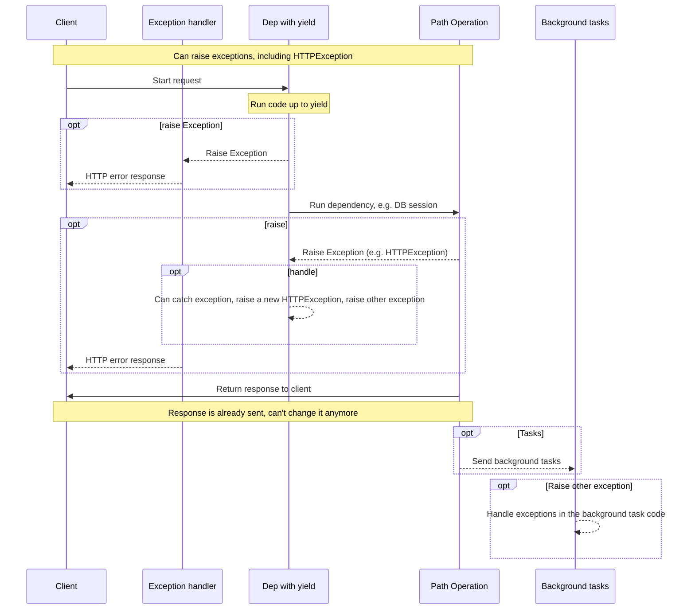

# yield를 사용하는 의존성

FastAPI는 <abbr title='때로는 "종료 코드", "정리 코드", "종료 처리 코드", "닫기 코드", "컨텍스트 관리자 종료 코드" 등으로도 불립니다'>작업 완료 후 추가 단계를 수행하는</abbr> 의존성을 지원합니다.

이를 구현하려면 `return` 대신 `yield`를 사용하고, 추가로 실행할 단계 (코드)를 그 뒤에 작성하세요.

/// tip | 팁

각 의존성마다 `yield`는 한 번만 사용해야 합니다.

///

/// note | 기술 세부사항

다음과 함께 사용할 수 있는 모든 함수:

* <a href="https://docs.python.org/3/library/contextlib.html#contextlib.contextmanager" class="external-link" target="_blank">`@contextlib.contextmanager`</a> 또는
* <a href="https://docs.python.org/3/library/contextlib.html#contextlib.asynccontextmanager" class="external-link" target="_blank">`@contextlib.asynccontextmanager`</a>

는 **FastAPI**의 의존성으로 사용할 수 있습니다.

사실, FastAPI는 내부적으로 이 두 데코레이터를 사용합니다.

///

## `yield`를 사용하는 데이터베이스 의존성

예를 들어, 이 기능을 사용하면 데이터베이스 세션을 생성하고 작업이 끝난 후에 세션을 종료할 수 있습니다.

응답을 생성하기 전에는 `yield`문을 포함하여 그 이전의 코드만이 실행됩니다:

{* ../../docs_src/dependencies/tutorial007.py hl[2:4] *}

yield된 값은 *경로 작업* 및 다른 의존성들에 주입되는 값 입니다:

{* ../../docs_src/dependencies/tutorial007.py hl[4] *}

`yield`문 다음의 코드는 응답을 생성한 후 보내기 전에 실행됩니다:

{* ../../docs_src/dependencies/tutorial007.py hl[5:6] *}

/// tip | 팁

`async` 함수와 일반 함수 모두 사용할 수 있습니다.

**FastAPI**는 일반 의존성과 마찬가지로 각각의 함수를 올바르게 처리할 것입니다.

///

## `yield`와 `try`를 사용하는 의존성

`yield`를 사용하는 의존성에서 `try` 블록을 사용한다면, 의존성을 사용하는 도중 발생한 모든 예외를 받을 수 있습니다.

예를 들어, 다른 의존성이나 *경로 작업*의 중간에 데이터베이스 트랜잭션 "롤백"이 발생하거나 다른 오류가 발생한다면, 해당 예외를 의존성에서 받을 수 있습니다.

따라서, 의존성 내에서 `except SomeException`을 사용하여 특정 예외를 처리할 수 있습니다.

마찬가지로, `finally`를 사용하여 예외 발생 여부와 관계 없이 종료 단계까 실행되도록 할 수 있습니다.

{* ../../docs_src/dependencies/tutorial007.py hl[3,5] *}

## `yield`를 사용하는 하위 의존성

모든 크기와 형태의 하위 의존성과 하위 의존성의 "트리"도 가질 수 있으며, 이들 모두가 `yield`를 사용할 수 있습니다.

**FastAPI**는 `yield`를 사용하는 각 의존성의 "종료 코드"가 올바른 순서로 실행되도록 보장합니다.

예를 들어, `dependency_c`는 `dependency_b`에 의존할 수 있고, `dependency_b`는 `dependency_a`에 의존할 수 있습니다.

{* ../../docs_src/dependencies/tutorial008_an_py39.py hl[6,14,22] *}

이들 모두는 `yield`를 사용할 수 있습니다.

이 경우 `dependency_c`는 종료 코드를 실행하기 위해, `dependency_b`의 값 (여기서는 `dep_b`로 명명)이 여전히 사용 가능해야 합니다.

그리고, `dependency_b`는 종료 코드를 위해 `dependency_a`의 값 (여기서는 `dep_a`로 명명) 이 사용 가능해야 합니다.

{* ../../docs_src/dependencies/tutorial008_an_py39.py hl[18:19,26:27] *}

같은 방식으로, `yield`를 사용하는 의존성과 `return`을 사용하는 의존성을 함께 사용할 수 있으며, 이들 중 일부가 다른 것들에 의존할 수 있습니다.

그리고 `yield`를 사용하는 다른 여러 의존성을 필요로 하는 단일 의존성을 가질 수도 있습니다.

원하는 의존성을 원하는 대로 조합할 수 있습니다.

**FastAPI**는 모든 것이 올바른 순서로 실행되도록 보장합니다.

/// note | 기술 세부사항

파이썬의 <a href=“https://docs.python.org/3/library/contextlib.html” class=“external-link” target=“_blank”>Context Managers</a> 덕분에 이 기능이 작동합니다.

**FastAPI**는 이를 내부적으로 컨텍스트 관리자를 사용하여 구현합니다.

///

## `yield`와 `HTTPException`를 사용하는 의존성

`yield`와 `try` 블록이 있는 의존성을 사용하여 예외를 처리할 수 있다는 것을 알게 되었습니다.

같은 방식으로, `yield` 이후의 종료 코드에서 `HTTPException`이나 유사한 예외를 발생시킬 수 있습니다.

/// tip | 팁

이는 다소 고급 기술이며, 대부분의 경우 경로 연산 함수 등 나머지 애플리케이션 코드 내부에서 예외 (`HTTPException` 포함)를 발생시킬 수 있으므로 실제로는 필요하지 않을 것입니다.

하지만 필요한 경우 사용할 수 있습니다. 🤓

///

{* ../../docs_src/dependencies/tutorial008b_an_py39.py hl[18:22,31] *}

예외를 처리하고(또는 추가로 다른 `HTTPException`을 발생시키기 위해) 사용할 수 있는 또 다른 방법은 [사용자 정의 예외 처리기](../handling-errors.md#install-custom-exception-handlers){.internal-link target=_blank}를 생성하는 것 입니다.

## `yield`와 `except`를 사용하는 의존성

`yield`를 사용하는 의존성에서 `except`를 사용하여 예외를 포착하고 예외를 다시 발생시키지 않거나 (또는 새 예외를 발생시키지 않으면), FastAPI는 해당 예외가 발생했는지 알 수 없습니다. 이는 일반적인 Python 방식과 동일합니다:

{* ../../docs_src/dependencies/tutorial008c_an_py39.py hl[15:16] *}

이 경우, `HTTPException`이나 유사한 예외를 발생시키지 않기 때문에 클라이언트는 HTTP 500 Internal Server Error 응답을 보게 되지만, 서버는 어떤 오류가 발생했는지에 대한 **로그**나 다른 표시를 전혀 가지지 않게 됩니다. 😱

### `yield`와 `except`를 사용하는 의존성에서 항상 `raise` 하기

`yield`가 있는 의존성에서 예외를 잡았을 때는 `HTTPException`이나 유사한 예외를 새로 발생시키지 않는 한, 반드시 원래의 예외를 다시 발생시켜야 합니다.

`raise`를 사용하여 동일한 예외를 다시 발생시킬 수 있습니다:

{* ../../docs_src/dependencies/tutorial008d_an_py39.py hl[17] *}

이제 클라이언트는 동일한 *HTTP 500 Internal Server Error* 오류 응답을 받게 되지만, 서버 로그에는 사용자 정의 예외인 `InternalError"가 기록됩니다. 😎

## `yield`를 사용하는 의존성의 실행 순서

실행 순서는 아래 다이어그램과 거의 비슷합니다. 시간은 위에서 아래로 흐릅니다. 그리고 각 열은 상호 작용하거나 코드를 실행하는 부분 중 하나입니다.



/// info | 정보

클라이언트에 **하나의 응답** 만 전송됩니다. 이는 오류 응답 중 하나일 수도 있고,*경로 작업*에서 생성된 응답일 수도 있습니다.

이러한 응답 중 하나가 전송된 후에는 다른 응답을 보낼 수 없습니다.

///

/// tip | 팁

이 다이어그램은 `HTTPException`을 보여주지만, `yield`를 사용하는 의존성에서 처리한 예외나 [사용자 정의 예외처리기](../handling-errors.md#install-custom-exception-handlers){.internal-link target=_blank}.를 사용하여 처리한 다른 예외도 발생시킬 수 있습니다.

어떤 예외가 발생하든, `HTTPException`을 포함하여 yield를 사용하는 의존성으로 전달됩니다. 대부분의 경우 예외를 다시 발생시키거나 새로운 예외를 발생시켜야 합니다.

///

## `yield`, `HTTPException`, `except` 및 백그라운드 작업을 사용하는 의존성

/// warning | 경고

이러한 기술적 세부 사항은 대부분 필요하지 않으므로 이 섹션을 건너뛰고 아래에서 계속 진행해도 됩니다.

이러한 세부 정보는 주로 FastAPI 0.106.0 이전 버전에서 `yield`가 있는 의존성의 리소스를 백그라운드 작업에서 사용했던 경우메 유용합니다.

///

### `yield`와 `except`를 사용하는 의존성, 기술 세부사항

FastAPI 0.110.0 이전에는 `yield`가 포함된 의존성을 사용한 후 해당 의존성에서 `except`가 포함된 예외를 캡처하고 다시 예외를 발생시키지 않으면 예외가 자동으로 예외 핸들러 또는 내부 서버 오류 핸들러로 발생/전달되었습니다.

이는 처리기 없이 전달된 예외(내부 서버 오류)에서 처리되지 않은 메모리 소비를 수정하고 일반 파이썬 코드의 동작과 일치하도록 하기 위해 0.110.0 버전에서 변경되었습니다.

### 백그라운드 작업과 `yield`를 사용하는 의존성, 기술 세부사항

FastAPI 0.106.0 이전에는 `yield` 이후에 예외를 발생시키는 것이 불가능했습니다. `yield`가 있는 의존성 종료 코드는 응답이 전송된 이후에 실행되었기 때문에, [예외 처리기](../handling-errors.md#install-custom-exception-handlers){.internal-link target=_blank}가 이미 실행된 상태였습니다.

이는 주로 백그라운드 작업 내에서 의존성에서 "yield된" 동일한 객체를 사용할 수 있도록 하기 위해 이런 방식으로 설계되었습니다. 종료 코드는 백그라운드 작업이 완료된 후에 실행되었기 때문입니다

하지만 이렇게 하면 리소스를 불필요하게 양보한 의존성(예: 데이터베이스 연결)에서 보유하면서 응답이 네트워크를 통해 이동할 때까지 기다리는 것을 의미하기 때문에 FastAPI 0.106.0에서 변경되었습니다.

/// tip | 팁

또한 백그라운드 작업은 일반적으로 자체 리소스(예: 자체 데이터베이스 연결)를 사용하여 별도로 처리해야 하는 독립적인 로직 집합입니다.

따라서 이렇게 하면 코드가 더 깔끔해집니다.

///

만약 이전에 이러한 동작에 의존했다면, 이제는 백그라운드 작업 내부에서 백그라운드 작업을 위한 리소스를 생성하고, `yield`가 있는 의존성의 리소스에 의존하지 않는 데이터만 내부적으로 사용해야합니다.

예를 들어, 동일한 데이터베이스 세션을 사용하는 대신, 백그라운드 작업 내부에서 새로운 데이터베이스 세션을 생성하고 이 새로운 세션을 사용하여 데이터베이스에서 객체를 가져와야 합니다. 그리고 데이터베이스 객체를 백그라운드 작업 함수의 매개변수로 직접 전달하는 대신, 해당 객체의 ID를 전달한 다음 백그라운드 작업 함수 내부에서 객체를 다시 가져와야 합니다

## 컨텍스트 관리자

### "컨텍스트 관리자"란?

"컨텍스트 관리자"는 Python에서 `with` 문에서 사용할 수 있는 모든 객체를 의미합니다.

예를 들어, <a href="https://docs.python.org/3/tutorial/inputoutput.html#reading-and-writing-files" class="external-link" target="_blank"> `with`를 사용하여 파일을 읽을 수 있습니다</a>:

```Python
with open("./somefile.txt") as f:
    contents = f.read()
    print(contents)
```

내부적으로 `open("./somefile.txt")` 는 "컨텍스트 관리자(Context Manager)"라고 불리는 객체를 생성합니다.

`with` 블록이 끝나면, 예외가 발생했더라도 파일을 닫도록 보장합니다.

`yield`가 있는 의존성을 생성하면 **FastAPI**는 내부적으로 이를 위한 컨텍스트 매니저를 생성하고 다른 관련 도구들과 결합합니다.

### `yield`를 사용하는 의존성에서 컨텍스트 관리자 사용하기

/// warning | 경고

이것은 어느 정도 "고급" 개념입니다.

**FastAPI**를 처음 시작하는 경우 지금은 이 부분을 건너뛰어도 좋습니다.

///

Python에서는 다음을 통해 컨텍스트 관리자를 생성할 수 있습니다. <a href="https://docs.python.org/3/reference/datamodel.html#context-managers" class="external-link" target="_blank"> 두 가지 메서드가 있는 클래스를 생성합니다: `__enter__()` and `__exit__()`</a>.

**FastAPI**의 `yield`가 있는 의존성 내에서
`with` 또는 `async with`문을 사용하여 이들을 활용할 수 있습니다:

{* ../../docs_src/dependencies/tutorial010.py hl[1:9,13] *}

/// tip | 팁

컨텍스트 관리자를 생성하는 또 다른 방법은 다음과 같습니다:

* <a href="https://docs.python.org/3/library/contextlib.html#contextlib.contextmanager" class="external-link" target="_blank">`@contextlib.contextmanager`</a> 또는
* <a href="https://docs.python.org/3/library/contextlib.html#contextlib.asynccontextmanager" class="external-link" target="_blank">`@contextlib.asynccontextmanager`</a>

이들은 단일 `yield`가 있는 함수를 꾸미는 데 사용합니다.

이것이 **FastAPI**가 `yield`가 있는 의존성을 위해 내부적으로 사용하는 방식입니다.

하지만 FastAPI 의존성에는 이러한 데코레이터를 사용할 필요가 없습니다(그리고 사용해서도 안됩니다).

FastAPI가 내부적으로 이를 처리해 줄 것입니다.

///
