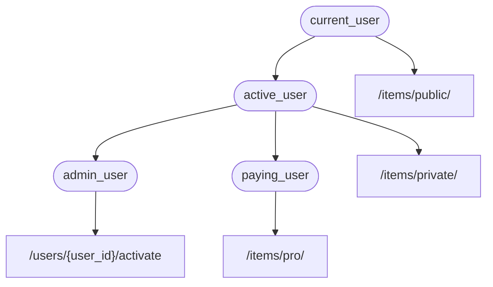

# 의존성

**FastAPI**는 아주 강력하지만 직관적인 **<abbr title="컴포넌트, 자원, 제공자, 서비스, 인젝터블로 알려져 있습니다">의존성 주입</abbr>** 시스템을 가지고 있습니다.

이는 사용하기 아주 쉽게 설계했으며, 어느 개발자나 다른 컴포넌트와 **FastAPI**를 쉽게 통합할 수 있도록 만들었습니다.

## "의존성 주입"은 무엇입니까?

**"의존성 주입"**은 프로그래밍에서 여러분의 코드(이 경우, 경로 작동 함수)가 작동하고 사용하는 데 필요로 하는 것, 즉 "의존성"을 선언할 수 있는 방법을 의미합니다.

그 후에, 시스템(이 경우 FastAPI)은 여러분의 코드가 요구하는 의존성을 제공하기 위해 필요한 모든 작업을 처리합니다.(의존성을 "주입"합니다)

이는 여러분이 다음과 같은 사항을 필요로 할 때 매우 유용합니다:

* 공용된 로직을 가졌을 경우 (같은 코드 로직이 계속 반복되는 경우).
* 데이터베이스 연결을 공유하는 경우.
* 보안, 인증, 역할 요구 사항 등을 강제하는 경우.
* 그리고 많은 다른 사항...

이 모든 사항을 할 때 코드 반복을 최소화합니다.

## 첫번째 단계

아주 간단한 예제를 봅시다. 너무 간단할 것이기에 지금 당장은 유용하지 않을 수 있습니다.

하지만 이를 통해 **의존성 주입** 시스템이 어떻게 작동하는지에 중점을 둘 것입니다.

### 의존성 혹은 "디펜더블" 만들기

의존성에 집중해 봅시다.

*경로 작동 함수*가 가질 수 있는 모든 매개변수를 갖는 단순한 함수입니다:

{* ../../docs_src/dependencies/tutorial001_an_py310.py hl[8:9] *}

이게 다입니다.

**단 두 줄입니다**.

그리고, 이 함수는 여러분의 모든 *경로 작동 함수*가 가지고 있는 것과 같은 형태와 구조를 가지고 있습니다.

여러분은 이를 "데코레이터"가 없는 (`@app.get("/some-path")`가 없는) *경로 작동 함수*라고 생각할 수 있습니다.

그리고 여러분이 원하는 무엇이든 반환할 수 있습니다.

이 경우, 이 의존성은 다음과 같은 경우를 기대합니다:

* 선택적인 쿼리 매개변수 `q`, `str`을 자료형으로 가집니다.
* 선택적인 쿼리 매개변수 `skip`, `int`를 자료형으로 가지며 기본 값은 `0`입니다.
* 선택적인 쿼리 매개변수 `limit`,`int`를 자료형으로 가지며 기본 값은 `100`입니다.

그 후 위의 값을 포함한 `dict` 자료형으로 반환할 뿐입니다.

/// info | 정보

FastAPI는 0.95.0 버전부터 `Annotated`에 대한 지원을 (그리고 이를 사용하기 권장합니다) 추가했습니다.

옛날 버전을 가지고 있는 경우, `Annotated`를 사용하려 하면 에러를 맞이하게 될 것입니다.

`Annotated`를 사용하기 전에 최소 0.95.1로 [FastAPI 버전 업그레이드](../../deployment/versions.md#fastapi_2){.internal-link target=_blank}를 확실하게 하세요.

///

### `Depends` 불러오기

{* ../../docs_src/dependencies/tutorial001_an_py310.py hl[3] *}

### "의존자"에 의존성 명시하기

*경로 작동 함수*의 매개변수로 `Body`, `Query` 등을 사용하는 방식과 같이 새로운 매개변수로 `Depends`를 사용합니다:

{* ../../docs_src/dependencies/tutorial001_an_py310.py hl[13,18] *}

비록 `Body`, `Query` 등을 사용하는 것과 같은 방식으로 여러분의 함수의 매개변수에 있는 `Depends`를 사용하지만, `Depends`는 약간 다르게 작동합니다.

`Depends`에 단일 매개변수만 전달했습니다.

이 매개변수는 함수같은 것이어야 합니다.

여러분은 직접 **호출하지 않았습니다** (끝에 괄호를 치지 않았습니다), 단지 `Depends()`에 매개변수로 넘겨 줬을 뿐입니다.

그리고 그 함수는 *경로 작동 함수*가 작동하는 것과 같은 방식으로 매개변수를 받습니다.

/// tip | 팁

여러분은 다음 장에서 함수를 제외하고서, "다른 것들"이 어떻게 의존성으로 사용되는지 알게 될 것입니다.

///

새로운 요청이 도착할 때마다, **FastAPI**는 다음을 처리합니다:

* 올바른 매개변수를 가진 의존성("디펜더블") 함수를 호출합니다.
* 함수에서 결과를 받아옵니다.
* *경로 작동 함수*에 있는 매개변수에 그 결과를 할당합니다


이렇게 하면 공용 코드를 한번만 적어도 되며, **FastAPI**는 *경로 작동*을 위해 이에 대한 호출을 처리합니다.

/// check | 확인

특별한 클래스를 만들지 않아도 되며, 이러한 것 혹은 비슷한 종류를 **FastAPI**에 "등록"하기 위해 어떤 곳에 넘겨주지 않아도 됩니다.

단순히 `Depends`에 넘겨주기만 하면 되며, **FastAPI**는 나머지를 어찌할지 알고 있습니다.

///

## `Annotated`인 의존성 공유하기

위의 예제에서 몇몇 작은 **코드 중복**이 있다는 것을 보았을 겁니다.

`common_parameters()`의존을 사용해야 한다면, 타입 명시와 `Depends()`와 함께 전체 매개변수를 적어야 합니다:

```Python
commons: Annotated[dict, Depends(common_parameters)]
```

하지만 `Annotated`를 사용하고 있기에, `Annotated` 값을 변수에 저장하고 여러 장소에서 사용할 수 있습니다:

{* ../../docs_src/dependencies/tutorial001_02_an_py310.py hl[12,16,21] *}

/// tip | 팁

이는 그저 표준 파이썬이고 "type alias"라고 부르며 사실 **FastAPI**에 국한되는 것은 아닙니다.

하지만, `Annotated`를 포함하여, **FastAPI**가 파이썬 표준을 기반으로 하고 있기에, 이를 여러분의 코드 트릭으로 사용할 수 있습니다. 😎

///

이 의존성은 계속해서 예상한대로 작동할 것이며, **제일 좋은 부분**은 **타입 정보가 보존된다는 것입니다**. 즉 여러분의 편집기가 **자동 완성**, **인라인 에러** 등을 계속해서 제공할 수 있다는 것입니다. `mypy`같은 다른 도구도 마찬가지입니다.

이는 특히 **많은 *경로 작동***에서 **같은 의존성**을 계속해서 사용하는 **거대 코드 기반**안에서 사용하면 유용할 것입니다.

## `async`하게, 혹은 `async`하지 않게

의존성이 (*경로 작동 함수*에서 처럼 똑같이) **FastAPI**에 의해 호출될 수 있으며, 함수를 정의할 때 동일한 규칙이 적용됩니다.

`async def`을 사용하거나 혹은 일반적인 `def`를 사용할 수 있습니다.

그리고 일반적인 `def` *경로 작동 함수* 안에 `async def`로 의존성을 선언할 수 있으며, `async def` *경로 작동 함수* 안에 `def`로 의존성을 선언하는 등의 방법이 있습니다.

아무 문제 없습니다. **FastAPI**는 무엇을 할지 알고 있습니다.

/// note | 참고

잘 모르시겠다면, [Async: *"In a hurry?"*](../../async.md){.internal-link target=_blank} 문서에서 `async`와 `await`에 대해 확인할 수 있습니다.

///

## OpenAPI와 통합

모든 요청 선언, 검증과 의존성(및 하위 의존성)에 대한 요구 사항은 동일한 OpenAPI 스키마에 통합됩니다.

따라서 대화형 문서에 이러한 의존성에 대한 모든 정보 역시 포함하고 있습니다:


## 간단한 사용법

이를 보면, *경로 작동 함수*는 *경로*와 *작동*이 매칭되면 언제든지 사용되도록 정의되었으며, **FastAPI**는 올바른 매개변수를 가진 함수를 호출하고 해당 요청에서 데이터를 추출합니다.

사실, 모든 (혹은 대부분의) 웹 프레임워크는 이와 같은 방식으로 작동합니다.

여러분은 이러한 함수들을 절대 직접 호출하지 않습니다. 프레임워크(이 경우 **FastAPI**)에 의해 호출됩니다.

의존성 주입 시스템과 함께라면 **FastAPI**에게 여러분의 *경로 작동 함수*가 실행되기 전에 실행되어야 하는 무언가에 여러분의 *경로 작동 함수* 또한 "의존"하고 있음을 알릴 수 있으며, **FastAPI**는 이를 실행하고 결과를 "주입"할 것입니다.

"의존성 주입"이라는 동일한 아이디어에 대한 다른 일반적인 용어는 다음과 같습니다:

* 리소스
* 제공자
* 서비스
* 인젝터블
* 컴포넌트

## **FastAPI** 플러그인

통합과 "플러그인"은 **의존성 주입** 시스템을 사용하여 구축할 수 있습니다. 하지만 실제로 **"플러그인"을 만들 필요는 없습니다**, 왜냐하면 의존성을 사용함으로써 여러분의 *경로 작동 함수*에 통합과 상호 작용을 무한대로 선언할 수 있기 때문입니다.

그리고 "말 그대로", 그저 필요로 하는 파이썬 패키지를 임포트하고 단 몇 줄의 코드로 여러분의 API 함수와 통합함으로써, 의존성을 아주 간단하고 직관적인 방법으로 만들 수 있습니다.

관계형 및 NoSQL 데이터베이스, 보안 등, 이에 대한 예시를 다음 장에서 볼 수 있습니다.

## **FastAPI** 호환성

의존성 주입 시스템의 단순함은 **FastAPI**를 다음과 같은 요소들과 호환할 수 있게 합니다:

* 모든 관계형 데이터베이스
* NoSQL 데이터베이스
* 외부 패키지
* 외부 API
* 인증 및 권한 부여 시스템
* API 사용 모니터링 시스템
* 응답 데이터 주입 시스템
* 기타 등등.

## 간편하고 강력하다

계층적인 의존성 주입 시스템은 정의하고 사용하기 쉽지만, 여전히 매우 강력합니다.

여러분은 스스로를 의존하는 의존성을 정의할 수 있습니다.

끝에는, 계층적인 나무로 된 의존성이 만들어지며, 그리고 **의존성 주입** 시스템은 (하위 의존성도 마찬가지로) 이러한 의존성들을 처리하고 각 단계마다 결과를 제공합니다(주입합니다).

예를 들면, 여러분이 4개의 API 엔드포인트(*경로 작동*)를 가지고 있다고 해봅시다:

* `/items/public/`
* `/items/private/`
* `/users/{user_id}/activate`
* `/items/pro/`

그 다음 각각에 대해 그저 의존성과 하위 의존성을 사용하여 다른 권한 요구 사항을 추가할 수 있을 겁니다:



## **OpenAPI**와의 통합

이 모든 의존성은 각각의 요구사항을 선언하는 동시에, *경로 작동*에 매개변수, 검증 등을 추가합니다.

**FastAPI**는 이 모든 것을 OpenAPI 스키마에 추가할 것이며, 이를 통해 대화형 문서 시스템에 나타날 것입니다.
