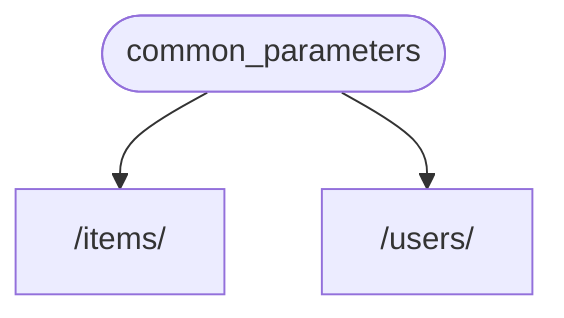

# 의존성 - 도입부

**FastAPI**는 강력하면서도 직관적인 **<abbr title="also known as components, resources, providers, services, injectables">의존성 주입</abbr>** 시스템입니다.

**FastAPI**는 사용하기 매우 쉽게 디자인되었으며, 어느 개발자라도 다른 컴포넌트들과 통합하기 쉽게 만들어졌습니다.

## "의존성 주입"이 무엇입니까?

**"의존성 주입"**은 프로그래밍에서 코드(이 경우, 당신의 *경로 조작 함수*)에 작동하고 사용하는데 필요한 "의존성"들이 선언하는 방법입니다.

그리고, 그 시스템(**FastAPI**의 경우)은 필요한 의존성을 코드에 제공하는 데 필요한 모든 작업을 처리합니다(의존성 "주입").

다음의 경우에 매우 유용합니다:

* 공유 로직이 존재 (같은 코드 로직의 반복).
* 데이터베이스 연결 공유.
* 보안, 인증, 권한 등의 강화.
* 그 외 여러가지...

이 모든 것이 코드의 반복을 최소화를 위함입니다.

## 첫 번째 단계

매우 간단한 예시를 봅시다. 간단하지만 유용하지는 않죠, 아직은 말입니다.

그러나 이 방법은 어떻게 **의존성 주입** 시스템이 작동하는지를 보여줍니다.

### 의존성 또는 "의존적인" 생성

먼저 의존성에 초점을 맞춰봅시다.

그것은 단지 *경로 조작 함수*가 취할 수 있는 것과 동일한 모든 매개변수를 취할 수 있는 함수일 뿐입니다:

=== "Python 3.6 이상"

    ```Python hl_lines="8-11"
    {!> ../../../docs_src/dependencies/tutorial001.py!}
    ```

=== "Python 3.10 이상"

    ```Python hl_lines="6-7"
    {!> ../../../docs_src/dependencies/tutorial001_py310.py!}
    ```

끝입니다.

**2 lines**.

그리고 그것은 모든 *경로 조작 함수*이 가지고 있는 것과 같은 모양과 구조를 가지고 있습니다.

"데코레이터" 없이(`@app.get("/some-path")` 없이) *경로 조작 함수*로 생각할 수 있습니다.

그리고 원한다면 언제든지 되돌릴 수 있습니다.

이 경우, 이 의존성은 다음을 기대할 수 있습니다:

* 매개변수 `q`는 선택적이며, `str`을 자료형으로 가집니다.
* 매개변수 `skip`는 선택적이며, `int`을 자료형으로 가지며, 기본값으로 `0`을 가집니다.
* 매개변수 `limit`는 선택적이며, `int`을 자료형으로 가지며, 기본값으로 `100`을 가집니다.

그리고 그 값들을 `dict` 형으로 반환합니다.

### `Depends` 암포트하기

=== "Python 3.6 이상"

    ```Python hl_lines="3"
    {!> ../../../docs_src/dependencies/tutorial001.py!}
    ```

=== "Python 3.10 이상"

    ```Python hl_lines="1"
    {!> ../../../docs_src/dependencies/tutorial001_py310.py!}
    ```

### "의존자"에 의존성 명시하기

*경로 조작 함수* 매개변수와 함께 `Body`, `Query` 등을 사용하는 것과 같은 방식으로 새 매개변수와 함께 `Depends`를 사용합니다:

=== "Python 3.6 이상"

    ```Python hl_lines="15  20"
    {!> ../../../docs_src/dependencies/tutorial001.py!}
    ```

=== "Python 3.10 이상"

    ```Python hl_lines="11  16"
    {!> ../../../docs_src/dependencies/tutorial001_py310.py!}
    ```

'Body', 'Query' 등을 사용하는 것과 같은 방식으로 함수의 매개변수에 'Depends'를 사용하지만 'Depends'는 약간 다르게 작동합니다.

`Depends`에는 단일 매개변수만 제공합니다.

이 매개변수는 함수와 같아야 합니다.

그리고 그 함수는 *경로 조작 함수*가 하는 것과 같은 방식으로 매개변수를 취합니다.

!!! 팁
    다음 장에서 함수를 제외하고 어떤 "다른 것들"이 종속성으로 사용될 수 있는지 알게 될 것입니다.

새 요청이 도착할 때마다 **FastAPI**가 다음을 처리합니다:

* 올바른 매개변수들과 함께 의존성("의존적인") 함수를 호출합니다.
* 함수에서 결과를 가져옵니다.
* *경로 조작 함수*의 매개변수로부터 결과를 할당합니다.



이 방법으로 공유 코드를 한 번 작성하면 **FastAPI**가 *경로 함수*을 위해 이를 호출합니다.

!!! 체크
    특별한 클래스를 생성하거나 **FastAPI**에 전달하여 "등록"하거나 유사한 작업을 수행할 필요가 없습니다.

    단순히 `Depends`에 전달하면 **FastAPI**가 나머지를 수행하는 방법을 알고 있습니다.

## `비동기` 혹은 `동기`

의존성들 또한 **FastAPI**(*경로 조작 함수*와 동일)에서도 호출되므로 함수를 정의하는 동안 동일한 규칙이 적용됩니다.

당신은 `async def` 혹은 일반 `def`를 사용할 수 있습니다.

그리고 일반 `def` *경로 조작 함수* 내부의 `async def`로 혹은 `async def` *경로 조작 함수* 내부의 `def`로 의존성을 선언하는 등이 있습니다.

문제 없습니다. **FastAPI**는 무엇을 할지 알고 있습니다.

!!! 노트
    잘 모르겠다면, 문서의 [Async: *"In a hurry?"*](../../async.md){.internal-link target=_blank} 섹션에서 `async`과 `await`에 대해 확인하십시오.

## OpenAPI와의 통합

의존성(및 하위 의존성)의 모든 요청 선언, 유효성 및 요구 사항은 동일한 OpenAPI 스키마에 통합됩니다.

따라서 대화형 문서에는 이러한 종속성에서도 모든 정보가 있습니다:


## 간단한 사용법

그것을 확인해 보면, *경로 조작 함수*는 *경로*와 *조작*이 매칭되면 언제든지 사용되어 정의되며, **FastAPI**는 올바른 매개변수와 요청에서 추출된 데이터들과 함께 함수를 호출할 수 있습니다.

실제로 모든(또는 대부분의) 웹 프레임워크는 이와 같은 방식으로 작동합니다.

이러한 함수를 직접 호출하지 않으며, 프레임워크에서 호출합니다(이 경우, **FastAPI**).

의존성 주입 시스템과 함께, *경로 조작 함수* 또한 다른 것에 "의존적"이며 또한 *경로 조작 함수* 전에 실행되어야 한다는 것은 **FastAPI**라고 부를 수 있습니다. 그리고 **FastAPI**는 그것을 실행하고 결과들을 주입할 것입니다.

"의존성 주입"이라는 동일한 아이디어에 대한 다른 일반적인 용어는 다음과 같습니다:

* 리소스들
* 제공자들
* 서비스들
* 주입 가능 요소들
* 컴포넌트들

## **FastAPI** 플러그인

통합과 플러그인들은 **의존성 주입** 시스템 사용을 위해 구축됩니다. 그러나 실제로 **"플러그인"을 만들 필요가 없습니다**. 의존성을 사용하면 *경로 조작 기능*에 사용할 수 있는 통합 및 상호 작용을 무한대로 선언할 수 있기 때문입니다.

그리고 의존성은 매우 간단하고 직관적인 방식으로 생성할 수 있어 필요한 파이썬 패키지를 가져와서 *말 그대로* 몇 줄의 코드로 API 함수와 통합할 수 있습니다.

관계형 및 NoSQL 데이터베이스, 보안 등에 대한 다음 장에서 이것에 대한 예시를 볼 수 있습니다.

## **FastAPI** 호환성

의존성 주입 시스템의 단순함은 **FastAPI**와 다음의 시스템들 간의 호환이 가능합니다

* 모든 관계형 데이터베이스
* NoSQL 데이터베이스
* 외부 패키지들
* 외부 API들
* 인증 및 권한 부여 시스템들
* API 사용 모니터링 시스템들
* 응답 데이터 주입 시스템들
* 기타 등등.

## 간편하고 강력함

계층적 의존성 주입 시스템은 정의하고 사용하는 것이 매우 간단하지만 여전히 매우 강력합니다.

당신은 의존성 자체를 정의할 수 있는 의존성을 정의할 수 있습니다.

결국 계층적 의존성 트리가 구축되고, **의존성 주입** 시스템은 이러한 모든 의존성(및 하위 의존성)을 해결하고 각 단계에서 결과를 제공(주입)합니다.

당신에게 4개의 API 엔드포인트가 있다고 가정합시다(*경로 작업*):

* `/items/public/`
* `/items/private/`
* `/users/{user_id}/activate`
* `/items/pro/`

그런 다음에 당신은 의존성 및 하위 의존성을 사용하여 각각에 대해 다른 권한 요구 사항을 추가할 수 있습니다:


## **OpenAPI**와의 통합

이러한 모든 의존성들은 요구 사항을 선언하면서 *경로 조작*에 매개변수, 유효성 검사 등을 추가합니다.

**FastAPI**는 모든 것을 OpenAPI 스키마에 추가하여 대화형 문서 시스템에 표시되도록 처리합니다.