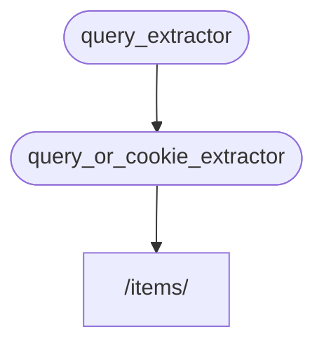

# 하위-의존성

**하위-의존성**을 가진 의존성을 생성할 수 있습니다.

그것들은 필요한 만큼 **깊을** 수 있습니다.

**FastAPI**는 그것들을 해결합니다.

### 첫 번째 의존성 "의존 가능한 것"

다음과 같이 첫 번째 의존성 ("의존 가능한 것") 을 생성할 수 있습니다:

```Python hl_lines="8-9"
{!../../../docs_src/dependencies/tutorial005.py!}
```

이것은 선택적 쿼리 매개변수 `q`를 `str`로 선언하고, 반환합니다.

이것은 꽤 단순 하지만 (매우 유용하지는 않고), 하위-의존성의 작동 방식에 집중하는 데 도움 됩니다.

### 두 번째 의존성, "의존 가능한 것"과 "디펜던트"

그러면 동시에 스스로 (이것 또한 "디펜던트"인) 의존성을 선언하는 ("의존 가능한") 또 다른 의존성 함수를 생성할 수 있습니다:

```Python hl_lines="13"
{!../../../docs_src/dependencies/tutorial005.py!}
```

선언된 매개변수에 집중해봅시다:

* 이 함수가 스스로 ("의존 가능한") 의존성임에도 불구하고, (다른 것에 "의존"하는) 또 다른 의존성을 선언합니다.
    * 이것은 `query_extractor`에 의존하고, 반환된 값을 매개변수 `q`에 할당합니다.
* 이것은 또한 선택적 `last_query` 쿠키를, `str`로 선언합니다.
    * 만약 사용자가 아무런 쿼리 `q`도 제공하지 않는다면, 이전에 쿠키에 저장된, 마지막으로 사용된 쿼리를 사용합니다.

### 의존성 사용

그러면 다음과 같이 의존성을 사용할 수 있습니다:

```Python hl_lines="21"
{!../../../docs_src/dependencies/tutorial005.py!}
```

!!! info "정보"
    `query_or_cookie_extractor`라는, *경로 작동 함수* 내부에 하나의 의존성만을 선언하고 있다는 걸 명심하기 바랍니다.

    그러나 **FastAPI**는 이것이 호출되었을 때 그 결과를 `query_or_cookie_extractor`로 전달하기 위해, `query_extractor`를 먼저 해결해야 하는 걸 압니다. 




## 동일 의존성 여러 번 사용

만약 의존성 중 하나가, 예를 들어, 여러 의존성이 하나의 동일한 하위-의존성을 가진 것처럼, 동일한 *경로 작동*에 여러 번 선언되었다면, **FastAPI**는 그 하위-의존성을 요청마다 오로지 한 번만 호출해야 하는 걸 알고 있습니다.


그리고 반환된 값을 <abbr title="다시 계산하는 대신 재사용하기 위해, 계산/생성된 값을 저장하는 유틸리티/시스템 ">"캐시"</abbr>에 저장하고 동일한 요청에 의존성을 여러 번 호출하는 대신, 해당 특정 요청이 필요로 하는 모든 "의존성"에 전달합니다.

동일한 요청에 "캐시된" 값을 사용하는 대신 모든 단계에서 (아마도 여러 번) 의존성을 호출해야 하는 숙련된 상황에서는, `Depends`를 사용할 때 매개변수를 `use_cache=False`로 설정할 수 있습니다.

```Python hl_lines="1"
async def needy_dependency(fresh_value: str = Depends(get_value, use_cache=False)):
    return {"fresh_value": fresh_value}
```

## 요약

이곳에서 사용된 모든 멋진 단어와 상관 없이, **의존성 주입** 시스템은 꽤 단순합니다.

단지 *경로 작동 함수*와 유사해보이는 함수일 뿐입니다.

그러나 여전히, 매우 강력하고, 임의로 깊게 중첩된 의존성 "그래프" (트리) 를 선언할 수 있게 해줍니다.

!!! tip "팁"
    이 간단한 예시에서는 이 모든 것이 유용해보이지 않을 수 있습니다.

    그러나 **보안** 챕터에서 이것이 어떻게 유용한 지 볼 수 있습니다.

    그리고 당신을 구해줄 코드를 볼 수 있습니다.
