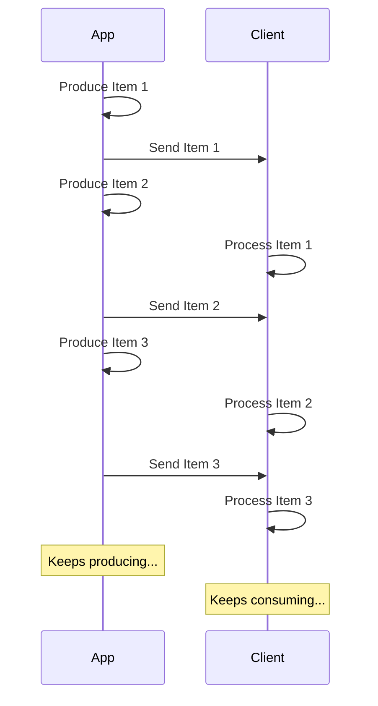

# JSON Lines 스트리밍 { #stream-json-lines }

연속된 데이터를 "**스트림**"으로 보내고 싶다면 **JSON Lines**를 사용할 수 있습니다.

/// info

FastAPI 0.134.0에 추가되었습니다.

///

## 스트림이란 { #what-is-a-stream }

데이터를 "**스트리밍**"한다는 것은 애플리케이션이 전체 항목 시퀀스가 모두 준비될 때까지 기다리지 않고 클라이언트로 데이터 항목을 보내기 시작한다는 뜻입니다.

즉, 첫 번째 항목을 보내면 클라이언트는 그것을 받아 처리하기 시작하고, 그동안 애플리케이션은 다음 항목을 계속 생성할 수 있습니다.



데이터를 계속 보내는 무한 스트림일 수도 있습니다.

## JSON Lines { #json-lines }

이런 경우에는 한 줄에 하나의 JSON 객체를 보내는 형식인 "**JSON Lines**"를 사용하는 것이 일반적입니다.

응답의 콘텐츠 타입은 `application/json` 대신 `application/jsonl`이고, 본문은 다음과 같습니다:

```json
{"name": "Plumbus", "description": "A multi-purpose household device."}
{"name": "Portal Gun", "description": "A portal opening device."}
{"name": "Meeseeks Box", "description": "A box that summons a Meeseeks."}
```

JSON 배열(Python의 list에 해당)과 매우 비슷하지만, 항목들을 `[]`로 감싸고 항목 사이에 `,`를 넣는 대신, 줄마다 하나의 JSON 객체가 있고, 새 줄 문자로 구분됩니다.

/// info

핵심은 애플리케이션이 각 줄을 차례로 생성하는 동안, 클라이언트는 이전 줄을 소비할 수 있다는 점입니다.

///

/// note | 기술 세부사항

각 JSON 객체는 새 줄로 구분되므로, 내용에 실제 줄바꿈 문자를 포함할 수는 없습니다. 하지만 JSON 표준의 일부인 이스케이프된 줄바꿈(`\n`)은 포함할 수 있습니다.

보통은 신경 쓸 필요가 없습니다. 자동으로 처리되니 계속 읽어 주세요. 🤓

///

## 사용 예 { #use-cases }

이 방법을 사용해 **AI LLM** 서비스, **로그** 또는 **telemetry**에서 오는 데이터, 혹은 **JSON** 항목으로 구조화할 수 있는 다른 유형의 데이터를 스트리밍할 수 있습니다.

/// tip

비디오나 오디오처럼 바이너리 데이터를 스트리밍하려면 고급 가이드를 확인하세요: [스트림 데이터](../advanced/stream-data.md).

///

## FastAPI로 JSON Lines 스트리밍 { #stream-json-lines-with-fastapi }

FastAPI에서 JSON Lines를 스트리밍하려면, *경로 처리 함수*에서 `return`을 사용하는 대신 `yield`로 각 항목을 차례로 생성하면 됩니다.

{* ../../docs_src/stream_json_lines/tutorial001_py310.py ln[1:24] hl[24] *}

보내려는 각 JSON 항목의 타입이 `Item`(Pydantic 모델)이고 함수가 async라면, 반환 타입을 `AsyncIterable[Item]`로 선언할 수 있습니다:

{* ../../docs_src/stream_json_lines/tutorial001_py310.py ln[1:24] hl[9:11,22] *}

반환 타입을 선언하면 FastAPI가 이를 사용해 데이터를 **검증**하고, OpenAPI에 **문서화**하고, **필터링**하고, Pydantic으로 **직렬화**합니다.

/// tip

Pydantic이 **Rust** 측에서 직렬화하므로, 반환 타입을 선언하지 않았을 때보다 훨씬 높은 **성능**을 얻게 됩니다.

///

### 비동기 아님 *경로 처리 함수* { #non-async-path-operation-functions }

일반 `def` 함수(`async` 없이)도 사용할 수 있으며, 동일하게 `yield`를 사용할 수 있습니다.

FastAPI가 이벤트 루프를 막지 않도록 올바르게 실행되게 보장합니다.

이 경우 함수가 async가 아니므로, 올바른 반환 타입은 `Iterable[Item]`입니다:

{* ../../docs_src/stream_json_lines/tutorial001_py310.py ln[27:30] hl[28] *}

### 반환 타입 생략 { #no-return-type }

반환 타입을 생략할 수도 있습니다. 그러면 FastAPI가 [`jsonable_encoder`](./encoder.md)를 사용해 데이터를 JSON으로 직렬화 가능한 형태로 변환한 뒤 JSON Lines로 전송합니다.

{* ../../docs_src/stream_json_lines/tutorial001_py310.py ln[33:36] hl[34] *}

## 서버 전송 이벤트(SSE) { #server-sent-events-sse }

FastAPI는 Server-Sent Events(SSE)도 일급으로 지원합니다. 매우 비슷하지만 몇 가지 추가 세부사항이 있습니다. 다음 장에서 자세히 알아보세요: [Server-Sent Events (SSE)](server-sent-events.md). 🤓
