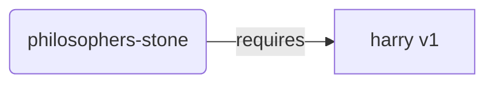
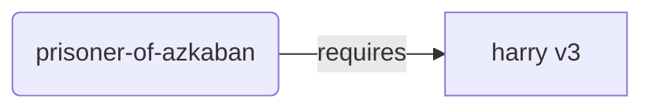
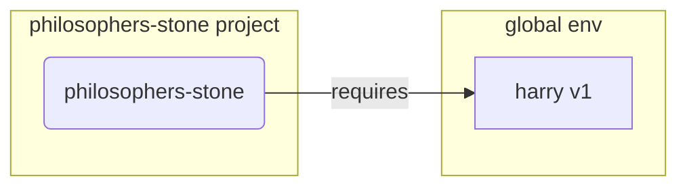
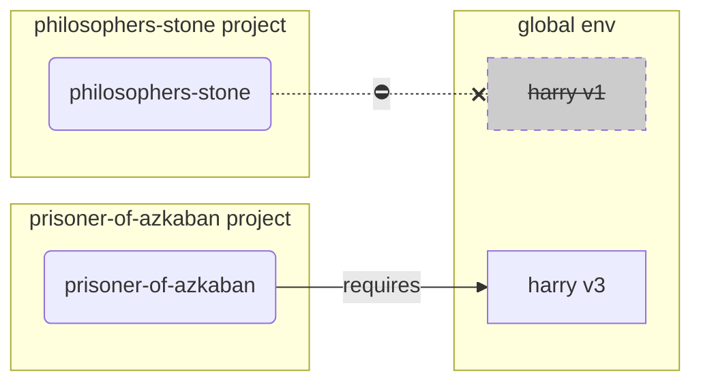
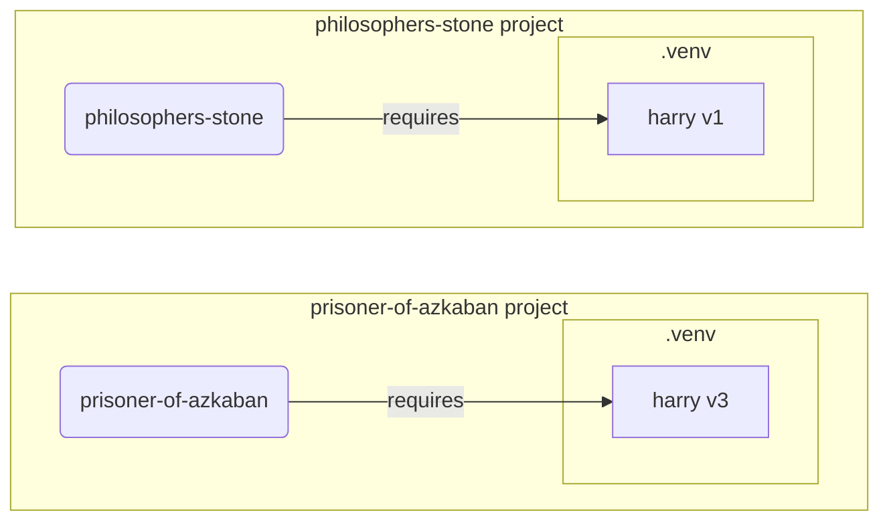

# 가상 환경 { #virtual-environments }

Python 프로젝트를 작업할 때는 **가상 환경**(또는 이와 유사한 메커니즘)을 사용해 각 프로젝트마다 설치하는 패키지를 분리하는 것이 좋습니다.

/// info

이미 가상 환경에 대해 알고 있고, 어떻게 생성하고 사용하는지도 알고 있다면, 이 섹션은 건너뛰어도 괜찮습니다. 🤓

///

/// tip

**가상 환경**은 **환경 변수**와 다릅니다.

**환경 변수**는 시스템에 존재하며, 프로그램이 사용할 수 있는 변수입니다.

**가상 환경**은 몇몇 파일로 구성된 하나의 디렉터리입니다.

///

/// info

이 페이지에서는 **가상 환경**을 사용하는 방법과 작동 방식을 알려드립니다.

Python 설치까지 포함해 **모든 것을 관리해주는 도구**를 도입할 준비가 되었다면 <a href="https://github.com/astral-sh/uv" class="external-link" target="_blank">uv</a>를 사용해 보세요.

///

## 프로젝트 생성 { #create-a-project }

먼저, 프로젝트를 위한 디렉터리를 하나 생성합니다.

제가 보통 하는 방법은 사용자 홈/유저 디렉터리 안에 `code`라는 디렉터리를 만드는 것입니다.

그리고 그 안에 프로젝트마다 디렉터리를 하나씩 만듭니다.

<div class="termy">

```console
// Go to the home directory
$ cd
// Create a directory for all your code projects
$ mkdir code
// Enter into that code directory
$ cd code
// Create a directory for this project
$ mkdir awesome-project
// Enter into that project directory
$ cd awesome-project
```

</div>

## 가상 환경 생성 { #create-a-virtual-environment }

Python 프로젝트를 **처음 시작할 때**, **<abbr title="다른 옵션도 있지만, 이것은 간단한 가이드라인입니다">프로젝트 내부</abbr>**에 가상 환경을 생성하세요.

/// tip

이 작업은 **프로젝트당 한 번만** 하면 되며, 작업할 때마다 할 필요는 없습니다.

///

//// tab | `venv`

가상 환경을 만들려면 Python에 포함된 `venv` 모듈을 사용할 수 있습니다.

<div class="termy">

```console
$ python -m venv .venv
```

</div>

/// details | 명령어 의미

* `python`: `python`이라는 프로그램을 사용합니다
* `-m`: 모듈을 스크립트로 호출합니다. 다음에 어떤 모듈인지 지정합니다
* `venv`: 보통 Python에 기본으로 설치되어 있는 `venv` 모듈을 사용합니다
* `.venv`: 새 디렉터리인 `.venv`에 가상 환경을 생성합니다

///

////

//// tab | `uv`

<a href="https://github.com/astral-sh/uv" class="external-link" target="_blank">`uv`</a>가 설치되어 있다면, 이를 사용해 가상 환경을 생성할 수 있습니다.

<div class="termy">

```console
$ uv venv
```

</div>

/// tip

기본적으로 `uv`는 `.venv`라는 디렉터리에 가상 환경을 생성합니다.

하지만 디렉터리 이름을 추가 인자로 전달해 이를 커스터마이즈할 수 있습니다.

///

////

해당 명령어는 `.venv`라는 디렉터리에 새로운 가상 환경을 생성합니다.

/// details | `.venv` 또는 다른 이름

가상 환경을 다른 디렉터리에 생성할 수도 있지만, 관례적으로 `.venv`라는 이름을 사용합니다.

///

## 가상 환경 활성화 { #activate-the-virtual-environment }

이후 실행하는 Python 명령어와 설치하는 패키지가 새 가상 환경을 사용하도록, 새 가상 환경을 활성화하세요.

/// tip

프로젝트 작업을 위해 **새 터미널 세션**을 시작할 때마다 **매번** 이 작업을 하세요.

///

//// tab | Linux, macOS

<div class="termy">

```console
$ source .venv/bin/activate
```

</div>

////

//// tab | Windows PowerShell

<div class="termy">

```console
$ .venv\Scripts\Activate.ps1
```

</div>

////

//// tab | Windows Bash

또는 Windows에서 Bash(예: <a href="https://gitforwindows.org/" class="external-link" target="_blank">Git Bash</a>)를 사용하는 경우:

<div class="termy">

```console
$ source .venv/Scripts/activate
```

</div>

////

/// tip

해당 환경에 **새 패키지**를 설치할 때마다, 환경을 다시 **활성화**하세요.

이렇게 하면 해당 패키지가 설치한 **터미널(<abbr title="command line interface">CLI</abbr>) 프로그램**을 사용할 때, 전역으로 설치되어 있을 수도 있는(아마 필요한 버전과는 다른 버전인) 다른 프로그램이 아니라 가상 환경에 있는 것을 사용하게 됩니다.

///

## 가상 환경 활성화 여부 확인 { #check-the-virtual-environment-is-active }

가상 환경이 활성화되어 있는지(이전 명령어가 작동했는지) 확인합니다.

/// tip

이 단계는 **선택 사항**이지만, 모든 것이 예상대로 작동하고 있는지, 그리고 의도한 가상 환경을 사용하고 있는지 **확인**하는 좋은 방법입니다.

///

//// tab | Linux, macOS, Windows Bash

<div class="termy">

```console
$ which python

/home/user/code/awesome-project/.venv/bin/python
```

</div>

프로젝트 내부(이 경우 `awesome-project`)의 `.venv/bin/python`에 있는 `python` 바이너리가 표시된다면, 정상적으로 작동한 것입니다. 🎉

////

//// tab | Windows PowerShell

<div class="termy">

```console
$ Get-Command python

C:\Users\user\code\awesome-project\.venv\Scripts\python
```

</div>

프로젝트 내부(이 경우 `awesome-project`)의 `.venv\Scripts\python`에 있는 `python` 바이너리가 표시된다면, 정상적으로 작동한 것입니다. 🎉

////

## `pip` 업그레이드 { #upgrade-pip }

/// tip

<a href="https://github.com/astral-sh/uv" class="external-link" target="_blank">`uv`</a>를 사용한다면, `pip` 대신 `uv`로 설치하게 되므로 `pip`을 업그레이드할 필요가 없습니다. 😎

///

`pip`로 패키지를 설치한다면(Python에 기본으로 포함되어 있습니다) 최신 버전으로 **업그레이드**하는 것이 좋습니다.

패키지 설치 중 발생하는 다양한 특이한 오류는 먼저 `pip`를 업그레이드하는 것만으로 해결되는 경우가 많습니다.

/// tip

보통 이 작업은 가상 환경을 만든 직후 **한 번만** 하면 됩니다.

///

가상 환경이 활성화된 상태인지 확인한 다음(위의 명령어 사용) 아래를 실행하세요:

<div class="termy">

```console
$ python -m pip install --upgrade pip

---> 100%
```

</div>

/// tip

때로는 pip를 업그레이드하려고 할 때 **`No module named pip`** 오류가 발생할 수 있습니다.

이 경우 아래 명령어로 pip를 설치하고 업그레이드하세요:

<div class="termy">

```console
$ python -m ensurepip --upgrade

---> 100%
```

</div>

이 명령어는 pip가 아직 설치되어 있지 않다면 설치하며, 설치된 pip 버전이 `ensurepip`에서 제공 가능한 버전만큼 최신임을 보장합니다.

///

## `.gitignore` 추가하기 { #add-gitignore }

**Git**을 사용하고 있다면(사용하는 것이 좋습니다), `.venv`의 모든 내용을 Git에서 제외하도록 `.gitignore` 파일을 추가하세요.

/// tip

<a href="https://github.com/astral-sh/uv" class="external-link" target="_blank">`uv`</a>로 가상 환경을 만들었다면, 이미 자동으로 처리되어 있으므로 이 단계는 건너뛰어도 됩니다. 😎

///

/// tip

가상 환경을 만든 직후 **한 번만** 하면 됩니다.

///

<div class="termy">

```console
$ echo "*" > .venv/.gitignore
```

</div>

/// details | 명령어 의미

* `echo "*"`: 터미널에 `*` 텍스트를 "출력"합니다(다음 부분이 이를 약간 변경합니다)
* `>`: `>` 왼쪽 명령어가 터미널에 출력한 내용을 터미널에 출력하지 않고, `>` 오른쪽에 있는 파일에 기록하라는 의미입니다
* `.gitignore`: 텍스트가 기록될 파일 이름입니다

그리고 Git에서 `*`는 "모든 것"을 의미합니다. 따라서 `.venv` 디렉터리 안의 모든 것을 무시합니다.

이 명령어는 다음 내용을 가진 `.gitignore` 파일을 생성합니다:

```gitignore
*
```

///

## 패키지 설치 { #install-packages }

환경을 활성화한 뒤, 그 안에 패키지를 설치할 수 있습니다.

/// tip

프로젝트에 필요한 패키지를 설치하거나 업그레이드할 때는 **한 번**만 하면 됩니다.

버전을 업그레이드하거나 새 패키지를 추가해야 한다면 **다시 이 작업을** 하게 됩니다.

///

### 패키지 직접 설치 { #install-packages-directly }

급하게 작업 중이고 프로젝트의 패키지 요구사항을 선언하는 파일을 사용하고 싶지 않다면, 패키지를 직접 설치할 수 있습니다.

/// tip

프로그램에 필요한 패키지와 버전을 파일(예: `requirements.txt` 또는 `pyproject.toml`)에 적어두는 것은 (매우) 좋은 생각입니다.

///

//// tab | `pip`

<div class="termy">

```console
$ pip install "fastapi[standard]"

---> 100%
```

</div>

////

//// tab | `uv`

<a href="https://github.com/astral-sh/uv" class="external-link" target="_blank">`uv`</a>가 있다면:

<div class="termy">

```console
$ uv pip install "fastapi[standard]"
---> 100%
```

</div>

////

### `requirements.txt`에서 설치 { #install-from-requirements-txt }

`requirements.txt`가 있다면, 이제 이를 사용해 그 안의 패키지를 설치할 수 있습니다.

//// tab | `pip`

<div class="termy">

```console
$ pip install -r requirements.txt
---> 100%
```

</div>

////

//// tab | `uv`

<a href="https://github.com/astral-sh/uv" class="external-link" target="_blank">`uv`</a>가 있다면:

<div class="termy">

```console
$ uv pip install -r requirements.txt
---> 100%
```

</div>

////

/// details | `requirements.txt`

일부 패키지가 있는 `requirements.txt`는 다음과 같이 생겼을 수 있습니다:

```requirements.txt
fastapi[standard]==0.113.0
pydantic==2.8.0
```

///

## 프로그램 실행 { #run-your-program }

가상 환경을 활성화한 뒤에는 프로그램을 실행할 수 있으며, 설치한 패키지가 들어있는 가상 환경 내부의 Python을 사용하게 됩니다.

<div class="termy">

```console
$ python main.py

Hello World
```

</div>

## 에디터 설정 { #configure-your-editor }

아마 에디터를 사용할 텐데, 자동 완성과 인라인 오류 표시를 받을 수 있도록 생성한 가상 환경을 사용하도록 설정하세요(대부분 자동 감지합니다).

예를 들면:

* <a href="https://code.visualstudio.com/docs/python/environments#_select-and-activate-an-environment" class="external-link" target="_blank">VS Code</a>
* <a href="https://www.jetbrains.com/help/pycharm/creating-virtual-environment.html" class="external-link" target="_blank">PyCharm</a>

/// tip

보통 이 설정은 가상 환경을 만들 때 **한 번만** 하면 됩니다.

///

## 가상 환경 비활성화 { #deactivate-the-virtual-environment }

프로젝트 작업을 마쳤다면 가상 환경을 **비활성화**할 수 있습니다.

<div class="termy">

```console
$ deactivate
```

</div>

이렇게 하면 `python`을 실행할 때, 해당 가상 환경과 그 안에 설치된 패키지에서 실행하려고 하지 않습니다.

## 작업할 준비 완료 { #ready-to-work }

이제 프로젝트 작업을 시작할 준비가 되었습니다.


/// tip

위의 내용이 무엇인지 더 이해하고 싶으신가요?

계속 읽어보세요. 👇🤓

///

## 가상 환경을 왜 사용하나요 { #why-virtual-environments }

FastAPI로 작업하려면 <a href="https://www.python.org/" class="external-link" target="_blank">Python</a>을 설치해야 합니다.

그 다음 FastAPI와 사용하려는 다른 **패키지**를 **설치**해야 합니다.

패키지를 설치할 때는 보통 Python에 포함된 `pip` 명령어(또는 유사한 대안)를 사용합니다.

하지만 `pip`를 그대로 직접 사용하면, 패키지는 **전역 Python 환경**(전역 Python 설치)에 설치됩니다.

### 문제점 { #the-problem }

그렇다면, 전역 Python 환경에 패키지를 설치하면 어떤 문제가 있을까요?

어느 시점이 되면 **서로 다른 패키지**에 의존하는 다양한 프로그램을 작성하게 될 것입니다. 그리고 작업하는 프로젝트 중 일부는 같은 패키지의 **서로 다른 버전**에 의존할 수도 있습니다. 😱

예를 들어 `philosophers-stone`이라는 프로젝트를 만들 수 있습니다. 이 프로그램은 **`harry`라는 다른 패키지의 버전 `1`**에 의존합니다. 그래서 `harry`를 설치해야 합니다.



그다음, 나중에 `prisoner-of-azkaban`이라는 또 다른 프로젝트를 만들고, 이 프로젝트도 `harry`에 의존하지만, 이 프로젝트는 **`harry` 버전 `3`**이 필요합니다.



하지만 이제 문제가 생깁니다. 로컬 **가상 환경**이 아니라 전역(전역 환경)에 패키지를 설치한다면, 어떤 버전의 `harry`를 설치할지 선택해야 합니다.

`philosophers-stone`을 실행하고 싶다면, 먼저 `harry` 버전 `1`을 다음과 같이 설치해야 합니다:

<div class="termy">

```console
$ pip install "harry==1"
```

</div>

그리고 전역 Python 환경에 `harry` 버전 `1`이 설치된 상태가 됩니다.



하지만 `prisoner-of-azkaban`을 실행하려면 `harry` 버전 `1`을 제거하고 `harry` 버전 `3`을 설치해야 합니다(또는 버전 `3`을 설치하기만 해도 버전 `1`이 자동으로 제거됩니다).

<div class="termy">

```console
$ pip install "harry==3"
```

</div>

그러면 전역 Python 환경에 `harry` 버전 `3`이 설치된 상태가 됩니다.

그리고 `philosophers-stone`을 다시 실행하려고 하면, `harry` 버전 `1`이 필요하기 때문에 **작동하지 않을** 가능성이 있습니다.



/// tip

Python 패키지에서는 **새 버전**에서 **호환성을 깨뜨리는 변경(breaking changes)**을 **피하려고** 최선을 다하는 것이 매우 일반적이지만, 안전을 위해 더 최신 버전은 의도적으로 설치하고, 테스트를 실행해 모든 것이 올바르게 작동하는지 확인할 수 있을 때 설치하는 것이 좋습니다.

///

이제 이런 일이 여러분의 **모든 프로젝트가 의존하는** **많은** 다른 **패키지**에서도 일어난다고 상상해 보세요. 이는 관리하기가 매우 어렵습니다. 그리고 결국 일부 프로젝트는 패키지의 **호환되지 않는 버전**으로 실행하게 될 가능성이 높으며, 왜 무언가가 작동하지 않는지 알지 못하게 될 수 있습니다.

또한 운영체제(Linux, Windows, macOS 등)에 따라 Python이 이미 설치되어 있을 수도 있습니다. 그런 경우에는 시스템에 **필요한 특정 버전**의 패키지가 일부 미리 설치되어 있을 가능성이 큽니다. 전역 Python 환경에 패키지를 설치하면, 운영체제에 포함된 프로그램 일부가 **깨질** 수 있습니다.

## 패키지는 어디에 설치되나요 { #where-are-packages-installed }

Python을 설치하면 컴퓨터에 몇몇 파일이 들어 있는 디렉터리가 생성됩니다.

이 디렉터리 중 일부는 설치한 모든 패키지를 담는 역할을 합니다.

다음을 실행하면:

<div class="termy">

```console
// Don't run this now, it's just an example 🤓
$ pip install "fastapi[standard]"
---> 100%
```

</div>

FastAPI 코드를 담은 압축 파일을 다운로드합니다. 보통 <a href="https://pypi.org/project/fastapi/" class="external-link" target="_blank">PyPI</a>에서 받습니다.

또한 FastAPI가 의존하는 다른 패키지들의 파일도 **다운로드**합니다.

그 다음 모든 파일을 **압축 해제**하고 컴퓨터의 한 디렉터리에 넣습니다.

기본적으로, 다운로드하고 압축 해제한 파일들은 Python 설치와 함께 제공되는 디렉터리, 즉 **전역 환경**에 저장됩니다.

## 가상 환경이란 무엇인가요 { #what-are-virtual-environments }

전역 환경에 모든 패키지를 두는 문제에 대한 해결책은 작업하는 **각 프로젝트마다 가상 환경**을 사용하는 것입니다.

가상 환경은 전역 환경과 매우 유사한 하나의 **디렉터리**이며, 프로젝트의 패키지를 설치할 수 있습니다.

이렇게 하면 각 프로젝트는 자체 가상 환경(`.venv` 디렉터리)과 자체 패키지를 갖게 됩니다.



## 가상 환경을 활성화한다는 것은 무엇을 의미하나요 { #what-does-activating-a-virtual-environment-mean }

가상 환경을 활성화한다는 것은, 예를 들어 다음과 같은 명령어로:

//// tab | Linux, macOS

<div class="termy">

```console
$ source .venv/bin/activate
```

</div>

////

//// tab | Windows PowerShell

<div class="termy">

```console
$ .venv\Scripts\Activate.ps1
```

</div>

////

//// tab | Windows Bash

또는 Windows에서 Bash(예: <a href="https://gitforwindows.org/" class="external-link" target="_blank">Git Bash</a>)를 사용하는 경우:

<div class="termy">

```console
$ source .venv/Scripts/activate
```

</div>

////

다음 명령어들에서 사용할 수 있는 몇몇 [환경 변수](environment-variables.md){.internal-link target=_blank}를 생성하거나 수정하는 것을 의미합니다.

그 변수 중 하나가 `PATH` 변수입니다.

/// tip

`PATH` 환경 변수에 대해 더 알아보려면 [환경 변수](environment-variables.md#path-environment-variable){.internal-link target=_blank} 섹션을 참고하세요.

///

가상 환경을 활성화하면 가상 환경의 경로인 `.venv/bin`(Linux와 macOS) 또는 `.venv\Scripts`(Windows)를 `PATH` 환경 변수에 추가합니다.

가령 환경을 활성화하기 전에는 `PATH` 변수가 다음과 같았다고 해보겠습니다:

//// tab | Linux, macOS

```plaintext
/usr/bin:/bin:/usr/sbin:/sbin
```

이는 시스템이 다음 위치에서 프로그램을 찾는다는 뜻입니다:

* `/usr/bin`
* `/bin`
* `/usr/sbin`
* `/sbin`

////

//// tab | Windows

```plaintext
C:\Windows\System32
```

이는 시스템이 다음 위치에서 프로그램을 찾는다는 뜻입니다:

* `C:\Windows\System32`

////

가상 환경을 활성화한 뒤에는 `PATH` 변수가 다음과 같이 보일 수 있습니다:

//// tab | Linux, macOS

```plaintext
/home/user/code/awesome-project/.venv/bin:/usr/bin:/bin:/usr/sbin:/sbin
```

이는 시스템이 이제 다음 위치에서 프로그램을 가장 먼저 찾기 시작한다는 뜻입니다:

```plaintext
/home/user/code/awesome-project/.venv/bin
```

그리고 나서 다른 디렉터리들을 탐색합니다.

따라서 터미널에 `python`을 입력하면, 시스템은 다음 위치에서 Python 프로그램을 찾고:

```plaintext
/home/user/code/awesome-project/.venv/bin/python
```

그것을 사용하게 됩니다.

////

//// tab | Windows

```plaintext
C:\Users\user\code\awesome-project\.venv\Scripts;C:\Windows\System32
```

이는 시스템이 이제 다음 위치에서 프로그램을 가장 먼저 찾기 시작한다는 뜻입니다:

```plaintext
C:\Users\user\code\awesome-project\.venv\Scripts
```

그리고 나서 다른 디렉터리들을 탐색합니다.

따라서 터미널에 `python`을 입력하면, 시스템은 다음 위치에서 Python 프로그램을 찾고:

```plaintext
C:\Users\user\code\awesome-project\.venv\Scripts\python
```

그것을 사용하게 됩니다.

////

중요한 세부 사항은 가상 환경 경로가 `PATH` 변수의 **맨 앞**에 들어간다는 점입니다. 시스템은 다른 어떤 Python보다도 **먼저** 이를 찾게 됩니다. 이렇게 하면 `python`을 실행할 때, 다른 어떤 `python`(예: 전역 환경의 `python`)이 아니라 **가상 환경의 Python**을 사용하게 됩니다.

가상 환경을 활성화하면 다른 몇 가지도 변경되지만, 이것이 그중 가장 중요한 것 중 하나입니다.

## 가상 환경 확인하기 { #checking-a-virtual-environment }

가상 환경이 활성화되어 있는지 확인할 때는, 예를 들어 다음을 사용합니다:

//// tab | Linux, macOS, Windows Bash

<div class="termy">

```console
$ which python

/home/user/code/awesome-project/.venv/bin/python
```

</div>

////

//// tab | Windows PowerShell

<div class="termy">

```console
$ Get-Command python

C:\Users\user\code\awesome-project\.venv\Scripts\python
```

</div>

////

이는 사용될 `python` 프로그램이 **가상 환경 내부에 있는 것**이라는 뜻입니다.

Linux와 macOS에서는 `which`, Windows PowerShell에서는 `Get-Command`를 사용합니다.

이 명령어는 `PATH` 환경 변수에 있는 경로를 **순서대로** 확인하면서 `python`이라는 프로그램을 찾습니다. 찾는 즉시, 그 프로그램의 **경로를 보여줍니다**.

가장 중요한 부분은 `python`을 호출했을 때, 실행될 정확한 "`python`"이 무엇인지 알 수 있다는 점입니다.

따라서 올바른 가상 환경에 있는지 확인할 수 있습니다.

/// tip

가상 환경을 하나 활성화해서 Python을 사용한 다음, **다른 프로젝트로 이동**하기 쉽습니다.

그리고 두 번째 프로젝트는 다른 프로젝트의 가상 환경에서 온 **잘못된 Python**을 사용하고 있기 때문에 **작동하지 않을** 수 있습니다.

어떤 `python`이 사용되고 있는지 확인할 수 있으면 유용합니다. 🤓

///

## 가상 환경을 왜 비활성화하나요 { #why-deactivate-a-virtual-environment }

예를 들어 `philosophers-stone` 프로젝트에서 작업하면서, **그 가상 환경을 활성화**하고, 패키지를 설치하고, 그 환경으로 작업하고 있다고 해보겠습니다.

그런데 이제 **다른 프로젝트**인 `prisoner-of-azkaban`에서 작업하고 싶습니다.

해당 프로젝트로 이동합니다:

<div class="termy">

```console
$ cd ~/code/prisoner-of-azkaban
```

</div>

`philosophers-stone`의 가상 환경을 비활성화하지 않으면, 터미널에서 `python`을 실행할 때 `philosophers-stone`의 Python을 사용하려고 할 것입니다.

<div class="termy">

```console
$ cd ~/code/prisoner-of-azkaban

$ python main.py

// Error importing sirius, it's not installed 😱
Traceback (most recent call last):
    File "main.py", line 1, in <module>
        import sirius
```

</div>

하지만 가상 환경을 비활성화하고 `prisoner-of-askaban`에 대한 새 가상 환경을 활성화하면, `python`을 실행할 때 `prisoner-of-azkaban`의 가상 환경에 있는 Python을 사용하게 됩니다.

<div class="termy">

```console
$ cd ~/code/prisoner-of-azkaban

// You don't need to be in the old directory to deactivate, you can do it wherever you are, even after going to the other project 😎
$ deactivate

// Activate the virtual environment in prisoner-of-azkaban/.venv 🚀
$ source .venv/bin/activate

// Now when you run python, it will find the package sirius installed in this virtual environment ✨
$ python main.py

I solemnly swear 🐺
```

</div>

## 대안들 { #alternatives }

이 문서는 시작을 돕고, 내부에서 모든 것이 어떻게 작동하는지 알려주는 간단한 가이드입니다.

가상 환경, 패키지 의존성(requirements), 프로젝트를 관리하는 방법에는 많은 **대안**이 있습니다.

준비가 되었고 **프로젝트 전체**, 패키지 의존성, 가상 환경 등을 **관리**하는 도구를 사용하고 싶다면 <a href="https://github.com/astral-sh/uv" class="external-link" target="_blank">uv</a>를 사용해 보시길 권합니다.

`uv`는 많은 일을 할 수 있습니다. 예를 들어:

* 여러 버전을 포함해 **Python을 설치**
* 프로젝트의 **가상 환경** 관리
* **패키지** 설치
* 프로젝트의 패키지 **의존성과 버전** 관리
* 의존성을 포함해 설치할 패키지와 버전의 **정확한** 세트를 보장하여, 개발 중인 컴퓨터와 동일하게 프로덕션에서 실행할 수 있도록 합니다. 이를 **locking**이라고 합니다
* 그 외에도 많은 기능이 있습니다

## 결론 { #conclusion }

여기까지 모두 읽고 이해했다면, 이제 많은 개발자들보다 가상 환경에 대해 **훨씬 더 많이** 알게 된 것입니다. 🤓

이 세부 사항을 알고 있으면, 나중에 복잡해 보이는 무언가를 디버깅할 때 아마도 도움이 될 것입니다. **내부에서 어떻게 작동하는지** 알고 있기 때문입니다. 😎
