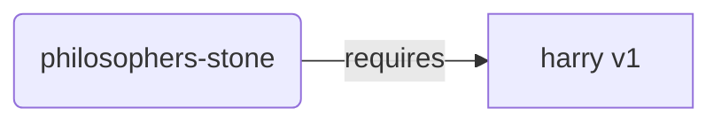
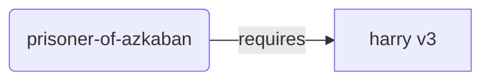
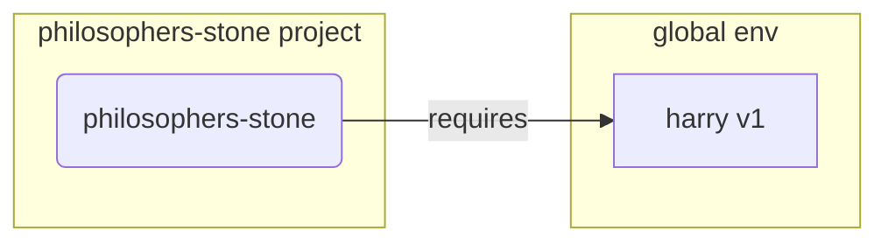
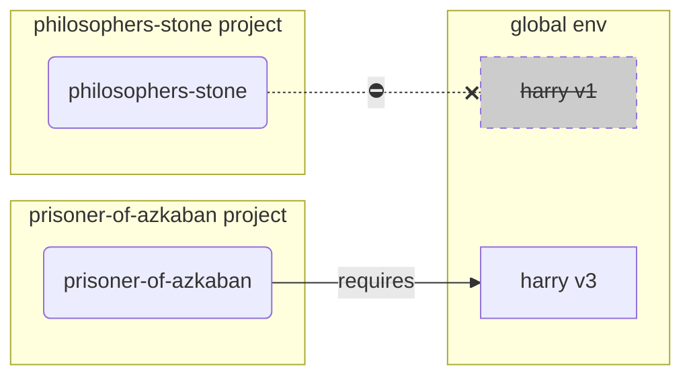
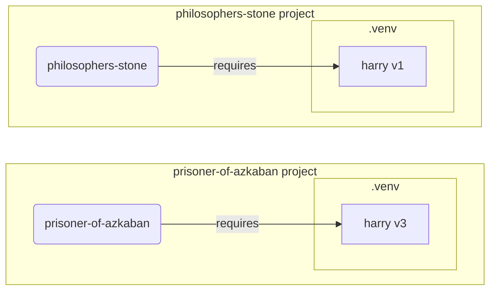

# 가상 환경

파이썬 프로젝트에서 작업할 때, 각 프로젝트마다 설치하는 패키지를 격리하기 위해 **가상 환경(virtual environment)**(또는 유사한 메커니즘)을 사용하는 것이 좋습니다.


/// info | 정보

만약 가상 환경을 어떻게 생성하고 사용하는지 이미 알고 있다면, 이 섹션은 건너뛰어도 됩니다. 🤓

///

/// tip | 팁

**가상 환경(virtual environment)**은 **환경 변수(environment variable)**와 다릅니다.

**환경 변수**는 프로그램에서 사용할 수 있는 시스템 변수입니다.

**가상 환경**은 어떤 파일들이 포함된 하나의 디렉터리입니다.

///

/// info | 정보

이 페이지는 **가상 환경**을 사용하는 방법과 작동 원리를 알려줍니다.

만약 **모든 것을 관리해 주는 도구**(파이썬 설치를 포함해)를 선택하고 싶다면, <a href="https://github.com/astral-sh/uv" class="external-link" target="_blank">uv</a>를 사용해 보십시오.

///

## 프로젝트 생성

먼저 프로젝트를 위한 디렉터리를 생성하십시오.

예제에서는 사용자 홈 디렉터리 내 `code`라는 디렉터리를 생성합니다.

그리고 그 안에 프로젝트별 디렉터리를 생성합니다.

<div class="termy">

```console
// 홈 디렉터리로 이동
$ cd
// 모든 프로젝트를 위한 code 디렉터리 생성
$ mkdir code
// code 디렉터리로 이동
$ cd code
// 이 프로젝트를 위한 디렉터리 생성
$ mkdir awesome-project
// 생성한 프로젝트 디렉터리로 이동
$ cd awesome-project
```

</div>

## 가상 환경 생성

파이썬 프로젝트를 **처음** 시작할 때, **<abbr title="다른 방법들도 있지만, 이것은 가장 간단한 가이드라인입니다.">여러분의 프로젝트 안에</abbr>** 가상 환경을 생성하십시오.

/// tip | 팁

이 작업은 **프로젝트당 한 번**만 수행하면 되며, 매번 할 필요는 없습니다.

///

//// tab | `venv`

가상 환경을 생성하기 위해, 파이썬에 내장된 `venv` 모듈을 사용할 수 있습니다.

<div class="termy">

```console
$ python -m venv .venv
```

</div>

/// details | 명령어의 의미

* `python`: `python`이라는 프로그램을 사용합니다.
* `-m`: 모듈을 스크립트로서 실행합니다. 이것 다음에 실행할 모듈을 지정할 것입니다.
* `venv`: 파이썬에 기본적으로 포함된 `venv` 모듈을 사용합니다.
* `.venv`: 새로운 디렉터리 `.venv`에 가상 환경을 생성합니다.

///

////

//// tab | `uv`

<a href="https://github.com/astral-sh/uv" class="external-link" target="_blank">`uv`</a>가 설치되어 있다면, 이를 사용하여 가상 환경을 생성할 수 있습니다.

<div class="termy">

```console
$ uv venv
```

</div>

/// tip | 팁

기본적으로 `uv`는 `.venv`라는 디렉터리에 가상 환경을 생성합니다.

하지만 디렉터리 이름을 추가 인자로 전달하여 사용자가 직접 정의할 수 있습니다.

///

////

해당 명령어는 `.venv`라는 디렉터리에 새로운 가상 환경을 생성합니다.

/// details | `.venv` 또는 다른 이름

다른 디렉터리에 가상 환경을 생성할 수도 있지만, `.venv`로 이름을 붙이는 관례가 있습니다.

///

## 가상 환경 활성화

새로운 가상 환경을 활성화하여, 여러분이 실행하는 파이썬 명령어나 설치하는 패키지가 가상 환경을 사용하도록 합니다.

/// tip | 팁

프로젝트에서 작업하기 위해 **새로운 터미널 세션**을 시작할 때 마다 이 작업을 **매번** 수행하십시오.

///

//// tab | Linux, macOS

<div class="termy">

```console
$ source .venv/bin/activate
```

</div>

////

//// tab | Windows PowerShell

<div class="termy">

```console
$ .venv\Scripts\Activate.ps1
```

</div>

////

//// tab | Windows Bash

또는 Windows에서 Bash를 사용하는 경우 (예: <a href="https://gitforwindows.org/" class="external-link" target="_blank">Git Bash</a>):

<div class="termy">

```console
$ source .venv/Scripts/activate
```

</div>

////

/// tip | 팁

그 환경에 **새로운 패키지**를 설치할 때 마다, 가상 환경을 다시 **활성화**하십시오.

이렇게 하면 해당 패키지가 설치된 **터미널 (<abbr title="command line interface">CLI</abbr>) 프로그램**을 사용할 경우, 가상 환경에서 설치된 프로그램을 사용하고, 전역적으로 설치된 다른 프로그램을 사용하지 않도록 보장할 수 있습니다. 전역적으로 설치된 프로그램은 여러분이 필요한 것과 다른 버전일 수도 있습니다.

///

## 가상 환경 활성화 여부 확인

가상 환경이 활성화 되었는지 (명령어가 제대로 작동했는지) 확인하십시오.

/// tip | 팁

이것은 **선택 사항**이지만, 모든것이 잘 작동하고 있고 의도한대로 가상 환경을 사용하고 있는지 **확인**하는 좋은 방법입니다.

///

//// tab | Linux, macOS, Windows Bash

<div class="termy">

```console
$ which python

/home/user/code/awesome-project/.venv/bin/python
```

</div>

여러분의 프로젝트(예제에서는 `awesome-project`) 내부에서, `python`의 바이너리가 `.venv/bin/python`로 표시된다면 제대로 작동하는 것입니다.🎉

////

//// tab | Windows PowerShell

<div class="termy">

```console
$ Get-Command python

C:\Users\user\code\awesome-project\.venv\Scripts\python
```

</div>

여러분의 프로젝트(예제에서는 `awesome-project`) 내부에서, `python`의 바이너리가 `.venv\Scripts\python`로 표시된다면 제대로 작동하는 것입니다.🎉

////

## `pip` 업그레이드

/// tip | 팁

<a href="https://github.com/astral-sh/uv" class="external-link" target="_blank">`uv`</a>를 사용한다면 `pip` 대신 `uv`를 사용하여 패키지를 설치하므로, `pip`를 업그레이드할 필요가 없습니다. 😎

///

만약 `pip`(파이썬에 내장된)를 사용해 패키지를 설치하고 있다면, `pip`를 최신 버전으로 **업그레이드**해야 합니다.

패키지를 설치할 때 발생하는 많은 오류는 `pip`를 먼저 업그레이드하는 것만으로도 해결됩니다.

/// tip | 팁

일반적으로 이 작업은 **한번**만 수행하며, 가상 환경을 생성한 직후에 합니다.

///

가상 환경이 활성화 되어 있는지 확인(위의 명령어로)한 후 다음 명령어를 수행하십시오:

<div class="termy">

```console
$ python -m pip install --upgrade pip

---> 100%
```

</div>

## `.gitignore` 추가

**Git**을 사용하고 있다면, `.venv` 내의 모든 항목이 Git에서 제외되도록 `.gitignore` 파일을 추가하십시오. (Git을 사용하는 것이 좋습니다.)

/// tip | 팁

<a href="https://github.com/astral-sh/uv" class="external-link" target="_blank">`uv`</a>를 사용하여 가상 환경을 생성했다면, 이미 이 작업이 수행되었으므로 이 단계를 건너뛰어도 됩니다. 😎

///

/// tip | 팁

이 작업은 가상환경울 생성한 직후에 **한 번**만 수행하십시오.

///

<div class="termy">

```console
$ echo "*" > .venv/.gitignore
```

</div>

/// details | 명령어의 의미

* `echo "*"`: 터미널에 `*`를 "출력(print)" 합니다 (다음 부분에서 약간 변경됩니다).
* `>`: `>`의 왼쪽의 명령어로 터미널에 출력된 내용을 화면을 출력하지 않고, `>`의 오른쪽에 지정된 파일에 저장합니다.
* `.gitignore`: 텍스트가 쓰여질 파일의 이름입니다.

그리고 Git에서 `*`는 "모든 것(everything)"을 의미합니다. 그래서 `.venv` 디렉터리 내의 모든 항목을 무시할 것입니다.

이 명령어는 다음의 내용이 포함된 `.gitignore` 파일을 생성합니다:

```gitignore
*
```

///

## 패키지 설치

가상 환경을 활성화한 후, 가상 환경 안에 패키지를 설치할 수 있습니다.

/// tip | 팁

프로젝트에 필요한 패키지를 설치하거나 업그레이드할 때 이 작업을 **한 번** 수행하십시오.

버전을 업그레이드 하거나 새로운 패키지를 추가해야 한다면 **다시 이 작업을 수행**하십시오.

///

### 패키지 직접 설치

만약 시간이 부족하고 프로젝트의 패키지 요구사항을 선언하는 파일을 사용하고 싶지 않다면, 패키지를 직접 설치할 수 있습니다.

/// tip | 팁

프로그램에 필요한 패키지와 버전을 파일에 저장하는 것은 (매우) 좋은 방법입니다. (예를 들어 `requirements.txt` 또는 `pyproject.toml`)

///

//// tab | `pip`

<div class="termy">

```console
$ pip install "fastapi[standard]"

---> 100%
```

</div>

////

//// tab | `uv`

<a href="https://github.com/astral-sh/uv" class="external-link" target="_blank">`uv`</a>를 사용하는 경우:

<div class="termy">

```console
$ uv pip install "fastapi[standard]"
---> 100%
```

</div>

////

### `requirements.txt` 에서 설치하기

`requirements.txt` 파일이 있다면, 이를 사용해 패키지들을 설치할 수 있습니다.

//// tab | `pip`

<div class="termy">

```console
$ pip install -r requirements.txt
---> 100%
```

</div>

////

//// tab | `uv`

<a href="https://github.com/astral-sh/uv" class="external-link" target="_blank">`uv`</a>를 사용하는 경우:

<div class="termy">

```console
$ uv pip install -r requirements.txt
---> 100%
```

</div>

////

/// details | `requirements.txt`

몇몇 패키지들이 포함된 `requirements.txt` 는 다음과 같은 형태입니다:

```requirements.txt
fastapi[standard]==0.113.0
pydantic==2.8.0
```

///

## 프로그램 실행

가상 환경을 활성화한 후 프로그램을 실행할 수 있으며, 이 때 가상 환경 내부의 파이썬과 설치된 패키지들이 사용됩니다.

<div class="termy">

```console
$ python main.py

Hello World
```

</div>

## 에디터 설정

여러분은 아마 대부분 에디터를 사용하므로, 자동 완성 기능과 인라인 오류 표시를 활용하기 위해서는 생성한 가상 환경을 사용하도록 설정해야 합니다. (대부분 자동으로 감지될 것입니다)

예시: 

* <a href="https://code.visualstudio.com/docs/python/environments#_select-and-activate-an-environment" class="external-link" target="_blank">VS Code</a>
* <a href="https://www.jetbrains.com/help/pycharm/creating-virtual-environment.html" class="external-link" target="_blank">PyCharm</a>

/// tip | 팁

이 작업은 보통 가상 환경을 생성할 때 **한 번**만 수행하면 됩니다.

///

## 가상 환경 비활성화

프로젝트에서 작업을 마친 후에는 가상 환경을 **비활성화**할 수 있습니다.

<div class="termy">

```console
$ deactivate
```

</div>

이렇게 하면 `python`을 실행할 때, 패키지가 설치된 가상 환경에서 실행되지 않게 됩니다.

## 작업 준비 완료

이제 프로젝트 작업을 시작할 준비가 끝났습니다.


/// tip | 팁

위에서 설명한 모든 내용을 이해하고 싶나요?

계속 읽어보세요. 👇🤓

///

## 가상 환경의 필요성

FastAPI로 작업하려면 <a href="https://www.python.org/" class="external-link" target="_blank">Python</a>을 설치해야 합니다.

그런 후에 FastAPI와 사용하려는 다른 **패키지들**을 **설치**해야 합니다.

패키지들을 설치할 때는 보통 파이썬에 내장된 `pip` 명령어(또는 유사한 대체 도구)를 사용합니다.

그럼에도 불구하고, `pip`를 직접 사용하면 패키지들이 **전역 파이썬 환경(global Python environment)**(전역적으로 설치된 파이썬)에 설치됩니다.

### 문제점

그렇다면, 왜 전역 파이썬 환경에 패키지를 설치하는게 문제가 될까요?

여러분은 아마도 언젠가 **서로 다른 패키지들**에 의존하는 여러 프로그램들을 만들게 될 것입니다. 그리고 그 중 일부 프로젝트는 같은 패키지의 **다른 버전**에 의존하게 될 것입니다. 😱

예를 들어 `philosophers-stone`라는 프로젝트를 만들었다고 가정하겠습니다. 이 프로그램은 패키지 **`harry` 버전 1**에 의존하고, 여러분은 `harry`를 설치해야 합니다.



그런 후에 `prisoner-of-azkaban`라는 다른 프로젝트를 만들었습니다. 그리고 이 프로젝트 또한 `harry`에 의존하지만, 이 프로젝트는 **`harry` 버전 `3`** 을 필요로 합니다.



하지만 이제 문제가 있습니다. 만약 패키지를 로컬 **가상 환경**이 아닌 전역적으로(전역 환경에) 설치한다면, 여러분은 `harry`의 어떤 버전을 설치할지 선택해야 합니다.

예를 들어 `philosophers-stone`을 실행하려면 먼저 다음과 같이 `harry` 버전 `1`을 설치할 것입니다:

<div class="termy">

```console
$ pip install "harry==1"
```

</div>

이제 전역 파이썬 환경에 `harry` 버전 `1`이 설치된 상태가 됩니다.



하지만 그런 후 `prisoner-of-azkaban`을 실행시키기 위해, 여러분은 `harry` 버전 `1`을 제거하고 `harry` 버전 `3`을 설치해야 합니다. (또는 버전 `3`을 설치하면 자동으로 버전 `1`이 제거됩니다.)

<div class="termy">

```console
$ pip install "harry==3"
```

</div>

이제 전역 파이썬 환경에 `harry` 버전 `3`이 설치된 상태가 됩니다.

그리고 다시 `philosophers-stone`을 실행하려고 하면, `harry` 버전 `1`을 필요로 하므로 **정상적으로 작동하지 않을** 가능성이 있습니다.



/// tip | 팁

일반적으로 파이썬 패키지들은 **새로운 버전**에서 **호환성이 손상되는 변경(breaking changes)을 피하기** 위해 최선을 다하지만, 더 안전해지는 방법은 새로운 버전을 계획적으로 설치하고 모든 것이 정상적으로 작동하는지 테스트를 실행해 확인하는 것입니다.

///

이제 여러분의 **모든 프로젝트가 의존하는** **많은** 다른 **패키지들**이 있다고 상상해보십시오. 그것을 관리하는 것은 매우 어렵습니다. 그리고 결국 어떤 프로젝트는 **호환되지 않는 버전**의 패키지와 함께 실행될 것이고, 그것이 왜 제대로 작동하지 않는지 알기 어려울 수도 있습니다.

또한 사용 중인 운영체제(예: Linux, Windows, macOS)에 따라, 파이썬이 이미 설치되어 있을 수도 있습니다. 그리고 이 경우, 대개는 시스템에서 요구되는 특정 버전의 패키지들이 미리 설치되어 있습니다. 만약 전역 파이썬 환경에 패키지를 설치하면, 운영체제에서 제공하는 일부 프로그램이 **손상될 위험**이 있습니다.

## 패키지가 설치된 위치

파이썬을 설치할 때 컴퓨터에 여러 디렉터리들과 파일들이 생성됩니다.

이 디렉터리들 중 일부는 여러분이 설치한 모든 패키지들을 저장하는 역할을 합니다.

다음 명령어를 실행할 경우:

<div class="termy">

```console
// 지금은 따라 실행하지 마세요. 이것은 단지 예시입니다 🤓
$ pip install "fastapi[standard]"
---> 100%
```

</div>

일반적으로는 <a href="https://pypi.org/project/fastapi/" class="external-link" target="_blank">PyPI</a>에서 FastAPI 코드가 압축된 파일을 다운로드합니다.

또한 FastAPI가 의존하는 다른 패키지 파일들도 **다운로드**합니다.

그런 후 다운로드한 모든 파일을 **추출(extract)**하여 컴퓨터의 디렉터리에 저장합니다.

기본적으로 이렇게 다운로드하여 추출된 파일들은 파이썬 설치 디렉터리에 저장되며, 이는 **전역 환경**입니다.

## 가상 환경이란

전역 환경에 모든 패키지를 설치하는 문제를 해결하는 방법은 **프로젝트별 가상 환경**을 사용하는 것입니다.

가상 환경은 전역 환경과 유사하게 **디렉터리**인데, 특정 프로젝트를 위한 패키지를 설치할 수 있습니다.

이렇게 하면, 각 프로젝트는 자신의 패키지를 위한 자체적인 가상 환경(`.venv` 디렉터리)을 가집니다.



## 가상 환경 활성화란

다음과 같이 가상 환경을 활성화할 수 있습니다:

//// tab | Linux, macOS

<div class="termy">

```console
$ source .venv/bin/activate
```

</div>

////

//// tab | Windows PowerShell

<div class="termy">

```console
$ .venv\Scripts\Activate.ps1
```

</div>

////

//// tab | Windows Bash

또는 Window에서 Bash를 사용하는 경우 (예: <a href="https://gitforwindows.org/" class="external-link" target="_blank">Git Bash</a>):

<div class="termy">

```console
$ source .venv/Scripts/activate
```

</div>

////

이 명령어는 다음 명령어에서 사용할 수 있도록 일부 [환경 변수](environment-variables.md){.internal-link target=_blank}를 생성하거나 수정합니다.

그 환경 변수 중 하나가 `PATH`입니다.

/// tip | 팁

`PATH` 환경 변수에 대해 더 자세히 알고 싶다면 [환경 변수](environment-variables.md#path-environment-variable){.internal-link target=_blank} 섹션에서 확인할 수 있습니다.

///

가상 환경을 활성화하면 가상 환경의 경로 `.venv/bin`(Linux 및 macOS) 또는 `.venv\Scripts`(Windows)가 `PATH` 환경 변수에 추가됩니다.

환경을 활성화하기 전 `PATH` 변수가 다음과 같았다고 가정해봅시다:

//// tab | Linux, macOS

```plaintext
/usr/bin:/bin:/usr/sbin:/sbin
```

이는 시스템이 다음 경로에서 프로그램을 찾는다는 것을 의미합니다:

* `/usr/bin`
* `/bin`
* `/usr/sbin`
* `/sbin`

////

//// tab | Windows

```plaintext
C:\Windows\System32
```
이는 시스템이 다음 경로에서 프로그램을 찾는다는 것을 의미합니다:

* `C:\Windows\System32`

////

가상 환경을 활성화한 후, `PATH` 변수는 다음과 같은 형태가 됩니다:

//// tab | Linux, macOS

```plaintext
/home/user/code/awesome-project/.venv/bin:/usr/bin:/bin:/usr/sbin:/sbin
```

이는 시스템이 이제는 다음 경로에서 먼저 프로그램을 찾기 시작한다는 것을 의미합니다:

```plaintext
/home/user/code/awesome-project/.venv/bin
```

다른 디렉터리를 검색하기 전에 해당 경로에서 먼저 찾습니다.

따라서 터미널에서 `python`을 입력하면, 시스템은 파이썬 프로그램을 다음 위치에서 찾고 

```plaintext
/home/user/code/awesome-project/.venv/bin/python
```

그것을 사용합니다.

////

//// tab | Windows

```plaintext
C:\Users\user\code\awesome-project\.venv\Scripts;C:\Windows\System32
```

이는 시스템이 이제는 다음 경로에서 먼저 프로그램을 찾기 시작한다는 것을 의미합니다:

```plaintext
C:\Users\user\code\awesome-project\.venv\Scripts
```

다른 디렉터리를 검색하기 전에 해당 경로에서 먼저 찾습니다.

따라서 터미널에서 `python`을 입력하면, 시스템은 파이썬 프로그램을 다음 위치에서 찾고 


```plaintext
C:\Users\user\code\awesome-project\.venv\Scripts\python
```

그것을 사용합니다.

////

중요한 점은 가상 환경의 경로가 `PATH` 변수의 **가장 앞에** 추가된다는 것입니다. 시스템은 다른 파이썬을 찾기 **전에** 이 경로에서 먼저 파이썬을 찾을 것입니다. 따라서 `python`을 실행했을 때, 다른 어떤 `python`(예를 들어 전역 환경의 `python` 같은) 대신에 **가상 환경의** 파이썬이 사용됩니다.

가상 환경을 활성화 하면 몇 가지 다른 변화도 있지만, 이것이 가장 중요한 하나입니다.

## 가상 환경 확인하기

가상 환경이 활성화 되어 있는지 확인하려면, 다음 명령어를 사용할 수 있습니다:

//// tab | Linux, macOS, Windows Bash

<div class="termy">

```console
$ which python

/home/user/code/awesome-project/.venv/bin/python
```

</div>

////

//// tab | Windows PowerShell

<div class="termy">

```console
$ Get-Command python

C:\Users\user\code\awesome-project\.venv\Scripts\python
```

</div>

////

이것은 사용될 `python` 프로그램이 **가상 환경 안에** 있음을 의미합니다.

Linux와 macOS에서는 `which`를, Windows PowerShell에서는 `Get-Command`를 사용합니다.

이 명령어의 작동 방식은 `PATH` 환경 변수를 확인하고 **각 경로를 순차적으로** 탐색하여, `python`이라는 프로그램을 찾습니다. 그리고 프로그램을 찾으면 그 **경로를 보여줍니다**.

가장 중요한 부분은 `python`을 호출할 때, 바로 그 "`python`"이 실행된다는 것입니다.

따라서 여러분은 올바른 가상 환경에 있는지 확인할 수 있습니다.

/// tip | 팁

하나의 가상 환경을 활성화 하여 파이썬을 실행한 후, **또 다른 프로젝트로 이동**할 수 있습니다.

그리고 두 번째 프로젝트는 **작동하지 않습니다**. 다른 프로젝트 가상환경의 파이썬이라, **잘못된 파이썬**을 사용하기 때문입니다.

어떤 `python`이 사용되고 있는지 확인할 수 있는 기능은 유용합니다. 🤓

///

## 가상 환경을 비활성화 하는 이유

예를 들어 **가상 환경을 활성화 한** `philosophers-stone` 프로젝트에서 작업 중일 때, 그 환경에서 패키지를 설치하고 작업할 수 있습니다. 

그리고 나서 **다른 프로젝트**인 `prisoner-of-azkaban`에서 작업하길 원할 수도 있습니다.

그 프로젝트로 이동합니다:

<div class="termy">

```console
$ cd ~/code/prisoner-of-azkaban
```

</div>

`philosophers-stone`의 가상 환경을 비활성화하지 않으면, 터미널에서 `python`을 실행할 때 `philosophers-stone`의 파이썬을 사용하려고 시도하게 됩니다.

<div class="termy">

```console
$ cd ~/code/prisoner-of-azkaban

$ python main.py

// sirius가 설치되지 않아 임포트할 때 에러가 발생했습니다 😱
Traceback (most recent call last):
    File "main.py", line 1, in <module>
        import sirius
```

</div>

하지만 가상 환경을 비활성화 하고 `prisoner-of-askaban`을 위한 새로운 가상 환경을 활성화 한다면, `python`을 실행할 때 `prisoner-of-azkaban`의 가상 환경에서 파이썬을 사용하게 됩니다.

<div class="termy">

```console
$ cd ~/code/prisoner-of-azkaban

// 가상 환경을 비활성화 하기 위해 반드시 이전 디렉터리에 있을 필요는 없으며, 다른 프로젝트로 이동한 후에도 어디서나 비활성화할 수 있습니다 😎 
$ deactivate

// prisoner-of-azkaban/.venv 에서 가상환경을 활성화합니다 🚀
$ source .venv/bin/activate

// 이제 파이썬을 실행하면, 이 가상 환경에 설치된 sirius 패키지를 찾을 수 있습니다 ✨
$ python main.py

I solemnly swear 🐺
```

</div>

## 대안

이 가이드는 시작하는 데 도움을 주고 모든 것이 어떻게 **작동**하는지 알려주기 위한 간단한 가이드입니다.

가상 환경과 패키지 의존성(요구사항), 프로젝트를 관리하기 위한 많은 **대안들**이 있습니다.

일단 **전체 프로젝트 관리**, 패키지 의존성, 가상 환경 등을 관리할 도구를 원하고 준비가 되었다면, <a href="https://github.com/astral-sh/uv" class="external-link" target="_blank">uv</a>를 시도해 보길 추천드립니다.

`uv`는 많은 일을 할 수 있습니다:

* 다양한 버전을 포함한 **파이썬 설치**
* 프로젝트의 **가상 환경** 관리
* **패키지** 설치
* 프로젝트를 위한 패키지 **의존성 및 버전** 관리
* 개발 중인 컴퓨터와 프로덕션 환경에서 동일하게 실행할 수 있도록, **정확한** 패키지와 버전 및 의존성의 집합을 설치하도록 하는 **로킹(locking)** 
* 그 외의 많은 다른 기능들

## 결론

이 모든 내용을 읽고 이해했다면, 이제 여러분은 다른 많은 개발자들 보다 가상 환경에 대해 **훨씬 더 잘 알게되었습니다**. 🤓

이 세부 사항들을 안다는 것은, 언젠가 복잡해 보이는 문제를 디버깅할 때 유용할 수 있으며, 그러나 그때는 이 **모든 것이 어떻게 작동하는지** 알게될 것입니다. 😎
