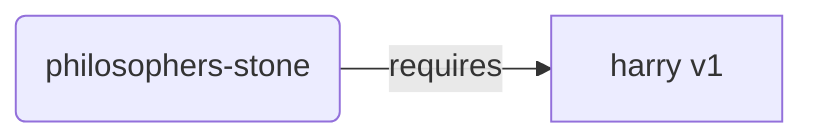
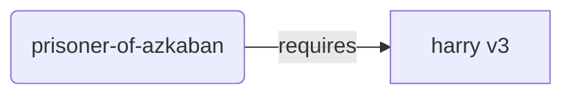
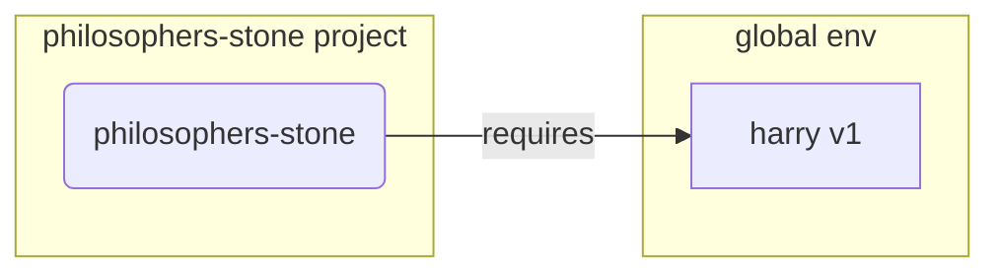
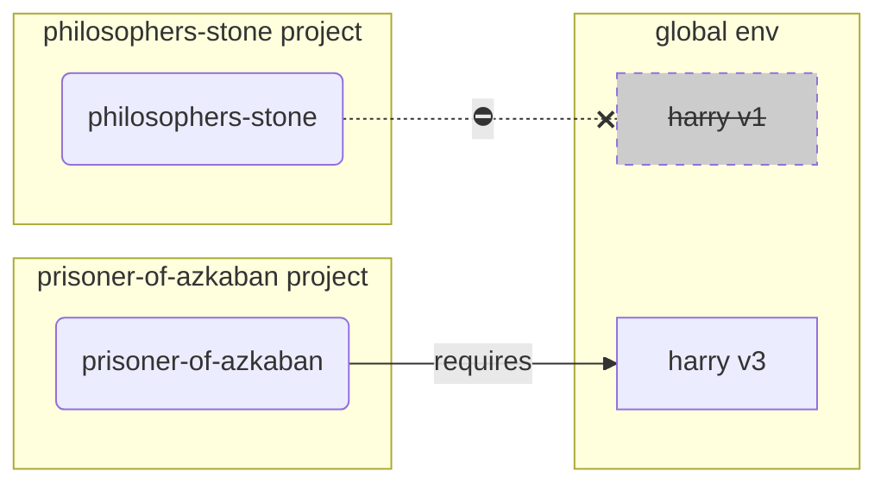
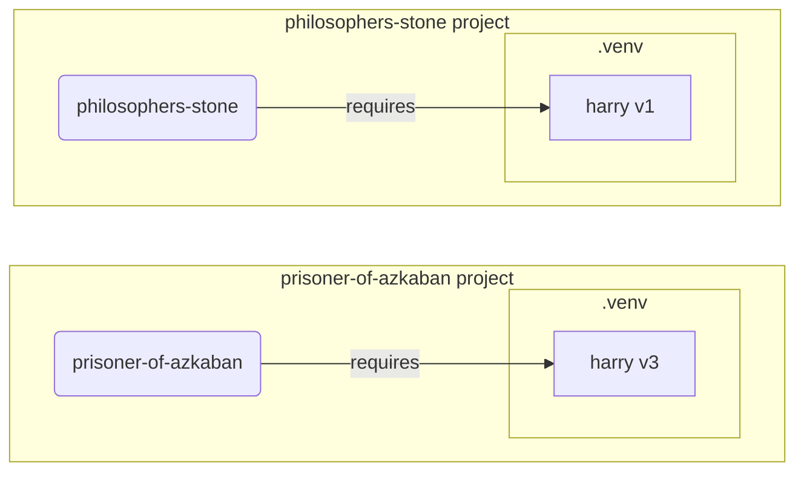

# 가상 환경

Python 프로젝트를 작업할 때는 **가상 환경** (또는 이와 유사한 도구)을 사용하는 것이 좋습니다. 각 프로젝트 마다 설치하는 패키지를 분리하여 관리할 수 있습니다.

/// info | 정보

이미 가상 환경에 대해 잘 알고 있다면, 이 섹션은 건너 뛰어도 괜찮습니다. 🤓

///

/// tip | 팁

**가상 환경(Virtual Environment)** 은 **환경 변수(Environment Variable)** 와 다릅니다.

**환경 변수**는 시스템에 존재하며, 프로그램이 사용할 수 있는 변수입니다.

**가상 환경**은 몇몇 파일로 구성된 하나의 디렉터리입니다.

///

/// info | 정보

이 페이지에서는 **가상 환경**의 사용 방법과 작동 방식을 설명합니다.

만약 **모든 것을 관리해주는 도구** (Python 설치까지 포함)를 사용하고 싶다면 <a href="https://github.com/astral-sh/uv" class="external-link" target="_blank">uv</a>를 사용해보세요.

///

## 프로젝트 생성

먼저, 프로젝트를 위한 디렉터리를 하나 생성합니다.

보통 사용자 홈 디렉터리 안에 `code`라는 디렉터리를 만들고, 그 안에 프로젝트마다 하나씩 디렉터리를 만들어 관리합니다.

<div class="termy">

```console
// 홈 디렉터리로 이동
$ cd
// 모든 코드 프로젝트를 위한 디렉터리 생성
$ mkdir code
// code 디렉터리로 이동
$ cd code
// 이번 프로젝트를 위한 디렉터리 생성
$ mkdir awesome-project
// 해당 프로젝트 디렉터리로 이동
$ cd awesome-project
```

</div>

## 가상 환경 생성

Python 프로젝트를 **처음 시작할 때**, 가상 환경을 **<abbr title="다른 방법들도 있지만, 이건 간단한 가이드라인입니다">프로젝트 내부</abbr>**에 생성합니다.

/// tip | 팁

이 작업은 **프로젝트를 처음 설정할 때 한번만** 해주면 됩니다. 이후 작업할 때 반복할 필요는 없습니다.

///

//// tab | `venv`

Python 표준 라이브러리에 포함된 venv 모듈을 사용해 가상 환경을 생성할 수 있습니다.

<div class="termy">

```console
$ python -m venv .venv
```

</div>

/// details | 명령어 상세 설명

* `python`: `python` 프로그램을 실행합니다.
* `-m`: 특정 모듈을 스크립트처럼 실행합니다. 대상 모듈을 바로 뒤에 지정합니다.
* `venv`: Python 표준 라이브러리에 포함된 `venv` 모듈을 실행합니다.
* `.venv`: 가상 환경을 `.venv` 디렉터리에 생성합니다.

///

////

//// tab | `uv`

<a href="https://github.com/astral-sh/uv" class="external-link" target="_blank">`uv`</a>가 설치되어 있다면, uv를 통해 가상 환경을 생성할 수 있습니다.

<div class="termy">

```console
$ uv venv
```

</div>

/// tip | 팁

`uv`는 기본적으로 `.venv` 디렉터리에 가상 환경을 생성합니다.

별도로 디렉터리 이름을 추가 인자로 넘겨 주면 경로를 지정 할 수 있습니다.

///

////

해당 명령어는 `.venv` 디렉터리에 새로운 가상 환경을 생성합니다.

/// details | `.venv` 또는 다른 이름

가상 환경을 다른 디렉터리에 생성할 수도 있지만, 관례적으로 `.venv` 디렉터리 이름을 사용합니다.

///

## 가상 환경 활성화

이후 실행하는 Python 명령어와 패키지 설치가 가상 환경을 따르도록, 가상 환경을 활성화하세요.

/// tip | 팁

**터미널을 새로 열고** 프로젝트 작업을 시작할 때는, **항상 이 작업을** 해주세요.

///

//// tab | Linux, macOS

<div class="termy">

```console
$ source .venv/bin/activate
```

</div>

////

//// tab | Windows PowerShell

<div class="termy">

```console
$ .venv\Scripts\Activate.ps1
```

</div>

////

//// tab | Windows Bash

Windows에서 Bash(예: <a href="https://gitforwindows.org/" class="external-link" target="_blank">Git Bash</a>)를 사용하는 경우:

<div class="termy">

```console
$ source .venv/Scripts/activate
```

</div>

////

/// tip | 팁

가상 환경에 새로운 패키지를 설치할 때마다, 해당 환경을 다시 활성화하세요.

이렇게 하면 해당 패키지로 설치된 **터미널(<abbr title="command line interface">CLI</abbr>) 프로그램**을 사용할 때, 전역에 설치된 다른 버전이 아니라, 가상 환경 안에 설치된 정확한 버전을 사용합니다.

///

## 가상 환경이 활성화 여부 확인

가상 환경이 활성화되었는지 확인합니다. (이전 명령어가 제대로 작동했는지 확인합니다).

/// tip | 팁

이 단계는 **선택 사항**이지만, 모든 것이 예상대로 작동하고 있는지, 그리고 의도한 가상 환경이 활성화 되었는 지 **확인**하는 좋은 방법입니다.

///

//// tab | Linux, macOS, Windows Bash

<div class="termy">

```console
$ which python

/home/user/code/awesome-project/.venv/bin/python
```

</div>

`python` 위치가 프로젝트 내부(이 예시에서는 `awesome-project`)의 `.venv/bin/python` 경로로 표시된다면 성공입니다. 🎉

////

//// tab | Windows PowerShell

<div class="termy">

```console
$ Get-Command python

C:\Users\user\code\awesome-project\.venv\Scripts\python
```

</div>

`python` 위치가 프로젝트 내부(이 예시에서는 `awesome-project`)의 `.venv\bin\python` 경로로 표시된다면 성공입니다. 🎉

////

## pip 업그레이드

/// tip | 팁

<a href="https://github.com/astral-sh/uv" class="external-link" target="_blank">`uv`</a>를 사용한다면, `pip` 대신 `uv`로 패키지를 설치하게 되므로 `pip`을 업그레이드할 필요가 없습니다. 😎

///

`pip`을 사용하여 패키지를 설치하는 경우 (Python 표준 라이브러리에 포함되어 있습니다), **최신 버전으로 업그레이드**하는 것이 좋습니다.

패키지 설치 중 발생하는 다양하고 특이한 에러들은 `pip` 업그레이드로 쉽게 해결되는 경우가 많습니다.

/// tip | 팁

이 작업은 보통 가상 환경을 생성한 **직후 한 번만** 하면 됩니다.

///

가상 환경이 활성화된 상태인지 확인한 후(앞서 설명한 명령어 사용), 아래 명령어를 실행하세요:

<div class="termy">

```console
$ python -m pip install --upgrade pip

---> 100%
```

</div>

## `.gitignore` 추가하기

**Git**을 사용하고 있다면 (사용하는 것이 좋습니다), `.gitignore` 파일을 추가해서 `.venv` 디렉터리 전체를 Git에서 제외하세요.

/// tip | 팁

<a href="https://github.com/astral-sh/uv" class="external-link" target="_blank">`uv`</a>를 사용해 가상 환경을 생성했다면, 이미 이 작업이 자동으로 처리되어 있으므로 이 단계는 건너뛰어도 됩니다. 😎

///

/// tip | 팁

이 작업도 마찬가지로, 가상 환경을 생성한 **직후 한 번만** 하면 됩니다.

///

<div class="termy">

```console
$ echo "*" > .venv/.gitignore
```

</div>

/// details | 명령어 상세 설명

* `echo "*"`: 터미널에 `*` 텍스트를 "출력"합니다 (다음 설명에서 조금 바뀝니다)
* `>`: 왼쪽 명령어의 출력 내용을 터미널에 출력하지 않고, 오른쪽에 지정된 파일로 **기록(write)** 하라는 의미입니다.
* `.gitignore`: 출력된 텍스트가 기록될 파일 이름입니다.

그리고 Git에서 `*`는 "모든 것"을 의미합니다. 따라서 `.venv` 디렉터리 안의 모든 것을 무시하게 됩니다.

이 명령어는 다음과 같은 내용을 가진 `.gitignore` 파일을 생성합니다:


```gitignore
*
```

///

## 패키지 설치

가상 환경을 활성화한 후, 그 안에 필요한 패키지들을 설치할 수 있습니다.

/// tip | 팁

프로젝트에서 필요한 패키지를 설치하거나 업그레이드할 때는 이 작업을 **한 번만** 하면 됩니다.

만약 특정 패키지의 버전을 업그레이드하거나, 새로운 패키지를 추가할 필요가 생기면 **다시 이 작업을 반복**하면 됩니다.

///

### 패키지 직접 설치

급하게 작업하거나, 프로젝트에 필요한 패키지 목록을 따로 파일로 관리하고 싶지 않은 경우, 패키지를 직접 설치할 수도 있습니다.

/// tip | 팁

패키지 이름과 버전 정보를 파일에 정리해두는 것(예: `requirements.txt` 또는 `pyproject.toml`)은 (매우) 좋은 생각입니다.

///

//// tab | `pip`

<div class="termy">

```console
$ pip install "fastapi[standard]"

---> 100%
```

</div>

////

//// tab | `uv`

<a href="https://github.com/astral-sh/uv" class="external-link" target="_blank">`uv`</a>를 사용하는 경우:

<div class="termy">

```console
$ uv pip install "fastapi[standard]"
---> 100%
```

</div>

////

### `requirements.txt`에서 설치

`requirements.txt` 파일이 있다면, 그 안에 명시된 패키지들을 한 번에 설치할 수 있습니다.

//// tab | `pip`

<div class="termy">

```console
$ pip install -r requirements.txt
---> 100%
```

</div>

////

//// tab | `uv`

<a href="https://github.com/astral-sh/uv" class="external-link" target="_blank">`uv`</a>를 사용하는 경우:

<div class="termy">

```console
$ uv pip install -r requirements.txt
---> 100%
```

</div>

////

/// details | `requirements.txt`

다음은 몇 가지 패키지를 포함한 `requirements.txt`의 예시입니다:

```requirements.txt
fastapi[standard]==0.113.0
pydantic==2.8.0
```

///

## 프로그램 실행

가상 환경을 활성화한 후에는 프로그램을 실행할 수 있습니다. 이때 해당 가상 환경에 설치된 Python과 패키지들이 사용됩니다.

<div class="termy">

```console
$ python main.py

Hello World
```

</div>

## 에디터 설정

에디터를 사용할 경우, 앞서 만든 가상 환경을 사용하도록 설정하는 것이 좋습니다. (대부분의 에디터는 자동으로 감지하기도 합니다.)
이렇게 하면 자동 완성 기능이나 코드 내 오류 표시 기능을 제대로 사용할 수 있습니다.

예시:

* <a href="https://code.visualstudio.com/docs/python/environments#_select-and-activate-an-environment" class="external-link" target="_blank">VS Code</a>
* <a href="https://www.jetbrains.com/help/pycharm/creating-virtual-environment.html" class="external-link" target="_blank">PyCharm</a>

/// tip | 팁

이 설정은 보통 가상 환경을 **처음 만들었을 때 한 번만** 해주면 됩니다.

///

## 가상 환경 비활성화

프로젝트 작업이 끝났다면, 가상 환경을 **비활성화**할 수 있습니다.

<div class="termy">

```console
$ deactivate
```

</div>

이렇게 하면 이후에 `python` 명령어를 실행했을 때, 가상 환경의 Python이나 그 안에 설치된 패키지들을 사용하지 않게 됩니다.

## 이제 작업할 준비가 되었습니다

이제 프로젝트 작업을 시작할 준비가 완료되었습니다.


/// tip | 팁

위 내용을 더 깊이 이해하고 싶으신가요?

그렇다면 계속 읽어 주세요. 👇🤓

///

## 가상 환경을 왜 사용하는가

FastAPI를 사용하려면 먼저 <a href="https://www.python.org/" class="external-link" target="_blank">Python</a>을 설치해야 합니다.

그 후에는 FastAPI와 함께 사용할 **기타 패키지들**을 **설치**해야 합니다.

패키지를 설치할 때 보통 Python에 기본 포함된 `pip` 명령어(또는 유사한 도구)를 사용합니다.

하지만 `pip`을 그냥 직접 사용하면, 해당 패키지들은 **전역 Python 환경**(시스템 전체에 설치된 Python)에 설치됩니다.

### 문제점

그렇다면, 전역 Python 환경에 패키지를 설치하면 어떤 문제가 발생할까요?

어느 시점이 되면, **서로 다른 패키지들**에 의존하는 여러 개의 프로그램을 작성하게 될 것입니다. 그리고 이들 중 일부는 **같은 패키지의 서로 다른 버전**을 필요로 할 수 있습니다. 😱

예를 들어, `마법사의 돌(philosophers-stone)` 프로젝트를 만들었다고 가정해봅시다. 이 프로그램은 `해리 포터(harry)`라는 패키지의 `v1` 버전을 **의존**합니다. 따라서 `harry`를 설치해야 합니다.



그런데 나중에 `아즈카반의 죄수(prisoner-of-azkaban)`이라는 또 다른 프로젝트를 만들게 되었고, 이 프로젝트도 역시 `harry` 패키지를 사용합니다. 그런데 이 프로젝트는 `harry`의 `v3` 버전이 필요합니다.



하지만 이제 문제가 생깁니다. 로컬 가상 환경 대신에 전역 환경에 패키지를 설치하게 되면, 어떤 버전의 `harry`를 설치할지를 선택해야 하기 때문입니다.

예를 들어, `마법사의 돌(philosophers-stone)`을 실행하고 싶다면 먼저 `harry` `v1` 버전을 다음과 같이 설치 해야 합니다:

<div class="termy">

```console
$ pip install "harry==1"
```

</div>

그러면 결국 전역 Python 환경에는 `harry` `v1`버전이 설치된 상태가 됩니다.



하지만 이제 `아즈카반의 죄수(prisoner-of-azkaban)`을 실행하고 싶다면, `harry` `v1`버전을 제거하고 `harry` `v3`버전을 설치해야 합니다. (또는 단순히 `v3`버전을 설치하는 것만으로도 기존의 `v1`버전이 자동으로 제거됩니다.)

<div class="termy">

```console
$ pip install "harry==3"
```

</div>

그렇게 하면 이제 전역 Python 환경에는 `harry` `v3`버전이 설치된 상태가 됩니다.

그리고 다시 `마법사의 돌(philosophers-stone)`을 실행하려고 하면, **작동하지** 않을 수 있습니다. 왜냐하면 이 프로그램은 `harry` `v1`버전을 필요로 하기 때문입니다.



/// tip | 팁

Python 패키지들은 **새 버전**에서 **호환성 문제(breaking changes)**가 발생하지 않도록 최대한 노력하는 것이 일반적입니다. 하지만 그래도 안전하게 작업하려면, 테스트를 실행해보면서 새 버전을 의도적으로 설치하는 것이 좋습니다.

///

이제, 이런 일이 여러분의 **모든 프로젝트**가 사용하는 **수많은 패키지들**에서 동시에 발생한다고 상상해보세요. 이는 매우 관리하기 어려우며, 결국 **서로 호환되지 않는 버전**의 패키지로 프로젝트를 실행하게 될 가능성이 높고, 그로 인해 어떤 문제가 왜 발생하는지 알 수 없게 될 수 있습니다.

또한 사용하는 운영체제(Linux, Windows, macOS 등)에 따라 Python이 **미리 설치되어 있을 수도** 있습니다. 이런 경우에는 운영체제의 동작에 필요한 특정 버전의 패키지들이 함께 설치되어 있을 수 있습니다. 이 상태에서 전역 Python 환경에 임의의 패키지를 설치하면, 운영체제에 포함된 프로그램 일부가 **깨질 위험**도 있습니다.

## 패키지들은 어디에 설치되는가

Python을 설치하면, 컴퓨터에 여러 디렉터리와 파일들이 생성됩니다.

이 중 일부 디렉터리는 사용자가 설치한 패키지들을 보관하는 역할을 합니다.

예를 들어, 아래 명령어를 실행하면:

<div class="termy">

```console
// 지금 실행하지 않아도 됩니다, 그냥 예제일 뿐이에요 🤓
$ pip install "fastapi[standard]"
---> 100%
```

</div>

해당 명령어는 FastAPI 코드를 포함한 압축 파일을 다운로드합니다. 이 파일은 보통 <a href="https://pypi.org/project/fastapi/" class="external-link" target="_blank">PyPI</a>에서 받아옵니다.

또한 FastAPI가 의존하는 다른 패키지들도 함께 **다운로드**됩니다.

그리고 그 모든 파일들을 **압축 해제**한 뒤, 컴퓨터의 특정 디렉터리에 저장합니다.

기본적으로 이 파일들은 Python이 설치된 디렉터리 안, 즉 **전역 환경**에 내의 디렉터리에 저장됩니다.

## 가상 환경이란

전역 환경에 모든 패키지를 설치하면서 발생하는 문제에 대한 해결책은, 작업하는 **각 프로젝트마다 가상 환경**을 사용하는 것입니다.

가상 환경은 전역 환경과 매우 유사한 하나의 **디렉터리**이며, 그 안에 해당 프로젝트를 위한 패키지들을 설치할 수 있습니다.

이렇게 하면 각 프로젝트는 자체적인 가상 환경(`.venv` 디렉터리)을 가지게 되며, 그 안에 해당 프로젝트 전용 패키지들을 보유하게 됩니다.




## 가상 환경 활성화 의미

가상 환경을 활성화한다는 것은, 예를 들어 다음과 같은 명령어를 실행하는 것을 의미합니다:

//// tab | Linux, macOS

<div class="termy">

```console
$ source .venv/bin/activate
```

</div>

////

//// tab | Windows PowerShell

<div class="termy">

```console
$ .venv\Scripts\Activate.ps1
```

</div>

////

//// tab | Windows Bash

Windows에서 Bash(예: <a href="https://gitforwindows.org/" class="external-link" target="_blank">Git Bash</a>)를 사용하는 경우:

<div class="termy">

```console
$ source .venv/Scripts/activate
```

</div>

////

이 명령어는 이후에 실행될 명령어에서 사용될 [환경 변수](environment-variables.md){.internal-link target=_blank} 몇 개를 생성하거나 수정합니다.

이 변수들 중 하나가 바로 `PATH` 변수입니다.

/// tip | 팁

`PATH` 환경 변수에 대해 더 알고 싶다면 [환경 변수 문서의 PATH 환경 변수 섹션](environment-variables.md#path-environment-variable){.internal-link target=_blank}을 참고하세요.

///

가상 환경을 활성화하면, 가상 환경의 경로인 `.venv/bin` (Linux와 macOS) 또는 `.venv\Scripts`(Windows)를 `PATH` 환경 변수에 추가됩니다.

예를 들어, 가상 환경을 활성화하기 전의 `PATH` 변수는 다음과 같았다고 가정해봅시다:

//// tab | Linux, macOS

```plaintext
/usr/bin:/bin:/usr/sbin:/sbin
```

시스템은 다음 경로들에서 프로그램을 찾게 됩니다:

* `/usr/bin`
* `/bin`
* `/usr/sbin`
* `/sbin`

////

//// tab | Windows

```plaintext
C:\Windows\System32
```

시스템은 다음 경로들에서 프로그램을 찾게 됩니다:

* `C:\Windows\System32`

////

가상 환경을 활성화한 후에는, `PATH` 변수는 다음과 같은 형태가 됩니다:

//// tab | Linux, macOS

```plaintext
/home/user/code/awesome-project/.venv/bin:/usr/bin:/bin:/usr/sbin:/sbin
```

시스템은 가장 먼저 다음 경로에서 프로그램을 찾기 시작합니다:

```plaintext
/home/user/code/awesome-project/.venv/bin
```

그 후에 다른 디렉터리들을 탐색합니다.

따라서 터미널에 `python`을 입력하면, 시스템은 다음 위치에 있는 Python 프로그램을 찾게 됩니다:

```plaintext
/home/user/code/awesome-project/.venv/bin/python
```

그리고 해당 Python을 사용하게 됩니다.

////

//// tab | Windows

```plaintext
C:\Users\user\code\awesome-project\.venv\Scripts;C:\Windows\System32
```

시스템은 가장 먼저 다음 경로에서 프로그램을 찾기 시작합니다:

```plaintext
C:\Users\user\code\awesome-project\.venv\Scripts
```

그 후에 다른 디렉터리들을 탐색합니다.

따라서 터미널에 `python`을 입력하면, 시스템은 다음 경로에 있는 Python 프로그램을 찾게 됩니다:

```plaintext
C:\Users\user\code\awesome-project\.venv\Scripts\python
```

그리고 해당 Python을 사용하게 됩니다.

////

중요한 세부 사항 중 하나는, 가상 환경의 경로가 `PATH` 변수의 가장 **앞**에 추가된다는 점입니다. 시스템은 사용 가능한 다른 Python들보다 **먼저** 이 경로를 찾습니다. 그래서 터미널에서 `python`을 실행하면, 전역 환경의 Python이 아닌 **가상 환경에 있는** Python이 사용됩니다. (예: 전역 환경에 설치된 `python`이 있더라도 그보다 우선합니다.)

가상 환경을 활성화하면 이 외에도 몇 가지 다른 것들이 변경되지만, 이는 그중에서도 가장 중요한 변화 중 하나입니다.

## 가상 환경 확인하기

가상 환경이 활성화 되었는지 확인하려면, 아래 명령어를 사용할 수 있습니다:

//// tab | Linux, macOS, Windows Bash

<div class="termy">

```console
$ which python

/home/user/code/awesome-project/.venv/bin/python
```

</div>

////

//// tab | Windows PowerShell

<div class="termy">

```console
$ Get-Command python

C:\Users\user\code\awesome-project\.venv\Scripts\python
```

</div>

////

즉, 현재 사용되는 `python` 프로그램은 **가상 환경 내부에 있는 것**입니다.

Linux와 macOS에서는 `which`, Windows PowerShell에서는 `Get-Command` 명령어를 사용합니다.

이 명령어는 `PATH` 환경 변수에 지정된 경로들을 **순서대로 탐색**하면서 `python`이라는 이름의 프로그램을 찾습니다.
찾는 즉시, 해당 프로그램의 **경로를 출력**합니다.

중요한 점은 터미널에서 `python`을 실행했을 때, 실제로 실행되는 "`python`"이 어떤 것인지 정확히 알 수 있다는 것입니다.

따라서 현재 올바른 가상 환경에 있는지 확인할 수 있습니다.

/// tip | 팁

하나의 가상 환경을 활성화한 뒤, 해당 Python을 가진 상태에서 **또 다른 프로젝트**로 이동하는 것은 흔히 발생합니다.

하지만 이때 이전 프로젝트의 가상 환경에 있는 **잘못된 Python 실행 파일**을 사용하게 되어 새 프로젝트가 **정상 작동하지 않을 수 있습니다.**

그래서 현재 어떤 `python`이 사용되고 있는지 확인할 수 있는 능력은 매우 유용합니다. 🤓

///

## 가상 환경을 비활성화하는 이유

예를 들어 `마법사의 돌(philosophers-stone)`이라는 프로젝트에서 작업 중이라고 해보겠습니다. 이때 해당 **가상 환경을 활성화**하고, 필요한 패키지를 설치하며 작업을 진행합니다.

그런데 이제는 **다른 프로젝트**인 `아즈카반의 죄수(prisoner-of-azkaban)`을 작업하고 싶어졌습니다.

그래서 그 프로젝트 디렉터리로 이동합니다:

<div class="termy">

```console
$ cd ~/code/prisoner-of-azkaban
```

</div>

만약 `마법사의 돌(philosophers-stone)`의 가상 환경을 비활성화하지 않았다면, 터미널에서 `python`을 실행할 때 여전히 `마법사의 돌(philosophers-stone)` 가상 환경의 Python을 사용하게 됩니다.

<div class="termy">

```console
$ cd ~/code/prisoner-of-azkaban

$ python main.py

// sirius를 임포트하는 데 실패했습니다. 설치되어 있지 않아요 😱
Traceback (most recent call last):
    File "main.py", line 1, in <module>
        import sirius
```

</div>

하지만 `마법사의 돌(philosophers-stone)`의 가상 환경을 비활성화한 다음, `아즈카반의 죄수(prisoner-of-azkaban)` 프로젝트의 가상 환경을 활성화하면, 이제 `python` 명령어는 `아즈카반의 죄수(prisoner-of-azkaban)` 가상 환경의 Python을 사용하게 됩니다.

<div class="termy">

```console
$ cd ~/code/prisoner-of-azkaban

// 이전 디렉터리에 있을 필요 없이, 어디서든 가상 환경을 비활성화할 수 있습니다. 다른 프로젝트 디렉터리로 이동한 후에도 괜찮아요 😎
$ deactivate

// prisoner-of-azkaban/.venv 가상 환경을 활성화합니다 🚀
$ source .venv/bin/activate

// 이제 python을 실행하면, 이 가상 환경에 설치된 sirius 패키지를 찾게 됩니다 ✨
$ python main.py

못된 짓을 꾸미고 있음을 엄숙히 맹세합니다.🧙
ImportError는 이제 없습니다. 🐺
```

</div>

## 대안들

이 문서는 여러분이 Python 프로젝트를 시작하고, **그 내부에서** 어떻게 돌아가는지 알려주는 간단한 가이드입니다.

가상 환경, 패키지 의존성(Requirements), 프로젝트를 관리하는 방법에는 이 외에도 다양한 **대안**들이 존재합니다.

만약 준비가 되었다면, **프로젝트 전체**, 패키지 의존성, 가상 환경 등을 통합적으로 **관리**할 수 있는 도구를 써보는 것도 좋습니다. 그럴 때 추천하는 도구가 바로 <a href="https://github.com/astral-sh/uv" class="external-link" target="_blank">uv</a>입니다.

`uv`는 다양한 기능을 지원합니다:

* 다양한 버전의 **Python 설치**
* 각 프로젝트 별 **가상 환경 관리**
* **패키지 설치**
* 프로젝트의 **의존성과 버전** 관리
* 설치된 패키지들과 그 버전을 **정확히 고정(lock)**해서,개발 환경과 운영 환경이 완전히 동일하게 작동할 수 있도록 보장
* 이 외에도 다양한 기능을 지원

## 결론

여기까지 모두 읽고 이해했다면, 이제 많은 개발자들보다 가상 환경을 **훨씬 더 깊이 있게 이해**하게 되셨습니다. 🤓

이런 세부적인 내용을 알고 있으면, 언젠가 복잡해 보이는 문제를 디버깅할 때 분명히 큰 도움이 될 것입니다. 이제는 **이 모든 것들이 내부에서 어떻게 작동하는지** 알고 있기 때문입니다. 😎
