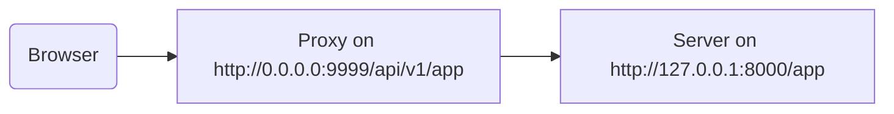

# Atrás de um Proxy

Em algumas situações, você pode precisar usar um servidor **proxy** como Traefik ou Nginx com uma configuração que adiciona um prefixo de caminho extra que não é visto pela sua aplicação.

Nesses casos, você pode usar `root_path` para configurar sua aplicação.

O `root_path` é um mecanismo fornecido pela especificação ASGI (que o FastAPI utiliza, através do Starlette).

O `root_path` é usado para lidar com esses casos específicos.

E também é usado internamente ao montar sub-aplicações.

## Proxy com um prefixo de caminho removido

Ter um proxy com um prefixo de caminho removido, nesse caso, significa que você poderia declarar um caminho em `/app` no seu código, mas então, você adiciona uma camada no topo (o proxy) que colocaria sua aplicação **FastAPI** sob um caminho como `/api/v1`.

Nesse caso, o caminho original `/app` seria servido em `/api/v1/app`.

Embora todo o seu código esteja escrito assumindo que existe apenas `/app`.

```Python hl_lines="6"
{!../../../docs_src/behind_a_proxy/tutorial001.py!}
```

E o proxy estaria **"removendo"** o **prefixo do caminho** dinamicamente antes de transmitir a solicitação para o servidor da aplicação (provavelmente Uvicorn via CLI do FastAPI), mantendo sua aplicação convencida de que está sendo servida em `/app`, para que você não precise atualizar todo o seu código para incluir o prefixo `/api/v1`.

Até aqui, tudo funcionaria normalmente.

Mas então, quando você abre a interface de documentação integrada (o frontend), ele esperaria obter o OpenAPI schema em `/openapi.json`, em vez de `/api/v1/openapi.json`.

Então, o frontend (que roda no navegador) tentaria acessar `/openapi.json` e não conseguiria obter o OpenAPI schema.

Como temos um proxy com um prefixo de caminho de `/api/v1` para nossa aplicação, o frontend precisa buscar o OpenAPI schema em `/api/v1/openapi.json`.



/// tip | "Dica"

O IP `0.0.0.0` é comumente usado para significar que o programa escuta em todos os IPs disponíveis naquela máquina/servidor.

///

A interface de documentação também precisaria do OpenAPI schema para declarar que API `server` está localizado em `/api/v1` (atrás do proxy). Por exemplo:

```JSON hl_lines="4-8"
{
    "openapi": "3.1.0",
    // Mais coisas aqui
    "servers": [
        {
            "url": "/api/v1"
        }
    ],
    "paths": {
            // Mais coisas aqui
    }
}
```

Neste exemplo, o "Proxy" poderia ser algo como **Traefik**. E o servidor seria algo como CLI do FastAPI com **Uvicorn**, executando sua aplicação FastAPI.

### Fornecendo o `root_path`

Para conseguir isso, você pode usar a opção de linha de comando `--root-path` assim:

<div class="termy">

```console
$ fastapi run main.py --root-path /api/v1

<span style="color: green;">INFO</span>:     Uvicorn running on http://127.0.0.1:8000 (Press CTRL+C to quit)
```

</div>

Se você usar Hypercorn, ele também tem a opção `--root-path`.

/// note | "Detalhes Técnicos"

A especificação ASGI define um `root_path` para esse caso de uso.

E a opção de linha de comando `--root-path` fornece esse `root_path`.

///

### Verificando o `root_path` atual

Você pode obter o `root_path` atual usado pela sua aplicação para cada solicitação, ele faz parte do dicionário `scope` (que faz parte da especificação ASGI).

Aqui estamos incluindo ele na mensagem apenas para fins de demonstração.

```Python hl_lines="8"
{!../../../docs_src/behind_a_proxy/tutorial001.py!}
```

Então, se você iniciar o Uvicorn com:

<div class="termy">

```console
$ fastapi run main.py --root-path /api/v1

<span style="color: green;">INFO</span>:     Uvicorn running on http://127.0.0.1:8000 (Press CTRL+C to quit)
```

</div>

A resposta seria algo como:

```JSON
{
    "message": "Hello World",
    "root_path": "/api/v1"
}
```

### Configurando o `root_path` na aplicação FastAPI

Alternativamente, se você não tiver uma maneira de fornecer uma opção de linha de comando como `--root-path` ou equivalente, você pode definir o parâmetro `--root-path` ao criar sua aplicação FastAPI:

```Python hl_lines="3"
{!../../../docs_src/behind_a_proxy/tutorial002.py!}
```

Passar o `root_path`h para `FastAPI` seria o equivalente a passar a opção de linha de comando `--root-path` para Uvicorn ou Hypercorn.

### Sobre `root_path`

Tenha em mente que o servidor (Uvicorn) não usará esse `root_path` para nada além de passá-lo para a aplicação.

Mas se você acessar com seu navegador <a href="http://127.0.0.1:8000" class="external-link" target="_blank">http://127.0.0.1:8000/app</a> você verá a resposta normal:

```JSON
{
    "message": "Hello World",
    "root_path": "/api/v1"
}
```

Portanto, ele não esperará ser acessado em `http://127.0.0.1:8000/api/v1/app`.

O Uvicorn esperará que o proxy acesse o Uvicorn em `http://127.0.0.1:8000/app`, e então seria responsabilidade do proxy adicionar o prefixo extra `/api/v1` no topo.

## Sobre proxies com um prefixo de caminho removido

Tenha em mente que um proxy com prefixo de caminho removido é apenas uma das maneiras de configurá-lo.

Provavelmente, em muitos casos, o padrão será que o proxy não tenha um prefixo de caminho removido.

Em um caso como esse (sem um prefixo de caminho removido), o proxy escutaria em algo como `https://myawesomeapp.com`, e então se o navegador acessar `https://myawesomeapp.com/api/v1/app` e seu servidor (por exemplo, Uvicorn) escutar em `http://127.0.0.1:8000` o proxy (sem um prefixo de caminho removido) acessaria o Uvicorn no mesmo caminho: `http://127.0.0.1:8000/api/v1/app`.

## Testando localmente com Traefik

Você pode facilmente executar o experimento localmente com um prefixo de caminho removido usando <a href="https://docs.traefik.io/" class="external-link" target="_blank">Traefik</a>.

<a href="https://github.com/containous/traefik/releases" class="external-link" target="_blank">Faça o download do Traefik.</a>, Ele é um único binário e você pode extrair o arquivo compactado e executá-lo diretamente do terminal.

Então, crie um arquivo `traefik.toml` com:

```TOML hl_lines="3"
[entryPoints]
  [entryPoints.http]
    address = ":9999"

[providers]
  [providers.file]
    filename = "routes.toml"
```

Isso diz ao Traefik para escutar na porta 9999 e usar outro arquivo `routes.toml`.

/// tip | "Dica"

Estamos usando a porta 9999 em vez da porta padrão HTTP 80 para que você não precise executá-lo com privilégios de administrador (`sudo`).

///

Agora crie esse outro arquivo `routes.toml`:

```TOML hl_lines="5  12  20"
[http]
  [http.middlewares]

    [http.middlewares.api-stripprefix.stripPrefix]
      prefixes = ["/api/v1"]

  [http.routers]

    [http.routers.app-http]
      entryPoints = ["http"]
      service = "app"
      rule = "PathPrefix(`/api/v1`)"
      middlewares = ["api-stripprefix"]

  [http.services]

    [http.services.app]
      [http.services.app.loadBalancer]
        [[http.services.app.loadBalancer.servers]]
          url = "http://127.0.0.1:8000"
```

Esse arquivo configura o Traefik para usar o prefixo de caminho `/api/v1`.

E então ele redirecionará suas solicitações para seu Uvicorn rodando em `http://127.0.0.1:8000`.

Agora inicie o Traefik:

<div class="termy">

```console
$ ./traefik --configFile=traefik.toml

INFO[0000] Configuration loaded from file: /home/user/awesomeapi/traefik.toml
```

</div>

E agora inicie sua aplicação, usando a opção `--root-path`:

<div class="termy">

```console
$ fastapi run main.py --root-path /api/v1

<span style="color: green;">INFO</span>:     Uvicorn running on http://127.0.0.1:8000 (Press CTRL+C to quit)
```

</div>

### Verifique as respostas

Agora, se você for ao URL com a porta para o Uvicorn: <a href="http://127.0.0.1:8000/app" class="external-link" target="_blank">http://127.0.0.1:8000/app</a>, você verá a resposta normal:

```JSON
{
    "message": "Hello World",
    "root_path": "/api/v1"
}
```

/// tip | "Dica"

Perceba que, mesmo acessando em `http://127.0.0.1:8000/app`, ele mostra o `root_path` de `/api/v1`, retirado da opção `--root-path`.

///

E agora abra o URL com a porta para o Traefik, incluindo o prefixo de caminho: <a href="http://127.0.0.1:9999/api/v1/app" class="external-link" target="_blank">http://127.0.0.1:9999/api/v1/app</a>.

Obtemos a mesma resposta:

```JSON
{
    "message": "Hello World",
    "root_path": "/api/v1"
}
```

mas desta vez no URL com o prefixo de caminho fornecido pelo proxy: `/api/v1`.

Claro, a ideia aqui é que todos acessariam a aplicação através do proxy, então a versão com o prefixo de caminho `/api/v1` é a "correta".

E a versão sem o prefixo de caminho (`http://127.0.0.1:8000/app`), fornecida diretamente pelo Uvicorn, seria exclusivamente para o _proxy_ (Traefik) acessá-la.

Isso demonstra como o Proxy (Traefik) usa o prefixo de caminho e como o servidor (Uvicorn) usa o `root_path` da opção `--root-path`.

### Verifique a interface de documentação

Mas aqui está a parte divertida. ✨

A maneira "oficial" de acessar a aplicação seria através do proxy com o prefixo de caminho que definimos. Então, como esperaríamos, se você tentar a interface de documentação servida diretamente pelo Uvicorn, sem o prefixo de caminho no URL, ela não funcionará, porque espera ser acessada através do proxy.

Você pode verificar em <a href="http://127.0.0.1:8000/docs" class="external-link" target="_blank">http://127.0.0.1:8000/docs</a>:


Mas se acessarmos a interface de documentação no URL "oficial" usando o proxy com a porta `9999`, em `/api/v1/docs`, ela funciona corretamente! 🎉

Você pode verificar em <a href="http://127.0.0.1:9999/api/v1/docs" class="external-link" target="_blank">http://127.0.0.1:9999/api/v1/docs</a>:


Exatamente como queríamos. ✔️

Isso porque o FastAPI usa esse `root_path` para criar o `server` padrão no OpenAPI com o URL fornecido pelo `root_path`.

## Servidores adicionais

/// warning | "Aviso"

Este é um caso de uso mais avançado. Sinta-se à vontade para pular.

///

Por padrão, o **FastAPI** criará um `server` no OpenAPI schema com o URL para o `root_path`.

Mas você também pode fornecer outros `servers` alternativos, por exemplo, se quiser que a *mesma* interface de documentação interaja com ambientes de staging e produção.

Se você passar uma lista personalizada de `servers` e houver um `root_path` (porque sua API está atrás de um proxy), o **FastAPI** inserirá um "server" com esse `root_path` no início da lista.

Por exemplo:

```Python hl_lines="4-7"
{!../../../docs_src/behind_a_proxy/tutorial003.py!}
```

Gerará um OpenAPI schema como:

```JSON hl_lines="5-7"
{
    "openapi": "3.1.0",
    // Mais coisas aqui
    "servers": [
        {
            "url": "/api/v1"
        },
        {
            "url": "https://stag.example.com",
            "description": "Staging environment"
        },
        {
            "url": "https://prod.example.com",
            "description": "Production environment"
        }
    ],
    "paths": {
            // Mais coisas aqui
    }
}
```

/// tip | "Dica"

Perceba o servidor gerado automaticamente com um valor `url` de `/api/v1`, retirado do `root_path`.

///

Na interface de documentação em <a href="http://127.0.0.1:9999/api/v1/docs" class="external-link" target="_blank">http://127.0.0.1:9999/api/v1/docs</a> parecerá:


/// tip | "Dica"

A interface de documentação interagirá com o servidor que você selecionar.

///

### Desabilitar servidor automático de `root_path`

Se você não quiser que o **FastAPI** inclua um servidor automático usando o `root_path`, você pode usar o parâmetro `root_path_in_servers=False`:

```Python hl_lines="9"
{!../../../docs_src/behind_a_proxy/tutorial004.py!}
```

e então ele não será incluído no OpenAPI schema.

## Montando uma sub-aplicação

Se você precisar montar uma sub-aplicação (como descrito em [Sub Aplicações - Montagens](sub-applications.md){.internal-link target=_blank}) enquanto também usa um proxy com `root_path`, você pode fazer isso normalmente, como esperaria.

O FastAPI usará internamente o `root_path` de forma inteligente, então tudo funcionará. ✨
