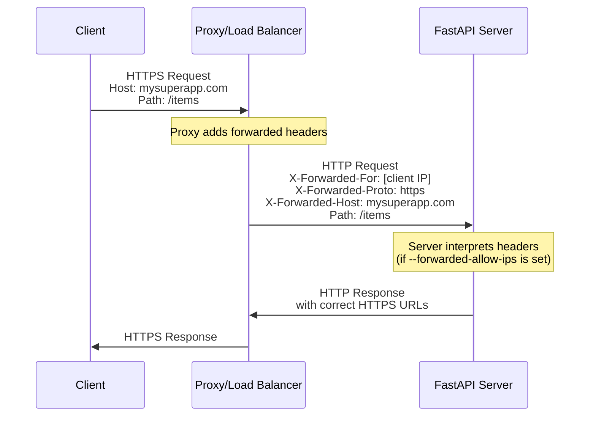
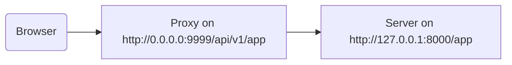

# Atrás de um Proxy { #behind-a-proxy }

Em muitas situações, você usaria um **proxy** como Traefik ou Nginx na frente da sua aplicação FastAPI.

Esses proxies podem lidar com certificados HTTPS e outras coisas.

## Headers Encaminhados pelo Proxy { #proxy-forwarded-headers }

Um **proxy** na frente da sua aplicação normalmente definiria alguns headers dinamicamente antes de enviar as requisições para o seu **servidor**, para informar ao servidor que a requisição foi **encaminhada** pelo proxy, informando a URL original (pública), incluindo o domínio, que está usando HTTPS, etc.

O programa do **servidor** (por exemplo, **Uvicorn** via **CLI do FastAPI**) é capaz de interpretar esses headers e então repassar essas informações para a sua aplicação.

Mas, por segurança, como o servidor não sabe que está atrás de um proxy confiável, ele não interpretará esses headers.

/// note | Detalhes Técnicos

Os headers do proxy são:

* [X-Forwarded-For](https://developer.mozilla.org/en-US/docs/Web/HTTP/Reference/Headers/X-Forwarded-For)
* [X-Forwarded-Proto](https://developer.mozilla.org/en-US/docs/Web/HTTP/Reference/Headers/X-Forwarded-Proto)
* [X-Forwarded-Host](https://developer.mozilla.org/en-US/docs/Web/HTTP/Reference/Headers/X-Forwarded-Host)

///

### Ativar headers encaminhados pelo proxy { #enable-proxy-forwarded-headers }

Você pode iniciar a CLI do FastAPI com a opção de linha de comando `--forwarded-allow-ips` e informar os endereços IP que devem ser confiáveis para ler esses headers encaminhados.

Se você definir como `--forwarded-allow-ips="*"`, ele confiará em todos os IPs de entrada.

Se o seu **servidor** estiver atrás de um **proxy** confiável e somente o proxy falar com ele, isso fará com que ele aceite seja qual for o IP desse **proxy**.

<div class="termy">

```console
$ fastapi run --forwarded-allow-ips="*"

<span style="color: green;">INFO</span>:     Uvicorn running on http://127.0.0.1:8000 (Press CTRL+C to quit)
```

</div>

### Redirecionamentos com HTTPS { #redirects-with-https }

Por exemplo, suponha que você defina uma *operação de rota* `/items/`:

{* ../../docs_src/behind_a_proxy/tutorial001_01_py310.py hl[6] *}

Se o cliente tentar ir para `/items`, por padrão, ele seria redirecionado para `/items/`.

Mas antes de definir a opção de linha de comando `--forwarded-allow-ips`, poderia redirecionar para `http://localhost:8000/items/`.

Mas talvez sua aplicação esteja hospedada em `https://mysuperapp.com`, e o redirecionamento deveria ser para `https://mysuperapp.com/items/`.

Ao definir `--proxy-headers`, agora o FastAPI conseguirá redirecionar para o local correto. 😎

```
https://mysuperapp.com/items/
```

/// tip | Dica

Se você quiser saber mais sobre HTTPS, confira o tutorial [Sobre HTTPS](../deployment/https.md).

///

### Como funcionam os headers encaminhados pelo proxy { #how-proxy-forwarded-headers-work }

Aqui está uma representação visual de como o **proxy** adiciona headers encaminhados entre o cliente e o **servidor da aplicação**:


```mermaid
sequenceDiagram
    participant Client
    participant Proxy as Proxy/Load Balancer
    participant Server as FastAPI Server

    Client->>Proxy: HTTPS Request<br/>Host: mysuperapp.com<br/>Path: /items

    Note over Proxy: Proxy adds forwarded headers

    Proxy->>Server: HTTP Request<br/>X-Forwarded-For: [client IP]<br/>X-Forwarded-Proto: https<br/>X-Forwarded-Host: mysuperapp.com<br/>Path: /items

    Note over Server: Server interprets headers<br/>(if --forwarded-allow-ips is set)

    Server->>Proxy: HTTP Response<br/>with correct HTTPS URLs

    Proxy->>Client: HTTPS Response
```

O **proxy** intercepta a requisição original do cliente e adiciona os headers especiais de encaminhamento (`X-Forwarded-*`) antes de repassar a requisição para o **servidor da aplicação**.

Esses headers preservam informações sobre a requisição original que, de outra forma, seriam perdidas:

* **X-Forwarded-For**: o endereço IP original do cliente
* **X-Forwarded-Proto**: o protocolo original (`https`)
* **X-Forwarded-Host**: o host original (`mysuperapp.com`)

Quando a **CLI do FastAPI** é configurada com `--forwarded-allow-ips`, ela confia nesses headers e os utiliza, por exemplo, para gerar as URLs corretas em redirecionamentos.

## Proxy com um prefixo de path removido { #proxy-with-a-stripped-path-prefix }

Você pode ter um proxy que adiciona um prefixo de path à sua aplicação.

Nesses casos, você pode usar `root_path` para configurar sua aplicação.

O `root_path` é um mecanismo fornecido pela especificação ASGI (na qual o FastAPI é construído, através do Starlette).

O `root_path` é usado para lidar com esses casos específicos.

E também é usado internamente ao montar sub-aplicações.

Ter um proxy com um prefixo de path removido, nesse caso, significa que você poderia declarar um path em `/app` no seu código, mas então você adiciona uma camada no topo (o proxy) que colocaria sua aplicação **FastAPI** sob um path como `/api/v1`.

Nesse caso, o path original `/app` seria servido em `/api/v1/app`.

Embora todo o seu código esteja escrito assumindo que existe apenas `/app`.

{* ../../docs_src/behind_a_proxy/tutorial001_py310.py hl[6] *}

E o proxy estaria **"removendo"** o **prefixo de path** dinamicamente antes de transmitir a solicitação para o servidor da aplicação (provavelmente Uvicorn via CLI do FastAPI), mantendo sua aplicação convencida de que está sendo servida em `/app`, para que você não precise atualizar todo o seu código para incluir o prefixo `/api/v1`.

Até aqui, tudo funcionaria normalmente.

Mas então, quando você abre a interface de documentação integrada (o frontend), ela esperaria obter o OpenAPI schema em `/openapi.json`, em vez de `/api/v1/openapi.json`.

Então, o frontend (que roda no navegador) tentaria acessar `/openapi.json` e não conseguiria obter o OpenAPI schema.

Como temos um proxy com um prefixo de path de `/api/v1` para nossa aplicação, o frontend precisa buscar o OpenAPI schema em `/api/v1/openapi.json`.


```mermaid
graph LR

browser("Browser")
proxy["Proxy on http://0.0.0.0:9999/api/v1/app"]
server["Server on http://127.0.0.1:8000/app"]

browser --> proxy
proxy --> server
```

/// tip | Dica

O IP `0.0.0.0` é comumente usado para significar que o programa escuta em todos os IPs disponíveis naquela máquina/servidor.

///

A interface de documentação também precisaria do OpenAPI schema para declarar que este `server` da API está localizado em `/api/v1` (atrás do proxy). Por exemplo:

```JSON hl_lines="4-8"
{
    "openapi": "3.1.0",
    // Mais coisas aqui
    "servers": [
        {
            "url": "/api/v1"
        }
    ],
    "paths": {
            // Mais coisas aqui
    }
}
```

Neste exemplo, o "Proxy" poderia ser algo como **Traefik**. E o servidor seria algo como a CLI do FastAPI com **Uvicorn**, executando sua aplicação FastAPI.

### Fornecendo o `root_path` { #providing-the-root-path }

Para conseguir isso, você pode usar a opção de linha de comando `--root-path` assim:

<div class="termy">

```console
$ fastapi run main.py --forwarded-allow-ips="*" --root-path /api/v1

<span style="color: green;">INFO</span>:     Uvicorn running on http://127.0.0.1:8000 (Press CTRL+C to quit)
```

</div>

Se você usar Hypercorn, ele também tem a opção `--root-path`.

/// note | Detalhes Técnicos

A especificação ASGI define um `root_path` para esse caso de uso.

E a opção de linha de comando `--root-path` fornece esse `root_path`.

///

### Verificando o `root_path` atual { #checking-the-current-root-path }

Você pode obter o `root_path` atual usado pela sua aplicação para cada solicitação, ele faz parte do dicionário `scope` (que faz parte da especificação ASGI).

Aqui estamos incluindo-o na mensagem apenas para fins de demonstração.

{* ../../docs_src/behind_a_proxy/tutorial001_py310.py hl[8] *}

Então, se você iniciar o Uvicorn com:

<div class="termy">

```console
$ fastapi run main.py --forwarded-allow-ips="*" --root-path /api/v1

<span style="color: green;">INFO</span>:     Uvicorn running on http://127.0.0.1:8000 (Press CTRL+C to quit)
```

</div>

A resposta seria algo como:

```JSON
{
    "message": "Hello World",
    "root_path": "/api/v1"
}
```

### Configurando o `root_path` na aplicação FastAPI { #setting-the-root-path-in-the-fastapi-app }

Alternativamente, se você não tiver uma maneira de fornecer uma opção de linha de comando como `--root-path` ou equivalente, você pode definir o parâmetro `root_path` ao criar sua aplicação FastAPI:

{* ../../docs_src/behind_a_proxy/tutorial002_py310.py hl[3] *}

Passar o `root_path` para `FastAPI` seria o equivalente a passar a opção de linha de comando `--root-path` para Uvicorn ou Hypercorn.

### Sobre `root_path` { #about-root-path }

Tenha em mente que o servidor (Uvicorn) não usará esse `root_path` para nada além de passá-lo para a aplicação.

Mas se você acessar com seu navegador [http://127.0.0.1:8000/app](http://127.0.0.1:8000/app) você verá a resposta normal:

```JSON
{
    "message": "Hello World",
    "root_path": "/api/v1"
}
```

Portanto, ele não esperará ser acessado em `http://127.0.0.1:8000/api/v1/app`.

O Uvicorn esperará que o proxy acesse o Uvicorn em `http://127.0.0.1:8000/app`, e então seria responsabilidade do proxy adicionar o prefixo extra `/api/v1` no topo.

## Sobre proxies com um prefixo de path removido { #about-proxies-with-a-stripped-path-prefix }

Tenha em mente que um proxy com prefixo de path removido é apenas uma das maneiras de configurá-lo.

Provavelmente, em muitos casos, o padrão será que o proxy não tenha um prefixo de path removido.

Em um caso como esse (sem um prefixo de path removido), o proxy escutaria em algo como `https://myawesomeapp.com`, e então, se o navegador acessar `https://myawesomeapp.com/api/v1/app` e seu servidor (por exemplo, Uvicorn) escutar em `http://127.0.0.1:8000`, o proxy (sem um prefixo de path removido) acessaria o Uvicorn no mesmo path: `http://127.0.0.1:8000/api/v1/app`.

## Testando localmente com Traefik { #testing-locally-with-traefik }

Você pode facilmente executar o experimento localmente com um prefixo de path removido usando [Traefik](https://docs.traefik.io/).

[Faça o download do Traefik](https://github.com/containous/traefik/releases), ele é um único binário, você pode extrair o arquivo compactado e executá-lo diretamente do terminal.

Então, crie um arquivo `traefik.toml` com:

```TOML hl_lines="3"
[entryPoints]
  [entryPoints.http]
    address = ":9999"

[providers]
  [providers.file]
    filename = "routes.toml"
```

Isso diz ao Traefik para escutar na porta 9999 e usar outro arquivo `routes.toml`.

/// tip | Dica

Estamos usando a porta 9999 em vez da porta padrão HTTP 80 para que você não precise executá-lo com privilégios de administrador (`sudo`).

///

Agora crie esse outro arquivo `routes.toml`:

```TOML hl_lines="5  12  20"
[http]
  [http.middlewares]

    [http.middlewares.api-stripprefix.stripPrefix]
      prefixes = ["/api/v1"]

  [http.routers]

    [http.routers.app-http]
      entryPoints = ["http"]
      service = "app"
      rule = "PathPrefix(`/api/v1`)"
      middlewares = ["api-stripprefix"]

  [http.services]

    [http.services.app]
      [http.services.app.loadBalancer]
        [[http.services.app.loadBalancer.servers]]
          url = "http://127.0.0.1:8000"
```

Esse arquivo configura o Traefik para usar o prefixo de path `/api/v1`.

E então o Traefik redirecionará suas solicitações para seu Uvicorn rodando em `http://127.0.0.1:8000`.

Agora inicie o Traefik:

<div class="termy">

```console
$ ./traefik --configFile=traefik.toml

INFO[0000] Configuration loaded from file: /home/user/awesomeapi/traefik.toml
```

</div>

E agora inicie sua aplicação, usando a opção `--root-path`:

<div class="termy">

```console
$ fastapi run main.py --forwarded-allow-ips="*" --root-path /api/v1

<span style="color: green;">INFO</span>:     Uvicorn running on http://127.0.0.1:8000 (Press CTRL+C to quit)
```

</div>

### Verifique as respostas { #check-the-responses }

Agora, se você for ao URL com a porta para o Uvicorn: [http://127.0.0.1:8000/app](http://127.0.0.1:8000/app), você verá a resposta normal:

```JSON
{
    "message": "Hello World",
    "root_path": "/api/v1"
}
```

/// tip | Dica

Perceba que, mesmo acessando em `http://127.0.0.1:8000/app`, ele mostra o `root_path` de `/api/v1`, retirado da opção `--root-path`.

///

E agora abra o URL com a porta para o Traefik, incluindo o prefixo de path: [http://127.0.0.1:9999/api/v1/app](http://127.0.0.1:9999/api/v1/app).

Obtemos a mesma resposta:

```JSON
{
    "message": "Hello World",
    "root_path": "/api/v1"
}
```

mas desta vez no URL com o prefixo de path fornecido pelo proxy: `/api/v1`.

Claro, a ideia aqui é que todos acessariam a aplicação através do proxy, então a versão com o prefixo de path `/api/v1` é a "correta".

E a versão sem o prefixo de path (`http://127.0.0.1:8000/app`), fornecida diretamente pelo Uvicorn, seria exclusivamente para o _proxy_ (Traefik) acessá-la.

Isso demonstra como o Proxy (Traefik) usa o prefixo de path e como o servidor (Uvicorn) usa o `root_path` da opção `--root-path`.

### Verifique a interface de documentação { #check-the-docs-ui }

Mas aqui está a parte divertida. ✨

A maneira "oficial" de acessar a aplicação seria através do proxy com o prefixo de path que definimos. Então, como esperaríamos, se você tentar a interface de documentação servida diretamente pelo Uvicorn, sem o prefixo de path no URL, ela não funcionará, porque espera ser acessada através do proxy.

Você pode verificar em [http://127.0.0.1:8000/docs](http://127.0.0.1:8000/docs):


Mas se acessarmos a interface de documentação no URL "oficial" usando o proxy com a porta `9999`, em `/api/v1/docs`, ela funciona corretamente! 🎉

Você pode verificar em [http://127.0.0.1:9999/api/v1/docs](http://127.0.0.1:9999/api/v1/docs):


Exatamente como queríamos. ✔️

Isso porque o FastAPI usa esse `root_path` para criar o `server` padrão no OpenAPI com o URL fornecido pelo `root_path`.

## Servidores adicionais { #additional-servers }

/// warning | Atenção

Este é um caso de uso mais avançado. Sinta-se à vontade para pular.

///

Por padrão, o **FastAPI** criará um `server` no OpenAPI schema com o URL para o `root_path`.

Mas você também pode fornecer outros `servers` alternativos, por exemplo, se quiser que a mesma interface de documentação interaja com ambientes de staging e produção.

Se você passar uma lista personalizada de `servers` e houver um `root_path` (porque sua API está atrás de um proxy), o **FastAPI** inserirá um "server" com esse `root_path` no início da lista.

Por exemplo:

{* ../../docs_src/behind_a_proxy/tutorial003_py310.py hl[4:7] *}

Gerará um OpenAPI schema como:

```JSON hl_lines="5-7"
{
    "openapi": "3.1.0",
    // Mais coisas aqui
    "servers": [
        {
            "url": "/api/v1"
        },
        {
            "url": "https://stag.example.com",
            "description": "Staging environment"
        },
        {
            "url": "https://prod.example.com",
            "description": "Production environment"
        }
    ],
    "paths": {
            // Mais coisas aqui
    }
}
```

/// tip | Dica

Perceba o servidor gerado automaticamente com um valor `url` de `/api/v1`, retirado do `root_path`.

///

Na interface de documentação em [http://127.0.0.1:9999/api/v1/docs](http://127.0.0.1:9999/api/v1/docs) parecerá:


/// tip | Dica

A interface de documentação interagirá com o servidor que você selecionar.

///

/// note | Detalhes Técnicos

A propriedade `servers` na especificação OpenAPI é opcional.

Se você não especificar o parâmetro `servers` e `root_path` for igual a `/`, a propriedade `servers` no OpenAPI gerado será totalmente omitida por padrão, o que equivale a um único servidor com valor de `url` igual a `/`.

///

### Desabilitar servidor automático de `root_path` { #disable-automatic-server-from-root-path }

Se você não quiser que o **FastAPI** inclua um servidor automático usando o `root_path`, você pode usar o parâmetro `root_path_in_servers=False`:

{* ../../docs_src/behind_a_proxy/tutorial004_py310.py hl[9] *}

e então ele não será incluído no OpenAPI schema.

## Montando uma sub-aplicação { #mounting-a-sub-application }

Se você precisar montar uma sub-aplicação (como descrito em [Sub-aplicações - Montagens](sub-applications.md)) enquanto também usa um proxy com `root_path`, você pode fazer isso normalmente, como esperaria.

O FastAPI usará internamente o `root_path` de forma inteligente, então tudo funcionará. ✨
