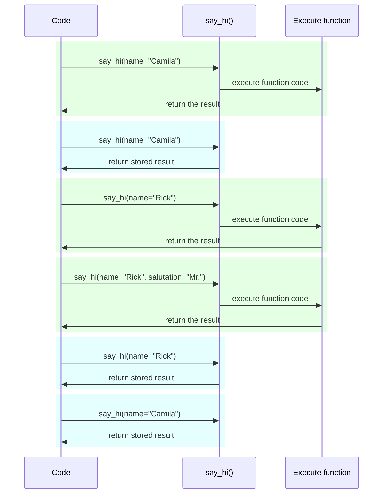

# Configurações e Variáveis de Ambiente { #settings-and-environment-variables }

Em muitos casos, sua aplicação pode precisar de configurações externas, por exemplo chaves secretas, credenciais de banco de dados, credenciais para serviços de e-mail, etc.

A maioria dessas configurações é variável (pode mudar), como URLs de banco de dados. E muitas podem ser sensíveis, como segredos.

Por esse motivo, é comum fornecê-las em variáveis de ambiente lidas pela aplicação.

/// tip | Dica

Para entender variáveis de ambiente, você pode ler [Variáveis de Ambiente](../environment-variables.md){.internal-link target=_blank}.

///

## Tipagem e validação { #types-and-validation }

Essas variáveis de ambiente só conseguem lidar com strings de texto, pois são externas ao Python e precisam ser compatíveis com outros programas e com o resto do sistema (e até com diferentes sistemas operacionais, como Linux, Windows, macOS).

Isso significa que qualquer valor lido em Python a partir de uma variável de ambiente será uma `str`, e qualquer conversão para um tipo diferente ou validação precisa ser feita em código.

## Pydantic `Settings` { #pydantic-settings }

Felizmente, o Pydantic fornece uma ótima utilidade para lidar com essas configurações vindas de variáveis de ambiente com <a href="https://docs.pydantic.dev/latest/concepts/pydantic_settings/" class="external-link" target="_blank">Pydantic: Settings management</a>.

### Instalar `pydantic-settings` { #install-pydantic-settings }

Primeiro, certifique-se de criar seu [ambiente virtual](../virtual-environments.md){.internal-link target=_blank}, ativá-lo e então instalar o pacote `pydantic-settings`:

<div class="termy">

```console
$ pip install pydantic-settings
---> 100%
```

</div>

Ele também vem incluído quando você instala os extras `all` com:

<div class="termy">

```console
$ pip install "fastapi[all]"
---> 100%
```

</div>

/// info | Informação

No Pydantic v1 ele vinha incluído no pacote principal. Agora é distribuído como um pacote independente para que você possa optar por instalá-lo ou não, caso não precise dessa funcionalidade.

///

### Criar o objeto `Settings` { #create-the-settings-object }

Importe `BaseSettings` do Pydantic e crie uma subclasse, muito parecido com um modelo do Pydantic.

Da mesma forma que com modelos do Pydantic, você declara atributos de classe com anotações de tipo e, possivelmente, valores padrão.

Você pode usar as mesmas funcionalidades e ferramentas de validação que usa em modelos do Pydantic, como diferentes tipos de dados e validações adicionais com `Field()`.

//// tab | Pydantic v2

{* ../../docs_src/settings/tutorial001.py hl[2,5:8,11] *}

////

//// tab | Pydantic v1

/// info | Informação

No Pydantic v1 você importaria `BaseSettings` diretamente de `pydantic` em vez de `pydantic_settings`.

///

{* ../../docs_src/settings/tutorial001_pv1.py hl[2,5:8,11] *}

////

/// tip | Dica

Se você quer algo rápido para copiar e colar, não use este exemplo, use o último abaixo.

///

Então, quando você cria uma instância dessa classe `Settings` (neste caso, no objeto `settings`), o Pydantic vai ler as variáveis de ambiente sem diferenciar maiúsculas de minúsculas; assim, uma variável em maiúsculas `APP_NAME` ainda será lida para o atributo `app_name`.

Em seguida, ele converterá e validará os dados. Assim, quando você usar esse objeto `settings`, terá dados dos tipos que declarou (por exemplo, `items_per_user` será um `int`).

### Usar o `settings` { #use-the-settings }

Depois você pode usar o novo objeto `settings` na sua aplicação:

{* ../../docs_src/settings/tutorial001.py hl[18:20] *}

### Executar o servidor { #run-the-server }

Em seguida, você executaria o servidor passando as configurações como variáveis de ambiente, por exemplo, você poderia definir `ADMIN_EMAIL` e `APP_NAME` com:

<div class="termy">

```console
$ ADMIN_EMAIL="deadpool@example.com" APP_NAME="ChimichangApp" fastapi run main.py

<span style="color: green;">INFO</span>:     Uvicorn running on http://127.0.0.1:8000 (Press CTRL+C to quit)
```

</div>

/// tip | Dica

Para definir várias variáveis de ambiente para um único comando, basta separá-las com espaço e colocá-las todas antes do comando.

///

Então a configuração `admin_email` seria definida como `"deadpool@example.com"`.

O `app_name` seria `"ChimichangApp"`.

E `items_per_user` manteria seu valor padrão de `50`.

## Configurações em outro módulo { #settings-in-another-module }

Você pode colocar essas configurações em outro arquivo de módulo como visto em [Aplicações Maiores - Múltiplos Arquivos](../tutorial/bigger-applications.md){.internal-link target=_blank}.

Por exemplo, você poderia ter um arquivo `config.py` com:

{* ../../docs_src/settings/app01/config.py *}

E então usá-lo em um arquivo `main.py`:

{* ../../docs_src/settings/app01/main.py hl[3,11:13] *}

/// tip | Dica

Você também precisaria de um arquivo `__init__.py` como visto em [Aplicações Maiores - Múltiplos Arquivos](../tutorial/bigger-applications.md){.internal-link target=_blank}.

///

## Configurações em uma dependência { #settings-in-a-dependency }

Em algumas ocasiões, pode ser útil fornecer as configurações a partir de uma dependência, em vez de ter um objeto global `settings` usado em todos os lugares.

Isso pode ser especialmente útil durante os testes, pois é muito fácil sobrescrever uma dependência com suas próprias configurações personalizadas.

### O arquivo de configuração { #the-config-file }

Vindo do exemplo anterior, seu arquivo `config.py` poderia ser assim:

{* ../../docs_src/settings/app02/config.py hl[10] *}

Perceba que agora não criamos uma instância padrão `settings = Settings()`.

### O arquivo principal da aplicação { #the-main-app-file }

Agora criamos uma dependência que retorna um novo `config.Settings()`.

{* ../../docs_src/settings/app02_an_py39/main.py hl[6,12:13] *}

/// tip | Dica

Vamos discutir o `@lru_cache` em breve.

Por enquanto, você pode assumir que `get_settings()` é uma função normal.

///

E então podemos exigi-la na *função de operação de rota* como dependência e usá-la onde for necessário.

{* ../../docs_src/settings/app02_an_py39/main.py hl[17,19:21] *}

### Configurações e testes { #settings-and-testing }

Então seria muito fácil fornecer um objeto de configurações diferente durante os testes criando uma sobrescrita de dependência para `get_settings`:

{* ../../docs_src/settings/app02/test_main.py hl[9:10,13,21] *}

Na sobrescrita da dependência definimos um novo valor para `admin_email` ao criar o novo objeto `Settings`, e então retornamos esse novo objeto.

Depois podemos testar que ele é usado.

## Lendo um arquivo `.env` { #reading-a-env-file }

Se você tiver muitas configurações que possivelmente mudam bastante, talvez em diferentes ambientes, pode ser útil colocá-las em um arquivo e então lê-las como se fossem variáveis de ambiente.

Essa prática é tão comum que tem um nome: essas variáveis de ambiente são comumente colocadas em um arquivo `.env`, e o arquivo é chamado de "dotenv".

/// tip | Dica

Um arquivo começando com um ponto (`.`) é um arquivo oculto em sistemas tipo Unix, como Linux e macOS.

Mas um arquivo dotenv não precisa ter exatamente esse nome de arquivo.

///

O Pydantic tem suporte para leitura desses tipos de arquivos usando uma biblioteca externa. Você pode ler mais em <a href="https://docs.pydantic.dev/latest/concepts/pydantic_settings/#dotenv-env-support" class="external-link" target="_blank">Pydantic Settings: Dotenv (.env) support</a>.

/// tip | Dica

Para isso funcionar, você precisa executar `pip install python-dotenv`.

///

### O arquivo `.env` { #the-env-file }

Você poderia ter um arquivo `.env` com:

```bash
ADMIN_EMAIL="deadpool@example.com"
APP_NAME="ChimichangApp"
```

### Ler configurações do `.env` { #read-settings-from-env }

E então atualizar seu `config.py` com:

//// tab | Pydantic v2

{* ../../docs_src/settings/app03_an/config.py hl[9] *}

/// tip | Dica

O atributo `model_config` é usado apenas para configuração do Pydantic. Você pode ler mais em <a href="https://docs.pydantic.dev/latest/concepts/config/" class="external-link" target="_blank">Pydantic: Concepts: Configuration</a>.

///

////

//// tab | Pydantic v1

{* ../../docs_src/settings/app03_an/config_pv1.py hl[9:10] *}

/// tip | Dica

A classe `Config` é usada apenas para configuração do Pydantic. Você pode ler mais em <a href="https://docs.pydantic.dev/1.10/usage/model_config/" class="external-link" target="_blank">Pydantic Model Config</a>.

///

////

/// info | Informação

Na versão 1 do Pydantic a configuração era feita em uma classe interna `Config`, na versão 2 do Pydantic é feita em um atributo `model_config`. Esse atributo recebe um `dict`, e para ter autocompletar e erros inline você pode importar e usar `SettingsConfigDict` para definir esse `dict`.

///

Aqui definimos a configuração `env_file` dentro da sua classe `Settings` do Pydantic e definimos o valor como o nome do arquivo dotenv que queremos usar.

### Criando o `Settings` apenas uma vez com `lru_cache` { #creating-the-settings-only-once-with-lru-cache }

Ler um arquivo do disco normalmente é uma operação custosa (lenta), então você provavelmente vai querer fazer isso apenas uma vez e depois reutilizar o mesmo objeto de configurações, em vez de lê-lo a cada requisição.

Mas toda vez que fizermos:

```Python
Settings()
```

um novo objeto `Settings` seria criado e, na criação, ele leria o arquivo `.env` novamente.

Se a função de dependência fosse assim:

```Python
def get_settings():
    return Settings()
```

criaríamos esse objeto para cada requisição e leríamos o arquivo `.env` para cada requisição. ⚠️

Mas como estamos usando o decorador `@lru_cache` por cima, o objeto `Settings` será criado apenas uma vez, na primeira vez em que for chamado. ✔️

{* ../../docs_src/settings/app03_an_py39/main.py hl[1,11] *}

Em qualquer chamada subsequente de `get_settings()` nas dependências das próximas requisições, em vez de executar o código interno de `get_settings()` e criar um novo objeto `Settings`, ele retornará o mesmo objeto que foi retornado na primeira chamada, repetidamente.

#### Detalhes Técnicos do `lru_cache` { #lru-cache-technical-details }

`@lru_cache` modifica a função que decora para retornar o mesmo valor que foi retornado na primeira vez, em vez de calculá-lo novamente executando o código da função todas as vezes.

Assim, a função abaixo dele será executada uma vez para cada combinação de argumentos. E então os valores retornados para cada uma dessas combinações de argumentos serão usados repetidamente sempre que a função for chamada com exatamente a mesma combinação de argumentos.

Por exemplo, se você tiver uma função:

```Python
@lru_cache
def say_hi(name: str, salutation: str = "Ms."):
    return f"Hello {salutation} {name}"
```

seu programa poderia executar assim:



No caso da nossa dependência `get_settings()`, a função nem recebe argumentos, então ela sempre retorna o mesmo valor.

Dessa forma, ela se comporta quase como se fosse apenas uma variável global. Mas como usa uma função de dependência, podemos sobrescrevê-la facilmente para testes.

`@lru_cache` faz parte de `functools`, que faz parte da biblioteca padrão do Python; você pode ler mais sobre isso na <a href="https://docs.python.org/3/library/functools.html#functools.lru_cache" class="external-link" target="_blank">documentação do Python para `@lru_cache`</a>.

## Recapitulando { #recap }

Você pode usar Pydantic Settings para lidar com as configurações da sua aplicação, com todo o poder dos modelos Pydantic.

* Usando uma dependência você pode simplificar os testes.
* Você pode usar arquivos `.env` com ele.
* Usar `@lru_cache` permite evitar ler o arquivo dotenv repetidamente a cada requisição, enquanto permite sobrescrevê-lo durante os testes.
