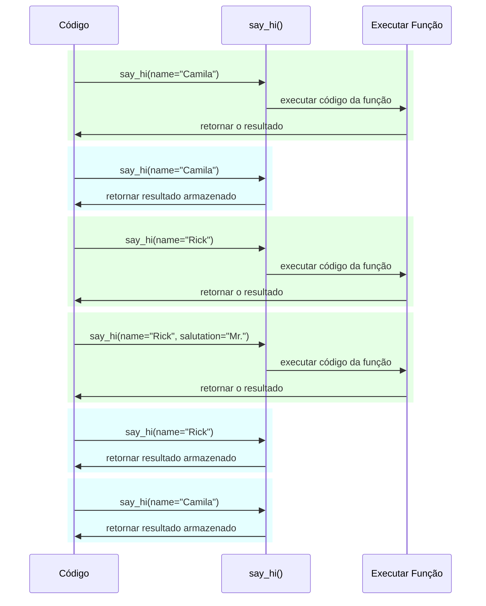

# Configurações e Variáveis de Ambiente

Em muitos casos a sua aplicação pode precisar de configurações externas, como chaves secretas, credenciais de banco de dados, credenciais para serviços de email, etc.

A maioria dessas configurações é variável (podem mudar), como URLs de bancos de dados. E muitas delas podem conter dados sensíveis, como tokens secretos.

Por isso é comum prover essas configurações como variáveis de ambiente que são utilizidas pela aplicação.

## Variáveis de Ambiente

/// dica

Se você já sabe o que são variáveis de ambiente e como utilizá-las, sinta-se livre para avançar para o próximo tópico.

///

Uma <a href="https://pt.wikipedia.org/wiki/Variável_de_ambiente" class="external-link" target="_blank">variável de ambiente</a> (abreviada em inglês para "env var") é uma variável definida fora do código Python, no sistema operacional, e pode ser lida pelo seu código Python (ou por outros programas).

Você pode criar e utilizar variáveis de ambiente no terminal, sem precisar utilizar Python:

//// tab | Linux, macOS, Windows Bash

<div class="termy">

```console
// Você pode criar uma env var MY_NAME usando
$ export MY_NAME="Wade Wilson"

// E utilizá-la em outros programas, como
$ echo "Hello $MY_NAME"

Hello Wade Wilson
```

</div>

////

//// tab | Windows PowerShell

<div class="termy">

```console
// Criando env var MY_NAME
$ $Env:MY_NAME = "Wade Wilson"

// Usando em outros programas, como
$ echo "Hello $Env:MY_NAME"

Hello Wade Wilson
```

</div>

////

### Lendo variáveis de ambiente com Python

Você também pode criar variáveis de ambiente fora do Python, no terminal (ou com qualquer outro método), e realizar a leitura delas no Python.

Por exemplo, você pode definir um arquivo `main.py` com o seguinte código:

```Python hl_lines="3"
import os

name = os.getenv("MY_NAME", "World")
print(f"Hello {name} from Python")
```

/// dica

O segundo parâmetro em <a href="https://docs.python.org/3.8/library/os.html#os.getenv" class="external-link" target="_blank">`os.getenv()`</a> é o valor padrão para o retorno.

Se nenhum valor for informado, `None` é utilizado por padrão, aqui definimos `"World"` como o valor padrão a ser utilizado.

///

E depois você pode executar esse arquivo:

<div class="termy">

```console
// Aqui ainda não definimos a env var
$ python main.py

// Por isso obtemos o valor padrão

Hello World from Python

// Mas se definirmos uma variável de ambiente primeiro
$ export MY_NAME="Wade Wilson"

// E executarmos o programa novamente
$ python main.py

// Agora ele pode ler a variável de ambiente

Hello Wade Wilson from Python
```

</div>

Como variáveis de ambiente podem ser definidas fora do código da aplicação, mas acessadas pela aplicação, e não precisam ser armazenadas (versionadas com `git`) junto dos outros arquivos, é comum utilizá-las para guardar configurações.

Você também pode criar uma variável de ambiente específica para uma invocação de um programa, que é acessível somente para esse programa, e somente enquanto ele estiver executando.

Para fazer isso, crie a variável imediatamente antes de iniciar o programa, na mesma linha:

<div class="termy">

```console
// Criando uma env var MY_NAME na mesma linha da execução do programa
$ MY_NAME="Wade Wilson" python main.py

// Agora a aplicação consegue ler a variável de ambiente

Hello Wade Wilson from Python

// E a variável deixa de existir após isso
$ python main.py

Hello World from Python
```

</div>

/// dica

Você pode ler mais sobre isso em: <a href="https://12factor.net/pt_br/config" class="external-link" target="_blank">The Twelve-Factor App: Configurações</a>.

///

### Tipagem e Validação

Essas variáveis de ambiente suportam apenas strings, por serem externas ao Python e por que precisam ser compatíveis com outros programas e o resto do sistema (e até mesmo com outros sistemas operacionais, como Linux, Windows e macOS).

Isso significa que qualquer valor obtido de uma variável de ambiente em Python terá o tipo `str`, e qualquer conversão para um tipo diferente ou validação deve ser realizada no código.

## Pydantic `Settings`

Por sorte, o Pydantic possui uma funcionalidade para lidar com essas configurações vindas de variáveis de ambiente utilizando <a href="https://docs.pydantic.dev/latest/usage/pydantic_settings/" class="external-link" target="_blank">Pydantic: Settings management</a>.

### Instalando `pydantic-settings`

Primeiro, instale o pacote `pydantic-settings`:

<div class="termy">

```console
$ pip install pydantic-settings
---> 100%
```

</div>

Ele também está incluído no fastapi quando você instala com a opção `all`:

<div class="termy">

```console
$ pip install "fastapi[all]"
---> 100%
```

</div>

/// info

Na v1 do Pydantic ele estava incluído no pacote principal. Agora ele está distribuido como um pacote independente para que você possa optar por instalar ou não caso você não precise dessa funcionalidade.

///

### Criando o objeto `Settings`

Importe a classe `BaseSettings` do Pydantic e crie uma nova subclasse, de forma parecida com um modelo do Pydantic.

Os atributos da classe são declarados com anotações de tipo, e possíveis valores padrão, da mesma maneira que os modelos do Pydantic.

Você pode utilizar todas as ferramentas e funcionalidades de validação que são utilizadas nos modelos do Pydantic, como tipos de dados diferentes e validações adicionei com `Field()`.

//// tab | Pydantic v2

```Python hl_lines="2  5-8  11"
{!> ../../../docs_src/settings/tutorial001.py!}
```

////

//// tab | Pydantic v1

/// info

Na versão 1 do Pydantic você importaria `BaseSettings` diretamente do módulo `pydantic` em vez do módulo `pydantic_settings`.

///

```Python hl_lines="2  5-8  11"
{!> ../../../docs_src/settings/tutorial001_pv1.py!}
```

////

/// dica

Se você quiser algo pronto para copiar e colar na sua aplicação, não use esse exemplo, mas sim o exemplo abaixo.

///

Portanto, quando você cria uma instância da classe `Settings` (nesse caso, o objeto `settings`), o Pydantic lê as variáveis de ambiente sem diferenciar maiúsculas e minúsculas, por isso, uma variável maiúscula `APP_NAME` será usada para o atributo `app_name`.

Depois ele irá converter e validar os dados. Assim, quando você utilizar aquele objeto `settings`, os dados terão o tipo que você declarou (e.g. `items_per_user` será do tipo `int`).

### Usando o objeto `settings`

Depois, Você pode utilizar o novo objeto `settings` na sua aplicação:

```Python hl_lines="18-20"
{!../../../docs_src/settings/tutorial001.py!}
```

### Executando o servidor

No próximo passo, você pode inicializar o servidor passando as configurações em forma de variáveis de ambiente, por exemplo, você poderia definir `ADMIN_EMAIL` e `APP_NAME` da seguinte forma:

<div class="termy">

```console
$ ADMIN_EMAIL="deadpool@example.com" APP_NAME="ChimichangApp" fastapi run main.py

<span style="color: green;">INFO</span>:     Uvicorn running on http://127.0.0.1:8000 (Press CTRL+C to quit)
```

</div>

/// dica

Para definir múltiplas variáveis de ambiente para um único comando basta separá-las utilizando espaços, e incluir todas elas antes do comando.

///

Assim, o atributo `admin_email` seria definido como `"deadpool@example.com"`.

`app_name` seria `"ChimichangApp"`.

E `items_per_user` manteria o valor padrão de `50`.

## Configurações em um módulo separado

Você também pode incluir essas configurações em um arquivo de um módulo separado como visto em [Bigger Applications - Multiple Files](../tutorial/bigger-applications.md){.internal-link target=\_blank}.

Por exemplo, você pode adicionar um arquivo `config.py` com:

```Python
{!../../../docs_src/settings/app01/config.py!}
```

E utilizar essa configuração em `main.py`:

```Python hl_lines="3  11-13"
{!../../../docs_src/settings/app01/main.py!}
```

/// dica

Você também precisa incluir um arquivo `__init__.py` como visto em [Bigger Applications - Multiple Files](../tutorial/bigger-applications.md){.internal-link target=\_blank}.

///

## Configurações em uma dependência

Em certas ocasiões, pode ser útil fornecer essas configurações a partir de uma dependência, em vez de definir um objeto global `settings` que é utilizado em toda a aplicação.

Isso é especialmente útil durante os testes, já que é bastante simples sobrescrever uma dependência com suas configurações personalizadas.

### O arquivo de configuração

Baseando-se no exemplo anterior, seu arquivo `config.py` seria parecido com isso:

```Python hl_lines="10"
{!../../../docs_src/settings/app02/config.py!}
```

Perceba que dessa vez não criamos uma instância padrão `settings = Settings()`.

### O arquivo principal da aplicação

Agora criamos a dependência que retorna um novo objeto `config.Settings()`.

//// tab | Python 3.9+

```Python hl_lines="6  12-13"
{!> ../../../docs_src/settings/app02_an_py39/main.py!}
```

////

//// tab | Python 3.8+

```Python hl_lines="6  12-13"
{!> ../../../docs_src/settings/app02_an/main.py!}
```

////

//// tab | Python 3.8+ non-Annotated

/// dica

Utilize a versão com `Annotated` se possível.

///

```Python hl_lines="5  11-12"
{!> ../../../docs_src/settings/app02/main.py!}
```

////

/// dica

Vamos discutir sobre `@lru_cache` logo mais.

Por enquanto, você pode considerar `get_settings()` como uma função normal.

///

E então podemos declarar essas configurações como uma dependência na função de operação da rota e utilizar onde for necessário.

//// tab | Python 3.9+

```Python hl_lines="17  19-21"
{!> ../../../docs_src/settings/app02_an_py39/main.py!}
```

////

//// tab | Python 3.8+

```Python hl_lines="17  19-21"
{!> ../../../docs_src/settings/app02_an/main.py!}
```

////

//// tab | Python 3.8+ non-Annotated

/// dica

Utilize a versão com `Annotated` se possível.

///

```Python hl_lines="16  18-20"
{!> ../../../docs_src/settings/app02/main.py!}
```

////

### Configurações e testes

Então seria muito fácil fornecer uma configuração diferente durante a execução dos testes sobrescrevendo a dependência de `get_settings`:

```Python hl_lines="9-10  13  21"
{!../../../docs_src/settings/app02/test_main.py!}
```

Na sobrescrita da dependência, definimos um novo valor para `admin_email` quando instanciamos um novo objeto `Settings`, e então retornamos esse novo objeto.

Após isso, podemos testar se o valor está sendo utilizado.

## Lendo um arquivo `.env`

Se você tiver muitas configurações que variem bastante, talvez em ambientes distintos, pode ser útil colocá-las em um arquivo e depois lê-las como se fossem variáveis de ambiente.

Essa prática é tão comum que possui um nome, essas variáveis de ambiente normalmente são colocadas em um arquivo `.env`, e esse arquivo é chamado de "dotenv".

/// dica

Um arquivo iniciando com um ponto final (`.`) é um arquivo oculto em sistemas baseados em Unix, como Linux e MacOS.

Mas um arquivo dotenv não precisa ter esse nome exato.

///

Pydantic suporta a leitura desses tipos de arquivos utilizando uma biblioteca externa. Você pode ler mais em <a href="https://docs.pydantic.dev/latest/concepts/pydantic_settings/#dotenv-env-support" class="external-link" target="_blank">Pydantic Settings: Dotenv (.env) support</a>.

/// dica

Para que isso funcione você precisa executar `pip install python-dotenv`.

///

### O arquivo `.env`

Você pode definir um arquivo `.env` com o seguinte conteúdo:

```bash
ADMIN_EMAIL="deadpool@example.com"
APP_NAME="ChimichangApp"
```

### Obtendo configurações do `.env`

E então adicionar o seguinte código em `config.py`:

//// tab | Pydantic v2

```Python hl_lines="9"
{!> ../../../docs_src/settings/app03_an/config.py!}
```

/// dica

O atributo `model_config` é usado apenas para configuração do Pydantic. Você pode ler mais em <a href="https://docs.pydantic.dev/latest/usage/model_config/" class="external-link" target="_blank">Pydantic Model Config</a>.

///

////

//// tab | Pydantic v1

```Python hl_lines="9-10"
{!> ../../../docs_src/settings/app03_an/config_pv1.py!}
```

/// dica

A classe `Config` é usada apenas para configuração do Pydantic. Você pode ler mais em <a href="https://docs.pydantic.dev/1.10/usage/model_config/" class="external-link" target="_blank">Pydantic Model Config</a>.

///

////

/// info

Na versão 1 do Pydantic a configuração é realizada por uma classe interna `Config`, na versão 2 do Pydantic isso é feito com o atributo `model_config`. Esse atributo recebe um `dict`, para utilizar o autocomplete e checagem de erros do seu editor de texto você pode importar e utilizar `SettingsConfigDict` para definir esse `dict`.

///

Aqui definimos a configuração `env_file` dentro da classe `Settings` do Pydantic, e definimos o valor como o nome do arquivo dotenv que queremos utilizar.

### Declarando `Settings` apenas uma vez com `lru_cache`

Ler o conteúdo de um arquivo em disco normalmente é uma operação custosa (lenta), então você provavelmente quer fazer isso apenas um vez e reutilizar o mesmo objeto settings depois, em vez de ler os valores a cada requisição.

Mas cada vez que fazemos:

```Python
Settings()
```

um novo objeto `Settings` é instanciado, e durante a instanciação, o arquivo `.env` é lido novamente.

Se a função da dependência fosse apenas:

```Python
def get_settings():
    return Settings()
```

Iriamos criar um novo objeto a cada requisição, e estaríamos lendo o arquivo `.env` a cada requisição. ⚠️

Mas como estamos utilizando o decorador `@lru_cache` acima, o objeto `Settings` é criado apenas uma vez, na primeira vez que a função é chamada. ✔️

//// tab | Python 3.9+

```Python hl_lines="1  11"
{!> ../../../docs_src/settings/app03_an_py39/main.py!}
```

////

//// tab | Python 3.8+

```Python hl_lines="1  11"
{!> ../../../docs_src/settings/app03_an/main.py!}
```

////

//// tab | Python 3.8+ non-Annotated

/// dica

Utilize a versão com `Annotated` se possível.

///

```Python hl_lines="1  10"
{!> ../../../docs_src/settings/app03/main.py!}
```

////

Dessa forma, todas as chamadas da função `get_settings()` nas dependências das próximas requisições, em vez de executar o código interno de `get_settings()` e instanciar um novo objeto `Settings`, irão retornar o mesmo objeto que foi retornado na primeira chamada, de novo e de novo.

#### Detalhes Técnicos de `lru_cache`

`@lru_cache` modifica a função decorada para retornar o mesmo valor que foi retornado na primeira vez, em vez de calculá-lo novamente, executando o código da função toda vez.

Assim, a função abaixo do decorador é executada uma única vez para cada combinação dos argumentos passados. E os valores retornados para cada combinação de argumentos são sempre reutilizados para cada nova chamada da função com a mesma combinação de argumentos.

Por exemplo, se você definir uma função:

```Python
@lru_cache
def say_hi(name: str, salutation: str = "Ms."):
    return f"Hello {salutation} {name}"
```

Seu programa poderia executar dessa forma:



No caso da nossa dependência `get_settings()`, a função não recebe nenhum argumento, então ela sempre retorna o mesmo valor.

Dessa forma, ela se comporta praticamente como uma variável global, mas ao ser utilizada como uma função de uma dependência, pode facilmente ser sobrescrita durante os testes.

`@lru_cache` é definido no módulo `functools` que faz parte da biblioteca padrão do Python, você pode ler mais sobre esse decorador no link <a href="https://docs.python.org/3/library/functools.html#functools.lru_cache" class="external-link" target="_blank">Python Docs sobre `@lru_cache`</a>.

## Recapitulando

Você pode usar o módulo Pydantic Settings para gerenciar as configurações de sua aplicação, utilizando todo o poder dos modelos Pydantic.

- Utilizar dependências simplifica os testes.
- Você pode utilizar arquivos .env junto das configurações do Pydantic.
- Utilizar o decorador `@lru_cache` evita que o arquivo .env seja lido de novo e de novo para cada requisição, enquanto permite que você sobrescreva durante os testes.
