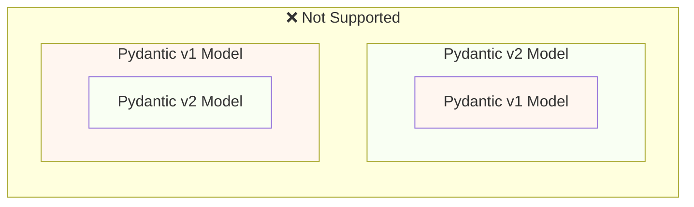
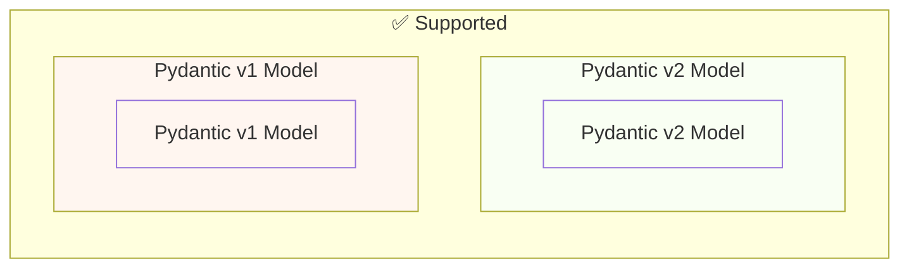

# Migrar do Pydantic v1 para o Pydantic v2 { #migrate-from-pydantic-v1-to-pydantic-v2 }

Se você tem uma aplicação FastAPI antiga, pode estar usando o Pydantic versão 1.

O FastAPI tem suporte ao Pydantic v1 ou v2 desde a versão 0.100.0.

Se você tiver o Pydantic v2 instalado, ele será utilizado. Se, em vez disso, tiver o Pydantic v1, será ele que será utilizado.

O Pydantic v1 está agora descontinuado e o suporte a ele será removido nas próximas versões do FastAPI, você deveria migrar para o Pydantic v2. Assim, você terá as funcionalidades, melhorias e correções mais recentes.

/// warning | Atenção

Além disso, a equipe do Pydantic interrompeu o suporte ao Pydantic v1 para as versões mais recentes do Python, a partir do **Python 3.14**.

Se quiser usar as funcionalidades mais recentes do Python, você precisará garantir que usa o Pydantic v2.

///

Se você tem uma aplicação FastAPI antiga com Pydantic v1, aqui vou mostrar como migrá-la para o Pydantic v2 e as **novas funcionalidades no FastAPI 0.119.0** para ajudar em uma migração gradual.

## Guia oficial { #official-guide }

O Pydantic tem um <a href="https://docs.pydantic.dev/latest/migration/" class="external-link" target="_blank">Guia de Migração</a> oficial do v1 para o v2.

Ele também inclui o que mudou, como as validações agora são mais corretas e rigorosas, possíveis ressalvas, etc.

Você pode lê-lo para entender melhor o que mudou.

## Testes { #tests }

Garanta que você tenha [testes](../tutorial/testing.md){.internal-link target=_blank} para sua aplicação e que os execute na integração contínua (CI).

Assim, você pode fazer a atualização e garantir que tudo continua funcionando como esperado.

## `bump-pydantic` { #bump-pydantic }

Em muitos casos, quando você usa modelos Pydantic regulares sem personalizações, será possível automatizar a maior parte do processo de migração do Pydantic v1 para o Pydantic v2.

Você pode usar o <a href="https://github.com/pydantic/bump-pydantic" class="external-link" target="_blank">`bump-pydantic`</a> da própria equipe do Pydantic.

Essa ferramenta ajuda a alterar automaticamente a maior parte do código que precisa ser modificado.

Depois disso, você pode rodar os testes e verificar se tudo funciona. Se funcionar, está concluído. 😎

## Pydantic v1 no v2 { #pydantic-v1-in-v2 }

O Pydantic v2 inclui tudo do Pydantic v1 como um submódulo `pydantic.v1`.

Isso significa que você pode instalar a versão mais recente do Pydantic v2 e importar e usar os componentes antigos do Pydantic v1 a partir desse submódulo, como se tivesse o Pydantic v1 antigo instalado.

{* ../../docs_src/pydantic_v1_in_v2/tutorial001_an_py310.py hl[1,4] *}

### Suporte do FastAPI ao Pydantic v1 no v2 { #fastapi-support-for-pydantic-v1-in-v2 }

Desde o FastAPI 0.119.0, há também suporte parcial ao Pydantic v1 a partir de dentro do Pydantic v2, para facilitar a migração para o v2.

Assim, você pode atualizar o Pydantic para a versão 2 mais recente e alterar os imports para usar o submódulo `pydantic.v1`, e em muitos casos tudo simplesmente funcionará.

{* ../../docs_src/pydantic_v1_in_v2/tutorial002_an_py310.py hl[2,5,15] *}

/// warning | Atenção

Tenha em mente que, como a equipe do Pydantic não oferece mais suporte ao Pydantic v1 nas versões recentes do Python, a partir do Python 3.14, o uso de `pydantic.v1` também não é suportado no Python 3.14 e superiores.

///

### Pydantic v1 e v2 na mesma aplicação { #pydantic-v1-and-v2-on-the-same-app }

Não é suportado pelo Pydantic ter um modelo do Pydantic v2 com campos próprios definidos como modelos do Pydantic v1, ou vice-versa.

...but, you can have separated models using Pydantic v1 and v2 in the same app.

Em alguns casos, é até possível ter modelos Pydantic v1 e v2 na mesma operação de rota na sua aplicação FastAPI:

{* ../../docs_src/pydantic_v1_in_v2/tutorial003_an_py310.py hl[2:3,6,12,21:22] *}

No exemplo acima, o modelo de entrada é um modelo Pydantic v1, e o modelo de saída (definido em `response_model=ItemV2`) é um modelo Pydantic v2.

### Parâmetros do Pydantic v1 { #pydantic-v1-parameters }

Se você precisar usar algumas das ferramentas específicas do FastAPI para parâmetros como `Body`, `Query`, `Form` etc. com modelos do Pydantic v1, pode importá-las de `fastapi.temp_pydantic_v1_params` enquanto conclui a migração para o Pydantic v2:

{* ../../docs_src/pydantic_v1_in_v2/tutorial004_an_py310.py hl[4,18] *}

### Migre em etapas { #migrate-in-steps }

/// tip | Dica

Primeiro tente com o `bump-pydantic`; se seus testes passarem e isso funcionar, então você concluiu tudo com um único comando. ✨

///

Se o `bump-pydantic` não funcionar para o seu caso, você pode usar o suporte a modelos Pydantic v1 e v2 na mesma aplicação para fazer a migração para o Pydantic v2 gradualmente.

Você poderia primeiro atualizar o Pydantic para usar a versão 2 mais recente e alterar os imports para usar `pydantic.v1` para todos os seus modelos.

Depois, você pode começar a migrar seus modelos do Pydantic v1 para o v2 em grupos, em etapas graduais. 🚶
