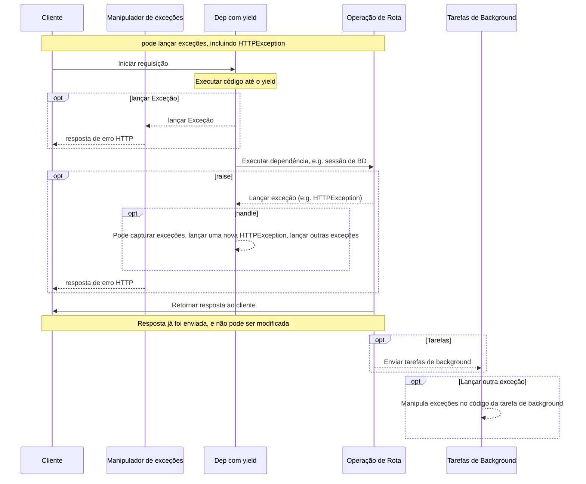
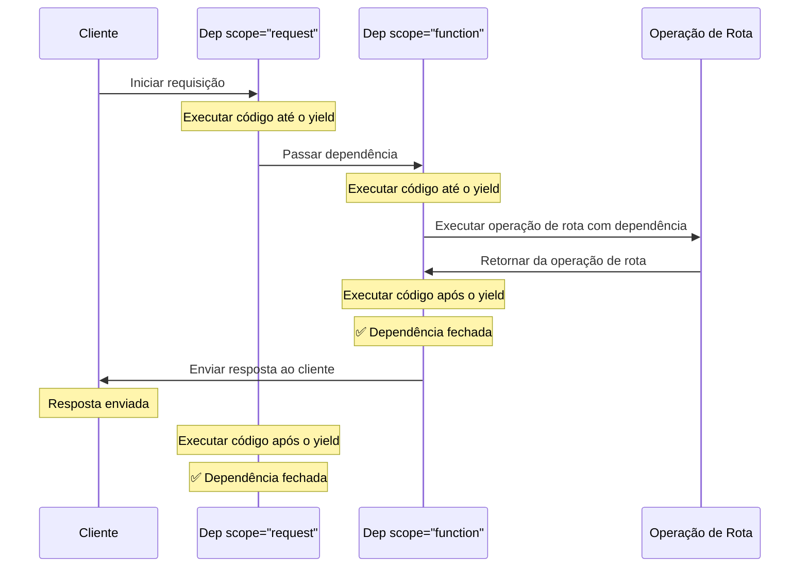

# Dependências com yield { #dependencies-with-yield }

O **FastAPI** possui suporte para dependências que realizam <abbr title='às vezes também chamado de "código de saída", "código de limpeza", "código de teardown", "código de fechamento", "código de saída do gerenciador de contexto", etc.'>alguns passos extras ao finalizar</abbr>.

Para fazer isso, utilize `yield` em vez de `return`, e escreva os passos extras (código) depois.

/// tip | Dica

Garanta utilizar `yield` apenas uma vez por dependência.

///

/// note | Detalhes Técnicos

Qualquer função que possa ser utilizada com:

* <a href="https://docs.python.org/3/library/contextlib.html#contextlib.contextmanager" class="external-link" target="_blank">`@contextlib.contextmanager`</a> ou
* <a href="https://docs.python.org/3/library/contextlib.html#contextlib.asynccontextmanager" class="external-link" target="_blank">`@contextlib.asynccontextmanager`</a>

pode ser utilizada como uma dependência do **FastAPI**.

Na realidade, o FastAPI utiliza esses dois decoradores internamente.

///

## Uma dependência de banco de dados com `yield` { #a-database-dependency-with-yield }

Por exemplo, você poderia utilizar isso para criar uma sessão do banco de dados, e fechá-la após terminar.

Apenas o código anterior à declaração com `yield` e o código contendo essa declaração são executados antes de criar uma resposta:

{* ../../docs_src/dependencies/tutorial007.py hl[2:4] *}

O valor gerado (yielded) é o que é injetado nas *operações de rota* e outras dependências:

{* ../../docs_src/dependencies/tutorial007.py hl[4] *}

O código após o `yield` é executado após a resposta:

{* ../../docs_src/dependencies/tutorial007.py hl[5:6] *}

/// tip | Dica

Você pode usar funções assíncronas (`async`) ou funções comuns.

O **FastAPI** saberá o que fazer com cada uma, da mesma forma que as dependências comuns.

///

## Uma dependência com `yield` e `try` { #a-dependency-with-yield-and-try }

Se você utilizar um bloco `try` em uma dependência com `yield`, você irá capturar qualquer exceção que for lançada enquanto a dependência é utilizada.

Por exemplo, se algum código em um certo momento no meio, em outra dependência ou em uma *operação de rota*, fizer um "rollback" de uma transação de banco de dados ou causar qualquer outra exceção, você irá capturar a exceção em sua dependência.

Então, você pode procurar por essa exceção específica dentro da dependência com `except AlgumaExcecao`.

Da mesma forma, você pode utilizar `finally` para garantir que os passos de saída são executados, com ou sem exceções.

{* ../../docs_src/dependencies/tutorial007.py hl[3,5] *}

## Subdependências com `yield` { #sub-dependencies-with-yield }

Você pode ter subdependências e "árvores" de subdependências de qualquer tamanho e forma, e qualquer uma ou todas elas podem utilizar `yield`.

O **FastAPI** garantirá que o "código de saída" em cada dependência com `yield` é executado na ordem correta.

Por exemplo, `dependency_c` pode depender de `dependency_b`, e `dependency_b` depender de `dependency_a`:

{* ../../docs_src/dependencies/tutorial008_an_py39.py hl[6,14,22] *}

E todas elas podem utilizar `yield`.

Neste caso, `dependency_c`, para executar seu código de saída, precisa que o valor de `dependency_b` (nomeado de `dep_b` aqui) continue disponível.

E, por outro lado, `dependency_b` precisa que o valor de `dependency_a` (nomeado de `dep_a`) esteja disponível para executar seu código de saída.

{* ../../docs_src/dependencies/tutorial008_an_py39.py hl[18:19,26:27] *}

Da mesma forma, você pode ter algumas dependências com `yield` e outras com `return` e ter uma relação de dependência entre algumas das duas.

E você poderia ter uma única dependência que precisa de diversas outras dependências com `yield`, etc.

Você pode ter qualquer combinação de dependências que você quiser.

O **FastAPI** se encarrega de executá-las na ordem certa.

/// note | Detalhes Técnicos

Tudo isso funciona graças aos <a href="https://docs.python.org/3/library/contextlib.html" class="external-link" target="_blank">gerenciadores de contexto</a> do Python.

O **FastAPI** utiliza eles internamente para alcançar isso.

///

## Dependências com `yield` e `HTTPException` { #dependencies-with-yield-and-httpexception }

Você viu que pode usar dependências com `yield` e ter blocos `try` que tentam executar algum código e depois executar algum código de saída com `finally`.

Você também pode usar `except` para capturar a exceção que foi levantada e fazer algo com ela.

Por exemplo, você pode levantar uma exceção diferente, como `HTTPException`.

/// tip | Dica

Essa é uma técnica relativamente avançada, e na maioria dos casos você não vai precisar dela, já que você pode levantar exceções (incluindo `HTTPException`) dentro do resto do código da sua aplicação, por exemplo, na *função de operação de rota*.

Mas ela existe para ser utilizada caso você precise. 🤓

///

{* ../../docs_src/dependencies/tutorial008b_an_py39.py hl[18:22,31] *}

Se você quiser capturar exceções e criar uma resposta personalizada com base nisso, crie um [Manipulador de Exceções Customizado](../handling-errors.md#install-custom-exception-handlers){.internal-link target=_blank}.

## Dependências com `yield` e `except` { #dependencies-with-yield-and-except }

Se você capturar uma exceção com `except` em uma dependência que utilize `yield` e ela não for levantada novamente (ou uma nova exceção for levantada), o FastAPI não será capaz de identificar que houve uma exceção, da mesma forma que aconteceria com Python puro:

{* ../../docs_src/dependencies/tutorial008c_an_py39.py hl[15:16] *}

Neste caso, o cliente irá ver uma resposta *HTTP 500 Internal Server Error* como deveria acontecer, já que não estamos levantando nenhuma `HTTPException` ou coisa parecida, mas o servidor **não terá nenhum log** ou qualquer outra indicação de qual foi o erro. 😱

### Sempre levante (`raise`) em Dependências com `yield` e `except` { #always-raise-in-dependencies-with-yield-and-except }

Se você capturar uma exceção em uma dependência com `yield`, a menos que você esteja levantando outra `HTTPException` ou coisa parecida, **você deve relançar a exceção original**.

Você pode relançar a mesma exceção utilizando `raise`:

{* ../../docs_src/dependencies/tutorial008d_an_py39.py hl[17] *}

Agora o cliente irá receber a mesma resposta *HTTP 500 Internal Server Error*, mas o servidor terá nosso `InternalError` personalizado nos logs. 😎

## Execução de dependências com `yield` { #execution-of-dependencies-with-yield }

A sequência de execução é mais ou menos como esse diagrama. O tempo passa do topo para baixo. E cada coluna é uma das partes interagindo ou executando código.



/// info | Informação

Apenas **uma resposta** será enviada para o cliente. Ela pode ser uma das respostas de erro, ou então a resposta da *operação de rota*.

Após uma dessas respostas ser enviada, nenhuma outra resposta pode ser enviada.

///

/// tip | Dica

Se você levantar qualquer exceção no código da *função de operação de rota*, ela será passada para as dependências com `yield`, incluindo `HTTPException`. Na maioria dos casos, você vai querer relançar essa mesma exceção ou uma nova a partir da dependência com `yield` para garantir que ela seja tratada adequadamente.

///

## Saída antecipada e `scope` { #early-exit-and-scope }

Normalmente, o código de saída das dependências com `yield` é executado **após a resposta** ser enviada ao cliente.

Mas se você sabe que não precisará usar a dependência depois de retornar da *função de operação de rota*, você pode usar `Depends(scope="function")` para dizer ao FastAPI que deve fechar a dependência depois que a *função de operação de rota* retornar, mas **antes** de a **resposta ser enviada**.

{* ../../docs_src/dependencies/tutorial008e_an_py39.py hl[12,16] *}

`Depends()` recebe um parâmetro `scope` que pode ser:

* `"function"`: iniciar a dependência antes da *função de operação de rota* que trata a requisição, encerrar a dependência depois que a *função de operação de rota* termina, mas **antes** de a resposta ser enviada de volta ao cliente. Assim, a função da dependência será executada **em torno** da *função de operação de rota*.
* `"request"`: iniciar a dependência antes da *função de operação de rota* que trata a requisição (semelhante a quando se usa `"function"`), mas encerrar **depois** que a resposta é enviada de volta ao cliente. Assim, a função da dependência será executada **em torno** do ciclo de **requisição** e resposta.

Se não for especificado e a dependência tiver `yield`, ela terá `scope` igual a `"request"` por padrão.

### `scope` para subdependências { #scope-for-sub-dependencies }

Quando você declara uma dependência com `scope="request"` (o padrão), qualquer subdependência também precisa ter `scope` igual a `"request"`.

Mas uma dependência com `scope` igual a `"function"` pode ter dependências com `scope` igual a `"function"` e com `scope` igual a `"request"`.

Isso porque qualquer dependência precisa conseguir executar seu código de saída antes das subdependências, pois pode ainda precisar usá-las durante seu código de saída.



## Dependências com `yield`, `HTTPException`, `except` e Tarefas de Background { #dependencies-with-yield-httpexception-except-and-background-tasks }

Dependências com `yield` evoluíram ao longo do tempo para cobrir diferentes casos de uso e corrigir alguns problemas.

Se você quiser ver o que mudou em diferentes versões do FastAPI, você pode ler mais sobre isso no guia avançado, em [Dependências Avançadas - Dependências com `yield`, `HTTPException`, `except` e Tarefas de Background](../../advanced/advanced-dependencies.md#dependencies-with-yield-httpexception-except-and-background-tasks){.internal-link target=_blank}.
## Gerenciadores de contexto { #context-managers }

### O que são "Gerenciadores de Contexto" { #what-are-context-managers }

"Gerenciadores de Contexto" são qualquer um dos objetos Python que podem ser utilizados com a declaração `with`.

Por exemplo, <a href="https://docs.python.org/3/tutorial/inputoutput.html#reading-and-writing-files" class="external-link" target="_blank">você pode utilizar `with` para ler um arquivo</a>:

```Python
with open("./somefile.txt") as f:
    contents = f.read()
    print(contents)
```

Por baixo dos panos, o código `open("./somefile.txt")` cria um objeto que é chamado de "Gerenciador de Contexto".

Quando o bloco `with` finaliza, ele se certifica de fechar o arquivo, mesmo que tenha ocorrido alguma exceção.

Quando você cria uma dependência com `yield`, o **FastAPI** irá criar um gerenciador de contexto internamente para ela, e combiná-lo com algumas outras ferramentas relacionadas.

### Utilizando gerenciadores de contexto em dependências com `yield` { #using-context-managers-in-dependencies-with-yield }

/// warning | Atenção

Isso é uma ideia mais ou menos "avançada".

Se você está apenas iniciando com o **FastAPI** você pode querer pular isso por enquanto.

///

Em Python, você pode criar Gerenciadores de Contexto ao <a href="https://docs.python.org/3/reference/datamodel.html#context-managers" class="external-link" target="_blank">criar uma classe com dois métodos: `__enter__()` e `__exit__()`</a>.

Você também pode usá-los dentro de dependências com `yield` do **FastAPI** ao utilizar
`with` ou `async with` dentro da função da dependência:

{* ../../docs_src/dependencies/tutorial010.py hl[1:9,13] *}

/// tip | Dica

Outra forma de criar um gerenciador de contexto é utilizando:

* <a href="https://docs.python.org/3/library/contextlib.html#contextlib.contextmanager" class="external-link" target="_blank">`@contextlib.contextmanager`</a> ou
* <a href="https://docs.python.org/3/library/contextlib.html#contextlib.asynccontextmanager" class="external-link" target="_blank">`@contextlib.asynccontextmanager`</a>

Para decorar uma função com um único `yield`.

Isso é o que o **FastAPI** usa internamente para dependências com `yield`.

Mas você não precisa usar esses decoradores para as dependências do FastAPI (e você não deveria).

O FastAPI irá fazer isso para você internamente.

///
