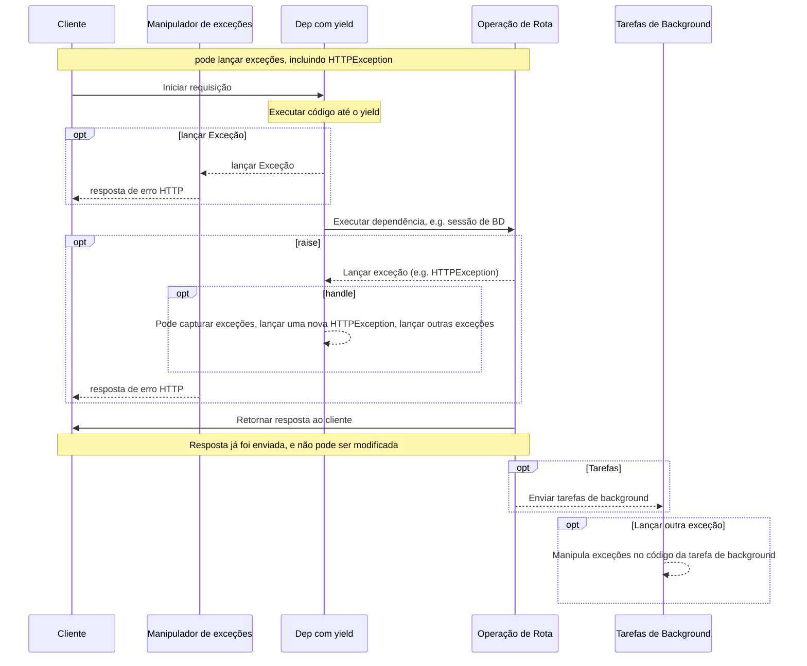

# Dependências com yield

O FastAPI possui suporte para dependências que realizam <abbr title='também chamados de "código de saída", "código de cleanup", "código de teardown", "código de finalização", "código de saída para gerenciador de contextos", etc.'>alguns passos extras ao finalizar</abbr>.

Para fazer isso, utilize `yield` em vez de `return`, e escreva os passos extras (código) depois.

/// tip | "Dica"

Garanta que `yield` é utilizado apenas uma vez.

///

/// note | "Detalhes Técnicos"

Qualquer função que possa ser utilizada com:

* <a href="https://docs.python.org/3/library/contextlib.html#contextlib.contextmanager" class="external-link" target="_blank">`@contextlib.contextmanager`</a> ou
* <a href="https://docs.python.org/3/library/contextlib.html#contextlib.asynccontextmanager" class="external-link" target="_blank">`@contextlib.asynccontextmanager`</a>

pode ser utilizada como uma dependência do **FastAPI**.

Na realidade, o FastAPI utiliza esses dois decoradores internamente.

///

## Uma dependência de banco de dados com `yield`

Por exemplo, você poderia utilizar isso para criar uma sessão do banco de dados, e fechá-la após terminar sua operação.

Apenas o código anterior a declaração com `yield` e o código contendo essa declaração são executados antes de criar uma resposta.

```Python hl_lines="2-4"
{!../../../docs_src/dependencies/tutorial007.py!}
```

O valor gerado (yielded) é o que é injetado nas *operações de rota* e outras dependências.

```Python hl_lines="4"
{!../../../docs_src/dependencies/tutorial007.py!}
```

O código após o `yield` é executado após a resposta ser entregue:

```Python hl_lines="5-6"
{!../../../docs_src/dependencies/tutorial007.py!}
```

/// tip | "Dica"

Você pode usar funções assíncronas (`async`) ou funções comuns.

O **FastAPI** saberá o que fazer com cada uma, da mesma forma que as dependências comuns.

///

## Uma dependência com `yield` e `try`

Se você utilizar um bloco `try` em uma dependência com `yield`, você irá capturar qualquer exceção que for lançada enquanto a dependência é utilizada.

Por exemplo, se algum código em um certo momento no meio da operação, em outra dependência ou em uma *operação de rota*, fizer um "rollback" de uma transação de banco de dados ou causar qualquer outro erro, você irá capturar a exceção em sua dependência.

Então, você pode procurar por essa exceção específica dentro da dependência com `except AlgumaExcecao`.

Da mesma forma, você pode utilizar `finally` para garantir que os passos de saída são executados, com ou sem exceções.

```python hl_lines="3  5"
{!../../../docs_src/dependencies/tutorial007.py!}
```

## Subdependências com `yield`

Você pode ter subdependências e "árvores" de subdependências de qualquer tamanho e forma, e qualquer uma ou todas elas podem utilizar `yield`.

O **FastAPI** garantirá que o "código de saída" em cada dependência com `yield` é executado na ordem correta.

Por exemplo, `dependency_c` pode depender de `dependency_b`, e `dependency_b` depender de `dependency_a`:

//// tab | python 3.9+

```python hl_lines="6  14  22"
{!> ../../../docs_src/dependencies/tutorial008_an_py39.py!}
```

////

//// tab | python 3.8+

```python hl_lines="5  13  21"
{!> ../../../docs_src/dependencies/tutorial008_an.py!}
```

////

//// tab | python 3.8+ non-annotated

/// tip | "Dica"

Utilize a versão com `Annotated` se possível.

///

```python hl_lines="4  12  20"
{!> ../../../docs_src/dependencies/tutorial008.py!}
```

////

E todas elas podem utilizar `yield`.

Neste caso, `dependency_c` precisa que o valor de `dependency_b` (nomeada de `dep_b` aqui) continue disponível para executar seu código de saída.

E, por outro lado, `dependency_b` precisa que o valor de `dependency_a` (nomeada de `dep_a`) continue disponível para executar seu código de saída.

//// tab | python 3.9+

```python hl_lines="18-19  26-27"
{!> ../../../docs_src/dependencies/tutorial008_an_py39.py!}
```

////

//// tab | python 3.8+

```python hl_lines="17-18  25-26"
{!> ../../../docs_src/dependencies/tutorial008_an.py!}
```

////

//// tab | python 3.8+ non-annotated

/// tip | "Dica"

Utilize a versão com `Annotated` se possível.

///

```python hl_lines="16-17  24-25"
{!> ../../../docs_src/dependencies/tutorial008.py!}
```

////

Da mesma forma, você pode ter algumas dependências com `yield` e outras com `return` e ter uma relação de dependência entre algumas dos dois tipos.

E você poderia ter uma única dependência que precisa de diversas outras dependências com `yield`, etc.

Você pode ter qualquer combinação de dependências que você quiser.

O **FastAPI** se encarrega de executá-las na ordem certa.

/// note | "Detalhes Técnicos"

Tudo isso funciona graças aos <a href="https://docs.python.org/3/library/contextlib.html" class="external-link" target="_blank">gerenciadores de contexto</a> do Python.

O **FastAPI** utiliza eles internamente para alcançar isso.

///

## Dependências com `yield` e `httpexception`

Você viu que dependências podem ser utilizadas com `yield` e podem incluir blocos `try` para capturar exceções.

Da mesma forma, você pode lançar uma `httpexception` ou algo parecido no código de saída, após o `yield`

/// tip | "Dica"

Essa é uma técnica relativamente avançada, e na maioria dos casos você não precisa dela totalmente, já que você pode lançar exceções (incluindo `httpexception`) dentro do resto do código da sua aplicação, por exemplo, em uma *função de operação de rota*.

Mas ela existe para ser utilizada caso você precise. 🤓

///

//// tab | python 3.9+

```python hl_lines="18-22  31"
{!> ../../../docs_src/dependencies/tutorial008b_an_py39.py!}
```

////

//// tab | python 3.8+

```python hl_lines="17-21  30"
{!> ../../../docs_src/dependencies/tutorial008b_an.py!}
```

////

//// tab | python 3.8+ non-annotated

/// tip | "Dica"

Utilize a versão com `Annotated` se possível.

///

```python hl_lines="16-20  29"
{!> ../../../docs_src/dependencies/tutorial008b.py!}
```

////

Uma alternativa que você pode utilizar para capturar exceções (e possivelmente lançar outra HTTPException) é criar um [Manipulador de Exceções Customizado](../handling-errors.md#instalando-manipuladores-de-excecoes-customizados){.internal-link target=_blank}.

## Dependências com `yield` e `except`

Se você capturar uma exceção com `except` em uma dependência que utilize `yield` e ela não for levantada novamente (ou uma nova exceção for levantada), o FastAPI não será capaz de identifcar que houve uma exceção, da mesma forma que aconteceria com Python puro:

//// tab | Python 3.9+

```Python hl_lines="15-16"
{!> ../../../docs_src/dependencies/tutorial008c_an_py39.py!}
```

////

//// tab | Python 3.8+

```Python hl_lines="14-15"
{!> ../../../docs_src/dependencies/tutorial008c_an.py!}
```

////

//// tab | Python 3.8+ non-annotated

/// tip | "dica"

utilize a versão com `Annotated` se possível.

///

```Python hl_lines="13-14"
{!> ../../../docs_src/dependencies/tutorial008c.py!}
```

////

Neste caso, o cliente irá ver uma resposta *HTTP 500 Internal Server Error* como deveria acontecer, já que não estamos levantando nenhuma `HTTPException` ou coisa parecida, mas o servidor **não terá nenhum log** ou qualquer outra indicação de qual foi o erro. 😱

### Sempre levante (`raise`) exceções em Dependências com `yield` e `except`

Se você capturar uma exceção em uma dependência com `yield`, a menos que você esteja levantando outra `HTTPException` ou coisa parecida, você deveria relançar a exceção original.

Você pode relançar a mesma exceção utilizando `raise`:

//// tab | Python 3.9+

```Python hl_lines="17"
{!> ../../../docs_src/dependencies/tutorial008d_an_py39.py!}
```

////

//// tab | Python 3.8+

```Python hl_lines="16"
{!> ../../../docs_src/dependencies/tutorial008d_an.py!}
```

////

//// tab | python 3.8+ non-annotated

/// tip | "Dica"

Utilize a versão com `Annotated` se possível.

///

```Python hl_lines="15"
{!> ../../../docs_src/dependencies/tutorial008d.py!}
```

////

Agora o cliente irá receber a mesma resposta *HTTP 500 Internal Server Error*, mas o servidor terá nosso `InternalError` personalizado nos logs. 😎

## Execução de dependências com `yield`

A sequência de execução é mais ou menos como esse diagrama. O tempo passa do topo para baixo. E cada coluna é uma das partes interagindo ou executando código.



/// info | "Informação"

Apenas **uma resposta** será enviada para o cliente. Ela pode ser uma das respostas de erro, ou então a resposta da *operação de rota*.

Após uma dessas respostas ser enviada, nenhuma outra resposta pode ser enviada

///

/// tip | "Dica"

Esse diagrama mostra `HttpException`, mas você pode levantar qualquer outra exceção que você capture em uma dependência com `yield` ou um [Manipulador de exceções personalizado](../handling-errors.md#instalando-manipuladores-de-excecoes-customizados){.internal-link target=_blank}.

Se você lançar qualquer exceção, ela será passada para as dependências com yield, inlcuindo a `HTTPException`. Na maioria dos casos você vai querer relançar essa mesma exceção ou uma nova a partir da dependência com `yield` para garantir que ela seja tratada adequadamente.

///

## Dependências com `yield`, `HTTPException`, `except` e Tarefas de Background

/// warning | "Aviso"

Você provavelmente não precisa desses detalhes técnicos, você pode pular essa seção e continuar na próxima seção abaixo.

Esses detalhes são úteis principalmente se você estiver usando uma versão do FastAPI anterior à 0.106.0 e utilizando recursos de dependências com `yield` em tarefas de background.

///

### Dependências com `yield` e `except`, Detalhes Técnicos

Antes do FastAPI 0.110.0, se você utilizasse uma dependência com `yield`, e então capturasse uma dependência com `except` nessa dependência, caso a exceção não fosse relançada, ela era automaticamente lançada para qualquer manipulador de exceções ou o manipulador de erros interno do servidor.

Isso foi modificado na versão 0.110.0 para consertar o consumo de memória não controlado das exceções relançadas automaticamente sem um manipulador (erros internos do servidor), e para manter o comportamento consistente com o código Python tradicional.

### Tarefas de Background e Dependências com `yield`, Detalhes Técnicos

Antes do FastAPI 0.106.0, levantar exceções após um `yield` não era possível, o código de saída nas dependências com `yield` era executado *após* a resposta ser enviada, então os [Manipuladores de Exceções](../handling-errors.md#instalando-manipuladores-de-excecoes-customizados){.internal-link target=_blank} já teriam executado.

Isso foi implementado dessa forma principalmente para permitir que os mesmos objetos fornecidos ("yielded") pelas dependências dentro de tarefas de background fossem reutilizados, por que o código de saída era executado antes das tarefas de background serem finalizadas.

Ainda assim, como isso exigiria esperar que a resposta navegasse pela rede enquanto mantia ativo um recurso desnecessário na dependência com yield (por exemplo, uma conexão com banco de dados), isso mudou na versão 0.106.0 do FastAPI.

/// tip | "Dica"

Adicionalmente, uma tarefa de background é, normalmente, um conjunto de lógicas independentes que devem ser manipuladas separadamente, com seus próprios recursos (e.g. sua própria conexão com banco de dados).

Então, dessa forma você provavelmente terá um código mais limpo.

///

Se você costumava depender desse comportamento, agora você precisa criar os recursos para uma tarefa de background dentro dela mesma, e usar internamente apenas dados que não dependam de recursos de dependências com `yield`.

Por exemplo, em vez de utilizar a mesma sessão do banco de dados, você criaria uma nova sessão dentro da tarefa de background, e você obteria os objetos do banco de dados utilizando essa nova sessão. E então, em vez de passar o objeto obtido do banco de dados como um parâmetro para a função da tarefa de background, você passaria o ID desse objeto e buscaria ele novamente dentro da função da tarefa de background.

## Gerenciadores de contexto

### O que são gerenciadores de contexto

"Gerenciadores de Contexto" são qualquer um dos objetos Python que podem ser utilizados com a declaração `with`.

Por exemplo, <a href="https://docs.python.org/3/tutorial/inputoutput.html#reading-and-writing-files" class="external-link" target="_blank">você pode utilizar `with` para ler um arquivo</a>:

```Python
with open("./somefile.txt") as f:
    contents = f.read()
    print(contents)
```

Por baixo dos panos, o código `open("./somefile.txt")` cria um objeto que é chamado de "Gerenciador de Contexto".

Quando o bloco `with` finaliza, ele se certifica de fechar o arquivo, mesmo que tenha ocorrido alguma exceção.

Quando você cria uma dependência com `yield`, o **FastAPI** irá criar um gerenciador de contexto internamente para ela, e combiná-lo com algumas outras ferramentas relacionadas.

### Utilizando gerenciadores de contexto em dependências com `yield`

/// warning | "Aviso"

Isso é uma ideia mais ou menos "avançada".

Se você está apenas iniciando com o **FastAPI** você pode querer pular isso por enquanto.

///

Em python, você pode criar Gerenciadores de Contexto ao <a href="https://docs.python.org/3/reference/datamodel.html#context-managers" class="external-link" target="_blank"> criar uma classe com dois métodos: `__enter__()` e `__exit__()`</a>.

Você também pode usá-los dentro de dependências com `yield` do **FastAPI** ao utilizar `with` ou `async with` dentro da função da dependência:

```Python hl_lines="1-9  13"
{!../../../docs_src/dependencies/tutorial010.py!}
```

/// tip | "Dica"

Outra forma de criar um gerenciador de contexto é utilizando:

* <a href="https://docs.python.org/3/library/contextlib.html#contextlib.contextmanager" class="external-link" target="_blank">`@contextlib.contextmanager`</a> ou

* <a href="https://docs.python.org/3/library/contextlib.html#contextlib.asynccontextmanager" class="external-link" target="_blank">`@contextlib.asynccontextmanager`</a>

Para decorar uma função com um único `yield`.

Isso é o que o **FastAPI** usa internamente para dependências com `yield`.

Mas você não precisa usar esses decoradores para as dependências do FastAPI (e você não deveria).

O FastAPI irá fazer isso para você internamente.

///
