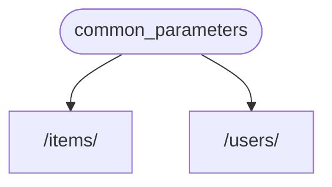
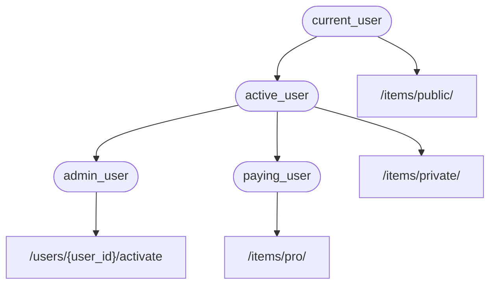

# Dependências { #dependencies }

O **FastAPI** possui um poderoso, mas intuitivo sistema de **<abbr title="também conhecidos como: componentes, recursos, provedores, serviços, injetáveis">Injeção de Dependência</abbr>**.

Esse sistema foi pensado para ser fácil de usar, e permitir que qualquer desenvolvedor possa integrar facilmente outros componentes ao **FastAPI**.

## O que é "Injeção de Dependência" { #what-is-dependency-injection }

**"Injeção de Dependência"** no mundo da programação significa, que existe uma maneira de declarar no seu código (nesse caso, suas *funções de operação de rota*) para declarar as coisas que ele precisa para funcionar e que serão utilizadas: "dependências".

Então, esse sistema (nesse caso o **FastAPI**) se encarrega de fazer o que for preciso para fornecer essas dependências para o código ("injetando" as dependências).

Isso é bastante útil quando você precisa:

* Definir uma lógica compartilhada (mesmo formato de código repetidamente).
* Compartilhar conexões com banco de dados.
* Aplicar regras de segurança, autenticação, papéis de usuários, etc.
* E muitas outras coisas...

Tudo isso, enquanto minimizamos a repetição de código.

## Primeiros passos { #first-steps }

Vamos ver um exemplo simples. Tão simples que não será muito útil, por enquanto.

Mas dessa forma podemos focar em como o sistema de **Injeção de Dependência** funciona.

### Criando uma dependência, ou "injetável" { #create-a-dependency-or-dependable }

Primeiro vamos focar na dependência.

Ela é apenas uma função que pode receber os mesmos parâmetros de uma *função de operação de rota*:

{* ../../docs_src/dependencies/tutorial001_an_py310.py hl[8:9] *}

E pronto.

**2 linhas**.

E com a mesma forma e estrutura de todas as suas *funções de operação de rota*.

Você pode pensar nela como uma *função de operação de rota* sem o "decorador" (sem a linha `@app.get("/some-path")`).

E com qualquer retorno que você desejar.

Neste caso, a dependência espera por:

* Um parâmetro de consulta opcional `q` do tipo `str`.
* Um parâmetro de consulta opcional `skip` do tipo `int`, e igual a `0` por padrão.
* Um parâmetro de consulta opcional `limit` do tipo `int`, e igual a `100` por padrão.

E então retorna um `dict` contendo esses valores.

/// info | Informação

FastAPI passou a suportar a notação `Annotated` (e começou a recomendá-la) na versão 0.95.0.

Se você utiliza uma versão anterior, ocorrerão erros ao tentar utilizar `Annotated`.

Certifique-se de [Atualizar a versão do FastAPI](../../deployment/versions.md#upgrading-the-fastapi-versions){.internal-link target=_blank} para pelo menos 0.95.1 antes de usar `Annotated`.

///

### Importando `Depends` { #import-depends }

{* ../../docs_src/dependencies/tutorial001_an_py310.py hl[3] *}

### Declarando a dependência, no "dependente" { #declare-the-dependency-in-the-dependant }

Da mesma forma que você utiliza `Body`, `Query`, etc. Como parâmetros de sua *função de operação de rota*, utilize `Depends` com um novo parâmetro:

{* ../../docs_src/dependencies/tutorial001_an_py310.py hl[13,18] *}

Ainda que `Depends` seja utilizado nos parâmetros da função da mesma forma que `Body`, `Query`, etc, `Depends` funciona de uma forma um pouco diferente.

Você fornece um único parâmetro para `Depends`.

Esse parâmetro deve ser algo como uma função.

Você **não chama a função** diretamente (não adicione os parênteses no final), apenas a passe como parâmetro de `Depends()`.

E essa função vai receber os parâmetros da mesma forma que uma *função de operação de rota*.

/// tip | Dica

Você verá quais outras "coisas", além de funções, podem ser usadas como dependências no próximo capítulo.

///

Sempre que uma nova requisição for realizada, o **FastAPI** se encarrega de:

* Chamar sua dependência ("injetável") com os parâmetros corretos.
* Obter o resultado da função.
* Atribuir esse resultado para o parâmetro em sua *função de operação de rota*.



Assim, você escreve um código compartilhado apenas uma vez e o **FastAPI** se encarrega de chamá-lo em suas *operações de rota*.

/// check | Verifique

Perceba que você não precisa criar uma classe especial e enviar a dependência para algum outro lugar em que o **FastAPI** a "registre" ou realize qualquer operação similar.

Você apenas envia para `Depends` e o **FastAPI** sabe como fazer o resto.

///

## Compartilhando dependências `Annotated` { #share-annotated-dependencies }

Nos exemplos acima, você pode ver que existe uma pequena **duplicação de código**.

Quando você precisa utilizar a dependência `common_parameters()`, você precisa escrever o parâmetro inteiro com uma anotação de tipo e `Depends()`:

```Python
commons: Annotated[dict, Depends(common_parameters)]
```

Mas como estamos utilizando `Annotated`, podemos guardar esse valor `Annotated` em uma variável e utilizá-la em múltiplos locais:

{* ../../docs_src/dependencies/tutorial001_02_an_py310.py hl[12,16,21] *}

/// tip | Dica

Isso é apenas Python padrão, essa funcionalidade é chamada de "type alias", e na verdade não é específica ao **FastAPI**.

Mas como o **FastAPI** se baseia em convenções do Python, incluindo `Annotated`, você pode incluir esse truque no seu código. 😎

///

As dependências continuarão funcionando como esperado, e a **melhor parte** é que a **informação sobre o tipo é preservada**, o que signfica que seu editor de texto ainda irá incluir **preenchimento automático**, **visualização de erros**, etc. O mesmo vale para ferramentas como `mypy`.

Isso é especialmente útil para uma **base de código grande** onde **as mesmas dependências** são utilizadas repetidamente em **muitas *operações de rota***.

## `Async` ou não, eis a questão { #to-async-or-not-to-async }

Como as dependências também serão chamadas pelo **FastAPI** (da mesma forma que *funções de operação de rota*), as mesmas regras se aplicam ao definir suas funções.

Você pode utilizar `async def` ou apenas `def`.

E você pode declarar dependências utilizando `async def` dentro de *funções de operação de rota* definidas com `def`, ou declarar dependências com `def` e utilizar dentro de *funções de operação de rota* definidas com `async def`, etc.

Não faz diferença. O **FastAPI** sabe o que fazer.

/// note | Nota

Caso você não conheça, veja em [Async: *"Com Pressa?"*](../../async.md#in-a-hurry){.internal-link target=_blank} a sessão acerca de `async` e `await` na documentação.

///

## Integrando com OpenAPI { #integrated-with-openapi }

Todas as declarações de requisições, validações e requisitos para suas dependências (e sub-dependências) serão integradas em um mesmo esquema OpenAPI.

Então, a documentação interativa também terá toda a informação sobre essas dependências:


## Caso de Uso Simples { #simple-usage }

Se você parar para ver, *funções de operação de rota* são declaradas para serem usadas sempre que uma *rota* e uma *operação* se encaixam, e então o **FastAPI** se encarrega de chamar a função correspondente com os argumentos corretos, extraindo os dados da requisição.

Na verdade, todos (ou a maioria) dos frameworks web funcionam da mesma forma.

Você nunca chama essas funções diretamente. Elas são chamadas pelo framework utilizado (nesse caso, **FastAPI**).

Com o Sistema de Injeção de Dependência, você também pode informar ao **FastAPI** que sua *função de operação de rota* também "depende" em algo a mais que deve ser executado antes de sua *função de operação de rota*, e o **FastAPI** se encarrega de executar e "injetar" os resultados.

Outros termos comuns para essa mesma ideia de "injeção de dependência" são:

* recursos
* provedores
* serviços
* injetáveis
* componentes

## Plug-ins em **FastAPI** { #fastapi-plug-ins }

Integrações e "plug-ins" podem ser construídos com o sistema de **Injeção de Dependência**. Mas na verdade, **não há necessidade de criar "plug-ins"**, já que utilizando dependências é possível declarar um número infinito de integrações e interações que se tornam disponíveis para as suas *funções de operação de rota*.

E as dependências pode ser criadas de uma forma bastante simples e intuitiva que permite que você importe apenas os pacotes Python que forem necessários, e integrá-los com as funções de sua API em algumas linhas de código, *literalmente*.

Você verá exemplos disso nos próximos capítulos, acerca de bancos de dados relacionais e NoSQL, segurança, etc.

## Compatibilidade do **FastAPI** { #fastapi-compatibility }

A simplicidade do sistema de injeção de dependência do **FastAPI** faz ele compatível com:

* todos os bancos de dados relacionais
* bancos de dados NoSQL
* pacotes externos
* APIs externas
* sistemas de autenticação e autorização
* istemas de monitoramento de uso para APIs
* sistemas de injeção de dados de resposta
* etc.

## Simples e Poderoso { #simple-and-powerful }

Mesmo que o sistema hierárquico de injeção de dependência seja simples de definir e utilizar, ele ainda é bastante poderoso.

Você pode definir dependências que por sua vez definem suas próprias dependências.

No fim, uma árvore hierárquica de dependências é criadas, e o sistema de **Injeção de Dependência** toma conta de resolver todas essas dependências (e as sub-dependências delas) para você, e provê (injeta) os resultados em cada passo.

Por exemplo, vamos supor que você possua 4 endpoints na sua API (*operações de rota*):

* `/items/public/`
* `/items/private/`
* `/users/{user_id}/activate`
* `/items/pro/`

Você poderia adicionar diferentes requisitos de permissão para cada um deles utilizando apenas dependências e sub-dependências:



## Integração com **OpenAPI** { #integrated-with-openapi_1 }

Todas essas dependências, ao declarar os requisitos para suas *operações de rota*, também adicionam parâmetros, validações, etc.

O **FastAPI** se encarrega de adicionar tudo isso ao esquema OpenAPI, para que seja mostrado nos sistemas de documentação interativa.
