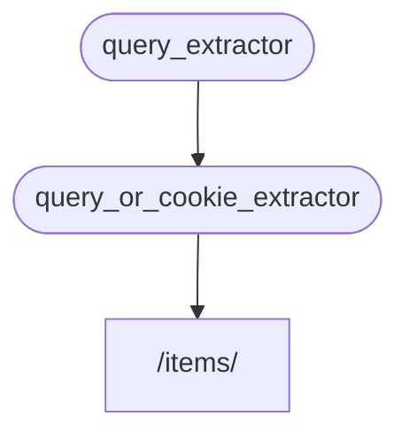

# Subdependências { #sub-dependencies }

Você pode criar dependências que possuem **subdependências**.

Elas podem ter o nível de **profundidade** que você achar necessário.

O **FastAPI** se encarrega de resolver essas dependências.

## Primeira dependência "dependable" { #first-dependency-dependable }

Você pode criar uma primeira dependência ("dependable") dessa forma:

{* ../../docs_src/dependencies/tutorial005_an_py310.py hl[8:9] *}

Esse código declara um parâmetro de consulta opcional, `q`, com o tipo `str`, e então retorna esse parâmetro.

Isso é bastante simples (e não muito útil), mas irá nos ajudar a focar em como as subdependências funcionam.

## Segunda dependência, "dependable" e "dependente" { #second-dependency-dependable-and-dependant }

Então, você pode criar uma outra função para uma dependência (um "dependable") que ao mesmo tempo declara sua própria dependência (o que faz dela um "dependente" também):

{* ../../docs_src/dependencies/tutorial005_an_py310.py hl[13] *}

Vamos focar nos parâmetros declarados:

* Mesmo que essa função seja uma dependência ("dependable") por si mesma, ela também declara uma outra dependência (ela "depende" de outra coisa).
    * Ela depende do `query_extractor`, e atribui o valor retornado pela função ao parâmetro `q`.
* Ela também declara um cookie opcional `last_query`, do tipo `str`.
    * Se o usuário não passou nenhuma consulta `q`, a última consulta é utilizada, que foi salva em um cookie anteriormente.

## Utilizando a dependência { #use-the-dependency }

Então podemos utilizar a dependência com:

{* ../../docs_src/dependencies/tutorial005_an_py310.py hl[23] *}

/// info | Informação

Perceba que nós estamos declarando apenas uma dependência na *função de operação de rota*, em `query_or_cookie_extractor`.

Mas o **FastAPI** saberá que precisa solucionar `query_extractor` primeiro, para passar o resultado para `query_or_cookie_extractor` enquanto chama a função.

///



## Utilizando a mesma dependência múltiplas vezes { #using-the-same-dependency-multiple-times }

Se uma de suas dependências é declarada várias vezes para a mesma *operação de rota*, por exemplo, múltiplas dependências com uma mesma subdependência, o **FastAPI** irá chamar essa subdependência uma única vez para cada requisição.

E o valor retornado é salvo em um <abbr title="Um utilitário/sistema para armazenar valores calculados/gerados para serem reutilizados em vez de computá-los novamente.">"cache"</abbr> e repassado para todos os "dependentes" que precisam dele em uma requisição específica, em vez de chamar a dependência múltiplas vezes para uma mesma requisição.

Em um cenário avançado onde você precise que a dependência seja calculada em cada passo (possivelmente várias vezes) de uma requisição em vez de utilizar o valor em "cache", você pode definir o parâmetro `use_cache=False` em `Depends`:

//// tab | Python 3.8+

```Python hl_lines="1"
async def needy_dependency(fresh_value: Annotated[str, Depends(get_value, use_cache=False)]):
    return {"fresh_value": fresh_value}
```

////

//// tab | Python 3.8+ non-Annotated

/// tip | Dica

Utilize a versão com `Annotated` se possível.

///

```Python hl_lines="1"
async def needy_dependency(fresh_value: str = Depends(get_value, use_cache=False)):
    return {"fresh_value": fresh_value}
```

////

## Recapitulando { #recap }

Com exceção de todas as palavras complicadas usadas aqui, o sistema de **Injeção de Dependência** é bastante simples.

Consiste apenas de funções que parecem idênticas a *funções de operação de rota*.

Mas ainda assim, é bastante poderoso, e permite que você declare grafos (árvores) de dependências com uma profundidade arbitrária.

/// tip | Dica

Tudo isso pode não parecer muito útil com esses exemplos.

Mas você verá o quão útil isso é nos capítulos sobre **segurança**.

E você também verá a quantidade de código que você não precisara escrever.

///
