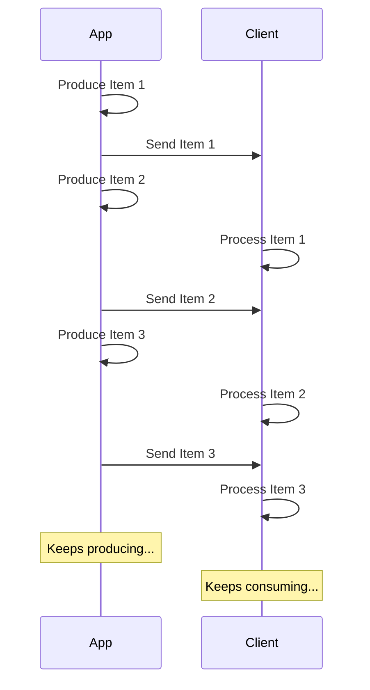

# Stream de JSON Lines { #stream-json-lines }

Você pode ter uma sequência de dados que deseja enviar em um "**Stream**"; é possível fazer isso com **JSON Lines**.

/// info | Informação

Adicionado no FastAPI 0.134.0.

///

## O que é um Stream? { #what-is-a-stream }

"**Streaming**" de dados significa que sua aplicação começará a enviar itens ao cliente sem esperar que toda a sequência esteja pronta.

Assim, ela envia o primeiro item, o cliente o recebe e começa a processá-lo, enquanto você ainda pode estar produzindo o próximo item.



Pode até ser um Stream infinito, em que você continua enviando dados.

## JSON Lines { #json-lines }

Nesses casos, é comum enviar "**JSON Lines**", um formato em que você envia um objeto JSON por linha.

Uma response teria um tipo de conteúdo `application/jsonl` (em vez de `application/json`) e o corpo seria algo como:

```json
{"name": "Plumbus", "description": "A multi-purpose household device."}
{"name": "Portal Gun", "description": "A portal opening device."}
{"name": "Meeseeks Box", "description": "A box that summons a Meeseeks."}
```

É muito semelhante a um array JSON (equivalente a uma list do Python), mas em vez de estar envolto em `[]` e ter `,` entre os itens, há **um objeto JSON por linha**, separados por um caractere de nova linha.

/// info | Informação

O ponto importante é que sua aplicação poderá produzir cada linha em sequência, enquanto o cliente consome as anteriores.

///

/// note | Detalhes Técnicos

Como cada objeto JSON será separado por uma nova linha, eles não podem conter caracteres de nova linha literais em seu conteúdo, mas podem conter novas linhas com escape (`\n`), o que faz parte do padrão JSON.

Mas, normalmente, você não precisará se preocupar com isso, é feito automaticamente, continue lendo. 🤓

///

## Casos de uso { #use-cases }

Você pode usar isso para transmitir dados de um serviço de **IA LLM**, de **logs** ou **telemetria**, ou de outros tipos de dados que possam ser estruturados em itens **JSON**.

/// tip | Dica

Se você quiser transmitir dados binários, por exemplo vídeo ou áudio, confira o guia avançado: [Stream Data](../advanced/stream-data.md).

///

## Stream de JSON Lines com FastAPI { #stream-json-lines-with-fastapi }

Para transmitir JSON Lines com FastAPI, em vez de usar `return` na sua *função de operação de rota*, use `yield` para produzir cada item em sequência.

{* ../../docs_src/stream_json_lines/tutorial001_py310.py ln[1:24] hl[24] *}

Se cada item JSON que você quer enviar de volta for do tipo `Item` (um modelo Pydantic) e a função for assíncrona, você pode declarar o tipo de retorno como `AsyncIterable[Item]`:

{* ../../docs_src/stream_json_lines/tutorial001_py310.py ln[1:24] hl[9:11,22] *}

Se você declarar o tipo de retorno, o FastAPI o usará para **validar** os dados, **documentá-los** no OpenAPI, **filtrá-los** e **serializá-los** usando o Pydantic.

/// tip | Dica

Como o Pydantic fará a serialização no lado em **Rust**, você terá uma **performance** muito maior do que se não declarar um tipo de retorno.

///

### Funções de operação de rota não assíncronas { #non-async-path-operation-functions }

Você também pode usar funções `def` normais (sem `async`) e usar `yield` da mesma forma.

O FastAPI garantirá que sejam executadas corretamente para não bloquear o event loop.

Como, neste caso, a função não é assíncrona, o tipo de retorno adequado seria `Iterable[Item]`:

{* ../../docs_src/stream_json_lines/tutorial001_py310.py ln[27:30] hl[28] *}

### Sem tipo de retorno { #no-return-type }

Você também pode omitir o tipo de retorno. O FastAPI então usará o [`jsonable_encoder`](./encoder.md) para converter os dados em algo que possa ser serializado para JSON e depois enviá-los como JSON Lines.

{* ../../docs_src/stream_json_lines/tutorial001_py310.py ln[33:36] hl[34] *}

## Eventos enviados pelo servidor (SSE) { #server-sent-events-sse }

O FastAPI também tem suporte de primeira classe a Server-Sent Events (SSE), que são bastante semelhantes, mas com alguns detalhes extras. Você pode aprender sobre eles no próximo capítulo: [Eventos enviados pelo servidor (SSE)](server-sent-events.md). 🤓
