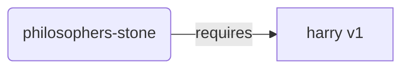
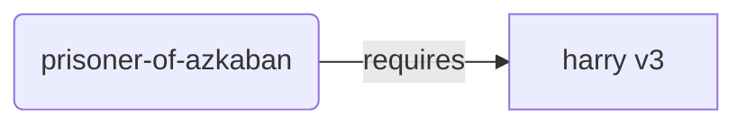
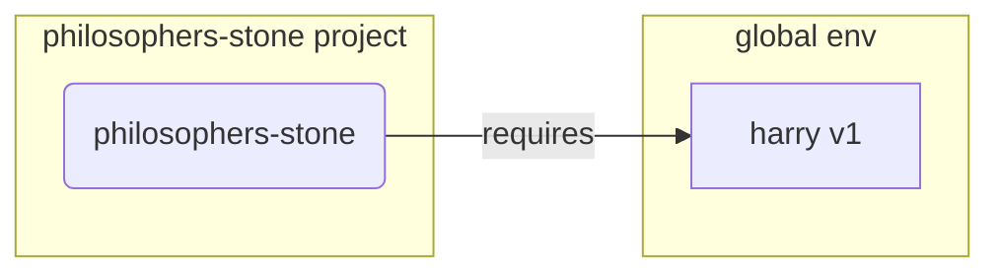
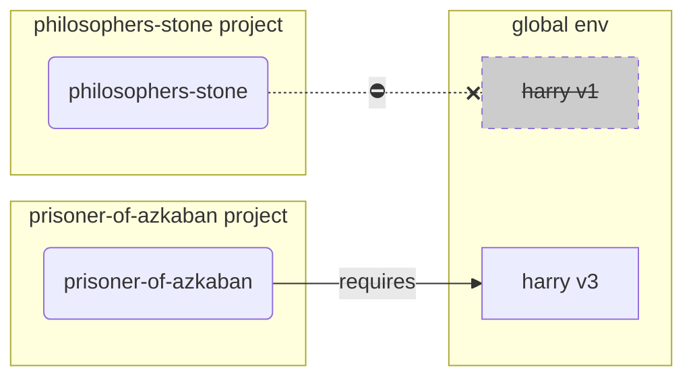
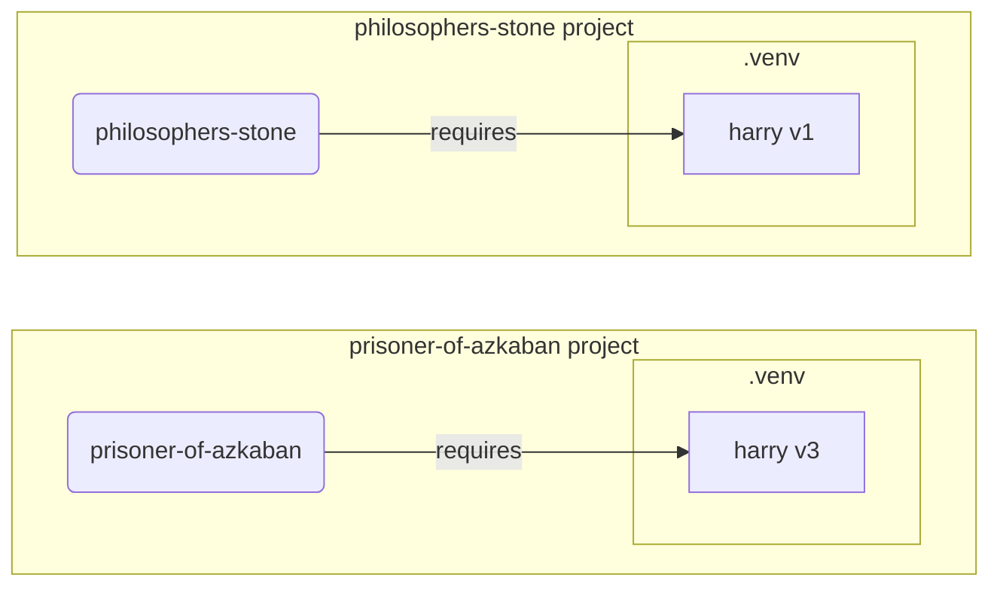

# Ambientes Virtuais { #virtual-environments }

Ao trabalhar em projetos Python, você provavelmente deve usar um **ambiente virtual** (ou um mecanismo similar) para isolar os pacotes que você instala para cada projeto.

/// info | Informação

Se você já sabe sobre ambientes virtuais, como criá-los e usá-los, talvez seja melhor pular esta seção. 🤓

///

/// tip | Dica

Um **ambiente virtual** é diferente de uma **variável de ambiente**.

Uma **variável de ambiente** é uma variável no sistema que pode ser usada por programas.

Um **ambiente virtual** é um diretório com alguns arquivos.

///

/// info | Informação

Esta página lhe ensinará como usar **ambientes virtuais** e como eles funcionam.

Se você estiver pronto para adotar uma **ferramenta que gerencia tudo** para você (incluindo a instalação do Python), experimente <a href="https://github.com/astral-sh/uv" class="external-link" target="_blank">uv</a>.

///

## Criar um Projeto { #create-a-project }

Primeiro, crie um diretório para seu projeto.

O que normalmente faço é criar um diretório chamado `code` dentro do meu diretório home/user.

E dentro disso eu crio um diretório por projeto.

<div class="termy">

```console
// Vá para o diretório inicial
$ cd
// Crie um diretório para todos os seus projetos de código
$ mkdir code
// Entre nesse diretório de código
$ cd code
// Crie um diretório para este projeto
$ mkdir awesome-project
// Entre no diretório do projeto
$ cd awesome-project
```

</div>

## Crie um ambiente virtual { #create-a-virtual-environment }

Ao começar a trabalhar em um projeto Python **pela primeira vez**, crie um ambiente virtual **<abbr title="existem outras opções, esta é uma diretriz simples">dentro do seu projeto</abbr>**.

/// tip | Dica

Você só precisa fazer isso **uma vez por projeto**, não toda vez que trabalhar.

///

//// tab | `venv`

Para criar um ambiente virtual, você pode usar o módulo `venv` que vem com o Python.

<div class="termy">

```console
$ python -m venv .venv
```

</div>

/// details | O que esse comando significa

* `python`: usa o programa chamado `python`
* `-m`: chama um módulo como um script, nós diremos a ele qual módulo vem em seguida
* `venv`: usa o módulo chamado `venv` que normalmente vem instalado com o Python
* `.venv`: cria o ambiente virtual no novo diretório `.venv`

///

////

//// tab | `uv`

Se você tiver o <a href="https://github.com/astral-sh/uv" class="external-link" target="_blank">`uv`</a> instalado, poderá usá-lo para criar um ambiente virtual.

<div class="termy">

```console
$ uv venv
```

</div>

/// tip | Dica

Por padrão, `uv` criará um ambiente virtual em um diretório chamado `.venv`.

Mas você pode personalizá-lo passando um argumento adicional com o nome do diretório.

///

////

Esse comando cria um novo ambiente virtual em um diretório chamado `.venv`.

/// details | `.venv` ou outro nome

Você pode criar o ambiente virtual em um diretório diferente, mas há uma convenção para chamá-lo de `.venv`.

///

## Ative o ambiente virtual { #activate-the-virtual-environment }

Ative o novo ambiente virtual para que qualquer comando Python que você executar ou pacote que você instalar o utilize.

/// tip | Dica

Faça isso **toda vez** que iniciar uma **nova sessão de terminal** para trabalhar no projeto.

///

//// tab | Linux, macOS

<div class="termy">

```console
$ source .venv/bin/activate
```

</div>

////

//// tab | Windows PowerShell

<div class="termy">

```console
$ .venv\Scripts\Activate.ps1
```

</div>

////

//// tab | Windows Bash

Ou se você usa o Bash para Windows (por exemplo, <a href="https://gitforwindows.org/" class="external-link" target="_blank">Git Bash</a>):

<div class="termy">

```console
$ source .venv/Scripts/activate
```

</div>

////

/// tip | Dica

Toda vez que você instalar um **novo pacote** naquele ambiente, **ative** o ambiente novamente.

Isso garante que, se você usar um **programa de terminal (<abbr title="Command Line Interface – Interface de Linha de Comando">CLI</abbr>)** instalado por esse pacote, você usará aquele do seu ambiente virtual e não qualquer outro que possa ser instalado globalmente, provavelmente com uma versão diferente do que você precisa.

///

## Verifique se o ambiente virtual está ativo { #check-the-virtual-environment-is-active }

Verifique se o ambiente virtual está ativo (o comando anterior funcionou).

/// tip | Dica

Isso é **opcional**, mas é uma boa maneira de **verificar** se tudo está funcionando conforme o esperado e se você está usando o ambiente virtual intendido.

///

//// tab | Linux, macOS, Windows Bash

<div class="termy">

```console
$ which python

/home/user/code/awesome-project/.venv/bin/python
```

</div>

Se ele mostrar o binário `python` em `.venv/bin/python`, dentro do seu projeto (neste caso `awesome-project`), então funcionou. 🎉

////

//// tab | Windows PowerShell

<div class="termy">

```console
$ Get-Command python

C:\Users\user\code\awesome-project\.venv\Scripts\python
```

</div>

Se ele mostrar o binário `python` em `.venv\Scripts\python`, dentro do seu projeto (neste caso `awesome-project`), então funcionou. 🎉

////

## Atualizar `pip` { #upgrade-pip }

/// tip | Dica

Se você usar <a href="https://github.com/astral-sh/uv" class="external-link" target="_blank">`uv`</a>, você o usará para instalar coisas em vez do `pip`, então não precisará atualizar o `pip`. 😎

///

Se você estiver usando `pip` para instalar pacotes (ele vem por padrão com o Python), você deve **atualizá-lo** para a versão mais recente.

Muitos erros exóticos durante a instalação de um pacote são resolvidos apenas atualizando o `pip` primeiro.

/// tip | Dica

Normalmente, você faria isso **uma vez**, logo após criar o ambiente virtual.

///

Certifique-se de que o ambiente virtual esteja ativo (com o comando acima) e execute:

<div class="termy">

```console
$ python -m pip install --upgrade pip

---> 100%
```

</div>

## Adicionar `.gitignore` { #add-gitignore }

Se você estiver usando **Git** (você deveria), adicione um arquivo `.gitignore` para excluir tudo em seu `.venv` do Git.

/// tip | Dica

Se você usou <a href="https://github.com/astral-sh/uv" class="external-link" target="_blank">`uv`</a> para criar o ambiente virtual, ele já fez isso para você, você pode pular esta etapa. 😎

///

/// tip | Dica

Faça isso **uma vez**, logo após criar o ambiente virtual.

///

<div class="termy">

```console
$ echo "*" > .venv/.gitignore
```

</div>

/// details | O que esse comando significa

* `echo "*"`: irá "imprimir" o texto `*` no terminal (a próxima parte muda isso um pouco)
* `>`: qualquer coisa impressa no terminal pelo comando à esquerda de `>` não deve ser impressa, mas sim escrita no arquivo que vai à direita de `>`
* `.gitignore`: o nome do arquivo onde o texto deve ser escrito

E `*` para Git significa "tudo". Então, ele ignorará tudo no diretório `.venv`.

Esse comando criará um arquivo `.gitignore` com o conteúdo:

```gitignore
*
```

///

## Instalar Pacotes { #install-packages }

Após ativar o ambiente, você pode instalar pacotes nele.

/// tip | Dica

Faça isso **uma vez** ao instalar ou atualizar os pacotes que seu projeto precisa.

Se precisar atualizar uma versão ou adicionar um novo pacote, você **fará isso novamente**.

///

### Instalar pacotes diretamente { #install-packages-directly }

Se estiver com pressa e não quiser usar um arquivo para declarar os requisitos de pacote do seu projeto, você pode instalá-los diretamente.

/// tip | Dica

É uma (muito) boa ideia colocar os pacotes e versões que seu programa precisa em um arquivo (por exemplo `requirements.txt` ou `pyproject.toml`).

///

//// tab | `pip`

<div class="termy">

```console
$ pip install "fastapi[standard]"

---> 100%
```

</div>

////

//// tab | `uv`

Se você tem o <a href="https://github.com/astral-sh/uv" class="external-link" target="_blank">`uv`</a>:

<div class="termy">

```console
$ uv pip install "fastapi[standard]"
---> 100%
```

</div>

////

### Instalar a partir de `requirements.txt` { #install-from-requirements-txt }

Se você tiver um `requirements.txt`, agora poderá usá-lo para instalar seus pacotes.

//// tab | `pip`

<div class="termy">

```console
$ pip install -r requirements.txt
---> 100%
```

</div>

////

//// tab | `uv`

Se você tem o <a href="https://github.com/astral-sh/uv" class="external-link" target="_blank">`uv`</a>:

<div class="termy">

```console
$ uv pip install -r requirements.txt
---> 100%
```

</div>

////

/// details | `requirements.txt`

Um `requirements.txt` com alguns pacotes poderia se parecer com:

```requirements.txt
fastapi[standard]==0.113.0
pydantic==2.8.0
```

///

## Execute seu programa { #run-your-program }

Depois de ativar o ambiente virtual, você pode executar seu programa, e ele usará o Python dentro do seu ambiente virtual com os pacotes que você instalou lá.

<div class="termy">

```console
$ python main.py

Hello World
```

</div>

## Configure seu editor { #configure-your-editor }

Você provavelmente usaria um editor. Certifique-se de configurá-lo para usar o mesmo ambiente virtual que você criou (ele provavelmente o detectará automaticamente) para que você possa obter preenchimento automático e erros em linha.

Por exemplo:

* <a href="https://code.visualstudio.com/docs/python/environments#_select-and-activate-an-environment" class="external-link" target="_blank">VS Code</a>
* <a href="https://www.jetbrains.com/help/pycharm/creating-virtual-environment.html" class="external-link" target="_blank">PyCharm</a>

/// tip | Dica

Normalmente, você só precisa fazer isso **uma vez**, ao criar o ambiente virtual.

///

## Desativar o ambiente virtual { #deactivate-the-virtual-environment }

Quando terminar de trabalhar no seu projeto, você pode **desativar** o ambiente virtual.

<div class="termy">

```console
$ deactivate
```

</div>

Dessa forma, quando você executar `python`, ele não tentará executá-lo naquele ambiente virtual com os pacotes instalados nele.

## Pronto para trabalhar { #ready-to-work }

Agora você está pronto para começar a trabalhar no seu projeto.


/// tip | Dica

Você quer entender o que é tudo isso acima?

Continue lendo. 👇🤓

///

## Por que ambientes virtuais { #why-virtual-environments }

Para trabalhar com o FastAPI, você precisa instalar o <a href="https://www.python.org/" class="external-link" target="_blank">Python</a>.

Depois disso, você precisará **instalar** o FastAPI e quaisquer outros **pacotes** que queira usar.

Para instalar pacotes, você normalmente usaria o comando `pip` que vem com o Python (ou alternativas semelhantes).

No entanto, se você usar `pip` diretamente, os pacotes serão instalados no seu **ambiente Python global** (a instalação global do Python).

### O Problema { #the-problem }

Então, qual é o problema em instalar pacotes no ambiente global do Python?

Em algum momento, você provavelmente acabará escrevendo muitos programas diferentes que dependem de **pacotes diferentes**. E alguns desses projetos em que você trabalha dependerão de **versões diferentes** do mesmo pacote. 😱

Por exemplo, você pode criar um projeto chamado `philosophers-stone`, este programa depende de outro pacote chamado **`harry`, usando a versão `1`**. Então, você precisa instalar `harry`.



Então, em algum momento depois, você cria outro projeto chamado `prisoner-of-azkaban`, e esse projeto também depende de `harry`, mas esse projeto precisa do **`harry` versão `3`**.



Mas agora o problema é que, se você instalar os pacotes globalmente (no ambiente global) em vez de em um **ambiente virtual** local, você terá que escolher qual versão do `harry` instalar.

Se você quiser executar `philosophers-stone`, precisará primeiro instalar `harry` versão `1`, por exemplo com:

<div class="termy">

```console
$ pip install "harry==1"
```

</div>

E então você acabaria com `harry` versão `1` instalado em seu ambiente Python global.



Mas se você quiser executar `prisoner-of-azkaban`, você precisará desinstalar `harry` versão `1` e instalar `harry` versão `3` (ou apenas instalar a versão `3` desinstalaria automaticamente a versão `1`).

<div class="termy">

```console
$ pip install "harry==3"
```

</div>

E então você acabaria com `harry` versão `3` instalado em seu ambiente Python global.

E se você tentar executar `philosophers-stone` novamente, há uma chance de que **não funcione** porque ele precisa de `harry` versão `1`.



/// tip | Dica

É muito comum em pacotes Python tentar ao máximo **evitar alterações drásticas** em **novas versões**, mas é melhor prevenir do que remediar e instalar versões mais recentes intencionalmente e, quando possível, executar os testes para verificar se tudo está funcionando corretamente.

///

Agora, imagine isso com **muitos** outros **pacotes** dos quais todos os seus **projetos dependem**. Isso é muito difícil de gerenciar. E você provavelmente acabaria executando alguns projetos com algumas **versões incompatíveis** dos pacotes, e não saberia por que algo não está funcionando.

Além disso, dependendo do seu sistema operacional (por exemplo, Linux, Windows, macOS), ele pode ter vindo com o Python já instalado. E, nesse caso, provavelmente tinha alguns pacotes pré-instalados com algumas versões específicas **necessárias para o seu sistema**. Se você instalar pacotes no ambiente global do Python, poderá acabar **quebrando** alguns dos programas que vieram com seu sistema operacional.

## Onde os pacotes são instalados { #where-are-packages-installed }

Quando você instala o Python, ele cria alguns diretórios com alguns arquivos no seu computador.

Alguns desses diretórios são os responsáveis ​​por ter todos os pacotes que você instala.

Quando você executa:

<div class="termy">

```console
// Não execute isso agora, é apenas um exemplo 🤓
$ pip install "fastapi[standard]"
---> 100%
```

</div>

Isso fará o download de um arquivo compactado com o código FastAPI, normalmente do <a href="https://pypi.org/project/fastapi/" class="external-link" target="_blank">PyPI</a>.

Ele também fará o **download** de arquivos para outros pacotes dos quais o FastAPI depende.

Em seguida, ele **extrairá** todos esses arquivos e os colocará em um diretório no seu computador.

Por padrão, ele colocará os arquivos baixados e extraídos no diretório que vem com a instalação do Python, que é o **ambiente global**.

## O que são ambientes virtuais { #what-are-virtual-environments }

A solução para os problemas de ter todos os pacotes no ambiente global é usar um **ambiente virtual para cada projeto** em que você trabalha.

Um ambiente virtual é um **diretório**, muito semelhante ao global, onde você pode instalar os pacotes para um projeto.

Dessa forma, cada projeto terá seu próprio ambiente virtual (diretório `.venv`) com seus próprios pacotes.



## O que significa ativar um ambiente virtual { #what-does-activating-a-virtual-environment-mean }

Quando você ativa um ambiente virtual, por exemplo com:

//// tab | Linux, macOS

<div class="termy">

```console
$ source .venv/bin/activate
```

</div>

////

//// tab | Windows PowerShell

<div class="termy">

```console
$ .venv\Scripts\Activate.ps1
```

</div>

////

//// tab | Windows Bash

Ou se você usa o Bash para Windows (por exemplo, <a href="https://gitforwindows.org/" class="external-link" target="_blank">Git Bash</a>):

<div class="termy">

```console
$ source .venv/Scripts/activate
```

</div>

////

Esse comando criará ou modificará algumas [variáveis ​​de ambiente](environment-variables.md){.internal-link target=_blank} que estarão disponíveis para os próximos comandos.

Uma dessas variáveis ​​é a variável `PATH`.

/// tip | Dica

Você pode aprender mais sobre a variável de ambiente `PATH` na seção [Variáveis ​​de ambiente](environment-variables.md#path-environment-variable){.internal-link target=_blank}.

///

A ativação de um ambiente virtual adiciona seu caminho `.venv/bin` (no Linux e macOS) ou `.venv\Scripts` (no Windows) à variável de ambiente `PATH`.

Digamos que antes de ativar o ambiente, a variável `PATH` estava assim:

//// tab | Linux, macOS

```plaintext
/usr/bin:/bin:/usr/sbin:/sbin
```

Isso significa que o sistema procuraria programas em:

* `/usr/bin`
* `/bin`
* `/usr/sbin`
* `/sbin`

////

//// tab | Windows

```plaintext
C:\Windows\System32
```

Isso significa que o sistema procuraria programas em:

* `C:\Windows\System32`

////

Após ativar o ambiente virtual, a variável `PATH` ficaria mais ou menos assim:

//// tab | Linux, macOS

```plaintext
/home/user/code/awesome-project/.venv/bin:/usr/bin:/bin:/usr/sbin:/sbin
```

Isso significa que o sistema agora começará a procurar primeiro por programas em:

```plaintext
/home/user/code/awesome-project/.venv/bin
```

antes de procurar nos outros diretórios.

Então, quando você digita `python` no terminal, o sistema encontrará o programa Python em

```plaintext
/home/user/code/awesome-project/.venv/bin/python
```

e usa esse.

////

//// tab | Windows

```plaintext
C:\Users\user\code\awesome-project\.venv\Scripts;C:\Windows\System32
```

Isso significa que o sistema agora começará a procurar primeiro por programas em:

```plaintext
C:\Users\user\code\awesome-project\.venv\Scripts
```

antes de procurar nos outros diretórios.

Então, quando você digita `python` no terminal, o sistema encontrará o programa Python em

```plaintext
C:\Users\user\code\awesome-project\.venv\Scripts\python
```

e usa esse.

////

Um detalhe importante é que ele colocará o caminho do ambiente virtual no **início** da variável `PATH`. O sistema o encontrará **antes** de encontrar qualquer outro Python disponível. Dessa forma, quando você executar `python`, ele usará o Python **do ambiente virtual** em vez de qualquer outro `python` (por exemplo, um `python` de um ambiente global).

Ativar um ambiente virtual também muda algumas outras coisas, mas esta é uma das mais importantes.

## Verificando um ambiente virtual { #checking-a-virtual-environment }

Ao verificar se um ambiente virtual está ativo, por exemplo com:

//// tab | Linux, macOS, Windows Bash

<div class="termy">

```console
$ which python

/home/user/code/awesome-project/.venv/bin/python
```

</div>

////

//// tab | Windows PowerShell

<div class="termy">

```console
$ Get-Command python

C:\Users\user\code\awesome-project\.venv\Scripts\python
```

</div>

////

Isso significa que o programa `python` que será usado é aquele **no ambiente virtual**.

você usa `which` no Linux e macOS e `Get-Command` no Windows PowerShell.

A maneira como esse comando funciona é que ele vai e verifica na variável de ambiente `PATH`, passando por **cada caminho em ordem**, procurando pelo programa chamado `python`. Uma vez que ele o encontre, ele **mostrará o caminho** para esse programa.

A parte mais importante é que quando você chama `python`, esse é exatamente o "`python`" que será executado.

Assim, você pode confirmar se está no ambiente virtual correto.

/// tip | Dica

É fácil ativar um ambiente virtual, obter um Python e então **ir para outro projeto**.

E o segundo projeto **não funcionaria** porque você está usando o **Python incorreto**, de um ambiente virtual para outro projeto.

É útil poder verificar qual `python` está sendo usado. 🤓

///

## Por que desativar um ambiente virtual { #why-deactivate-a-virtual-environment }

Por exemplo, você pode estar trabalhando em um projeto `philosophers-stone`, **ativar esse ambiente virtual**, instalar pacotes e trabalhar com esse ambiente.

E então você quer trabalhar em **outro projeto** `prisoner-of-azkaban`.

Você vai para aquele projeto:

<div class="termy">

```console
$ cd ~/code/prisoner-of-azkaban
```

</div>

Se você não desativar o ambiente virtual para `philosophers-stone`, quando você executar `python` no terminal, ele tentará usar o Python de `philosophers-stone`.

<div class="termy">

```console
$ cd ~/code/prisoner-of-azkaban

$ python main.py

// Erro ao importar o Sirius, ele não está instalado 😱
Traceback (most recent call last):
    File "main.py", line 1, in <module>
        import sirius
```

</div>

Mas se você desativar o ambiente virtual e ativar o novo para `prisoner-of-askaban`, quando você executar `python`, ele usará o Python do ambiente virtual em `prisoner-of-azkaban`.

<div class="termy">

```console
$ cd ~/code/prisoner-of-azkaban

// Você não precisa estar no diretório antigo para desativar, você pode fazer isso de onde estiver, mesmo depois de ir para o outro projeto 😎
$ deactivate

// Ative o ambiente virtual em prisoner-of-azkaban/.venv 🚀
$ source .venv/bin/activate

// Agora, quando você executar o python, ele encontrará o pacote sirius instalado neste ambiente virtual ✨
$ python main.py

Eu juro solenemente 🐺
```

</div>

## Alternativas { #alternatives }

Este é um guia simples para você começar e lhe ensinar como tudo funciona **por baixo**.

Existem muitas **alternativas** para gerenciar ambientes virtuais, dependências de pacotes (requisitos) e projetos.

Quando estiver pronto e quiser usar uma ferramenta para **gerenciar todo o projeto**, dependências de pacotes, ambientes virtuais, etc., sugiro que você experimente o <a href="https://github.com/astral-sh/uv" class="external-link" target="_blank">uv</a>.

`uv` pode fazer muitas coisas, ele pode:

* **Instalar o Python** para você, incluindo versões diferentes
* Gerenciar o **ambiente virtual** para seus projetos
* Instalar **pacotes**
* Gerenciar **dependências e versões** de pacotes para seu projeto
* Certificar-se de que você tenha um conjunto **exato** de pacotes e versões para instalar, incluindo suas dependências, para que você possa ter certeza de que pode executar seu projeto em produção exatamente da mesma forma que em seu computador durante o desenvolvimento, isso é chamado de **bloqueio**
* E muitas outras coisas

## Conclusão { #conclusion }

Se você leu e entendeu tudo isso, agora **você sabe muito mais** sobre ambientes virtuais do que muitos desenvolvedores por aí. 🤓

Saber esses detalhes provavelmente será útil no futuro, quando você estiver depurando algo que parece complexo, mas você saberá **como tudo funciona**. 😎
