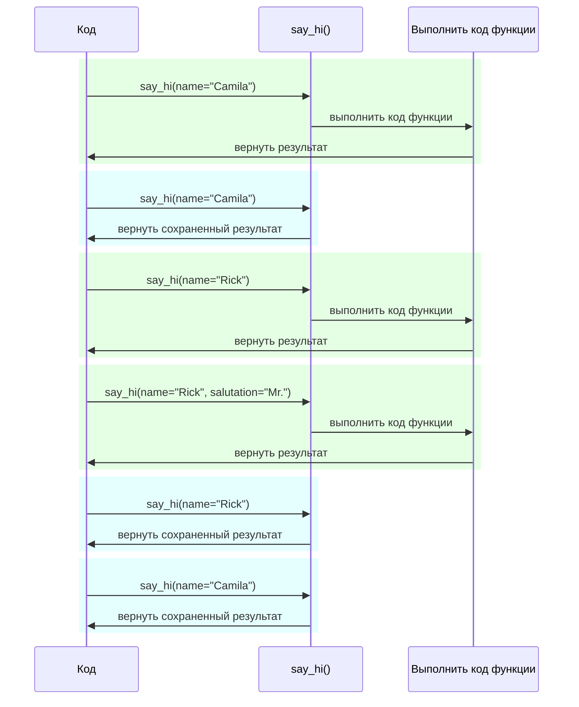

# Настройки и переменные окружения

Во многих случаях вашим приложениям могут понадобиться внешние настройки или конфигурации, например, секретные ключи, учетные данные базы данных, учетные данные для почтовых сервисов и т.д.

Большинство этих настроек являются изменяемыми (могут изменяться), как, например, URL-ы баз данных. Многие из них могут быть чувствительными, как, например, секреты.

По этой причине их обычно предоставляют в виде переменных окружения, которые считываются приложением.

/// tip | Совет

Чтобы понять, что такое переменные окружения, можете прочитать [Переменные окружения](../environment-variables.md){.internal-link target=_blank}.

///

## Типы и валидация

Эти переменные окружения могут обрабатывать только текстовые строки, так как они являются внешними для Python и должны быть совместимы с другими программами и остальной системой (и даже с разными операционными системами, такими как Linux, Windows, macOS).

Это означает, что любое значение, считанное в Python из переменной окружения, будет типа `str`, и любое преобразование в другой тип или валидация должны осуществляться в коде.

## Pydantic `Settings`

К счастью, Pydantic предоставляет отличную утилиту для работы с этими настройками, поступающими из переменных окружения, используя <a href="https://docs.pydantic.dev/latest/concepts/pydantic_settings/" class="external-link" target="_blank">Pydantic: Управление настройками</a>.

### Установка `pydantic-settings`

Сначала убедитесь, что вы создали ваше [виртуальное окружение](../virtual-environments.md){.internal-link target=_blank}, активировали его и затем установили пакет `pydantic-settings`:

<div class="termy">

```console
$ pip install pydantic-settings
---> 100%
```

</div>

Этот пакет также включен, если вы устанавливаете все зависимости с:

<div class="termy">

```console
$ pip install "fastapi[all]"
---> 100%
```

</div>

/// info | Информация

В Pydantic v1 он поставлялся с основным пакетом. Теперь он распространяется как отдельный пакет, чтобы вы могли выбрать, устанавливать его или нет, если вам не нужна эта функциональность.

///

### Создание объекта `Settings`

Импортируйте `BaseSettings` из Pydantic и создайте подкласс, как это делается с Pydantic-моделью.

Так же, как и с Pydantic-моделями, вы объявляете атрибуты класса с аннотациями типов и, возможно, значениями по умолчанию.

Вы можете использовать все те же функции валидации и инструменты, которые используете в Pydantic-моделях, например, разные типы данных и дополнительные валидации с `Field()`.

//// tab | Pydantic v2

{* ../../docs_src/settings/tutorial001.py hl[2,5:8,11] *}

////

//// tab | Pydantic v1

/// info | Информация

В Pydantic v1 вы импортировали бы `BaseSettings` непосредственно из `pydantic` вместо `pydantic_settings`.

///

{* ../../docs_src/settings/tutorial001_pv1.py hl[2,5:8,11] *}

////

/// tip | Совет

Если вам нужно что-то быстрое для копирования и вставки, не используйте этот пример, используйте последний ниже.

///

Когда вы создаете экземпляр этого класса `Settings` (в данном случае, в объекте `settings`), Pydantic будет считывать переменные окружения без учета регистра, так что переменная в верхнем регистре `APP_NAME` все еще будет считана для атрибута `app_name`.

Затем он выполнит преобразование и валидацию данных. Таким образом, когда вы используете этот объект `settings`, у вас будут данные тех типов, которые вы объявили (например, `items_per_user` будет типа `int`).

### Использование `settings`

Затем вы можете использовать новый объект `settings` в вашем приложении:

{* ../../docs_src/settings/tutorial001.py hl[18:20] *}

### Запуск сервера

Далее вы можете запустить сервер, передавая конфигурации как переменные окружения, например, вы можете установить `ADMIN_EMAIL` и `APP_NAME` следующим образом:

<div class="termy">

```console
$ ADMIN_EMAIL="deadpool@example.com" APP_NAME="ChimichangApp" fastapi run main.py

<span style="color: green;">INFO</span>:     Uvicorn running on http://127.0.0.1:8000 (Press CTRL+C to quit)
```

</div>

/// tip | Совет

Чтобы установить несколько переменных окружения для одной команды, просто разделите их пробелами и укажите перед командой.

///

Тогда настройка `admin_email` будет установлена в `"deadpool@example.com"`.

Настройка `app_name` будет иметь значение `"ChimichangApp"`.

А `items_per_user` сохранит свое значение по умолчанию — `50`.

## Настройки в другом модуле

Вы можете поместить эти настройки в другой файл-модуль, как вы видели в [Более крупные приложения - Несколько файлов](../tutorial/bigger-applications.md){.internal-link target=_blank}.

Например, у вас может быть файл `config.py` с:

{* ../../docs_src/settings/app01/config.py *}

И затем использовать его в файле `main.py`:

{* ../../docs_src/settings/app01/main.py hl[3,11:13] *}

/// tip | Совет

Вам также нужен будет файл `__init__.py`, как вы видели в [Более крупные приложения - Несколько файлов](../tutorial/bigger-applications.md){.internal-link target=_blank}.

///

## Настройки в зависимости

В некоторых случаях может быть полезно предоставлять настройки из зависимости, вместо использования глобального объекта `settings`, который используется везде.

Это может быть особенно полезно во время тестирования, так как очень легко переопределить зависимость вашими собственными настройками.

### Файл конфигурации

Исходя из предыдущего примера, ваш файл `config.py` может выглядеть так:

{* ../../docs_src/settings/app02/config.py hl[10] *}

Обратите внимание, что теперь мы не создаем экземпляр по умолчанию `settings = Settings()`.

### Основной файл приложения

Теперь мы создаем зависимость, которая возвращает новый `config.Settings()`.

{* ../../docs_src/settings/app02_an_py39/main.py hl[6,12:13] *}

/// tip | Совет

Мы обсудим `@lru_cache` чуть позже.

На данный момент можно считать, что `get_settings()` — это обычная функция.

///

А затем мы можем потребовать его в *функции-обработчике пути* как зависимость и использовать ее в любом месте, где это необходимо.

{* ../../docs_src/settings/app02_an_py39/main.py hl[17,19:21] *}

### Настройки и тестирование

Затем вам будет очень легко предоставить другой объект настроек во время тестирования, создав переопределение зависимости для `get_settings`:

{* ../../docs_src/settings/app02/test_main.py hl[9:10,13,21] *}

В переопределении зависимости мы устанавливаем новое значение для `admin_email`, создавая новый объект `Settings`, а затем возвращаем этот новый объект.

Затем мы можем протестировать, что он используется.

## Чтение файла `.env`

Если у вас есть множество настроек, которые могут часто меняться, возможно, в разных окружениях, может быть полезно поместить их в файл и затем считывать их из него, как если бы они были переменными окружения.

Эта практика достаточно распространена, чтобы у нее было название, эти переменные окружения обычно помещаются в файл `.env`, и этот файл называется "dotenv".

/// tip | Совет

Файл, начинающийся с точки (`.`), является скрытым файлом в системах, похожих на Unix, таких как Linux и macOS.

Но файл dotenv не обязательно должен иметь именно такое имя.

///

Pydantic поддерживает считывание из таких файлов с использованием внешней библиотеки. Вы можете узнать больше на <a href="https://docs.pydantic.dev/latest/concepts/pydantic_settings/#dotenv-env-support" class="external-link" target="_blank">Pydantic Settings: Поддержка Dotenv (.env)</a>.

/// tip | Совет

Для этого необходимо выполнить `pip install python-dotenv`.

///

### Файл `.env`

Вы могли бы иметь файл `.env` с:

```bash
ADMIN_EMAIL="deadpool@example.com"
APP_NAME="ChimichangApp"
```

### Чтение настроек из `.env`

А затем обновить ваш `config.py` следующим образом:

//// tab | Pydantic v2

{* ../../docs_src/settings/app03_an/config.py hl[9] *}

/// tip | Совет

Атрибут `model_config` используется только для настройки Pydantic. Вы можете прочитать больше на <a href="https://docs.pydantic.dev/latest/concepts/config/" class="external-link" target="_blank">Pydantic: Концепции: Конфигурация</a>.

///

////

//// tab | Pydantic v1

{* ../../docs_src/settings/app03_an/config_pv1.py hl[9:10] *}

/// tip | Совет

Класс `Config` используется только для настройки Pydantic. Вы можете прочитать больше на <a href="https://docs.pydantic.dev/1.10/usage/model_config/" class="external-link" target="_blank">Конфигурация Pydantic модели</a>.

///

////

/// info | Информация

В версии Pydantic 1 конфигурация осуществлялась во внутреннем классе `Config`, в версии Pydantic 2 это делается в атрибуте `model_config`. Этот атрибут принимает `dict`, и чтобы получить автозавершение и встроенные ошибки, вы можете импортировать и использовать `SettingsConfigDict` для определения этого `dict`.

///

Здесь мы определяем конфигурацию `env_file` внутри вашего класса Pydantic `Settings` и устанавливаем значение для имени файла с файлом dotenv, который мы хотим использовать.

### Создание `Settings` только один раз с `lru_cache`

Чтение файла с диска обычно является дорогой (медленной) операцией, поэтому, вероятно, вы захотите делать это только один раз, а затем использовать тот же объект настроек, вместо того чтобы считывать его для каждого запроса.

Но каждый раз, когда мы выполняем:

```Python
Settings()
```

новый объект `Settings` будет создан, и при создании он снова считает файл `.env`.

Если бы функция зависимости выглядела так:

```Python
def get_settings():
    return Settings()
```

мы бы создавали этот объект для каждого запроса, и мы бы считывали файл `.env` для каждого запроса. ⚠️

Но так как мы используем декоратор `@lru_cache` сверху, объект `Settings` будет создан только один раз, при первом вызове. ✔️

{* ../../docs_src/settings/app03_an_py39/main.py hl[1,11] *}

Затем для всех последующих вызовов `get_settings()` в зависимостях для следующих запросов, вместо выполнения внутреннего кода функции `get_settings()` и создания нового объекта `Settings`, будет возвращен тот же объект, который был возвращен при первом вызове, снова и снова.

#### Технические детали `lru_cache`

`@lru_cache` модифицирует функцию, которую он декорирует, чтобы возвращать то же самое значение, которое было возвращено в первый раз, вместо того чтобы вычислять его снова, выполняя код функции каждый раз.

Таким образом, функция ниже будет выполнена один раз для каждой комбинации аргументов. А затем возвращаемые значения для каждой из этих комбинаций аргументов будут использоваться снова и снова, когда функция вызывается с точно такой же комбинацией аргументов.

Например, если у вас есть функция:

```Python
@lru_cache
def say_hi(name: str, salutation: str = "Ms."):
    return f"Hello {salutation} {name}"
```

ваша программа может выполняться так:



В случае нашей зависимости `get_settings()`, функция даже не принимает никаких аргументов, поэтому всегда возвращает одно и то же значение.

Таким образом, она ведет себя почти как глобальная переменная. Но поскольку используется функция зависимости, мы можем легко переопределить ее для тестирования.

`@lru_cache` является частью `functools`, который является частью стандартной библиотеки Python, вы можете прочитать больше об этом в <a href="https://docs.python.org/3/library/functools.html#functools.lru_cache" class="external-link" target="_blank">документации Python по `@lru_cache`</a>.

## Резюме

Вы можете использовать Pydantic Settings для управления настройками или конфигурациями вашего приложения, используя все возможности Pydantic-моделей.

* Используя зависимость, вы можете упростить тестирование.
* Вы можете использовать `.env` файлы с ним.
* Использование `@lru_cache` позволяет избежать повторного чтения файла dotenv для каждого запроса, при этом позволяя его переопределять во время тестирования.
